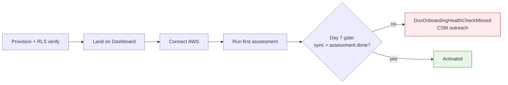

# Dux Onboarding & Activation

## Summary

The user activation funnel, onboarding procedure, and activation metrics, synthesized from the customer lifecycle, pricing KPI, and GTM claims sources. Owner: Engineering + GTM. Status: canonical (procedure), illustrative (funnel).

## Executive Summary

Dux's onboarding activation is measured on a single hard gate: a completed first connector sync **and** a completed first assessment within 7 days of provisioning, enforced by a daily automated sweep (`DuxOnboardingHealthCheckMissed`) rather than left to the biweekly CSM cadence. Time-to-value targets <48 hours from connector setup as a Phase-1 KPI. **The often-cited "8,341 -> 2,143" queue-reduction funnel is explicitly labeled illustrative in the source corpus, not a measured activation funnel** — it awaits design-partner validation at N>=10 before it can be treated as a real onboarding metric. No formal activation A/B experiments are documented anywhere in the corpus; this is a genuine content gap, not an omission on the wiki side — **source data needed** if experiment tracking is to be added here.

## Specification

### 9-step onboarding procedure

1. Provision tenant, verify RLS.
2. Land on Dashboard.
3. 30-minute admin training video.
4. Connect AWS (Connector Hub).
5. Run first assessment.
6. Demonstrate kill switch (L1, L3).
7. Test audit-log export.
8. Optionally test an API key and webhook.
9. Document the escalation path.

### Activation gate and detection

`DuxOnboardingHealthCheckMissed` fires at exactly 7 days post-provisioning if there is no completed first sync **and** no completed first assessment (daily sweep). Routes to `@customer-success-oncall`, not engineering. If unresolved by day 10, escalates early into the day-14 CSM churn-risk trigger — halving the worst-case detection gap from 14 days to 7.

### Activation and time-to-value metrics (Phase-1 KPIs)

| Metric | Target | Status |
|---|---|---|
| Time to value | <48h from connector setup | canonical target |
| MTXV (time to exploitability verdict) | <15 min per CVE | canonical target |
| 7-day onboarding completion (first sync + first assessment) | health-check gate, not a numeric target | canonical, enforced |
| Queue reduction ("thousands to tens") | illustrative | **unvalidated — N>=10 required before signed collateral** |
| Onboarding funnel (8,341 -> 2,143) | illustrative | **unvalidated marketing figure, not a measured product funnel** |

### Gap: activation experiments

**Source data needed.** The ingested corpus contains no experiment log, A/B test framework, or activation-funnel-stage breakdown (e.g., signup -> connector -> first sync -> first assessment -> first mitigation, with conversion rates per stage). If this vault is to track growth experiments, that data must be sourced from a growth/analytics system not present in `C:\Users\User\dux` and added as a new ingest.

## Diagram

## Entities & Concepts

- [[Customer Lifecycle & Comms]] — the full onboarding/offboarding/health-monitoring source
- [[Pricing & Packaging]] — Phase-1 KPI table this shares targets with
- [[GTM Guardrails]] — the illustrative-numbers discipline governing the funnel figure

## Related

- [[Customer Success Hub]]
- [[Growth Hub]]

## Sources

- `.raw/dux/60-operations/customer-lifecycle.md`
- `.raw/dux/80-gtm/pricing-packaging.md`
- `.raw/dux/80-gtm/gtm-guardrails.md`
