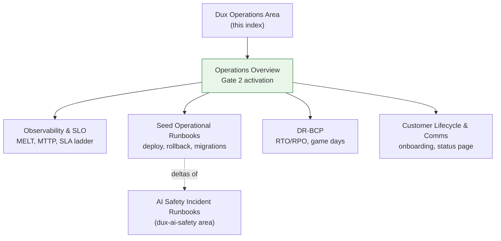

# Dux Operations Area

## Scope

Everything under `60-operations/` in the Dux corpus: seed-stage operational activation, observability/SLO, deploy/rollback/migration runbooks, DR/BCP, and customer lifecycle. **In scope:** operations-overview.md, observability-slo.md, runbooks.md, dr-bcp.md, customer-lifecycle.md. **Out of scope, reused by reference:** the 12 canonical AI safety incident procedures live in [[AI Safety Incident Runbooks]] — this area's runbooks are stage deltas only, never a duplicate step table.

## Reference material

- [[Operations Overview]] — Gate 2 activation criteria, founder checklist, service catalog
- [[Observability & SLO]] — MELT stack, LLM instrumentation, MTTP, SLA ladder
- [[Seed Operational Runbooks]] — deploy, rollback, SSO, migrations, tenant lifecycle
- [[DR-BCP]] — RTO/RPO ladder, chaos scenarios, game days
- [[Customer Lifecycle & Comms]] — onboarding, offboarding, status page, health monitoring

## Diagram

## Related

- [[Dux AI Safety Area]]
- [[Dux Overview]]

## Review cadence

Weekly.
