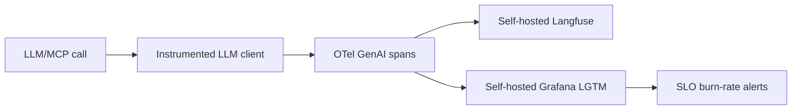
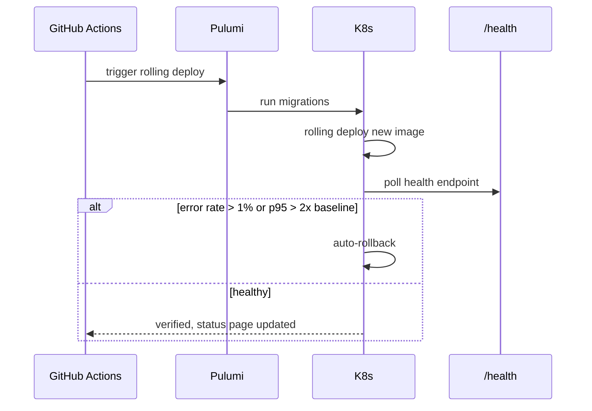
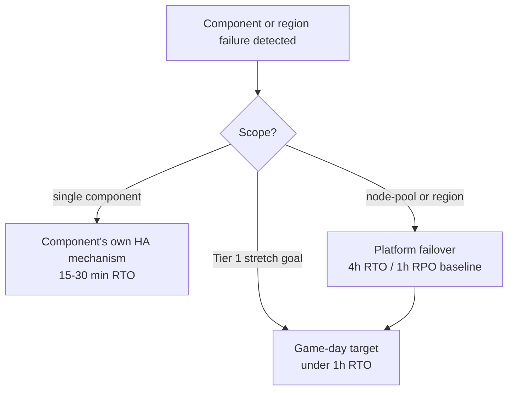

# Dux Operations Guide

Navigation: [[Dux]] | [[Dux Customer Success Guide]] | [[Dux AI Safety Operations Reference]]

## What "operational maturity" actually gates

Seed-stage operations (on-call, production monitoring, disaster recovery) activate at Gate 2, and the corpus is careful to gate that activation on only two mandatory sub-gates: **Gate 2a** (a real production Kubernetes deployment, working observability, a staffed on-call rotation, and a DR posture) and a **cross-cutting** bar (the kill switch tested end-to-end across all four levels, the self-hosted sandbox live or explicitly deferred with CTO sign-off, SLO alerting live, and cross-tenant isolation green). GTM/product readiness and connector rollout are both explicitly *optional* for seed activation: a deliberate discipline against letting commercial readiness get conflated with operational readiness. Even the hiring plan behind all this (roughly 30 engineers within 6 months of Gate 2a) is aspirational, never a blocker in its own right.

| Tier | What's in it | Blocks seed? |
|---|---|---|
| Mandatory | Gate 2a (production deploy, observability, DR) + cross-cutting (kill switch, sandbox, SLO alerts, isolation) | Yes |
| Optional | Gate 2b GTM (billing SKUs, signed MSA/SLA) and product readiness | No |
| PLG-only | Gate 2b self-serve provisioning | No: blocks public signup only, not seed itself |
| Connectors | Gate 2c | No |

A short founder-facing checklist keeps this concrete. Before the first paying customer: PagerDuty on-call plus an incidents channel live, all twelve-plus incident runbooks tested in staging, the shadow-AI detection runbook meeting its 5-minute SLA, and the platform cost cap and quota system dry-run tested. Before the first enterprise RFP: SOC 2 Type I evidence collection automated, a public status page live, the agent registry fully reconciled (zero undeclared agents), and a penetration test either completed or scheduled within 30 days.

Three incident roles anchor everything below, and one separation is structural rather than a preference: the **AI Safety Lead** holds 60-second agent-halt authority and can never also be the **Incident Commander** for the same incident: a deliberate separation of powers, not a staffing convenience.

| Role | Responsibility | Default assignee |
|---|---|---|
| Incident Commander | Owns the timeline and severity call | Platform on-call |
| AI Safety Lead | Halts agent activity within 60 seconds; cannot be the same person as the IC | AI-safety on-call |
| Comms Lead | Status page and customer email | Founder/PM pre-Gate 2, product on-call after |

## Observability: what gets watched, and how

The observability stack is fully self-hosted on Kubernetes: Grafana LGTM (Loki for logs, Tempo for traces, Prometheus for metrics, Grafana for dashboards) plus self-hosted Langfuse for LLM-specific tracing. That's a deliberate choice, not just a cost optimization: because trace data never leaves the platform boundary, self-hosting Langfuse removes an entire legal prerequisite (a data-processing agreement with a third-party tracing vendor) rather than merely satisfying it. A single trace ID spans both Langfuse and Grafana, which is what lets a full agent run (reasoning, tool calls, memory access) be reconstructed at read time from a `replay_trace_id`, rather than needing to be stored as a separate artifact ahead of time.

Every LLM call is required to route through one instrumented client: no ad-hoc SDK calls are permitted anywhere in the codebase, and CI enforces this.

| Layer | Tool | What it watches |
|---|---|---|
| Metrics | Prometheus + Grafana | API latency, kill-switch propagation time, LLM cost |
| Logs | Loki | Structured JSON, tagged with tenant/request/correlation IDs |
| Traces | OTel → Langfuse + Tempo | Agent-session traces, LLM spans |
| Runtime security | Falco | Anomalous syscalls, sandbox-escape attempts |

Retention is tiered by data sensitivity and cost: audit telemetry stays hot for 90 days and archived for 2 years (with the canonical hash chain itself retained 7 years cold); application logs for 30 days; agent traces for 14 days at full sampling; API traces for 7 days at 10% head sampling plus 100% of errors.

### The cost and safety dashboard

A handful of panels carry real operational weight:

| Panel | Threshold |
|---|---|
| LLM cost per assessment | Above $0.75 pages; sustained above $0.55 is an early warning |
| Workflow actions per assessment (p95) | SLO ceiling of 60 |
| Golden-set accuracy trend | A regression above 2% is a hard merge block |
| Kill-switch trip rate | Above 1% pages as a safety anomaly |
| LLM response cache hit rate | Below 60% pages: this is the primary cost-reduction lever, targeted at 60–80% |
| Event-stream consumer lag | Above 1,000 pages; any stream above 5,000 pages |

A dedicated cost-approach alert fires when hourly spend on a tenant crosses a fast-burn projection of its monthly cap, or when the raw rate simply exceeds $25/hour outright: whichever trips first.

### Mean time to protection, measured honestly

The metric Dux actually markets is **MTTP: mean time to protection**, not the narrower "mean time to verdict." That distinction matters: time-to-verdict covers only the assessment leg of the pipeline, while MTTP is assessment plus action plus approval (the last leg firing only on anomaly escalation, since writes are unattended by default). Because that approval leg only sometimes fires, MTTP is reported as a **bimodal distribution** (both the unconditional distribution and the split by whether an approval leg fired) rather than collapsed into one blended average that would misrepresent both cases.

One easy-to-miss detail worth getting right if you're ever doing the math yourself: two different "days in a month" divisors are used deliberately and never unified: 720 hours (a 30-day month) for the hourly cost-cap math, and 730 hours (the true average month) for MRR-at-risk revenue calculations. They're solving different problems and conflating them produces subtly wrong numbers in both directions.

### The full NFR ladder

| Target | Requirement |
|---|---|
| API availability (excluding LLM) | 99.5% monthly |
| Tenant isolation | Zero cross-tenant reads, full stop |
| Kill switch | Under 5 seconds p99 |
| API p95 latency | Under 300ms |
| Assessment start p95 | Under 2 seconds |
| 3-hop graph query p95 | Under 200ms above 2,000 assets |
| Golden-set regression | Under 2% |
| Feature-flag evaluation | SDK p99 under 20ms; API 99.9% available |
| GDPR export and delete | Under 24 hours |
| Accessibility | WCAG 2.2 AA, zero automated-scan violations |
| Max agent context | 128K tokens, checkpointed at 80% |
| OTel instrumentation coverage | 100% of LLM call paths |

The four latency targets in that table page through the same fast-burn-rate alerting windows as the availability SLO itself, rather than through separate bespoke thresholds: one alerting mechanism, several things it watches.

### The SLA ladder

| Tier | Contractual SLA | Enforceable from |
|---|---|---|
| Starter | 99.5% (excluding LLM) | Seed launch |
| Professional | 99.9% | After Gate 2, once 2+ SLA contracts exist |
| Enterprise | 99.99% | With capacity headroom in place |

No 99.9%-or-higher figure goes into a signed contract without counsel sign-off, and LLM provider outages are excluded from the availability numerator across every tier: an outage at OpenAI or AWS doesn't count against Dux's own uptime number.

## Runbooks: deploy, rollback, and the seed-stage infrastructure procedures

This section is explicitly scoped as *deltas* on top of the twelve canonical AI-safety runbooks in [[Dux AI Safety Operations Reference]]: infrastructure-specific procedure, PagerDuty routing, and seed-stage thresholds, never a duplicate of the AI-safety step tables. One structural rule threads through every procedure here: the eight-item AI-safety check is deliberately *omitted* for infrastructure-only deploys and for the NVD-sync-stale runbook (no agent is involved in either), but it's required the moment a change touches the agents package or the model routing configuration.

**Admin CLI readiness gate:** every admin command referenced by these runbooks must be at `implemented` status, not merely `spec`, before Gate 2: a runbook that reads as ready but references a still-speculative command is worse than no runbook at all, because it fails silently at the exact moment it's needed.

### Deploy and rollback

Deploys run through GitHub Actions triggering a Pulumi-driven Kubernetes rolling update, migrations always applied before the new API image ships. An auto-rollback trips automatically if the error rate exceeds 1% or p95 latency exceeds twice baseline. **Disabling the responsible feature flag is always the first thing to try, before a full rollback**: it's faster and lower-risk when it's available. Rollback itself targets under 5 minutes; a down-migration drill runs quarterly and requires two separate approvals, and forward-fixing is the default when there's no safe down migration at all: dropping a column in production without a full deprecation cycle first is never acceptable.

### Database migrations

Every migration runs through Drizzle Kit, with an RLS-verification script confirming row-level security is still forced immediately after. A production `down` migration needs two approvals via CODEOWNERS. Three things are flatly forbidden regardless of urgency: dropping a `tenant_id` column without a formal architecture decision, disabling row-level security for any reason, and running a long migration without the non-locking `CONCURRENTLY` option.

### Tenant provisioning and offboarding

Provisioning validates the tenant's AWS role up front (a failure here alerts if it stays stuck more than 30 minutes) and gates on a per-tenant isolation test before the tenant is considered live. Offboarding mirrors the tenant lifecycle authority described in [[Dux Architecture Guide]]: soft-delete, a 24-hour-SLA export window, a legal-hold period from day 31 to day 90, then a hard purge with a destruction certificate emailed to the customer.

### Shadow AI detection

An undeclared-agent signal is treated with real urgency: the CTO is paged within 5 minutes, the AI Safety Lead halts the affected agent within 60 seconds, an L2 kill switch trips, session evidence is exported for the record, and (critically) **the deploy pipeline is blocked outright until every agent is accounted for.** Nothing ships while an unexplained agent is running.

### NVD sync going stale (the one runbook with no agent-safety check)

A warning fires past 2 hours of staleness, a hard alert past 4. The response (check the API key, read ingestion logs, verify backoff behavior, check the cache, and if needed enable the CISA KEV/EPSS fallback path) is entirely infrastructure work, which is exactly why the AI-safety check is deliberately skipped here: no agent is involved, and the actual risk is platform-trust erosion from stale data, not an agentic-safety concern. Customers are only notified if the outage runs past 24 hours.

### Seed-stage extensions worth knowing

Agent quota exhaustion hard-caps an agent one hour after it crosses 100% of its quota, with an L2 kill switch at 120%: the governance kernel's cost cap fails closed on its own, independent of whether Stripe's usage-metering system has caught up yet. A billing-reconciliation drift above 5% between Stripe and the platform's own ledger triggers a quota hold that needs three consecutive clean daily reconciliation runs to clear. And once a month, the first Friday is "Chaos Friday" in staging: a scheduled resilience exercise that gates that week's production deploy on passing.

## Disaster recovery and business continuity

Two sets of recovery numbers exist side by side and are deliberately not the same, and that's not a contradiction: the **platform baseline** (4-hour recovery time, 1-hour recovery point) assumes a genuinely hard failure (a whole node pool or region lost) while the tighter **per-component numbers** (CloudNativePG under 15 minutes, NATS under 5, Valkey and MinIO under 30) describe each component's own high-availability mechanism absorbing a narrower failure on its own.

| Target | Value | How it's achieved |
|---|---|---|
| Platform RTO | 4 hours | Multi-AZ node pools plus database failover |
| Tier-1 stretch RTO (game-day target) | Under 1 hour | Auth, API, and workflows specifically |
| Platform RPO | 1 hour | WAL archiving plus hourly logical backups |
| Restore drill | Quarterly | Full staging restore from backup |

### Chaos scenarios and their expected behavior

| Scenario | Expected behavior | Target recovery | Drill cadence |
|---|---|---|---|
| A 30-minute event-bus outage | Kill switch falls back to a direct database-notify path in under 10 seconds; rate limiting degrades to in-memory, a documented over-admission risk | Under 10s for kill propagation | Quarterly |
| A node-pool or region loss | Redeploy to an alternate pool or region, DNS failover | Under 4 hours | Semi-annual |
| A primary LLM provider outage | Fallback service reweights to the backup provider chain | Under 60 seconds | Quarterly |
| MCP gateway failure | Circuit breaker trips, request queue degrades gracefully | Under 5 min to trip, under 10 min to full recovery | Quarterly |

Once a month, "Chaos Friday" runs resilience scenarios in staging that have to pass before that week's production deploy is allowed to proceed, with an SRE sign-off required to bypass that gate. A full timed regional-failover exercise runs at Seed Month 6, targeting the same sub-1-hour Tier-1 goal, explicitly to document the gap against the 4-hour baseline and to feed the eventual Series B multi-region design. One infrastructure note worth flagging because it resolves what used to be an open question: since the platform already runs on Kubernetes/EKS from Gate 1, the old prerequisite of "migrate off the original hosting platform before multi-region is possible" is already satisfied: the actual Series B blocker now is capacity and region topology, not a hosting migration.

## Sources

- `.raw/dux/60-operations/operations-overview.md`
- `.raw/dux/60-operations/observability-slo.md`
- `.raw/dux/60-operations/runbooks.md`
- `.raw/dux/60-operations/dr-bcp.md`
- `.raw/dux/20-architecture/architecture-diagrams.md`
