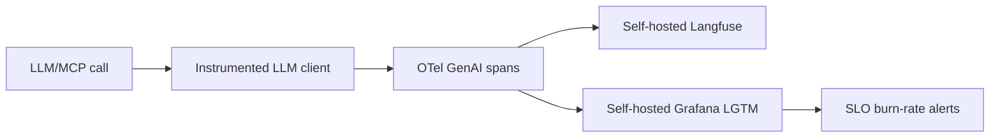
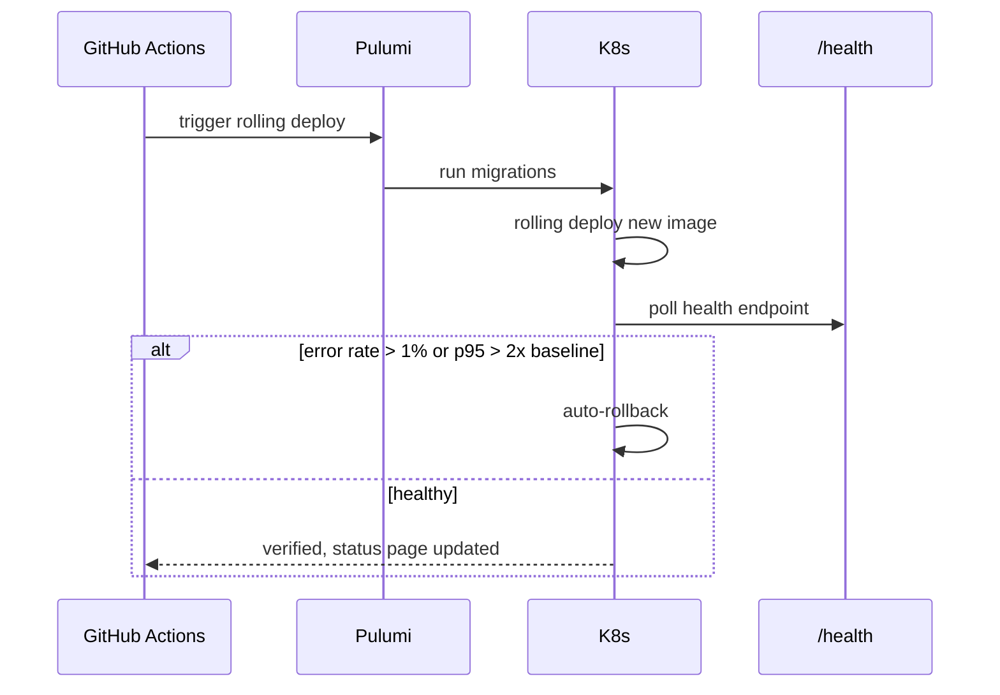
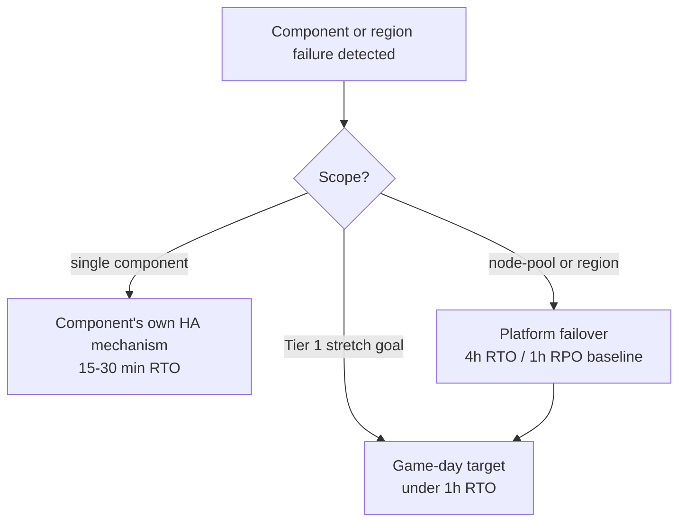

# Running Dux at Seed Stage: On-Call, SLOs, and the Discipline of Not Confusing Ops-Readiness With a Funding Round

### Gate 2, MELT, MWMBR burn-rate alerts, and the RTO/RPO ladder that has to hold before the first enterprise RFP

Navigation: [[Dux]] | [[Dux Customer Success Guide]] | [[Dux AI Safety Operations Reference]]

This guide defines the seed-stage operational playbook for Dux — on-call, production observability, SLO alerting, deploy procedures, SSO onboarding, tenant lifecycle, disaster recovery, and business continuity. It consolidates four canonical source documents: Operations Overview, Observability & SLO, Seed Operational Runbooks, and DR / BCP.

> **This is an operational-maturity stage. It is not the December-2025 funding round.**

The team is explicit about that distinction, and it's worth sitting with for a second: a lot of the numbers below — the 4-hour RTO, the 23 dry-run scenarios, the three health-score formulas that deliberately never merge — exist because "we raised money" and "we can run this safely in production" are different claims, and conflating them is how a seed-stage company ends up promising an SLA it can't back.

---

## 1. Gate 2 Consolidated Criteria

Operational maturity 2 activates at Gate 2. The consolidated bar is split into **mandatory** and **optional** tiers — a deliberate discipline against conflating commercial readiness with operational readiness.

| Tier | Sub-gates | Blocks seed | Unlocks |
|------|-----------|-------------|---------|
| **Mandatory** | **Gate 2a** — production K8s deploy; observability and on-call named; DR posture. **Plus Cross-cutting** — kill switch tested (L1–L4); **self-hosted Firecracker live** (or a CTO-signed defer); SLO alerts; cross-tenant isolation green | **Yes** | production ops, on-call, runbooks |
| Optional | Gate 2b GTM — Stripe SKUs, list pricing, counsel-approved MSA/SLA. Gate 2b product — Fast Actions manual | No | GTM collateral; manual UI |
| PLG only | Gate 2b PLG (a)–(e) — list pricing + Stripe SKUs; automated provisioning with RLS verification; KS-L3 tested in production; Stripe Tax for EU/UK | No — **blocks public signup only** | self-serve signup |
| Connectors | Gate 2c | No | vendor-dependent screens (already Gate 1 for the W1 set) |

### Hiring plan

Roughly **30 developers within 6 months of Gate 2a**, 40–50 employees total — aspirational, **never a seed-activation blocker**.

### Pre-seed build triggers

Carried from the pre-seed playbook — each row exists because something specific in the build phase has to hand off to something specific in ops:

| # | Build-phase event | Activates |
|---|-------------------|-----------|
| 1 | Gate 1 in reach | milestone review (the gate model) |
| 2 | SLO burn during the build | verify alerting before Gate 2 (observability and SLO) |
| 3 | An agentic failure is observed | the incident runbooks |
| 4 | **An isolation test fails** | **BLOCKS Gate 1** (multi-tenancy) |
| 5 | Cost anomaly, provider outage, MCP spike, 429 cascade, context exhaustion, or cache drop | the named incident runbooks |
| 6 | An MCP tool registration changes | `aibom-validate` + `mcp-scan` in CI (MCP security) |
| 7 | Gate 2 passes | activate this seed stage |
| 8 | Quarterly | the gap-closure workshop — a claims ↔ capability review |

### Seed triggers

Reconstructed from cross-references (BS-21), since the original playbook referenced "seed triggers" without ever tabulating them:

| # | Trigger | Starts work on |
|---|---------|----------------|
| 1 | The first enterprise prospect requiring SOC 2 evidence, **or** a Gate 2 consolidated pass | SOC 2 Type I gap assessment and readiness (audit engagement, months 9–12) |
| 2 | The first SSO/SAML RFP, or enterprise IdP federation | the [[Dux Operations Guide#SSO onboarding (seed trigger)|SSO onboarding runbook]] |
| 3 | Public API demand from a developer or partner | the Public Data API + developer portal (`api.dux.io/docs`) |
| 4 | The first churn-risk signal — a health score below 50 for 2 weeks | CSM EBR + customer lifecycle |
| 5 | NHI / agent inventory above 500 (`nhi_threshold_500`) | formalize the NHI policy — Series A |
| 6 | The first $100 K ACV, or an enterprise security questionnaire | trust portal content-complete — **a procurement blocker** |
| 7 | Gate 3 approval | closed-loop mitigation validation (US-019); amend the SOC 2 scope to cover the validation surface. **Unattended writes are already live at Gate 1** |
| 8 | The first EU prospect | EU AI Act Art. 9 (ISO 42001); Azure OpenAI EU routing |
| 9 | Throughput ≥500 assessments/day, **or** Temporal spend above $500/month for 30 days | the `WorkflowPort` graduate spike — Restate / Hatchet / DBOS |

### Founder checklist

Three tiers, each gating a different milestone rather than one undifferentiated launch checklist:

**P0 — before the first paying customer:**

- PagerDuty on-call, and `#incidents`.
- **All 13 failure modes tested in staging** — the 12 incident runbooks, plus agent quota.
- The shadow-AI runbook (`DuxShadowAI`, 5-minute SLA).
- Platform cost cap, and a quota dry-run.
- Service-catalog Tier 1 owners named.
- **Self-hosted Firecracker live**, or a CTO-signed defer.

**P1 — before the first enterprise RFP:**

- SOC 2 Type I evidence automated.
- Status page live.
- Agent registry complete — `shadow-ai-reconcile` reports `undeclared_count: 0`.
- Pentest completed, or scheduled within 30 days.

**P2 — before Gate 3 preparation:**

- Red-team backlog triaged.
- OpenAPI and the developer portal published.

### Incident roles

The seed table below is deliberately not five interchangeable rotations. The AI Safety Lead role is carved out on purpose — see the closure standard right after it for why.

At 16+ FTE, the Series A delta applies.

| Role | Responsibility | Default assignee |
|------|----------------|------------------|
| Incident Commander | timeline, severity | `@platform-oncall` (primary) |
| Technical Lead | mitigation, rollback | on-call secondary |
| **AI Safety Lead** | **agent halt within 60 s — this role cannot be merged with the IC** | `@ai-safety-oncall` |
| Comms Lead | status page, customer email | Founder or PM before Gate 2; `@product-oncall` after |
| Scribe | timeline and evidence | rotating engineer |

### Closure standard

> **Any P0 or P1 logs all five DORA MTTR phases in PagerDuty before it closes.** Applied without exception.

### AI incident-response activation phasing

- **Seed** covers §1–6 of the canonical AI incident-response template.
- **Series A** adds the §7–12 deltas.
- **Series B** runs the full 12-section template.

### Service catalog

Every production service, its PagerDuty routing, and the RTO/RPO it's held to:

| Service | PagerDuty | On-call | RTO | RPO |
|---------|-----------|---------|-----|-----|
| `dux-api` | [`dux-platform`](https://app.pagerduty.com/service-directory) | `@platform-oncall` | 4 h | 1 h |
| `dux-connector-sync` / `dux-workflow` | [`dux-platform`](https://app.pagerduty.com/service-directory) | `@platform-oncall` | 4 h | 1 h |
| `dux-web` | [`dux-platform`](https://app.pagerduty.com/service-directory) | `@platform-oncall` | 4 h | 4 h |
| `dux-notifications` | [`dux-platform`](https://app.pagerduty.com/service-directory) | `@platform-oncall` | 8 h | 4 h |
| `dux-agent` | [`dux-ai`](https://app.pagerduty.com/service-directory) | `@ai-safety-oncall` | 8 h | 4 h |
| `dux-sandbox` | [`dux-ai`](https://app.pagerduty.com/service-directory) | `@ai-safety-oncall` | 8 h | 4 h |

Service names follow the Kubernetes (EKS) Deployment topology of ADR-006 R4. **Gate 2 activation checklist:** verified PagerDuty service-directory URLs for every row, plus SRE and CTO sign-off before any enterprise RFP.

---

## 2. Observability and SLO

### The MELT stack

Rewritten 2026-07-19 (D-33): **self-hosted Grafana LGTM stack** on Kubernetes replaces Grafana Cloud. This also closes the observability leg of OI-36 — Sentry usage was environment drift, not adopted.

| Layer | Tool | Purpose |
|-------|------|---------|
| Metrics | Prometheus + Grafana (self-hosted, LGTM stack) / Langfuse (self-hosted) | API latency, error rates, kill-switch propagation, LLM cost, tenant quota |
| **Events** | **PostHog** | **product analytics, funnel, adoption** |
| Logs | Loki (self-hosted, LGTM stack) | structured JSON carrying `tenant_id`, `request_id`, `correlation_id` |
| Traces | OTel → Langfuse (self-hosted) + Tempo (self-hosted, LGTM stack) | agent-session traces; LLM spans via the OTel GenAI semantic conventions |
| Runtime security | Falco (in-cluster) | anomalous syscalls, sandbox-escape attempts — see §4 |

### Retention and sampling

| Data | Retention |
|------|-----------|
| Audit telemetry | 90 days hot; 2 years in the MinIO archive. (The canonical hash-chained audit is 7 years, cold, in MinIO) |
| Application logs | 30 days |
| Agent traces | 14 days, sampled at 100% |
| API traces | 7 days — 10% head sampling, plus 100% of errors |

`ops:verify-observability-ttl` runs monthly.

### Self-hosted Langfuse (D-33)

**No DPA required** — trace data never leaves the platform boundary, removing the AI-20 Langfuse-DPA prerequisite entirely rather than merely satisfying it. **Langfuse moved its backend to ClickHouse in January 2026** — informational only, no Dux-side change; the `trace_id`-keyed query pattern (§2, §4) is unaffected. Self-hosted Langfuse runs the same ClickHouse-backed version. In production, Langfuse runs with `hide_inputs` and `hide_outputs`.

### Self-hosted LGTM sizing

The retention figures above (90 days audit telemetry hot, 30 days app logs, 14 days agent traces at 100% sampling) drive **in-cluster storage sizing** (Loki/Tempo/Prometheus PVCs) rather than a Grafana Cloud plan tier. Self-hosted storage capacity is a **Gate-1 cost-model line item** — tracked alongside other infra costs in pricing and packaging, against the self-hosted-K8s cost baseline rather than a per-seat/per-GB SaaS rate.

### LLM instrumentation contract

Every LLM call routes through `InstrumentedLLMClient` (`packages/observability/`). **No ad-hoc SDK calls** — enforced in CI by `no-direct-llm-sdk`.

### OTel GenAI semantic convention pinning

The semantic convention is pinned at a specific version (`OTEL_SEMCONV_STABILITY_OPT_IN`) and tracked as **Development-status upstream — not yet stable**; a version bump is a deliberate, tested change, not a silent dependency update. Span name: `chat {provider}`.

**Required OTel attributes:**

| Attribute | Description |
|-----------|-------------|
| `gen_ai.provider.name` | renamed from `gen_ai.system` in semconv v1.37.0 |
| `gen_ai.request.model` | model identifier |
| `gen_ai.request.temperature` | temperature parameter |
| `gen_ai.response.model` | response model |
| `gen_ai.usage.input_tokens` | input token count |
| `gen_ai.usage.output_tokens` | output token count |
| `tenant.id` | tenant identifier |
| `agent.id` | agent identifier |
| `session.id` | session identifier |
| `prompt_version` | prompt-registry version (DA-11) |

### `prompt_version` (DA-11)

Carried on `CalibrationRecord` and on every trace and span alongside the other required attributes above, so a prompt-registry version can be correlated against accuracy and cost the same way `gen_ai.request.model` is — a prerequisite for extending the existing model-version-pin discipline (CI/CD and testing) to prompts once a prompt registry exists.

### Prompts and completions opt-in

Prompts and completions are **opt-in span *attributes*** (`gen_ai.input.messages` / `gen_ai.output.messages`), **never unconditional span events** — the span-events pattern is deprecated upstream. The wrapper auto-sanitizes API keys, email addresses, JWTs, and sensitive hostnames regardless of which capture mode is enabled.

### Sampling rate table

| Environment | Rate |
|-------------|------|
| Dev | 100% |
| Production LLM | 10–30% head, plus tail sampling on errors and high latency |
| Any span above 10 K tokens | **always sampled** |
| Golden set | 100% |
| Agent APM | 100%, with parent `workflow_id` links |

Coverage target: **100%** (TR-NFR-014).

### `replay_trace_id` (DA-12)

Given the hash-chained audit trail (§1) and the shared `trace_id`, a full agent run — reasoning steps, tool calls, and memory-access events — can be reconstructed from that single `trace_id`: it replays the OTel span tree (agent, tool, and LLM spans, in their original parent/child order) and joins it against the corresponding LLM call records in Langfuse, keyed by the same `trace_id`. This is the capability the `GET /assessments/{id}/replay` endpoint (application API) surfaces at the API layer; it is a read-time reconstruction, not a stored artifact, so it stays valid for the full trace retention window in §1.



---

## 3. The Cost and Safety Dashboard

Cost and safety live on the same dashboard deliberately — a runaway LLM bill and a runaway agent are both things that page someone.

### Dashboard panels

| Panel | Threshold |
|-------|-----------|
| LLM cost per assessment | **above $0.75 → P2.** Sustained **above $0.55 → P2 early warning** |
| Workflow actions per assessment (p95) | SLO <60. Fast burn above 2× baseline within 1 h |
| Workflow actions per tenant per day | a cap breach raises `WORKFLOW_TENANT_BUDGET_EXCEEDED`; L2 at 2× the hourly baseline |
| Golden-set accuracy trend | a regression above 2% is a **P0 merge block** |
| Model structural drift (10% stratified) | above 2σ against the 30-day baseline → P2 |
| Model cost spike, per tenant | above 3× the 7-day baseline → P2 |
| Kill-switch rate (safety anomaly) | above 1% → P1 |
| Abstention labor cost | above $10 K/month → P1 |
| Self-hosted Temporal cluster cost (`dux_cost_temporal_cents`) | added 2026-07-19, D-33 — tracks cluster compute cost against the infra cost model |
| Bedrock vs. direct-Anthropic latency (`dux_llm_bedrock_latency_p95`, `dux_llm_anthropic_baseline_p95`) | added 2026-07-19, D-33 — makes ADR-017 R3 multi-provider fallback trigger (Bedrock p95 >2× baseline for 7 days) enforceable |
| Valkey cache hit rate (`dux_valkey_hit_rate`) | Gauge, `keyspace_hits / (keyspace_hits + keyspace_misses)` from Valkey `INFO stats`, labeled `tenant_id` + `cache_type` (`llm_response`, `session`, `rate_limit`, `graph_path`, `temporal_activity`). `llm_response` type below 0.6 → P2 |
| NATS JetStream consumer lag (`dux_nats_consumer_lag`) | Gauge, `num_pending` from JetStream `CONSUMER.INFO`, labeled `stream` (`VULNERABILITIES`, `ASSETS`, `INVESTIGATIONS`) + `consumer_name` + `tenant_id`. `VULNERABILITIES` above 1,000 → P1; any stream above 5,000 → P1 |
| Falco runtime-security alerts (Gate 2) | sandbox-escape attempts, anomalous in-cluster syscalls — any alert is P1, triaged same as a kill-switch anomaly |

### Prometheus metrics (full list)

`dux_cost_llm_cents` · `dux_cost_workflow_actions` · `dux_cost_infrastructure_cents` · `kill_switch_propagation_seconds` · `dux_cost_llm_cents_per_tenant{tenant_id}` · `dux_cost_sandbox_seconds_per_tenant` (Gate 2+) · `dux_cost_temporal_cents` · `dux_llm_bedrock_latency_p95` · `dux_llm_anthropic_baseline_p95` · `dux_valkey_hit_rate` · `dux_nats_consumer_lag`.

### `DuxTenantCostCapApproach` formula

Fires when hourly spend exceeds:

```
monthly_cap / 720 × 14.4    (MWMBR form)
```

**or** when raw `rate(dux_cost_llm_cents_per_tenant[1h]) > 2500` — that is, $25/hour. Whichever trips first.

> **Two divisors, deliberately different.** `720` is a 30-day calendar month, used for the **hourly cap**. The `/730` average-month divisor in the MRR-at-risk formulas (kill switch and HITL, incident runbooks) is for **revenue math**. **Do not unify them.**

---

## 4. MTTP — Time to Protection (H9)

Instrumented by Phase-1 exit. This section exists because "we assess fast" and "we protect fast" are different claims, and the team wants the number a CISO will actually ask for, not the flattering half of it.

The marketed outcome is **MTTP:** assess → the vendor action executes → exposure drops. **MTXV (<15 min) covers only the first leg.**

Measure it on real partner data, **as a measured metric — not an SLA**:

### Three-leg table

| Leg | Metric |
|-----|--------|
| Assessment | `assessment_latency` (MTXV) |
| Action | `action_latency` — verdict → `mitigation.executed`, or ticket routed |
| Approval | `approval_latency` — `hitl_request` → `hitl_response`. **Anomaly-escalation path only** |

### Bimodal MTTP distribution

**Expect a bimodal MTTP distribution, and report the escalated tail separately.** Writes are unattended by default, so the approval leg exists only on anomaly escalation.

> The MTTP distribution is the number a CISO will actually ask for. It is the same class of gap as the "thousands → tens" measurement: no end-to-end speed claim is safe without it.

### H9 outcome-instrumentation contract (C1/C2, CI-07 closure spec)

`EP-05-F01-T07` backs the "smaller attack surface" (C1) and "shorter path to solution" (C2) claims with the MTTP pipeline above.

| Leg | Start event | End event | Correlation |
|-----|-------------|-----------|-------------|
| Assessment | `assessment.queued` | `assessment.completed` | `assessment_id` |
| Action | `assessment.completed` (verdict crosses an action threshold) | `mitigation.executed` \| `ticket.created` \| `mitigation.blocked` | `assessment_id` → `action_id` (1:N) |
| Approval | `hitl_request` | `hitl_response` | `assessment_id` → `hitl_request_id`, **anomaly-escalation path only** |

All three legs share `assessment_id` as the stitching key — the same ID on `EXPLOITABILITY_ASSESSMENT` (the data model) and the same `trace_id` correlation `replay_trace_id` (§2) relies on. No new ID scheme; MTTP is a **read-time join** across three existing event streams (`AUDIT_EVENT`, webhook delivery log, HITL request/response), not a new stored record.

**Computation:** `MTTP = action_latency` when no approval leg fires (the 3 earned-autonomy actions); `MTTP = action_latency + approval_latency` when it does (`endpoint.isolate`/`patch.deploy_special_devices`, or an anomaly escalation on the other three). **Report both the unconditional distribution and the bimodal split** — C1/C2 must never be sold as a single blended number.

**Verification:** a fixture test asserting the three-leg join resolves correctly across all 5 canonical actions (mandatory-HITL and earned-autonomy alike), plus a check that `action_id`/`hitl_request_id` never orphan from their parent `assessment_id`.

---

## 5. SLO Burn-Rate Alerts (MWMBR)

| Alert | SLO | Window | Runbook |
|-------|-----|--------|---------|
| `DuxSLOAvailabilityFastBurn` | API availability | 1 h + 5 m (14.4×) | runbooks #3 rollback-infra |
| `DuxSLOAvailabilitySlowBurn` | API availability | 6 h + 30 m (6×) | Incident response |
| `DuxAssessmentLLMAvailabilityFastBurn` | assessment / LLM path | 1 h + 5 m | incident runbooks #model-outage |
| `DuxPromptCacheHitRateDrop` | cache hit rate | >15% drop in 5 m | incident runbooks #prompt-cache |
| `DuxTenantCostCapApproach` | per-tenant spend | above 80% of the daily cap | incident runbooks #token-cost |
| `DuxWorkflowActionsFastBurn` | actions per assessment | MWMBR | incident runbooks #token-cost |
| `DuxAgentBehaviorAnomaly` | behavioral baseline | 2σ in 5 m | runbooks #10-shadow-ai-detection |
| `DuxApiLatencyFastBurn` | API p95 <300 ms (TR-NFR-004) | 1 h + 5 m (14.4×) | runbooks #3 rollback-infra |
| `DuxApiLatencySlowBurn` | API p95 <300 ms (TR-NFR-004) | 6 h + 30 m (6×) | runbooks #3 rollback-infra |
| `DuxAssessmentStartLatencyFastBurn` | assessment start p95 <2 s (TR-NFR-005) | 1 h + 5 m | incident runbooks #r11 coordination-overhead |
| `Dux3HopCteLatencyFastBurn` | 3-hop CTE p95 <200 ms above 2 K assets (TR-NFR-006) | 1 h + 5 m | runbooks #neo4j-reconciliation-failure — the `neo4j_graph` fallback path |
| `DuxExposureDrilldownLatencyFastBurn` | exposure drill-down p95 <500 ms at 1 K assets (TR-NFR-015 / NFR-013) | 1 h + 5 m | incident runbooks #r11 coordination-overhead |

> **[OI-07] resolved 2026-07-16.** The four latency p95 targets (TR-NFR-004/005/006/015) now page through the four burn-rate alerts above, using the same MWMBR windows as the availability alerts. `DuxAssessmentStartLatencyFastBurn` and `DuxExposureDrilldownLatencyFastBurn` route to R11 (sustained p95 breach = same worker-handoff or redundant-MCP-call pattern); `Dux3HopCteLatencyFastBurn` routes to the Neo4j-fallback runbook (CTE latency breach above 2 K assets = documented trigger for `neo4j_graph` flag flip).

### Recording rules

Recording rules use `rate()` over raw counters — a 15-minute scrape is sufficient for the 1 h / 5 m MWMBR windows. A rollback and kill-switch drill runs monthly against these alert types.

### Low-traffic advisory (AI-82)

Sustained 5xx above 1% over 1 h fires an advisory **regardless of request volume**, validated in staging. **Burn-rate math alone can miss it at pre-seed traffic.**

### Legacy alert name mapping

Renamed in this rewrite. Kept grep-able for old dashboards and runbooks:

| Legacy name | Canonical name |
|-------------|----------------|
| `DuxSLOAvailabilitySlowDrift` (3 d + 6 h windows) | `DuxSLOAvailabilitySlowBurn` |
| `DuxPromptCacheFastBurn` | `DuxPromptCacheHitRateDrop` |
| `DuxWorkflowTenantBudgetExceeded` (hourly tenant actions >2× the 7-day average) | `DuxTenantCostCapApproach` |
| `DuxTokenSpendAnomaly` (>3× the 7-day baseline) | a `DuxTenantCostCapApproach` trigger, in the incident runbooks #token-cost |
| `DuxTenantNoisyNeighbor` | the PromQL noisy-neighbor throttle in multi-tenancy |
| `DuxAssessmentDedupFailure` | dedup and queue-segmentation alert routing (`AssessmentDeduplicationService`) |
| `DuxPhysicalResidentCacheAnomaly` (>15% cache drop, Gate-5 resident agents) | the per-agent-type baseline diff in agent identity |
| AWS CloudWatch `AWSThrottledRequests` | connector sync-health alerts in connector hub |

---

## 6. TR-NFR Targets

| ID | Requirement | Target |
|----|-------------|--------|
| TR-NFR-001 | API availability (excluding LLM) | 99.5% monthly |
| TR-NFR-002 | tenant isolation | **zero cross-tenant reads** |
| TR-NFR-003 | kill switch | <5 s p99 |
| TR-NFR-004 | API p95 latency | <300 ms |
| TR-NFR-005 | assessment start p95 | <2 s |
| TR-NFR-006 | 3-hop CTE p95 | <200 ms above 2 K assets |
| TR-NFR-007 | golden-set regression | <2% |
| TR-NFR-008 | feature-flag evaluation | SDK p99 <20 ms; API 99.9% |
| TR-NFR-009 | GDPR export and delete | <24 h |
| TR-NFR-010 | WCAG 2.2 AA | 0 axe-core violations |
| TR-NFR-011 | code-backed audit retention | trace + code, plus execution results at Gate 1 |
| TR-NFR-012 | max agent context | 128 K; checkpoint at 80% |
| TR-NFR-013 | per-tenant LLM cost cap | enforced before intervention |
| TR-NFR-014 | OTel GenAI instrumentation | 100% of LLM paths |
| TR-NFR-015 | exposure drill-down p95 | <500 ms at 1 K assets |

> **TR-NFR-004, TR-NFR-005, TR-NFR-006, and TR-NFR-015** — the four latency p95 targets — now page through the burn-rate alerts in §5 (OI-07, resolved 2026-07-16). [pricing-packaging] sells figures derived from these targets as a customer SLO — see OI-06.

---

## 7. The SLA Ladder: Contractual Versus Operational

Why keep two columns instead of one? Because a contractual promise and an operationally-enforceable one are not the same fact, and the team refuses to sell the first before the second exists.

| Tier | Contractual SLA | Operational SLO | Enforceable when |
|------|-----------------|-----------------|------------------|
| Starter | 99.5% (excluding LLM) | 99.5% at seed launch | the per-tenant SLO object is live |
| Professional | 99.9% | 99.9% per tenant, after Gate 2+ | the object is live, and ≥2 SLA contracts exist (SOC 2 A1) |
| Enterprise | 99.99% | 99.99%, with capacity headroom | the object is live; status-page credits if A1 is adopted |

### SLA ladder rules

- A contractual SLA **may** appear in an order form before the operational objects exist — **Legal attaches an activation date tied to Gate 2+ MELT.**
- **No 99.9% figure enters a signed contract until counsel signs** (review AI-226a, target 2026-07-31).
- **LLM provider outages are excluded from the availability numerator** (NFR-012).
- Assessment p95 is <120 s end to end at 1 K assets (AI-217), with a burn-rate alert at 5% of the error budget in 1 h.

---

## 8. Seed Operational Runbooks

> These are **stage deltas only**. The canonical AI and infrastructure procedures live in incident runbooks. What follows adds PagerDuty IDs, admin CLI, and seed thresholds — **do not duplicate the canonical step tables here.**

Topology: Kubernetes, Amazon EKS (ADR-006 R4).

### Admin CLI status gate (OPS-08)

Every `pnpm admin:*` command referenced by these runbooks **must be status `implemented`, not `spec`, before Gate 2.** A `spec`-status command **blocks the enterprise pilot**. `ops:smoke` in CI covers each referenced command.

### Gate 2 dry-run

Run before on-call go-live:

| # | Runbook | Staging command | Expected |
|---|---------|-----------------|----------|
| 1 | Deploy | `pnpm ops:test-deploy --env staging` | `deploy_ms < 900000` |
| 2 | Rollback | `pnpm ops:test-rollback --env staging` | `rollback_ms < 300000` |
| 3 | Cross-tenant leak | `ops:test-runbook --runbook cross-tenant` | containment within 60 s |
| 4 | Token cost runaway | `--runbook token-cost` | the cap is enforced |
| 5 | Model provider outage | `--runbook model-outage` | fallback within 60 s |
| 6 | MCP dependency failure | `--runbook mcp-failure` | circuit opens in under 5 min |
| 7 | Rate limit cascade | `--runbook rate-limit` | throttle active |
| 8 | Context window exhaustion | `--runbook context-exhaust` | checkpoint saved |
| 9 | Prompt cache invalidation | `--runbook cache-warm` | hit rate above 85% |
| 10 | Agent quota exhaustion | `--runbook quota-cap` | hard cap enforced |
| 11 | Shadow AI | `admin:shadow-ai-reconcile --env staging` | `undeclared_count: 0` |
| 12 | Kill switch — KS-001 / KS-L1 / KS-007 | `ops:test-kill-switch --level L2` / `--level L1` / `--fallback pg-notify --level L3 --iterations 50` | p99 <5 s / ≤30 s / <10 s |
| 13 | Bedrock SDK dependency audit | weekly GHA `npm audit` + Sigstore provenance check against pinned `@aws-sdk/*` versions | no unaddressed high/critical CVE |

### Deploy (INFRA) — 10 steps

GitHub Actions → **Pulumi-driven K8s rolling deploy**. `pnpm ops:migrate --env production` runs **before** the API image.

**preStop drain:** the replica stops accepting new workflows, waits `max(step_timeout, 120s)` for in-flight activities, and only then terminates. `dbos_workflows_orphaned_total` alerts if it rises above 0.

**Auto-rollback** on an error rate above 1%, or p95 above 2× baseline.

Versioning: SemVer for the API, CalVer for the UI. A hotfix lands within 30 min (1 approval; P0 bypasses).

| Step | Action |
|------|--------|
| 1 | Confirm CI is green. |
| 2 | Run migrations. |
| 3 | Monitor the K8s rollout — `/health` must return 200. |
| 4 | Check post-deploy metrics: error rate <0.5%, p95 <300 ms. |
| 5 | Confirm every task is on the new image. |
| 6 | Deploy the static frontend to MinIO (behind Cloudflare CDN), if the frontend changed. |
| 7 | RED verification for 15 min. |
| 8 | Verify kill-switch propagation at p99 <5 s. |
| 9 | Update the status page. |
| 10 | Archive the evidence to S3 (SOC 2 CC8.1). |

**Cost benchmark gate:** staging average at or below $0.55 (D-3).

The AI safety check is **omitted for INFRA deploys** — unless `packages/agents/` or `models.json` changed, in which case run `aibom:validate`, `shadow-ai-reconcile`, and `test:prompt-injection`.

### Rollback (INFRA) — target under 5 minutes

Revert the K8s rolling deploy to the previous Deployment revision (`kubectl rollout undo`). Revert the MinIO static-frontend deploy if the frontend is implicated.

> Depends on the Cloudflare DNS abort path — see DR / BCP game days for the `wrangler`/API rollback mechanism, credentials, and on-call owner.

Poll `/health` and the error rate; monitor RED for 15 min. **Disabling the feature flag is the first option to try, before a rollback.**

### Down-migration drill

A down-migration drill runs **quarterly**, requiring **2 approvals** (Engineering lead + on-call). `ops:migrate` takes a CloudNativePG base-backup snapshot before any destructive migration.

**Forward-fix only when there is no safe down migration. Never drop a column in production without a deprecation cycle.**

### SSO onboarding (seed trigger)

OIDC preferred, with **PKCE mandatory** — the implicit flow is disabled. SAML 2.0 is the fallback. Okta and Entra are primary.

JIT provisioning defaults to `viewer`, with group → role mapping. SCIM 2.0 is optional: tokens live in Vault, rotate every 90 days, and emit an `sso.scim.token.rotated` audit record. Session timeout is 8 h.

**Rollback:** `admin:sso-disable --tenant $ID` — under 5 min, invalidating sessions.

### Database migration (INFRA)

Drizzle Kit. `check-rls.sh` verifies FORCE RLS on every `tenant_id` table. `test:isolation` runs post-migration.

A production `down` migration requires **2 approvals**; CODEOWNERS on `packages/database/migrations/` enforces it.

**Forbidden operations:**

- Dropping `tenant_id` without an ADR.
- Disabling RLS.
- Long migrations without `CONCURRENTLY`.

### Secret rotation

A **30 / 7 / 1-day** notification sequence, by email and in-app banner. Self-service rotation UI. Delivery is tracked in the audit log.

Secrets live in HashiCorp Vault (D-5 R2), including transit for OAuth refresh tokens.

### Tenant provisioning and offboarding

**Provisioning.** Idempotent slug. Validate the AWS role with `admin:tenant-verify-aws-role` — on failure the tenant moves to `status=aws_role_failed`, and alerts if it stays stuck for more than 30 min. `test:isolation --tenant $NEW_ID` is a gate. Audit `tenant.provisioned`.

**Offboarding.** Soft-delete at day 0 → 24 h export SLA within the days 0–30 export window → revoke sessions, keys, and credentials → days 31–90 legal-hold retention → day-90 purge. The `legal_hold` flag blocks the day-90 purge and notifies Legal. Then the destruction certificate. Matches multi-tenancy, the lifecycle authority.

### NVD sync stale (INFRA, P2)

**Trigger:** `NVD_SYNC_WARN` above 2 h; `NVD_SYNC_STALE` above 4 h.

1. Check the API key in the secrets store.
2. Read the ingestion logs.
3. Verify 429 backoff.
4. Verify the cache — 48 h TTL, sha256.
5. Enable the intel fallback.
6. `admin:nvd-resume --chunk-days 120`.
7. It clears once feed age drops below 7,200 s.

Notify the customer **only** if the outage exceeds 24 h. The AI safety check is omitted by design — no agent is involved. Impact framing is platform-trust erosion; the MRR-at-risk formula is in the incident runbooks.

### Incident response routing

COMPOSITE incidents route to the incident runbooks. INFRA-only incidents use general IR.

The `ai-safety` PagerDuty service pages `@ai-safety-oncall`, with a **60-second halt escalation drill before on-call go-live**.

**Crossing the MRR-at-risk threshold auto-pages the CEO and Founder.**

### Seed-only extensions (all 7)

The section header names 7, but the source enumerates 8 distinct extensions — kept exactly as documented rather than trimmed to match the header:

**1. Shadow AI detection (AI-AGENT, P0-B).** Trigger: `DuxShadowAI` — `undeclared_count > 0`.

1. Page the CTO within 5 min.
2. The AI Safety Lead halts within 60 s.
3. L2 kill switch.
4. Export session evidence.
5. Enumerate the undeclared agents against the registry.
6. **Block the deploy pipeline until `undeclared_count: 0`.**
7. Register the agent, and baseline it afterwards.

L3 and L4 escalation criteria follow blast radius, tool scope, and any cross-tenant indicators.

**2. Agent quota exhaustion.** Hard-cap enforcement 1 h after the 100% alert; L2 at 120%. **The governance-kernel cost cap fails closed, independently of Stripe meter reconciliation.**

**3. Rate limit cascade (depth).** Dynamic throttle at `max(1, floor(baseline × 0.5))`. Escalate provider quota after 15 min.

**4. Context exhaustion (depth).** Checkpoint at 80%, abandon at 100%, max 3 resumes. More than 10 sessions per hour triggers a prompt-template review.

**5. Neo4j reconciliation failure.** Divergence above 0.1% → set the `neo4j_graph` flag to 0%, so all reads fall back to the CTE (<30 s) → `admin:neo4j-replay --from-offset` → a 7-day shadow period before retrying.

**6. Chaos Friday.** The first Friday monthly, in staging. **It gates that week's production deploy** (`ops:chaos-gate`).

**7. Billing reconciliation drift.** A Stripe-versus-platform delta above 5% → `admin:quota-hold` → backfill or credit → require 3 clean daily runs.

**8. Assessment dedup failure.** When `AssessmentDeduplicationService` misses — a duplicate `assessment_id` within the CVE + asset window — alert `@platform-oncall` (legacy: `DuxAssessmentDedupFailure`). **Queue segmentation keeps one tenant's dedup storm off the shared workers.**

---

## 9. Disaster Recovery and Business Continuity

### RTO / RPO

The platform-wide baseline everything else in this section is measured against:

| Target | Value | Implementation |
|--------|-------|----------------|
| RTO | **4 h** (platform baseline) | K8s multi-AZ node pools + CloudNativePG base-backup failover |
| RTO, Tier 1 (game-day stretch) | **<1 h** | auth, API, workflows. The DR game day measures the gap against the 4 h baseline |
| RPO | **1 h** | CloudNativePG WAL archiving to MinIO + hourly logical backups |
| Restore drill | quarterly | a full staging restore from a CloudNativePG base-backup or ephemeral-cluster snapshot |

### Per-component failover targets

Narrower-scope than the platform RTO/RPO above, which covers full-disaster restore. These are individual-component failover numbers within an otherwise-healthy cluster:

| Component | RPO | RTO | Mechanism |
|-----------|-----|-----|-----------|
| CloudNativePG | <5 min | <15 min | streaming replication + S3-compatible WAL archives to MinIO |
| NATS JetStream | <1 min | <5 min | multi-replica streams |
| Valkey | <1 h | <30 min | RDB + AOF snapshots |
| MinIO | <1 h | <30 min | erasure coding + site replication |

> Not a contradiction of the 4 h/1 h platform baseline — that number assumes a harder failure (node-pool or region loss, §2) than a single component's own HA mechanism absorbing.

### Chaos and partition scenarios

| Scenario | Expected behavior | RTO | Cadence |
|----------|-------------------|-----|---------|
| NATS outage, 30 min | kill switch falls back to CloudNativePG `LISTEN/NOTIFY` (<10 s); rate limits degrade to in-memory per replica (**documented over-admission risk**); SSE falls back to REST polling (US-012 fallback) | <10 s kill propagation | quarterly chaos |
| CloudNativePG primary failover | base-backup restore, or the operator's automated failover | <1 h Tier 1 (Month-6 game day) | Month 6 |
| K8s node-pool or region loss | redeploy to an alternate node pool or region; DNS failover | <4 h | semi-annual |
| Bedrock provider outage | `LLMProviderPort`'s NestJS `LLMFallbackService` reweights away from Bedrock automatically on error-rate/latency signal → direct Anthropic API, then local vLLM (ADR-017 R3) | <60 s | quarterly |
| Kill-switch propagation | KS-L2/L3 at p99 <5 s (KS-001); recovery within 15 min | — | quarterly |
| Model provider outage | ADR-008 fallback within 60 s | — | quarterly |
| MCP gateway failure | circuit breaker trips (§8 R4); queue degrades gracefully; recovers within RTO | **<5 min circuit-open, <10 min full recovery** | quarterly |

### `ops:chaos-gate` assertion

The circuit breaker trips at the R4 threshold (incident runbooks #r4-mcp-dependency-failure) — MCP errors above 50% over 5 min, or a health-check failure. `ops:chaos-gate` asserts three bounds:

| Bound | Value | Source |
|-------|-------|--------|
| Circuit-open detection | <5 min | existing R4 trigger window |
| Queue-depth ceiling while open | requests queue, capped at `GOV-004`'s per-tenant daily budget — no unbounded backlog | governance-kernel GOV-004 |
| Recovery (half-open → closed) | <10 min total from trip, once the error rate drops below 5% (R4 step 5) | derived: 5 min detection + up to 5 min half-open probe interval |

A drill that exceeds the 10-minute recovery bound is a scenario failure, same as any other RTO miss in this table.

---

## 10. Game Days

### Chaos Friday

The first Friday monthly, in staging. **Scenarios must meet their success criteria before that week's production deploy** (`ops:chaos-gate`). An SRE sign-off is required to bypass.

### DR game day (Seed Month 6)

A full, timed regional-failover exercise. Target: **RTO <1 h for Tier 1.** Documents the gap against the 4 h active-passive baseline, feeds the Series B multi-region active-active design.

### DNS abort path (resolves OI-19; rewritten 2026-07-19, D-33)

| Step | Mechanism |
|------|-----------|
| Revert MinIO static-frontend deployment | restore the prior build's object version from MinIO versioning (`mc cp --version-id <id>` from the bucket's version history) |
| Revert DNS record (if changed) | Cloudflare API `PATCH /zones/{zone_id}/dns_records/{id}` restoring the prior `content`/`proxied` values, captured before every DNS change per the standing pre-change-snapshot rule |
| Credentials | scoped Cloudflare API token (`Zone:DNS:Edit`, single zone `dux.io`) plus MinIO admin credentials, both in Vault (D-5 R2 convention), rotated every 90 days |
| On-call owner | `@platform-oncall` (same PagerDuty service as the INFRA rollback runbook) — Cloudflare console / MinIO console access is a break-glass fallback, not the primary path |

### DNS abort exercise

The DNS abort path is a **required step** in the first staging game day (§3) — a MinIO static-frontend deployment is rolled back live, and the Cloudflare API / MinIO admin credentials are confirmed to actually authenticate, not merely to be present in Vault.

---

## 11. DR / BCP Forward

### Series B forward

Series B targets Tier 1 active-active RTO of **<1 h** (**<15 min** at scale), with a **required multi-region game day before any EU or APAC go-live**.

Governed by Series B scale — a backlog shell. **Inherit the Series A BCP/DR posture until that document is content-complete.**

Under ADR-006 R4 (Kubernetes/EKS from Gate 1), the former "Railway → AWS migration" prerequisite for multi-region is **already satisfied**. The trigger is now capacity and region topology, not a hosting migration.

---



---



---

## Sources

- `.raw/dux/60-operations/operations-overview.md`
- `.raw/dux/60-operations/observability-slo.md`
- `.raw/dux/60-operations/runbooks.md`
- `.raw/dux/60-operations/dr-bcp.md`
