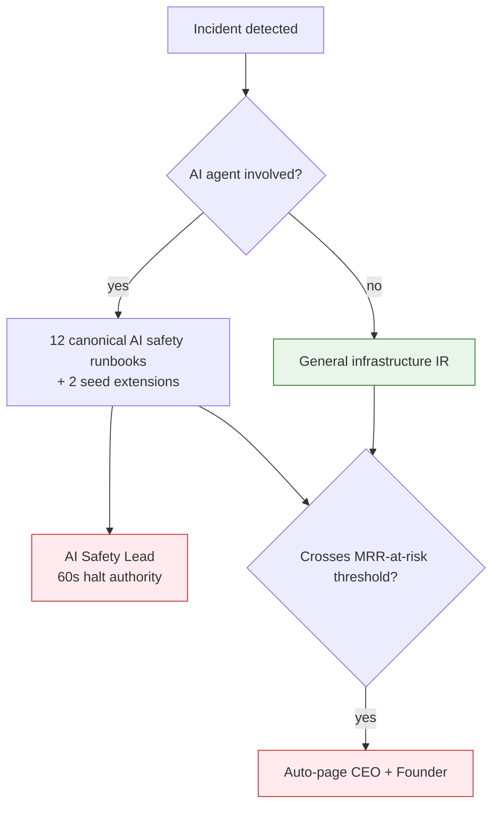

# Dux Support Playbook

## Summary

Support tiers, escalation paths, and incident-routing decision trees, synthesized from customer lifecycle, AI safety incident, and seed operational runbook sources. Owner: Engineering + Customer Success.

## Executive Summary

Dux has no separate "support ticket taxonomy" document in the ingested corpus — **source data needed** for a granular top-ticket-categories breakdown with real volumes. What the corpus does specify precisely is the escalation and severity structure a support playbook needs: three commercial support tiers (Standard/Professional/Enterprise), a strict incident-routing decision tree that separates AI/agentic incidents (routed to the 12 canonical runbooks plus 2 seed-only extensions) from infrastructure-only incidents (routed to general IR), and severity-specific customer-facing copy for six distinct incident classes spanning platform outages through kill-switch-triggered AI pauses. The AI Safety Lead role is structurally separated from the Incident Commander for every agentic incident, and any P0/P1 must log all five DORA MTTR phases before closing.

## Specification

### Support tiers

| Tier | Response | Channels | Price |
|---|---|---|---|
| Standard | 24h, business days | email, docs | included with Starter |
| Professional | 8h, business days | email, Slack Connect | ~$500/mo add-on |
| Enterprise | 2h; 24x7 for P1 | Slack, email, phone, named CSM | custom, ~$2K+/mo |

### Incident routing decision tree

```
Incident detected
├── Is an AI agent involved (reasoning, tool call, execution)?
│   ├── YES → route to the 12 canonical AI safety runbooks (R1-R12)
│   │         + 2 seed-only extensions (agent quota, shadow AI)
│   │         → AI Safety Lead holds 60-second halt authority
│   │         → cannot be the same person as Incident Commander
│   └── NO  → INFRA-only incident → general IR (deploy, rollback, DB, DNS)
└── Does spend cross the MRR-at-risk threshold?
    └── YES → auto-pages CEO and Founder, regardless of routing above
```

### Severity-specific customer communication (selected)

| Severity | Status page copy | SLA |
|---|---|---|
| P0 platform outage | "Dux is experiencing a platform-wide issue affecting dashboard and API access." | 15-min status update |
| P0 AI safety (KS-L4) | "We detected a potential data isolation issue and paused AI analysis as a precaution." | 15-min status update |
| P1 tenant incident | "Some customers may experience delayed assessments. We are investigating." | 15-min status update |
| KS-L3 (tenant platform) | "Your organization's dashboard is in read-only mode while we review a billing or security matter." | 15-min status update |
| Degraded AI (fallback) | "AI analysis is running in reduced-capability mode." | 15-min status update |

### Escalation ladder (by trigger, selected)

| Trigger | First responder | Escalates to |
|---|---|---|
| Onboarding stall (7 days, no sync/assessment) | `@customer-success-oncall` | day-14 CSM churn-risk trigger if unresolved by day 10 |
| Health score below 50 for 2 weeks | CSM | churn-risk trigger + EBR |
| Any L3/L4 kill-switch activation | `@ai-safety-oncall` | mandatory audit, regardless of tier |
| MRR-at-risk threshold crossed | Incident Commander | auto-pages CEO + Founder |

### Health monitoring feeding support prioritization

Three separate health formulas route to different owners and must never be merged: CSM health score (usage/CSAT-weighted, routes to CSM), TenantHealthScore (reliability/cost/safety-weighted, routes to Security+FinOps), Governance dashboard (queue depth/kill-switch-weighted, routes to PM+Security). See [[Customer Lifecycle & Comms]] for the full formula composition.

### Gap: ticket-category taxonomy

**Source data needed.** No historical support-ticket volume, category breakdown, or common-issue frequency data exists in the ingested corpus (`C:\Users\User\dux` is a pre-launch planning corpus with no live support history). A real top-ticket-categories table requires a support/helpdesk system export not present in this ingest.

## Diagram



## Entities & Concepts

- [[AI Safety Incident Runbooks]] — the 12 canonical procedures this playbook routes into
- [[Customer Lifecycle & Comms]] — status-page copy and health-formula source
- [[Seed Operational Runbooks]] — the 2 seed-only extensions (agent quota, shadow AI)

## Related

- [[Customer Success Hub]]
- [[Dux Onboarding & Activation]]

## Sources

- `.raw/dux/60-operations/customer-lifecycle.md`
- `.raw/dux/40-ai-safety/incident-runbooks.md`
- `.raw/dux/60-operations/runbooks.md`
