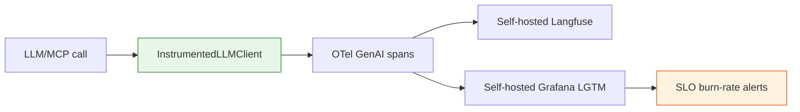

# Observability & SLO

## Summary

The MELT stack, LLM instrumentation contract, burn-rate alerting, and SLO/SLA ladder. Owner: Engineering. Status: canonical. Gate: 2. Decisions: D-3, D-33, D-34.

## Executive Summary

The stack moved to a fully self-hosted **Grafana LGTM** (Loki/Tempo/Prometheus/Grafana) on Kubernetes, replacing Grafana Cloud, with self-hosted Langfuse for LLM tracing — since trace data never leaves the platform boundary, this removes the Langfuse-DPA prerequisite entirely rather than satisfying it. Every LLM call routes through `InstrumentedLLMClient`; no ad-hoc SDK calls, enforced in CI. A single `trace_id` spans both Langfuse and Grafana, enabling `replay_trace_id` — a full agent run (reasoning, tool calls, memory access) reconstructed at read time, not stored as a separate artifact, which is exactly the capability `GET /assessments/{id}/replay` surfaces at the API layer. **MTTP (time to protection)**, not MTXV, is the marketed outcome metric — MTXV covers only the assessment leg; the full pipeline is assessment + action + approval (anomaly-escalation only), reported as a bimodal distribution since writes are unattended by default. Two divisors are deliberately kept separate and never unified: 720 (30-day month) for the hourly cost cap, 730 (average month) for MRR-at-risk revenue math.

## Specification

### MELT stack

| Layer | Tool | Purpose |
|---|---|---|
| Metrics | Prometheus + Grafana (self-hosted LGTM) | API latency, kill-switch propagation, LLM cost |
| Logs | Loki (self-hosted) | structured JSON, `tenant_id`/`request_id`/`correlation_id` |
| Traces | OTel -> Langfuse (self-hosted) + Tempo | agent-session traces, LLM spans via OTel GenAI conventions |
| Runtime security | Falco (in-cluster) | anomalous syscalls, sandbox-escape attempts |

Retention: audit telemetry 90 days hot / 2 years archive (canonical hash-chain 7 years cold); app logs 30 days; agent traces 14 days at 100% sampling; API traces 7 days (10% head + 100% errors).

### LLM instrumentation contract

Required OTel GenAI attributes: `gen_ai.provider.name`, `gen_ai.request.model`, `gen_ai.usage.input_tokens`/`output_tokens`, `tenant.id`, `agent.id`, `session.id`, `prompt_version`. Prompts/completions are opt-in span attributes, never unconditional span events (deprecated pattern). Sampling: dev 100%, production 10-30% head plus tail on errors/high latency, spans above 10K tokens always sampled, golden set 100%. Coverage target 100% (TR-NFR-014).

### Cost and safety dashboard (selected panels)

| Panel | Threshold |
|---|---|
| LLM cost per assessment | above $0.75 -> P2; sustained above $0.55 -> P2 early warning |
| Workflow actions per assessment (p95) | SLO <60 |
| Golden-set accuracy trend | regression above 2% -> P0 merge block |
| Kill-switch rate (safety anomaly) | above 1% -> P1 |
| Valkey `llm_response` cache hit rate | below 0.6 -> P2 (primary cost-reduction mechanism, target 60-80%) |
| NATS `VULNERABILITIES` consumer lag | above 1,000 -> P1; any stream above 5,000 -> P1 |

`DuxTenantCostCapApproach` fires when hourly spend exceeds `monthly_cap / 720 x 14.4`, or raw rate exceeds $25/hour.

**Prometheus metrics backing the dashboard:** `dux_cost_llm_cents`, `dux_cost_workflow_actions`, `dux_cost_infrastructure_cents`, `kill_switch_propagation_seconds`, `dux_cost_llm_cents_per_tenant{tenant_id}`, `dux_cost_sandbox_seconds_per_tenant` (Gate 2+), `dux_cost_temporal_cents`, `dux_llm_bedrock_latency_p95`, `dux_llm_anthropic_baseline_p95`, `dux_valkey_hit_rate`, `dux_nats_consumer_lag`.

### MTTP — time to protection (H9)

| Leg | Metric | Correlation |
|---|---|---|
| Assessment | `assessment_latency` (MTXV) | `assessment_id` |
| Action | `action_latency` — verdict -> `mitigation.executed` or ticket routed | `assessment_id` -> `action_id` |
| Approval | `approval_latency` — `hitl_request` -> `hitl_response`, anomaly-escalation only | `assessment_id` -> `hitl_request_id` |

`MTTP = action_latency` when no approval leg fires (3 earned-autonomy actions); `MTTP = action_latency + approval_latency` when it does. Report both the unconditional distribution and the bimodal split — never a single blended number.

### SLO burn-rate alerts (MWMBR, selected)

| Alert | SLO | Window |
|---|---|---|
| `DuxSLOAvailabilityFastBurn` | API availability | 1h+5m (14.4x) |
| `DuxApiLatencyFastBurn` | API p95 <300ms | 1h+5m |
| `Dux3HopCteLatencyFastBurn` | 3-hop CTE p95 <200ms above 2K assets | 1h+5m, routes to Neo4j-fallback runbook |
| `DuxTenantCostCapApproach` | per-tenant spend | above 80% of daily cap |

### TR-NFR targets (full table)

| ID | Requirement | Target |
|---|---|---|
| TR-NFR-001 | API availability (excluding LLM) | 99.5% monthly |
| TR-NFR-002 | tenant isolation | zero cross-tenant reads |
| TR-NFR-003 | kill switch | <5s p99 |
| TR-NFR-004 | API p95 latency | <300ms |
| TR-NFR-005 | assessment start p95 | <2s |
| TR-NFR-006 | 3-hop CTE p95 | <200ms above 2K assets |
| TR-NFR-007 | golden-set regression | <2% |
| TR-NFR-008 | feature-flag evaluation | SDK p99 <20ms; API 99.9% |
| TR-NFR-009 | GDPR export and delete | <24h |
| TR-NFR-010 | WCAG 2.2 AA | 0 axe-core violations |
| TR-NFR-011 | code-backed audit retention | trace + code, plus execution results at Gate 1 |
| TR-NFR-012 | max agent context | 128K; checkpoint at 80% |
| TR-NFR-013 | per-tenant LLM cost cap | enforced before intervention |
| TR-NFR-014 | OTel GenAI instrumentation | 100% of LLM paths |
| TR-NFR-015 | exposure drill-down p95 | <500ms at 1K assets |

TR-NFR-004, 005, 006, and 015 (the four latency p95 targets) page through the burn-rate alerts above, using the same MWMBR windows as the availability alerts (resolves OI-07).

### SLA ladder

| Tier | Contractual SLA | Enforceable when |
|---|---|---|
| Starter | 99.5% (excl. LLM) | at seed launch |
| Professional | 99.9% | after Gate 2+, >=2 SLA contracts exist |
| Enterprise | 99.99% | with capacity headroom |

No 99.9% figure enters a signed contract until counsel signs; LLM provider outages are excluded from the availability numerator.

## Diagram

## Entities & Concepts

- [[Multi-Tenancy]] — noisy-neighbor and cost-cap enforcement this dashboard tracks
- [[CI-CD & Testing|CI/CD & Testing]] — golden-set accuracy trend shared with the P0 merge block

## Related

- [[Operations Overview]]
- [[Seed Operational Runbooks]]

## Sources

- `.raw/dux/60-operations/observability-slo.md`
- `.raw/dux/20-architecture/architecture-diagrams.md` (diagram 11)
