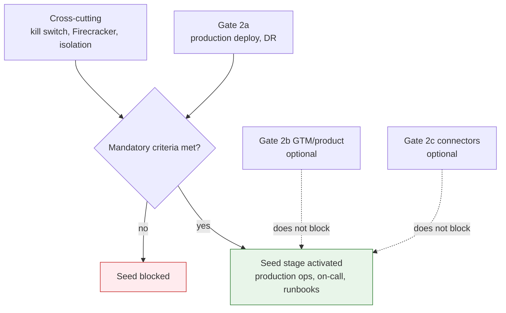

# Operations Overview

## Summary

What activates seed operational maturity (Days 90-365), what triggers each program, and who is on call. Owner: Engineering. Status: canonical. Gate: 2. Decisions: D-34.

## Executive Summary

Seed activation is gated by two mandatory sub-gates only — **Gate 2a** (production K8s deploy, observability, on-call, DR posture) and **Cross-cutting** (kill switch L1-L4 tested, self-hosted Firecracker live or CTO-signed defer, SLO alerts, cross-tenant isolation green). GTM/product readiness (Gate 2b) and connector rollout (Gate 2c) are explicitly optional for seed activation — a deliberate scope discipline against conflating operational maturity with commercial readiness. The hiring plan (~30 developers within 6 months of Gate 2a) is aspirational and never a seed-activation blocker. The AI Safety Lead role structurally cannot be merged with the Incident Commander, and any P0/P1 must log all five DORA MTTR phases before closing.

## Specification

### Gate 2 consolidated criteria

| Tier | Sub-gates | Blocks seed |
|---|---|---|
| Mandatory | Gate 2a (production deploy, observability, DR) + Cross-cutting (kill switch, Firecracker, SLO alerts, isolation) | Yes |
| Optional | Gate 2b GTM (Stripe SKUs, MSA/SLA) + product (Fast Actions manual) | No |
| PLG only | Gate 2b PLG (self-serve, RLS-verified provisioning, KS-L3 in prod) | No — blocks public signup only |
| Connectors | Gate 2c | No |

### Seed triggers (selected)

| Trigger | Starts work on |
|---|---|
| First enterprise prospect requiring SOC 2, or Gate 2 pass | SOC 2 Type I readiness (months 9-12) |
| First churn-risk signal (health score <50 for 2 weeks) | CSM EBR + customer lifecycle |
| First $100K ACV or enterprise security questionnaire | trust portal content-complete (procurement blocker) |
| First EU prospect | EU AI Act Art. 9 (ISO 42001), Azure OpenAI EU routing |
| Throughput >=500 assessments/day or Temporal spend >$500/mo for 30 days | `WorkflowPort` graduate spike evaluation |

### Founder checklist

**P0 (before first paying customer):** PagerDuty on-call + `#incidents`; all 13 failure modes tested in staging; shadow-AI runbook (5-min SLA); platform cost cap + quota dry-run; self-hosted Firecracker live or CTO-signed defer.

**P1 (before first enterprise RFP):** SOC 2 Type I evidence automated; status page live; agent registry complete (`undeclared_count: 0`); pentest completed or scheduled within 30 days.

### Incident roles

| Role | Responsibility | Default assignee |
|---|---|---|
| Incident Commander | timeline, severity | `@platform-oncall` |
| AI Safety Lead | agent halt within 60s — cannot merge with IC | `@ai-safety-oncall` |
| Comms Lead | status page, customer email | Founder/PM pre-Gate 2, `@product-oncall` after |

### Service catalog

| Service | On-call | RTO | RPO |
|---|---|---|---|
| `dux-api`, `dux-connector-sync`, `dux-workflow` | `@platform-oncall` | 4h | 1h |
| `dux-web` | `@platform-oncall` | 4h | 4h |
| `dux-agent`, `dux-sandbox` | `@ai-safety-oncall` | 8h | 4h |

## Diagram

## Entities & Concepts

- [[Observability & SLO]] — the SLO alerts this gate requires
- [[AI Safety Incident Runbooks]] — the 12 canonical + agent-quota 13th failure mode

## Related

- [[Seed Operational Runbooks]]
- [[Dux Operations Area]]

## Sources

- `.raw/dux/60-operations/operations-overview.md`
