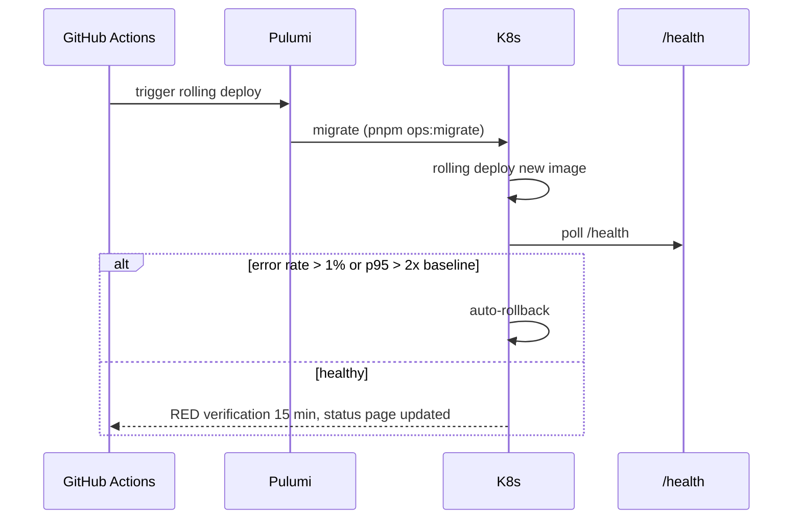

# Seed Operational Runbooks

## Summary

Seed-stage operational procedures: deploy, rollback, SSO, migrations, tenant lifecycle, and seed-only extensions. Owner: Engineering. Status: canonical. Gate: 2. Decisions: D-3, D-5, D-18, D-34.

## Executive Summary

This file is explicitly deltas-only: canonical AI and infrastructure procedures live in [[AI Safety Incident Runbooks]], and this file adds PagerDuty IDs, admin CLI, and seed thresholds without duplicating the step tables. A structural discipline runs throughout: the AI safety check is deliberately omitted for INFRA-only deploys and the NVD-sync-stale runbook (no agent involved), but required whenever `packages/agents/` or `models.json` changes. **Admin CLI status gate (OPS-08):** every `pnpm admin:*` command referenced by these runbooks must be status `implemented`, not `spec`, before Gate 2 — a `spec`-status command blocks the enterprise pilot entirely, closing a class of runbook that reads as ready but silently isn't executable.

## Specification

### Gate 2 dry-run (before on-call go-live)

| Runbook | Expected |
|---|---|
| Deploy | `deploy_ms < 900000` |
| Rollback | `rollback_ms < 300000` |
| Cross-tenant leak | containment within 60s |
| Kill switch KS-001/L1/L2/L3/L7 | p99 <5s / <=30s / <10s |

### Deploy (INFRA)

GitHub Actions -> Pulumi-driven K8s rolling deploy. Migrations run before the API image. `preStop` drain waits `max(step_timeout, 120s)` for in-flight activities before terminating. Auto-rollback on error rate above 1% or p95 above 2x baseline. Cost benchmark gate: staging average at or below $0.55 (D-3). AI safety check omitted unless `packages/agents/` or `models.json` changed.

### Rollback (INFRA)

Target under 5 minutes. Revert the K8s Deployment revision (`kubectl rollout undo`); revert MinIO static-frontend if implicated. **Disabling the feature flag is the first option to try, before a rollback.** A down-migration drill runs quarterly, requiring 2 approvals. Forward-fix only when there is no safe down migration — never drop a column in production without a deprecation cycle.

### SSO onboarding (seed trigger)

OIDC preferred with PKCE mandatory (implicit flow disabled); SAML 2.0 fallback. JIT provisioning defaults to `viewer` with group->role mapping. SCIM tokens rotate every 90 days. Session timeout 8h. Rollback: `admin:sso-disable`, under 5 minutes.

### Database migration (INFRA)

Drizzle Kit; `check-rls.sh` verifies FORCE RLS post-migration. Production `down` migration requires 2 approvals via CODEOWNERS. Forbidden: dropping `tenant_id` without an ADR, disabling RLS, long migrations without `CONCURRENTLY`.

### Tenant provisioning and offboarding

Provisioning: idempotent slug, validate AWS role (failure -> `status=aws_role_failed`, alert if stuck >30min), `test:isolation --tenant $NEW_ID` is a gate. Offboarding matches [[Multi-Tenancy]]'s lifecycle authority: soft-delete -> 24h export SLA -> days 31-90 legal hold -> day-90 purge -> destruction certificate.

### Shadow AI detection (AI-AGENT, P0-B)

`DuxShadowAI` (`undeclared_count > 0`) triggers: page CTO within 5 min -> AI Safety Lead halts within 60s -> L2 kill switch -> export session evidence -> enumerate undeclared agents against the registry -> **block the deploy pipeline until `undeclared_count: 0`** -> register and baseline.

### Seed-only extensions

Agent quota exhaustion: hard-cap 1h after 100% alert, L2 at 120% — the governance-kernel cost cap fails closed, independently of Stripe meter reconciliation. Neo4j reconciliation failure: divergence above 0.1% sets `neo4j_graph` flag to 0% (CTE fallback), 7-day shadow period before retrying. Chaos Friday: first Friday monthly in staging, gates that week's production deploy. Billing reconciliation drift: Stripe-vs-platform delta above 5% triggers `admin:quota-hold`, requires 3 clean daily runs to clear.

## Diagram

## Entities & Concepts

- [[AI Safety Incident Runbooks]] — the canonical procedures this file adds deltas to
- [[Multi-Tenancy]] — tenant lifecycle authority for provisioning/offboarding

## Related

- [[Operations Overview]]
- [[DR-BCP]]

## Sources

- `.raw/dux/60-operations/runbooks.md`
