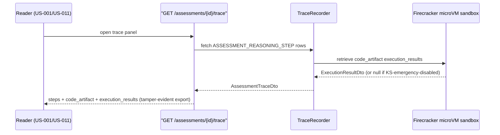

# Assessment Trace

## Summary

US-017 — the panel that shows a reader *why* the Dux Agent classified a CVE as exploitable or not, including the investigation code it wrote and the results of running it. Owner: Engineering. Status: canonical, Gate 1 (including executed-code results per ADR-015 R4, FR-026). Epic: EP-03. BRs: BR-002, BR-005.

## Executive Summary

Assessment Trace is Dux's single most important competitive asset: a JSON bundle proving why a verdict was reached, opened from US-001/US-011 rather than as its own nav icon. Its differentiating claim — "investigation backed by code — consistent, inspectable, repeatable" — depends entirely on `execution_results` actually being populated, which it is at Gate 1 via the self-hosted Firecracker microVM; the only null case is the sandbox being disabled through the emergency kill path. The trace is deliberately unavailable mid-assessment (routes to US-010 instead) and tamper-evident on export (NFR-009), both of which matter for its second use case: audit and competitive evaluation against Hexa and Strobes.

## Specification

**Surface:** panel opened from US-001 / US-011, not a nav icon.

**Orchestration.** `TraceRecorder` writes `ASSESSMENT_REASONING_STEP` rows. The code artifact comes from the coding-agent activity. `execution_results` is `null` only when the sandbox is disabled via the emergency kill path.

**API.** `GET /assessments/{id}/trace` → `AssessmentTraceDto`:

| Field | Type |
|---|---|
| `assessment_id` | uuid |
| `steps[]` | `step_order`, `step_type`, `content`, `source_refs` |
| `code_artifact` | `{language, source_code}` |
| `execution_results` | `null` \| `ExecutionResultDto` — populated at Gate 1 |
| `exported_at` | timestamp |

Export format: JSON ships in Phase 1; PDF (Gotenberg) is a seed delta. Flag: `trace_viewer`, on at Gate 1. Export is tamper-evident per **NFR-009**.

**UI.** Side panel, **480 px** preferred; mobile falls back to a full page. Interim spec until Figma v2.

**Safety.** Trace is available only once the assessment completes — the empty state routes to US-010. **KS-L1** stops the trace stream mid-assessment. Cross-tenant access returns **404**.

**Metrics.** Trace export count; steps-per-assessment distribution; `execution_results` population rate; competitive-evaluation win rate when the trace is shared.

**Marketing map.** "Investigation backed by code — consistent, inspectable, repeatable" (Redpoint), capability #1 — the key sales side-by-side asset against Hexa and Strobes.

## Diagram

## Entities & Concepts

- [[Dux Agent]] — the actor whose reasoning is being traced
- [[Kill Switch]] — KS-L1 stops the trace stream mid-assessment

## Related

- [[Security Stepper]] — US-001 is the trace's primary entry point
- [[Exposure Analysis]] — US-011 is the other entry point
- [[Dux Product Area]]
- [[Dux Overview]]

## Sources

- `.raw/dux/10-product/features/assessment-trace.md`
