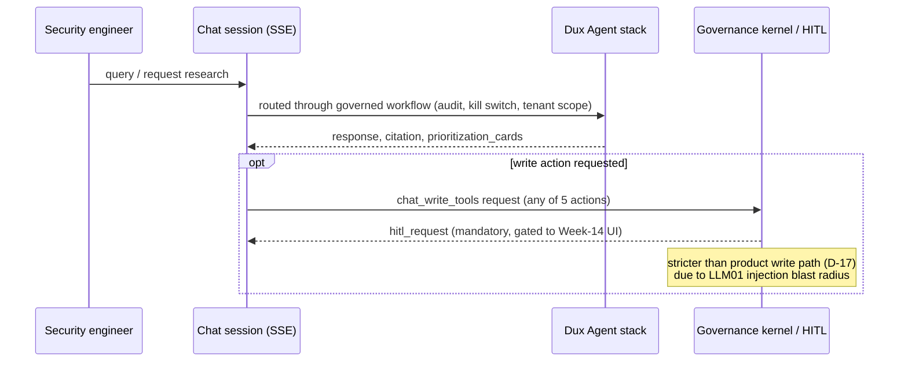

# Chat Guidance

## Summary

US-008 — the conversational surface onto the [[Dux Agent]]: request research, compare remediation strategies, and (where write is enabled) approve chat-initiated write actions. Owner: Engineering. Status: canonical, Gate 1 for the **read-only** path. Epic: EP-05. BRs: BR-002, BR-006, BR-007. Decisions: D-4, D-7, D-17, H4, H5.

## Executive Summary

Chat is explicitly not a general-purpose security chatbot — every turn routes through governed agent workflows (audit, kill switch, tenant scope, HITL) — and it is deliberately isolated in its own failure domain: a separate SSE connection pool and its own `InstrumentedLLMClient` LLM quota bucket (NFR-011), so chat degradation cannot block `ExploitabilityAssessmentWorkflow` queue processing. The load-bearing safety distinction in this spec is that `chat_write_tools` is gated to mandatory HITL for **every** action regardless of which of the five canonical write actions it targets — a stricter posture than the three earned-autonomy actions enjoy elsewhere in the product (US-004/016/018), because arbitrary MCP writes issued from open-ended conversation carry an LLM01 prompt-injection blast radius the schema-constrained write surfaces don't have. This is a deliberate, scoped exception layered on top of D-17's per-action gating, not a contradiction of it, and chat write stays blocked until the Week-14 full chat HITL UI exists (AI-133) — no chat write ships before then regardless of which action class it belongs to.

## Specification

**Nav:** global chat panel + in-context. **MCP is read-only in Phase 1.**

### Failure-domain isolation

Separate SSE connection pool + own LLM quota bucket (`InstrumentedLLMClient` budget, NFR-011). Chat degradation/rate limit must not block `ExploitabilityAssessmentWorkflow` queue processing.

### API

| Surface | Contract |
|---|---|
| SSE | `GET /chat/sessions/{id}/stream` — events: `query`, `response`, `citation`, `processing_step`, `prioritization_cards`, `request_research_ack`, `hitl_request` |
| POST | `POST /chat/sessions/{id}/hitl-response` |
| Alias | `POST /research/queue` — Request Research |

Flag: `chat_interface`, on at Gate 1.

### Prioritization cards

A **control-plane write**, exempt from `chat_write_tools`, persisted to `session_routing_preferences` (ephemeral, **24 h TTL**, threat model + hash-chained audit per AI-13). For a broad ask, `prioritization_cards` can carry several competing remediation strategies side by side, each quantified by **`exploited_cve_coverage_pct`** — the share of exploited/actively-targeted CVEs addressed, not raw instance count. Reuses the existing card mechanism: strategy label, affected-asset list, `exploited_cve_coverage_pct`.

### Reconnection

Replays `Last-Event-ID` from `chat_session_events` over a **1-hour window**; beyond that, falls back to `GET /chat/sessions/{id}/state` snapshot. Workflow state is unaffected — reconnection is transport-only. **Limits: 5 concurrent SSE streams per `user_id`, over HTTP/2.**

### Data & safety

World Model read-replica, **<5 s lag**. Citations carry AWS and NVD context. KS-L1 per session. Prompt-injection regression suite (LLM01). Write tools require HITL.

### Two write surfaces, two risk profiles

| Surface | Actions | Gate-1 posture |
|---|---|---|
| Product write (US-004/016/018) | 3 of 5 canonical actions | Unattended by default; approve/deny surface for anomaly escalation only |
| Product write (US-004/016/018) | `endpoint.isolate`, `patch.deploy_special_devices` | Mandatory HITL on every call (D-17), same approve/deny surface used as a mandatory gate |
| Chat write (`chat_write_tools`) | Any of the five | Gated to Week-14 full chat HITL UI regardless of action — no exception |

### Phased delivery

| Milestone | Delivery |
|---|---|
| Week 4 | DBOS / inner-loop chat spike (go/no-go) — blocks US-008 production routing until it passes |
| Week 6 | **Closed without a bake-off (D-35, ADR-021)** — no inner agent framework; reasoning loop calls Bedrock Converse API directly from Temporal activities. CopilotKit/AG-UI chat-UI spike (W10–12) proceeds independently |
| Week 8 | API-level HITL approve/deny gate active for write-tool paths |
| **Gate 1 (Week 12)** | Minimal approve/deny UI live, with impact preview (H4) |
| Week 14 | Full chat HITL UI; `chat_write_tools` enabled — no chat write before this UI exists (AI-133) |

## Diagram

## Entities & Concepts

- [[Dux Agent]] — the actor behind the chat surface
- [[CaMeL]] — the S-LLM boundary defenses this feature's write exception waits on
- [[Kill Switch]] — KS-L1 per session
- [[Governance Kernel]] — HITL gate for chat write tools

## Related

- [[Mitigation & Remediation Write Path]] — the two-risk-profile write-surface comparison
- [[Dux Product Area]]
- [[Dux Overview]]

## Sources

- `.raw/dux/10-product/features/chat-guidance.md`
