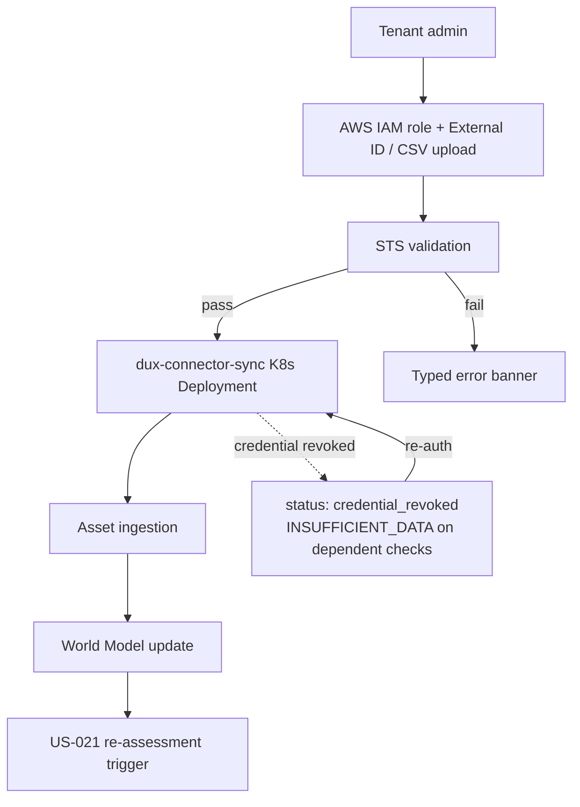

# Connector Hub

## Summary

US-013 (Connector Hub) and US-020 (Optional Physical Residency Admin) — how a tenant connects its environment to Dux and how sync health is surfaced. Owner: Engineering. Status: canonical. US-013: Gate 1, AWS as P0. US-020: Gate 5, status draft. Epic: EP-02. BR: BR-004. Decisions: D-34.

## Executive Summary

Connector Hub is the prerequisite gate for nearly everything else in the product: it feeds live US-011 AWS evidence and is the deep-link target from every degraded empty state in US-002–007. Its most consequential rule is integrity over coverage — a vendor must never show a false "Connected" (it reads "Coming soon" until `connector_configs.status = active`, requiring both `validateCredentials()` and a first successful sync), and a bad CSV upload produces typed errors rather than a partial, poisoned ingest. The MVP connector table (D-34, v4.0 source doc) is the single authoritative per-connector rate-limit/sync-interval source (D-47) — it supersedes and removes an older, coarser cadence table that conflicted with it by up to 288x on four overlapping connectors. Physical residency (US-020) is fenced to Gate 5 and contractually firewalled: there is no in-VPC agent before then, and for Phases 1–4 "lives inside your environment" means only *logical* residency via the Unified Integration Layer — sales copy must not imply otherwise. The mid-assessment credential-revocation handling (resolving OI-14) is the most operationally significant subsection: it treats a revoked connector as a distinct, non-fatal failure mode that degrades affected checks to `INSUFFICIENT_DATA` rather than failing the whole assessment.

## Specification

### US-013 Connector Hub (Gate 1, AWS P0)

**Orchestration.** Connector sync workflows — not Dux Agent reasoning. AWS sync → asset ingestion → World Model update, which triggers re-assessment (US-021, Gate 1). Sync runs as the isolated **`dux-connector-sync` K8s Deployment** (ADR-006 R4), never in the API container.

**API.**

| Endpoint | Contract |
|---|---|
| `POST /connectors/aws/sync` | → `{sync_id, status, assets_ingested, started_at}` |
| `POST /connectors/csv/upload` | multipart. Errors: `missing_column`, `invalid_os_family`, `duplicate_hostname`. Limits: **50 K rows**, UTF-8, unique `(tenant_id, hostname)` |
| Webhook | `connector.sync_failed` |

**Auth.** AWS cross-account IAM role + External ID (ADR-004). Credentials never appear in agent traces. STS validation at setup:

| STS error | Banner |
|---|---|
| `AccessDenied` | trust-policy fix message |
| `ExternalIdMismatch` | external-ID mismatch |
| `InvalidClientTokenId` | invalid credentials |

All three persist to `aws_role_status`.

**Throttling.** Backoff with jitter, max **5 retries**. Per-service limits: EC2 **100**, IAM **20**, S3 **100 req/s**. CloudWatch `AWSThrottledRequests` feeds the sync-health strip.

**Phase-1 constraint.** One AWS account per tenant — multi-account delegated admin deferred to Gate 2 (`AwsDiscoveryService`).

**MVP connector set (D-34, v4.0 source doc)** — the fuller target set on top of ADR-011 R2's "≥3 live at Gate 1" floor:

| Connector | Auth | Rate limit | Sync interval |
|---|---|---|---|
| Tenable.io | API key | 10 rps | 60 min |
| Qualys | API key | 5 rps | 60 min |
| CrowdStrike | OAuth2 | 6 rps | 30 min |
| AWS Security Hub | IAM SigV4 | 20 rps | 15 min |
| Rapid7 InsightVM | API key | 10 rps | 60 min |
| Splunk | REST token | 10 rps | 5 min |
| Jira | Basic auth | 10 rps | 5 min |
| ServiceNow | OAuth2 | 10 rps | 5 min |
| Okta | API token | 10 rps | 15 min |
| Azure AD | Graph API OAuth2 | 10 rps | 15 min |

Each implements `BaseConnector`/`AbstractVendorConnector` (ADR-011 R2), overriding only `fetchPage`/`mapRecord`. Output publishes to NATS subjects (`vulnerabilities.raw`, `assets.raw`, `tickets.raw`, `identities.raw`), consumed by the same World Model ingestion path as AWS/CSV.

**This table is the single authoritative cadence source (D-47)** — it supersedes and removes an older, coarser "sync cadence defaults" table (6 h/12 h/24 h, grouped by wave-taxonomy, no rate-limit backing) that conflicted with it by up to **288x** on the four overlapping connectors (CrowdStrike, Qualys, Splunk, ServiceNow). **Wiz and Intune are not in this table and have no rate-limit-derived cadence yet** — open item OI-58 tracks deriving one the same way rather than carrying over the superseded table's unresearched 6 h figure. Manual "Sync now" remains available on demand for every connector.

**Safety.** Sync failure raises the webhook + US-012/US-014 health strip. Invalid CSV → typed errors; no partial, poisoned ingest.

### US-020 Optional Physical Residency Admin (Gate 5, draft)

**Job.** A tenant admin monitors the `dux-resident-agent` — heartbeat, version, evidence sync — for air-gapped/on-prem listening checks.

**Orchestration.** A DaemonSet (FR-014) deployed **only inside customer infrastructure**, reporting via `POST /resident-agents/{id}/heartbeat`, authenticated by mTLS (preferred) or a signed JWT carrying `nonce` and `exp ≤60 s`. Its evidence surfaces in US-011's `process_not_listening` factor cards.

**Contract firewall.** No in-VPC agent before Gate 5. Phases 1–4: "lives inside your environment" = logical residency via the Unified Integration Layer. Sales copy must not imply otherwise.

**Safety.** Agent certificates rotate. A compromised resident triggers a tenant-scoped **KS-L3** and isolates the agent.

### Vendor-token revocation mid-assessment (resolves OI-14)

| Step | Behavior |
|---|---|
| Trigger | Vendor call (sync or in-flight `AssetContextWorker`/`ExploitabilityAssessmentWorkflow` MCP read) returns 401/403 or a vendor-specific revoked-token code for a connector that was `active` at assessment start |
| Detection | MCP tool wrapper classifies as `CONNECTOR_CREDENTIAL_REVOKED` (distinct from `ConnectorSyncError`, transient/5xx), emits on `connector.sync_failed` with `reason=credential_revoked` |
| In-flight behavior | (1) in-progress gathering stops, completed steps keep evidence; (2) remaining dependent checks yield `INSUFFICIENT_DATA` (`intel_gap`/`asset_gap`) rather than reusing stale evidence; (3) `connector_configs.status` flips `active` → `credential_revoked` (not `error`) — card shows "Reconnect required"; (4) US-014 health strip + webhook fire immediately, no wait for next scheduled sync |
| Recovery | Tenant admin re-authenticates via Connector Hub (same OAuth/IAM flow). On successful `validateCredentials()`, status returns to `active` and a full (not delta) sync runs once. Affected `INSUFFICIENT_DATA` assessments are eligible for the next scheduled sweep (US-021) — not auto-retried, to avoid a reconnect storm |
| Safety | No partial-credential state is ever passed to a vendor mutation API — a revoked connector cannot execute a write action; `VendorActionGate` checks connector status before every write |

## Diagram

## Entities & Concepts

- [[Dux Agent]] — consumer of connector-sourced evidence
- [[World Model]] — updated by every successful sync
- [[Governance Kernel]] — `VendorActionGate` blocks writes on revoked connectors
- [[Dux Catalogs — Registries of Record]] — integration catalog this MVP set extends

## Related

- [[Security Stepper]] — US-002's degraded empty states deep-link here
- [[Dux Product Area]]
- [[Dux Overview]]

## Sources

- `.raw/dux/10-product/features/connector-hub.md`
