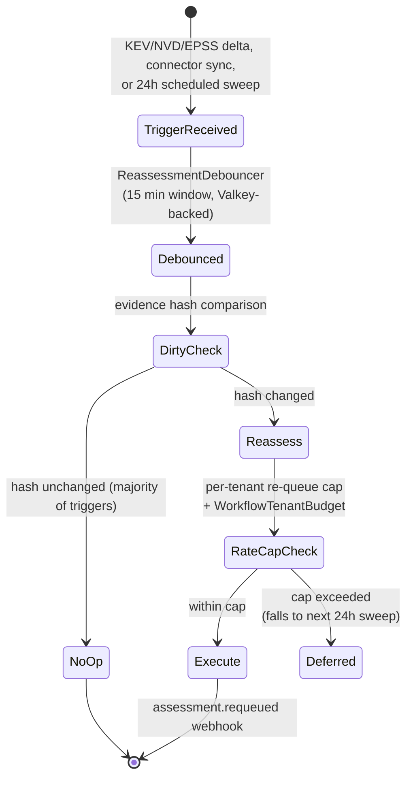

# Continuous Re-Assessment

## Summary

US-021 — re-evaluates exploitability findings automatically when the world changes (new threat intel, a connector delta, or a scheduled sweep) rather than only on human request. Owner: Engineering. Status: canonical, Gate 1. Epic: EP-04. BR: BR-002. FR-025 / ADR-016. Decisions: D-9.

## Executive Summary

This is the feature that makes the public "continuous exploitability" claim literally true at Gate 1: `ReassessmentSchedulerWorkflow` re-queues on threat-intel deltas, asset/control deltas, and a tenant-configurable scheduled sweep (default 24 h). The cost-control design is the interesting part — most triggers resolve as "no material change" without any LLM call, because a re-assessment reuses the cached World-Model prefix and only re-runs the P-LLM step when evidence actually changed (dirty-checked against an evidence hash). The burst-tier degradation model (resolving OI-13/SR-11) is the load-bearing safety mechanism: it bounds a platform-wide feed storm (e.g. a daily EPSS re-score touching every CVE) two ways before it ever reaches a tenant's re-queue cap — first by never touching the NVD/EPSS/KEV per-CVE request quota (EPSS publishes as one daily bulk file, diffed locally), and second by pacing execution-backed re-runs against the sandbox budget, which is the real ceiling regardless of how many triggers the storm produced. Marketing copy must keep "continuous" (data sync) distinct from "re-assessment" (this feature) — both ship at Gate 1, so the combined claim is safe, but Gate 3 (closed-loop validation, US-019) must not be conflated with the Gate-1 write path.

## Specification

### Triggers (`ReassessmentSchedulerWorkflow`, Temporal)

| Trigger | Source |
|---|---|
| Threat-intel delta touching a tenant CVE | new CISA KEV / NVD / EPSS |
| Asset or control delta | a connector sync bumps `world_model_versions` |
| Scheduled sweep | default **24 h**, tenant-configurable |

`ReassessmentDebouncer` coalesces per `(tenant, cve, asset)` within a **15-minute window**; state persists in **Valkey**, so the coalesce window survives worker restarts (D-9).

### Cost control

A re-assessment reuses the cached World-Model prefix and re-runs the P-LLM step **only when the evidence actually changed**, dirty-checked against an evidence hash. Most triggers resolve "no material change" with zero LLM calls.

### API

`POST /research/schedule`, `GET /research/schedule`. Webhook: `assessment.requeued`. Distinct from US-010 (manual Request Research).

### Safety — per-tenant rate caps

| Tier | Re-queue cap |
|---|---|
| Design Partner | 50/hour |
| Starter | 200/hour |
| Professional | 2,000/hour |
| Enterprise | 10,000/hour default, contract-negotiable |

Enforced alongside **GOV-004's `WorkflowTenantBudget`** (Starter **500** / Pro **5,000** / Enterprise floor **50,000** actions/day) — the re-queue cap is the re-assessment-specific ceiling *within* that daily action budget, not a separate mechanism. A breach raises `REASSESSMENT_TENANT_CAP_EXCEEDED`; excess triggers are not dropped — they fall through to the next 24 h scheduled sweep. **KS-L2** pauses the scheduler.

### Burst-tier degradation model (resolves OI-13, SR-11)

1. **Never touches the NVD/EPSS/KEV per-key request quota (50 req/30 s per key).** EPSS publishes as a single daily bulk file (FIRST.org) — the ingest pipeline downloads and diffs it, emitting a debounce trigger only for `(tenant, cve, asset)` triples with an open finding on a CVE whose EPSS score moved. The 200 K-row global delta collapses to "tenants with a matching open finding."
2. **The dirty-check already resolves most of what remains as no-op.** Execution-backed re-runs are ordered **KEV-first, then descending EPSS, then descending CVSS** and paced against the sandbox budget (D-9: **300 sandbox-seconds/hour** and **5 concurrent microVMs per tenant**) — the real ceiling, bounding a tenant to roughly **5–10 execution-backed re-assessments/hour** regardless of storm size. GTM copy about assessment speed refers to a single CVE, not a platform-wide sweep.

### Verification

`pnpm test:reassessment-trigger` (KEV / EPSS / connector delta → enqueue); `pnpm test:reassessment-dirtycheck` (no-op when evidence unchanged); plus a scheduled-sweep integration test.

### Metrics

Re-assessment volume; outcome-change rate on re-run; cost per scheduled assessment.

### Marketing reconciliation

"Continuous" (connector polling/data sync) must be distinguished from "re-assessment" (US-021). Both ship at Gate 1, so "continuous exploitability analysis" is claim-safe. Gate 3 is closed-loop validation (US-019) — not the write path, which is unattended by default at Gate 1.

## Diagram

## Entities & Concepts

- [[Dux Agent]] — the reasoning step re-run on dirty evidence
- [[World Model]] — the `world_model_versions` bump that triggers re-assessment
- [[Kill Switch]] — KS-L2 pauses the scheduler

## Related

- [[Connector Hub]] — connector deltas are a trigger source
- [[Research Dashboard & Vulnerability Reduction]] — the queue this feeds
- [[Dux Product Area]]
- [[Dux Overview]]

## Sources

- `.raw/dux/10-product/features/continuous-assessment.md`
