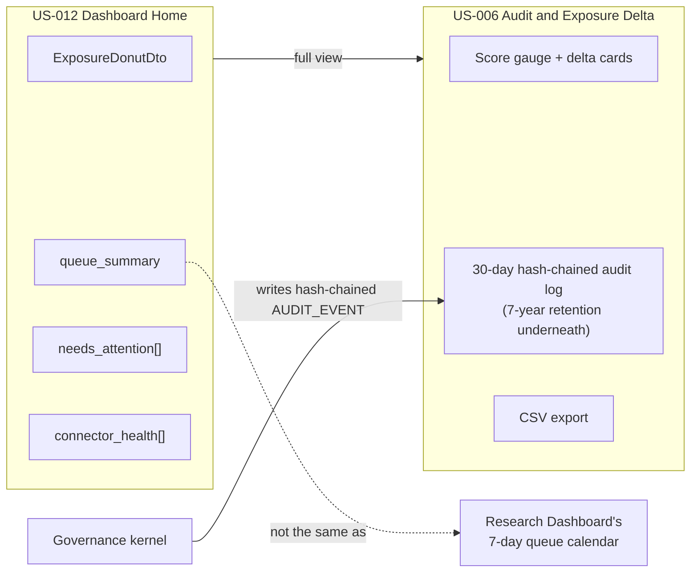

# Dashboard Home & Audit

## Summary

US-012 (Dashboard Home) and US-006 (Audit & Exposure Delta) — the at-a-glance posture screen and the tamper-evident record of how exposure changed over time. Owner: Engineering. Status: canonical. Both live at Gate 1. Epics: EP-05, EP-07. BRs: BR-008, BR-005. Decisions: H9.

## Executive Summary

US-012 answers a single question — "what needs attention now?" — via read-only aggregation that triggers no agent on load; the Request Research button and Chat shortcut are entry points into US-010 and US-008 respectively, not new mechanisms. US-006 is the CISO-facing companion: a board-ready exposure trend with a tamper-evident, hash-chained audit trail, explicitly **not** live vendor protection (that's US-003 — the corpus flags this as a build-rule the team must not merge). Two things in this file are frequently conflated and worth holding apart precisely: MTTP is tracked here as a hypothesis, instrumented end-to-end but framed as a measured metric rather than an SLA by Phase-1 exit (H9); and the audit-log detail view's 30-day UI display window is a presentation limit only — the underlying `AUDIT_EVENT` trail retains 7 years for compliance, and export is not limited to the visible 30 days. This file also draws the sharpest possible line between two calendar-shaped widgets that look similar but aren't: the audit-log date picker (audit-log history by date) versus the Research Dashboard's 7-day queue-activity calendar (queue completed/in-research/backlog by day) — different widgets, different data, and the spec calls out the risk of conflating them.

## Specification

### US-012 Dashboard Home

**Orchestration.** Read-only aggregation — loading the dashboard triggers no agent. Request Research feeds the same queue as US-010; Chat shortcut opens US-008.

**API.** `GET /dashboard/home` → `DashboardHomeDto`:

| Field | Type |
|---|---|
| `exposure_summary` | `ExposureDonutDto` |
| `vulnerability_reduction` | trend figure |
| `queue_summary` | `{completed, in_research, backlog}` |
| `needs_attention` | `CveSummaryDto[]` |
| `connector_health` | `ConnectorHealthDto[]` — `stale_warning` when **>24 h** |
| `as_of` | timestamp |

Streaming: `GET /dashboard/home/stream` (SSE) → `queue_update`, target **<5 s**.

**Safety.** **KS-L3** renders the dashboard read-only with a banner. A partial widget failure degrades that widget only. An `INSUFFICIENT_DATA` empty state routes to US-013 and US-010.

**Design.** Interim spec until Figma v2 ships.

### US-006 Audit & Exposure Delta (Gate 1, governance and audit)

Canonical spec for US-006; journey summary lives in [[Security Stepper]] Step 6.

**Job.** Give a CISO a board-ready exposure trend, delta cards, and a tamper-evident audit trail. **Not** live vendor protection — that's US-003.

**Orchestration.** No agent loop — a projection over assessment outcomes and exposure-state transitions. The governance kernel writes hash-chained `AUDIT_EVENT` rows.

**API.** `ExposureDonutDto` within `GET /dashboard/home`; `GET /audit/events` and `GET /audit/verify` (FR-008).

**Surface.** Dashboard donut widget + full view (US-012): score gauge, delta cards, a **30-day hash-chained audit log**, CSV export, state-transition entries.

**Data.** `EXPOSURE_STATE`, `AUDIT_EVENT`, outcome aggregates.

**MTTP.** Tracked here as a **hypothesis** — instrumented end to end (assessment, approval, action latency) as a **measured metric, not an SLA**, by Phase-1 exit (H9).

**Audit log detail view.** Per-day event count (e.g. "40 Events" against a calendar date), aggregated from `GET /audit/events`, with a date picker for historical navigation, scoped to a **30-day UI display window**. The underlying `AUDIT_EVENT` trail retains **7 years** per the compliance program — export is not limited to the visible 30 days.

**Do not conflate:** this widget browses *audit-log history by date*. The 7-day queue-activity calendar (`ResearchCalendarDayDto[7]`, in Research Dashboard) shows *queue completed/in-research/backlog by day* — different widgets, different data.

## Diagram

## Entities & Concepts

- [[Dux Agent]] — no agent loop runs on either of these two screens
- [[Governance Kernel]] — writes the hash-chained `AUDIT_EVENT` rows
- [[Kill Switch]] — KS-L3 renders the dashboard read-only

## Related

- [[Security Stepper]] — Step 6 journey summary points back here
- [[Research Dashboard & Vulnerability Reduction]] — the calendar widget this file explicitly distinguishes itself from
- [[Dux Product Area]]
- [[Dux Overview]]

## Sources

- `.raw/dux/10-product/features/dashboard-audit.md`
