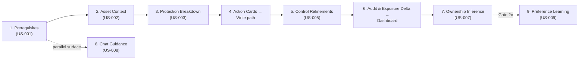
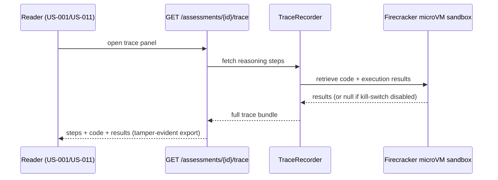
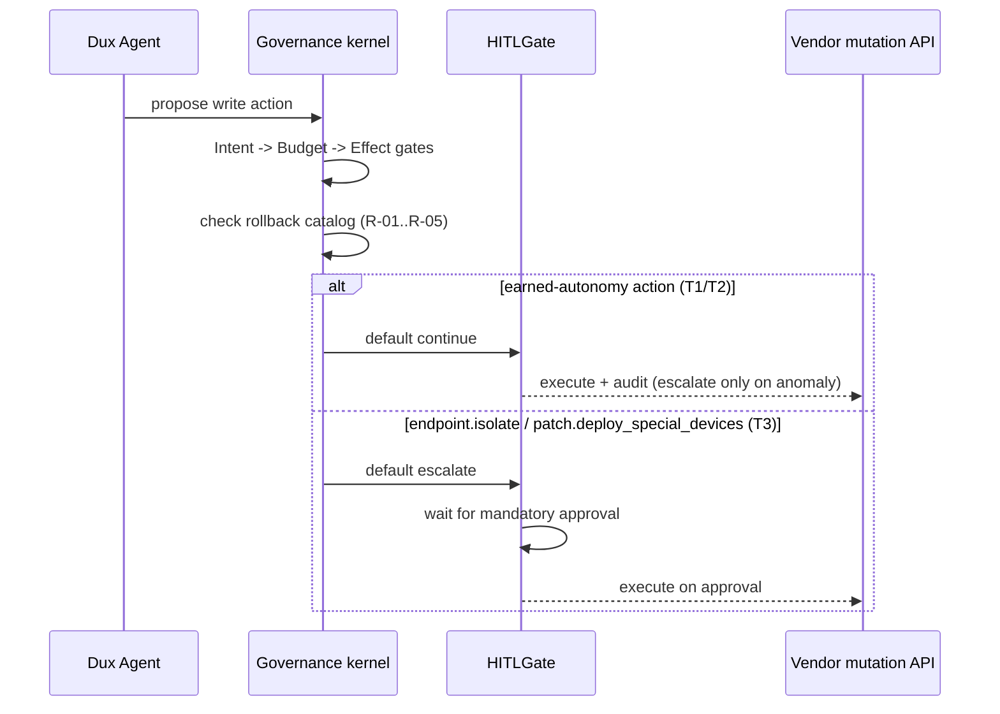

# Dux Feature Reference

Navigation: [[Dux]] | [[Dux Product Guide]] | [[Dux Taxonomy & Catalogs]]

The complete spec for every screen, API surface, and safety behavior behind the eight-icon sidebar and chat. Organized by where each feature sits in the Analyze → Mitigate → Remediate pipeline, not by nav order. Every user story (`US-###`) below is canonical and Gate 1 unless a status is called out explicitly.

## Investigation: the Security Stepper (US-001–007, US-009)

The stepper is the seven-plus-one-step investigation journey a security engineer walks through on any single CVE. Two pairs of steps look adjacent and are frequently, wrongly, merged in engineering discussions: this reference calls both out up front:

- **US-006 is not US-003.** US-006 answers "how is exposure trending" (governance/audit); US-003 answers "am I still protected right now" (live vendor control proof).
- **US-002 is not US-011.** US-002 is a standalone CrowdStrike/Intune asset-context panel; per-asset AWS fields already live in the US-011 asset table.

Every step without a live connector renders the full designed layout in a connector-degraded empty state, deep-linking to Connector Hub: never a bare "connect something" CTA shell.

### Step 1: Prerequisites Analysis (US-001)

Decomposes a CVE into its real-world exploitation requisites, with cited sources. Orchestrated by `ExploitabilityAssessmentWorkflow` (Temporal), triggered on queue enqueue or CVE selection; the `prerequisite-extractor` subagent pulls NVD, GitHub, Metasploit, and Medium evidence through MCP read tools, sanitized across the CaMeL S-LLM/P-LLM boundary. `GET /assessments/{id}` returns the `AssessmentDto`; trace lives at `GET /assessments/{id}/trace`.

Intel staler than 24 hours yields `INSUFFICIENT_DATA` rather than a guess. **KS-L1** halts the session. No HITL: this step is read-only research. Competitively, this is a real differentiator: Tenable Hexa orchestrates but ships no prerequisite decomposition with per-source citations, and Strobes triages in seconds without the reasoning chain Dux exposes via US-017.

### Step 2: Asset Context Evidence (US-002, read-only)

Proves or disproves environmental exploitability using runtime, network, SIEM, and role evidence for one specific asset, via `AssetContextWorker`:

| Source | Status | Evidence |
|---|---|---|
| CrowdStrike | live at Gate 1 | endpoint state |
| AWS | live at Gate 1 | EC2 metadata, security-group reachability |
| Splunk | live at Gate 1 | SIEM process/runtime telemetry |
| Identity/role | live at Gate 1 | last-login, role |
| Intune | Gate 3 / wave W2 | connector-degraded until then |

`GET /assets/{id}/context` returns `AssetContextDto`. A stale connector yields `INSUFFICIENT_DATA`: vendor fields are never fabricated. **KS-L2** stops new gathers; in-flight gathers complete and are flagged as partial evidence.

### Step 3: Protection Breakdown (US-003, read-only)

Answers "where am I already protected?" with vendor control proof: CrowdStrike policies at Gate 1, Intune at Gate 3/W2. `control-mapping-worker` correlates findings to active controls, producing segment cards (Protected / Partially Mitigated / Exposed) plus a settings/effect table, via `?projection=protection` on `GET /cves/{id}/detail` and `GET /attack-paths`.

### Step 4: Action Cards (US-004)

Journey summary only here: full canonical spec is in the [mitigation section](#mitigation-and-remediation-the-write-surfaces) below. At Gate 1: unattended by default for `network.blocklist_add`/`policy.deploy_device_config`; mandatory human approval for `endpoint.isolate`/`patch.deploy_special_devices`. **KS-L2** blocks new proposals.

### Step 5: Control Refinements (US-005)

Surfaces the highest-impact estate-wide configuration changes (disabling NTLM, enabling IMDSv2) ranked by exposure reduction, via `ControlRefinementQuery` using the Specification pattern (`ByImpact`, `ByScanner`, `ByCVE`). Wiz ingest is live at Gate 1; Qualys is Gate 3/W2. Each result carries an `effort` field (S/M/L, sized by rollout scope, not build cost) as a secondary column: it never breaks ties in the ranking, which is exposure-reduction only. `GET /controls/refinements`.

### Step 6: Audit & Exposure Delta (US-006)

Journey summary only here: full spec is under [Dashboard Home & Audit](#visibility-dashboard-home-and-audit-us-012-us-006) below. A CISO-facing, board-ready exposure trend: delta cards plus a tamper-evident, hash-chained audit trail. No agent runs; it's a projection over assessment outcomes.

### Step 7: Ownership Inference (US-007, read-only)

Routes remediation to the right team with a certainty percentage and ITSM/identity evidence, via the ownership-inference activity reading ServiceNow and Entra ID (both live at Gate 1). `OwnershipInferenceDto`; data lands on `OWNERSHIP_EVIDENCE` and `ASSET.owner_team`. Certainty below threshold yields `INSUFFICIENT_DATA` plus a manual-assign CTA. Auto-ticketing (US-018) creates and routes unattended at Gate 1.

### Step 9: Preference Learning (US-009, Gate 2c, not promoted)

Lets a CISO teach risk appetite in natural language so future assessments respect scope. Held back from Gate 1 for a data reason, not a build reason: `PreferenceEngine` needs tenant assessment history that simply doesn't exist yet. The Gate-1 interim is session routing preferences (24-hour TTL, in Chat Guidance) plus per-instance acknowledgment (US-023). `POST /preferences` / `GET /preferences`; writes require tenant-admin or CISO role, and ambiguous natural language always raises a clarification prompt rather than silently guessing.

**What the stepper is measured against**, feature by feature: completion rate and time-to-first-card p95 for the stepper overall (with at least 4 prerequisite source slots, NVD mandatory, backing US-001); trace export count, steps-per-assessment distribution, `execution_results` population rate, and the competitive-evaluation win rate when a trace is shared, for US-017's trace panel; and golden-set exploitability accuracy as the standing quality bar across the whole investigation flow.

## Investigation: Exposure Analysis (US-011)

Where the pipeline's output becomes a single defensible verdict: severity badges, risk groups, a flow bar, mitigation factor cards, an asset table, and attack paths, produced by the Prerequisite, AssetContext, and ControlMapping subagents together. `GET /cves/{id}/detail` returns `CveDetailDto`, and its most important structural rule is that **three taxonomies live in separate DTO subtrees and must never be merged**: a risk group, an exposure state, and a factor card are three different things.

Factor cards live at Gate 1: `aws_sg_blocks_port` (live), `product_not_affected` (live), `network_reachability` (partial), `firewall_blocks_exploitation` (live via CrowdStrike), `process_not_listening` (Gate 5 only). **NFR-013 sets a hard performance bar: p95 under 500ms at 1,000 assets.** Cross-tenant `GET /cves/{id}` returns 404. With AWS absent, factor cards fall back to assessment logic only, and **KS-L1** halts an in-flight assessment for the session.

One documentation note worth repeating precisely: the reference-UI demo numbers baked into the original Figma spec (8,341 researched, a 74.3/15.6/10.1% split, 78% certainty) are illustrative placeholders, not measured product metrics. Don't cite them as real.

## Investigation: Assessment Trace (US-017)

Arguably Dux's single biggest competitive asset: a JSON bundle proving *why* a verdict was reached, opened as a panel from US-001 or US-011 rather than living as its own nav icon. The differentiating claim ("investigation backed by code: consistent, inspectable, repeatable") depends entirely on `execution_results` actually being populated, which it is at Gate 1 via a self-hosted Firecracker microVM sandbox; the only time it's null is when the sandbox has been disabled through the emergency kill path.

`GET /assessments/{id}/trace` returns `AssessmentTraceDto`: `steps[]`, a `code_artifact`, `execution_results`, and an `exported_at` timestamp. Export ships as tamper-evident JSON in Phase 1 (NFR-009); PDF export via Gotenberg is a later delta. The trace is only available once an assessment completes: mid-assessment, the empty state routes to Request Research (US-010) instead. **KS-L1** stops the trace stream mid-assessment; cross-tenant access returns 404.

## Investigation: Research Dashboard & Vulnerability Reduction (US-010, US-023, US-024)

**This is the "Mitigation" nav item**: the Analyze-stage research queue, not the Mitigate automation stage. Conflating the two is the single most common naming error in the whole corpus, so it's worth over-stating: this page is about *visibility into what's being researched*, not about executing writes.

**US-010 Research Dashboard.** Tracks Completed / In Research / Backlog, reads Vulnerability Reduction metrics, and lets a user enqueue new investigations. `POST /research/queue` triggers `ExploitabilityAssessmentWorkflow`, deduplicated by `AssessmentDeduplicationService`. Streaming updates arrive over SSE targeting under 1 second. The 8,341 → 2,143 funnel sometimes quoted for this feature is illustrative, not a measured result: the real success story is "thousands of alerts collapse to tens of actionable rows, each with evidence links."

**US-023 Acknowledge Vulnerability Instance.** Lets an engineer accept or suppress risk on one specific instance with a reason and optional expiry: distinct from US-009's natural-language preference rules. `is_acknowledged` is computed: true only when an active, non-revoked acknowledgment exists with `expires_at` null or in the future. Critically, **a revoked or expired acknowledgment does not suppress alerts**: the instance returns to queue elevation automatically.

**US-024 Vulnerability Instances by CVE.** Lists every instance of a CVE across assets with exploitability, reachability, and acknowledgment state. `GET /v1/vulnerability-instances/{cve_id}` uses cursor pagination (limit 1–5000, default 3000). One precise distinction worth holding onto: `exploitability_status = null` means "we haven't looked yet"; `insufficient_data` means "we looked and couldn't tell." They are not interchangeable.

Measured by queue depth broken down by state, the accuracy of the Vulnerability Reduction bar itself, Request Research latency, and the actionable-queue ratio the whole page exists to demonstrate.

## Investigation: Chat Guidance (US-008)

The conversational surface onto Dux Agent: not a general-purpose security chatbot. Every turn routes through the same governed agent workflows (audit, kill switch, tenant scope, HITL) as the rest of the product, and chat runs in its own failure domain: a separate SSE connection pool and its own LLM quota bucket, so chat degradation can never block the core assessment queue.

The one write-surface rule worth internalizing: **any write action initiated from chat requires mandatory human approval, regardless of which of the five canonical actions it targets**: a stricter bar than the earned-autonomy model applied everywhere else in the product. That's deliberate, not a contradiction of the earned-autonomy model: open-ended conversation carries a prompt-injection blast radius that schema-constrained write surfaces don't have. Chat write stays fully blocked until the Week-14 full HITL UI ships: no exceptions before then.

Reconnection replays the last hour of events via `Last-Event-ID`; beyond that window it falls back to a state snapshot. Limits: 5 concurrent SSE streams per user, over HTTP/2. `POST /research/queue` is aliased as "Request Research" from chat.

## Mitigation and remediation: the write surfaces (US-004, US-016, US-018, US-019)

This is the canonical spec for everything Dux is allowed to *do* in a customer's environment, not just observe. Every write, regardless of which of the five actions it is, flows through the same governance chain (`IntentGate → BudgetGate → EffectGate → VendorActionGate → HITLGate`) and every write requires a `rollbackProcedure` URL in its audit/HITL payload before it can execute unattended. Full governance mechanics live in [[Dux AI Safety Guide]]; this section is the product-facing spec.

| Action | Tier | Posture |
|---|---|---|
| `ticket.create_remediation` | T1, lowest blast radius | Unattended by default |
| `network.blocklist_add` | T2 | Unattended by default |
| `policy.deploy_device_config` | T2 | Unattended, once the Intune connector ships |
| `endpoint.isolate` | T3 | Mandatory human approval, every call |
| `patch.deploy_special_devices` | T3 | Mandatory human approval: no API-level rollback exists |

**US-016 Fast Actions.** One-click lightweight mitigations. `POST /fast-actions` triggers `QuickMitigationWorkflow`; the three earned-autonomy actions execute immediately, audit-logged and kill-switch-covered, while the two mandatory-review actions raise a live approval request and wait.

**US-004 Action Cards.** The canonical mitigation surface: blocklist actions at Gate 1, Intune policy steps once the W2 connector lands, each carrying a residual-risk count. `POST /mitigations` executes through `VendorActionGate`.

**US-018 Remediation Ticket Panel.** A ServiceNow/ITSM ticket, created and routed automatically (`RemediationWorkflow`): the lowest blast-radius action in the set. Status updates arrive by webhook. Unattended closed-loop auto-close is Gate 3 (US-019), not Gate 1.

**US-019 Mitigation Validation Panel (Gate 3, draft).** Confirms post-mitigation exposure actually dropped by re-assessing. A failed validation escalates to human review: **a finding is never auto-closed on a timeout alone.**

### Marketing claim guardrails

"Lightweight mitigations" and "rapid remediation" are safe to claim without caveat at Gate 1: the write path genuinely executes at Gate 1. Any "self-healing" or "fully automated remediation" claim still needs a Gate-3 qualifier, because *confirming* the action worked (closed-loop validation) is a separate, later gate from *acting*.

### The rollback catalog

Every `rollbackProcedure` resolves to one of five entries. `VendorActionGate` will not authorize unattended execution of an action whose rollback entry is missing:

| ID | Action | Compensating procedure |
|---|---|---|
| R-01 | `endpoint.isolate` | Restore pre-isolation network policy via the same EDR adapter, keyed for idempotent reversal |
| R-02 | `network.blocklist_add` | Revert the specific rule by its vendor-native rule ID: never a broad "flush blocklist" |
| R-03 | `policy.deploy_device_config` | Redeploy the device's prior config snapshot |
| R-04 | `patch.deploy_special_devices` | Rollback where supported; firmware-only devices have no API-level rollback, so this action stays mandatory-HITL rather than running unattended without an undo path |
| R-05 | `ticket.create_remediation` | Close with reason `superseded_by_rollback`: no environment state to revert |

## Visibility: Dashboard Home and Audit (US-012, US-006)

**US-012 Dashboard Home** answers one question ("what needs attention now?") via read-only aggregation that triggers no agent on load. `GET /dashboard/home` returns exposure summary, vulnerability-reduction trend, queue summary, a needs-attention list, and connector health (flagging `stale_warning` past 24 hours). Streaming updates target under 5 seconds. **KS-L3** renders the dashboard read-only with a banner; a partial widget failure degrades only that widget.

**US-006 Audit & Exposure Delta** is the CISO-facing companion: a board-ready trend, delta cards, and a tamper-evident, hash-chained audit trail: explicitly **not** live vendor protection (that's US-003; see the build-rule warning above). `GET /audit/events` and `GET /audit/verify` back a 30-day UI display window, but the underlying audit trail actually retains 7 years for compliance: export is never limited to the visible 30 days. Mean-time-to-protect (MTTP) is tracked here as a hypothesis: instrumented end-to-end but reported as a measured metric, not an SLA, by Phase-1 exit.

One more pair worth holding apart: the audit-log date picker (history by date) and the Research Dashboard's 7-day queue-activity calendar (completed/in-research/backlog by day) look like similar calendar widgets. They show completely different data.

## Forward-looking: Predictive Risk Forecasting (US-028, Gate 2, draft)

Answers "which assets are likely to become risky in the future," funded for Gate 2 as of 2026-07-20: not yet built, and the rest of this reference is Gate-1 canonical while this one section is deliberately forward-looking. Its design constraint is stated as a discipline, not an apology: this is a velocity computation over evidence Dux already ingests, not a new ML model and not a composite risk score. Output is a direction (`rising` / `stable` / `falling`) plus an inspectable contributing-factor breakdown, never a bare percentage dressed up as a probability.

`AssetRiskTrendWorkflow` runs weekly per tenant, computing a trend from three weighted signals: 30-day EPSS delta (weight 0.4, the one genuinely new data artifact this feature needs, `EPSS_SCORE_HISTORY`, retained 90 days rolling), open-finding count delta (0.35), and control-coverage delta (0.25). `GET /assets/risk-trend` returns the ranked list, `rising` first.

Safety is enforced by construction here, not by policy: no write action is ever triggered by a trend alone. A `rising` result is a prompt for a human to request research: it cannot reach `VendorActionGate` on its own.

## Continuous Re-Assessment (US-021)

The feature that makes "continuous exploitability" a literally true claim at Gate 1. `ReassessmentSchedulerWorkflow` re-queues on three trigger types: a threat-intel delta touching a tenant's CVE, an asset/control delta from a connector sync, and a scheduled sweep (24-hour default, tenant-configurable). A debouncer coalesces triggers per `(tenant, cve, asset)` within a 15-minute window.

The cost-control design is the clever part: most triggers resolve as "no material change" without any LLM call at all, because re-assessment reuses the cached World Model prefix and only re-runs the reasoning step when evidence has actually changed (dirty-checked against an evidence hash). Per-tenant rate caps scale by plan (50/hour for design partners up to 10,000/hour (contract-negotiable) for Enterprise) layered inside the broader daily `WorkflowTenantBudget`. A breach doesn't drop triggers; excess ones simply fall through to the next scheduled sweep. **KS-L2** pauses the scheduler entirely.

The burst-tier degradation model bounds a platform-wide feed storm (say, a daily EPSS re-score touching every CVE at once) two ways before it ever reaches a tenant's cap: EPSS publishes as a single daily bulk file that gets diffed locally rather than hitting the per-CVE request quota, and execution-backed re-runs are paced against a hard sandbox budget (300 sandbox-seconds/hour, 5 concurrent microVMs per tenant): the real ceiling, regardless of how large the storm is.

Marketing guardrail: keep "continuous" (data sync) distinct from "re-assessment" (this feature). Both genuinely ship at Gate 1, so the combined claim is safe: but don't let it drift into implying Gate 3's closed-loop validation is already live.

## Platform: Connector Hub (US-013, US-020)

The prerequisite gate for nearly everything above: it feeds live AWS evidence into Exposure Analysis and is the deep-link target from every degraded empty state in the stepper. Its most consequential rule is integrity over coverage: a vendor connector never shows a false "Connected" state (it reads "Coming soon" until both credential validation and a first successful sync succeed), and a bad CSV upload produces typed errors rather than a partial, poisoned ingest.

`POST /connectors/aws/sync` and `POST /connectors/csv/upload` (limits: 50K rows, UTF-8, unique tenant+hostname pairs) are the two Gate-1 ingestion paths. AWS auth uses a cross-account IAM role with an External ID; credentials never appear in agent traces.

The MVP connector table is the single authoritative source for rate limits and sync intervals: it deliberately supersedes an older, coarser cadence table that disagreed with it by up to 288x on four overlapping connectors:

| Connector | Auth | Rate limit | Sync interval |
|---|---|---|---|
| Tenable.io | API key | 10 rps | 60 min |
| Qualys | API key | 5 rps | 60 min |
| CrowdStrike | OAuth2 | 6 rps | 30 min |
| AWS Security Hub | IAM SigV4 | 20 rps | 15 min |
| Rapid7 InsightVM | API key | 10 rps | 60 min |
| Splunk | REST token | 10 rps | 5 min |
| Jira | Basic auth | 10 rps | 5 min |
| ServiceNow | OAuth2 | 10 rps | 5 min |
| Okta | API token | 10 rps | 15 min |
| Azure AD | Graph API OAuth2 | 10 rps | 15 min |

A mid-assessment credential revocation is treated as a distinct, non-fatal failure mode: in-flight steps keep whatever evidence they'd already gathered, remaining dependent checks degrade to `INSUFFICIENT_DATA` rather than reusing stale evidence, and the connector status flips to `credential_revoked` (not a generic error) so the UI can prompt "Reconnect required" immediately rather than waiting for the next sync cycle. No partial-credential state is ever passed to a vendor mutation API.

**US-020 Optional Physical Residency Admin (Gate 5, draft)** monitors an on-prem/air-gapped resident agent via heartbeat. The contract firewall here is explicit and sales-relevant: there is no in-VPC agent before Gate 5: for Phases 1 through 4, "lives inside your environment" means only *logical* residency through the integration layer, and sales copy must not imply otherwise.

## Platform: Tenant Settings, Help & Custom Metrics (US-014, US-015, US-022)

**US-014 Tenant Settings** is where the two safety-critical admin controls live: kill-switch activation (`POST /v1/admin/kill-switch`, propagating in under 5 seconds) and agent-policy LLM spend caps. One rule worth being precise about: **data API keys and agent-provisioning keys are two non-interchangeable families**: data keys (`agt_…` bearer tokens, scoped to specific read/write permissions) are rejected on dashboard JWT routes, and agent-provisioning keys can't call public data endpoints without those same scopes. Kill-switch severity is legible at a glance in the UI: L1 is silent and single-session; L2/L3 raise an in-app banner naming the reason, actor, and UTC timestamp; L4 is platform-wide.

**US-015 Help & Support** (Phase-1 exit, not a Gate-1 blocker) is a static link hub. One real, currently-open risk worth flagging here rather than burying: `trust.dux.io` was unreachable at the June-2026 documentation scrape: a genuine launch blocker, covered by a broken-link synthetic check, though it carries no agent or safety impact.

**US-022 Custom Metrics Configuration** (Seed) lets a tenant admin define custom metrics via a DQL filter and dashboard binding: explicitly **not** arbitrary code execution; invalid DQL is rejected at save with a 422.

## Sources

- `.raw/dux/10-product/features/assessment-trace.md`
- `.raw/dux/10-product/features/chat-guidance.md`
- `.raw/dux/10-product/features/connector-hub.md`
- `.raw/dux/10-product/features/continuous-assessment.md`
- `.raw/dux/10-product/features/dashboard-audit.md`
- `.raw/dux/10-product/features/exposure-analysis.md`
- `.raw/dux/10-product/features/mitigation-write-path.md`
- `.raw/dux/10-product/features/predictive-risk-forecasting.md`
- `.raw/dux/10-product/features/research-dashboard.md`
- `.raw/dux/10-product/features/security-stepper.md`
- `.raw/dux/10-product/features/tenant-settings.md`
