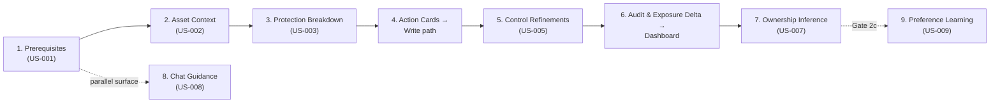
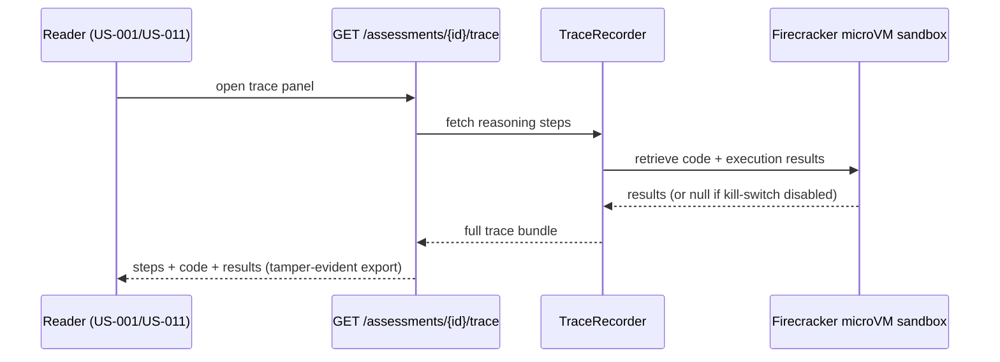
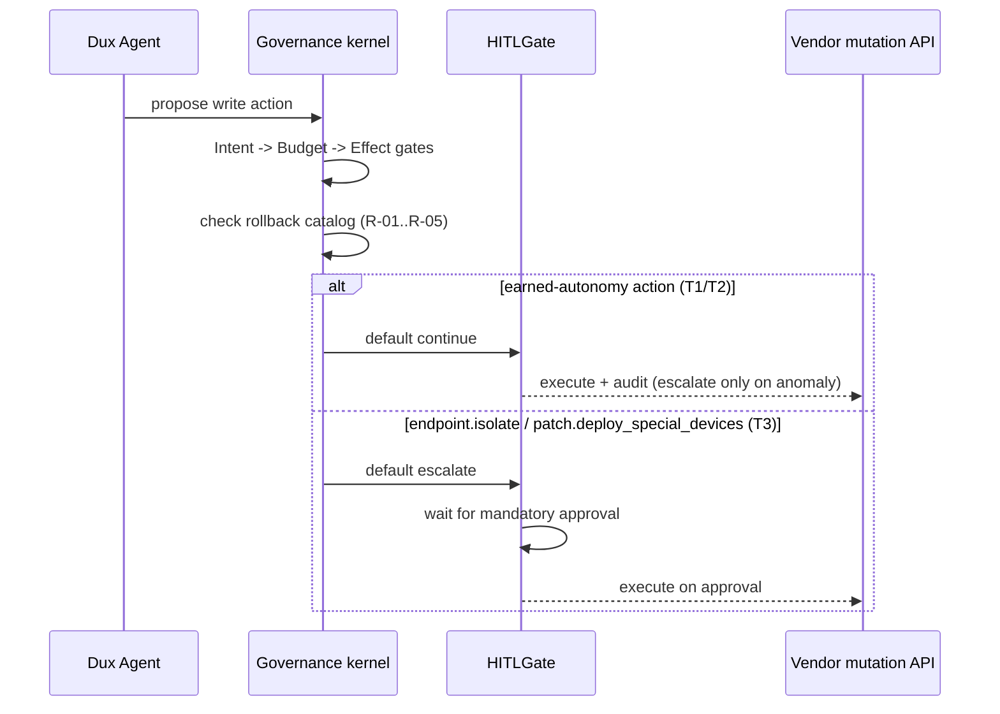

# Dux Feature Reference

Navigation: [[Dux]] | [[Dux Product Guide]] | [[Dux Taxonomy & Catalogs]]

The complete spec for every screen, API surface, and safety behavior behind the eight-icon sidebar and chat. Organized by where each feature sits in the Analyze → Mitigate → Remediate pipeline, not by nav order. Every user story (`US-###`) below is canonical and Gate 1 unless a status is called out explicitly.

---

## Investigation: the Security Stepper (US-001–007, US-009)

| Field | Value |
|---|---|
| **Nav** | Security |
| **Epics** | EP-02, EP-03, EP-06, EP-10 |
| **BRs** | BR-002, BR-004 |
| **Gate** | 1 (US-001–007, read-only or unattended write for 3 of 5 canonical actions; `endpoint.isolate` / `patch.deploy_special_devices` mandatory HITL per D-17); US-009 is Gate 2c |

The stepper is the seven-plus-one-step investigation journey a security engineer walks through on any single CVE. Two pairs of steps look adjacent and are frequently, wrongly, merged in engineering discussions: this reference calls both out up front:

- **US-006 is not US-003.** US-006 answers "how is exposure trending?" (governance/audit); US-003 answers "am I still protected right now?" (live vendor control proof).
- **US-002 is not US-011.** US-002 is a standalone CrowdStrike/Intune asset-context panel; per-asset AWS fields already live in the US-011 asset table.

Every step without a live connector renders the full designed layout in a connector-degraded empty state, deep-linking to [[Dux Feature Reference#Platform: Connector Hub (US-013, US-020)|Connector Hub]]: never a bare "connect something" CTA shell.

### Step 1: Prerequisites Analysis (US-001)

| Field | Value |
|---|---|
| **Purpose** | Decompose a CVE into its real-world exploitation requisites, with cited sources |
| **Gate** | 1 |
| **Agent** | AI #1 (REASONING) |

**Orchestration.** `ExploitabilityAssessmentWorkflow` (Temporal), triggered on queue enqueue or CVE selection. The `prerequisite-extractor` subagent gathers NVD, GitHub, Metasploit, and Medium evidence through MCP read tools. The CaMeL S-LLM/P-LLM boundary sanitizes the untrusted CVE text. Status streams live.

**API.** `GET /assessments/{id}` → `AssessmentDto`. Trace: `GET /assessments/{id}/trace` (US-017).

**Data.** World Model `FINDING`, `CVE`, `EXPLOITABILITY_ASSESSMENT`, `ASSESSMENT_REASONING_STEP`. Degraded paths: a missing NVD record yields `INSUFFICIENT_DATA`; with AWS absent, prerequisites render from intel feeds alone.

**Safety.** **KS-L1** halts the session. Intel staler than 24 h yields `INSUFFICIENT_DATA`. No HITL: this step is read-only research.

**Metrics.** Completion rate; at least 4 prerequisite source slots, with NVD mandatory; time-to-first-card p95; golden-set accuracy.

**Competitive.** Tenable Hexa AI orchestrates but ships no prerequisite decomposition with per-source citations. Strobes triages in seconds. Dux differentiates on the reasoning chain plus executed code (US-017).

### Step 2: Asset Context Evidence (US-002, read-only)

| Field | Value |
|---|---|
| **Purpose** | Prove or disprove environmental exploitability using runtime, network, SIEM, and role evidence on a specific asset |
| **Gate** | 1 |

**Orchestration.** `AssetContextWorker`. MCP tools query:

| Source | Status | Evidence |
|---|---|---|
| CrowdStrike | live at Gate 1 (one of ADR-011 R2's ≥3 launch connectors) | endpoint state |
| AWS | live at Gate 1 | EC2 metadata, security-group reachability |
| Splunk | live at Gate 1 | SIEM process/runtime telemetry — e.g. listening-process evidence for a service |
| Identity / role | live at Gate 1 | last-login, role — from the US-007 ownership-evidence sources |
| Intune | **Gate 3 / wave W2** | renders a connector-degraded empty state until then |

**API.** `GET /assets/{id}/context` → `AssetContextDto` (FR-020) — shape defined in application-api §2.

**Safety.** A stale connector yields `INSUFFICIENT_DATA`. **Vendor fields are never fabricated.** **KS-L2** stops new gathers; in-flight gathers complete and are flagged as partial evidence.

### Step 3: Protection Breakdown (US-003, read-only)

| Field | Value |
|---|---|
| **Purpose** | Answer "where am I already protected?" with vendor control proof — CrowdStrike policies at Gate 1; Intune at Gate 3/W2 |
| **Gate** | 1 |

**Orchestration.** `control-mapping-worker` correlates findings to active controls. MCP pulls CrowdStrike policy state at Gate 1. Output: segment cards — Protected, Partially Mitigated, Exposed — plus a settings and effect table.

**API.** `ProtectionBreakdownDto` via `?projection=protection` on `GET /cves/{id}/detail`. Also `GET /attack-paths` (AWS security groups + vendor).

**Data.** `CONTROL`, `CONTROL_MAPPING`.

### Step 4: Action Cards (US-004)

| Field | Value |
|---|---|
| **Purpose** | Surface and execute lightweight mitigations — blocklist at Gate 1, Intune policy steps once the W2 connector lands — faster than a full patch, with a residual-risk count |
| **Gate** | 1 — unattended by default for `network.blocklist_add` / `policy.deploy_device_config`; mandatory HITL for `endpoint.isolate` / `patch.deploy_special_devices` (D-17) |

**Canonical spec:** [[Dux Feature Reference#Mitigation and Remediation: the Write Surfaces (US-004, US-016, US-018, US-019)|Mitigation and Remediation Write Path]]. This section is the journey summary only.

**Orchestration.** The mitigation-recommendation activity, or `QuickMitigationWorkflow`. MCP write tools execute through the governance kernel. HITL tiers T2/T3 classify each action for audit and escalation on the three earned-autonomy actions; T3 is a mandatory pre-approval gate on `endpoint.isolate`. Agent: AI #4.

**API.** `?projection=action_cards`. `POST /mitigations` executes through `VendorActionGate` — unattended at Gate 1 for the three earned-autonomy actions, mandatory HITL for `endpoint.isolate` / `patch.deploy_special_devices`. Webhooks: `mitigation.executed`, `mitigation.blocked`.

**Safety.** Write tools require governance-kernel gates plus the kill switch. HITL escalates only on an anomaly for the three earned-autonomy actions; it is a mandatory gate, not an escalation, for `endpoint.isolate` / `patch.deploy_special_devices`. **KS-L2** blocks new proposals.

### Step 5: Control Refinements (US-005)

| Field | Value |
|---|---|
| **Purpose** | Surface the highest-impact estate-wide configuration changes — disable NTLM, enable IMDSv2 — ranked by exposure reduction |
| **Gate** | 1 (endpoint and stepper panel live; recommendation logic deferred to Gate 2 per D-19) |

**Orchestration.** `ControlRefinementQuery`, using the Specification pattern (`ByImpact`, `ByScanner`, `ByCVE`), aggregating across CVEs. Wiz ingest is live at Gate 1 (FR-019); Qualys is Gate 3/W2 per [[Dux Taxonomy & Catalogs]].

**Ranking output carries an `effort` field** — S / M / L, sized by rollout scope, not build cost: **S** a single-toggle config change on one control; **M** a staged change across a device or asset group; **L** an estate-wide policy rollout needing change-management sign-off. Exposure reduction ranks the queue; `effort` is a secondary column shown alongside it, not a tiebreaker the ranking itself uses.

**API.** `GET /controls/refinements`, or the refinement DTO via `?projection`. ERD entity: `ControlRefinementAggregate`, field `effort`.

> **Gate-2 note:** The recommendation logic itself is Gate 2, not Gate 1: deferred by D-19 as a capacity fallback, with zero Gate-1 tasks scheduled against it, and the deferral still stands as of the most recent capacity re-baseline. The endpoint and stepper panel exist at Gate 1; what actually populates them with ranked recommendations doesn't ship until Gate 2.

### Step 6: Audit & Exposure Delta (US-006)

| Field | Value |
|---|---|
| **Purpose** | A CISO-facing, board-ready exposure trend: delta cards and a tamper-evident audit trail |
| **Gate** | 1, governance and audit |

**Canonical spec:** [[Dux Feature Reference#Visibility: Dashboard Home and Audit (US-012, US-006)|Dashboard Home & Audit]]. This section is the journey summary only.

**Orchestration.** No agent loop. It is a projection over assessment outcomes and exposure-state transitions. The governance kernel writes hash-chained `AUDIT_EVENT` rows.

**API.** `ExposureDonutDto` within `GET /dashboard/home`; `GET /audit/events`; `GET /audit/verify` (FR-008). Surfaces as a Dashboard donut widget plus a full view (US-012): a score gauge, delta cards, a 30-day hash-chained audit log, CSV export, and state-transition entries.

**Data.** `EXPOSURE_STATE`, `AUDIT_EVENT`, and outcome aggregates.

### Step 7: Ownership Inference (US-007, read-only)

| Field | Value |
|---|---|
| **Purpose** | Route remediation to the right team, with a certainty percentage and ITSM/identity evidence |
| **Gate** | 1, read-only |
| **Agent** | AI #7 |

**Orchestration.** The ownership-inference activity. MCP reads ServiceNow and Entra ID, both live at Gate 1. Webhook: `ownership.inferred`.

**API.** `OwnershipInferenceDto` (FR-016). Data: `OWNERSHIP_EVIDENCE`, `ASSET.owner_team`.

**Safety.** Certainty below threshold yields `INSUFFICIENT_DATA` plus a manual-assign CTA. Auto-ticketing at Gate 1 creates and routes unattended (US-018).

### Step 9: Preference Learning (US-009, Gate 2c, not promoted)

| Field | Value |
|---|---|
| **Purpose** | A CISO teaches risk appetite in natural language so future assessments respect scope |
| **Gate** | 2c — not promoted |
| **Status** | Draft |

**Why it stays at Gate 2c.** It needs behavioral-data volume: `PreferenceEngine`'s influence on scoring weights requires tenant assessment history that does not exist at Gate 1. The interim is session routing preferences (24 h TTL) plus per-instance acknowledgment (US-023).

**API.** `POST /preferences`, `GET /preferences` (FR-018). Data: `TENANT_PREFERENCE`, `PREFERENCE_RULE`.

**Safety.** Preference writes require the tenant-admin or CISO role. Ambiguous natural language raises a clarification prompt — **never a silent accept**. **KS-L2** freezes updates.

### Build Rules

**US-006 is not US-003. Engineering must not merge them.**

| Question | Story | Surface |
|---|---|---|
| "How is exposure trending?" — governance and audit | **US-006**, Gate 1 | score gauge, delta cards, 30-day hash-chained log, CSV export |
| "Am I still protected?" — live vendor control proof | **US-003**, Gate 1 | vendor policy state |

The CISO Gate-1 demo uses US-006 metrics plus US-011 AWS and vendor factor cards.

**US-002 is not US-011.** Per-asset AWS fields live in the US-011 asset table. The US-002 standalone panel hydrates from CrowdStrike (Gate 1) and Intune (Gate 3/W2, connector-degraded until then).

### Figma and Interim Design

US-001–009 are confirmed in the June-2026 Figma set, screens 1–9. The vendor panels in US-002–005, US-007, and US-009 use connector-degraded empty states before hydration.

Figma's "playbook cards" **are** the mitigation factor cards. Do not introduce a separate entity for them.

### Stepper Flow

**What the stepper is measured against**, feature by feature: completion rate and time-to-first-card p95 for the stepper overall (with at least 4 prerequisite source slots, NVD mandatory, backing US-001); trace export count, steps-per-assessment distribution, `execution_results` population rate, and the competitive-evaluation win rate when a trace is shared, for US-017's trace panel; and golden-set exploitability accuracy as the standing quality bar across the whole investigation flow.

---

## Investigation: Exposure Analysis (US-011)

| Field | Value |
|---|---|
| **Nav** | Exposure |
| **Epic** | EP-05 |
| **BRs** | BR-002, BR-004 |
| **Gate** | 1 — primary Analyze drill-down surface |

Where the pipeline's output becomes a single defensible verdict: severity badges, risk groups, a flow bar, mitigation factor cards, an asset table, and attack paths — produced by the Prerequisite, AssetContext, and ControlMapping subagents together.

**Job.** A security engineer drills into a single CVE: severity badges, risk groups, flow bar, mitigation factor cards, asset table, and attack paths — ending in a verdict they can defend.

**Journey.** Entry from a US-010 row click, the US-012 needs-attention table, or `GET /cves/{id}/detail`. Exit to the US-017 trace panel, US-008 chat, or the US-004 action cards.

**Orchestration.** The full assessment pipeline — Prerequisite, AssetContext, and ControlMapping subagents — per the [[Dux Architecture Guide]] agent orchestration loop. Factor cards come from the `factor_type` catalog. Sources: MCP NVD, AWS APIs, and assessment logic.

### API Contract

`GET /cves/{id}/detail` → `CveDetailDto` (`CVEDetailQuery` / `ExposureProjection`):

| Field | Contents |
|---|---|
| `header` | CVSS, EPSS, KEV |
| `risk_groups` | group breakdown |
| `flow_bar` | pipeline state |
| `factor_cards[]` | mitigation factors |
| `assets[]` | affected assets |
| `attack_paths[]` | reachability paths |

Also available: `GET /attack-paths`, `GET /assessments/{id}`. Export and Audit Log actions are exposed on the view.

**The three taxonomies live in separate DTO subtrees and must not be merged: a risk group is not an exposure state, and neither is a factor card.**

**NFR-013: p95 <500 ms at 1 K assets.**

### Factor Cards at Gate 1

| Card | Status |
|---|---|
| `aws_sg_blocks_port` | live |
| `product_not_affected` | live |
| `network_reachability` | partial |
| `firewall_blocks_exploitation` | live at Gate 1 (CrowdStrike) |
| `process_not_listening` | Gate 5 |

See [[Dux Taxonomy & Catalogs|taxonomy §4]].

### Risk-Group Icons

Distinct from the four exposure-state instance icons:

| Icon | Meaning |
|---|---|
| Crossed eye | high-risk group |
| Umbrella | medium |
| Tree | low or mitigated |

These appear on the group breakdown rows in US-011.

### UI Mode

Full-width structured drill-down, confirmed in the June-2026 Figma. The flow bar and asset table are both required.

### Safety

Cross-tenant `GET /cves/{id}` returns 404. With AWS absent, factor cards show assessment logic only. **KS-L1** halts the in-flight assessment for the session.

### Metrics

Assessment confidence distribution; factor-card coverage; attack-path query latency; drill-down → trace open rate; golden-set exploitability accuracy.

### Marketing Reconciliation

"Determines what's viable for an attacker" (BusinessWire); "maps how every vulnerability, asset, and control connects" — capability #2. Vendor cards are backed by live connectors at Gate 1 (ADR-011 R2).

### Design Note

The reference UI demo numbers are illustrative, not measured — 8,341 researched; a 74.3 / 15.6 / 10.1% split; 78% certainty. See [[Dux Portfolio|vision-reference]]. They are not product metrics and must not be cited as such.

---

## Investigation: Assessment Trace (US-017)

| Field | Value |
|---|---|
| **Surface** | Panel opened from US-001 / US-011, not a nav icon |
| **Epic** | EP-03 |
| **BRs** | BR-002, BR-005 |
| **Gate** | 1, including executed-code results (ADR-015 R4, FR-026) |

Arguably Dux's single biggest competitive asset: a JSON bundle proving *why* a verdict was reached. The differentiating claim ("investigation backed by code: consistent, inspectable, repeatable") depends entirely on `execution_results` actually being populated, which it is at Gate 1 via a self-hosted Firecracker microVM sandbox; the only time it's null is when the sandbox has been disabled through the emergency kill path.

**Job.** A security engineer or CISO inspects the Dux Agent's reasoning steps and its generated investigation code, then exports the lot for audit or a competitive evaluation. Success is a JSON bundle that proves why a verdict was reached.

### Orchestration

`TraceRecorder` writes `ASSESSMENT_REASONING_STEP` rows. The code artifact comes from the coding-agent activity. **Execution results are populated at Gate 1** via the self-hosted Firecracker microVM; `execution_results` is `null` only when the sandbox has been disabled through the emergency kill path. Sandbox internals: [[Dux AI Safety Guide|sandbox-execution]].

### API Contract

`GET /assessments/{id}/trace` → `AssessmentTraceDto`:

| Field | Type |
|---|---|
| `assessment_id` | uuid |
| `steps[]` | `step_order`, `step_type`, `content`, `source_refs` |
| `code_artifact` | `{language, source_code}` |
| `execution_results` | `null` \| `ExecutionResultDto` — populated at Gate 1 |
| `exported_at` | timestamp |

JSON export ships in Phase 1; PDF (Gotenberg) is a seed delta. Flag: `trace_viewer`, on at Gate 1. Export is tamper-evident per NFR-009.

### UI

Side panel, 480 px preferred; mobile falls back to a full page. Interim spec until Figma v2.

### Trace Flow

### Safety

The trace is available only once the assessment completes — the empty state routes to US-010. **KS-L1** stops the trace stream mid-assessment. Cross-tenant access returns 404.

### Metrics

Trace export count; steps-per-assessment distribution; `execution_results` population rate; competitive-evaluation win rate when the trace is shared.

### Marketing Reconciliation

"Investigation backed by code — consistent, inspectable, repeatable" (Redpoint), capability #1. This is the key sales side-by-side asset against Hexa and Strobes.

---

## Investigation: Research Dashboard & Vulnerability Reduction (US-010, US-023, US-024)

| Field | Value |
|---|---|
| **Nav** | Mitigation — this is the **Analyze**-stage research queue, **not** the Mitigate pipeline stage |
| **Epics** | EP-05, EP-09 |
| **BRs** | BR-002, BR-010, BR-012 |
| **Gate** | 1 (US-010, US-023, US-024) |

**This is the "Mitigation" nav item**: the Analyze-stage research queue, not the Mitigate automation stage. Conflating the two is the single most common naming error in the whole corpus, so it's worth over-stating: this page is about *visibility into what's being researched*, not about executing writes.

### US-010 Research Dashboard

| Field | Value |
|---|---|
| **Gate** | 1 |

**Job.** A security engineer or CISO tracks the Dux Agent queue — Completed, In Research, Backlog — reads the Vulnerability Reduction metrics, and enqueues new investigations. **The success moment: thousands of alerts collapse to tens of actionable rows, each with evidence links.**

**Orchestration.** `POST /research/queue` → `ExploitabilityAssessmentWorkflow`, deduplicated by `AssessmentDeduplicationService`. Same agent stack as US-001 and US-011. Queue rows are **structured output, not chat**.

**Data.** `RESEARCH_QUEUE`, assessment statuses, `VulnerabilityReductionDto` aggregates, and AWS + NVD/KEV outcomes. Continuous re-assessment feeds the queue through [[Dux Feature Reference#Continuous Re-Assessment (US-021)|US-021]] (Gate 1, ADR-016).

#### API Contract

| Surface | Contract |
|---|---|
| `GET /research/dashboard` | → `ResearchDashboardDto`: `vulnerability_reduction`, a 7-day calendar with per-user tooltip lines, `cve_rows`, and `view_mode` (`by_cve` \| `by_asset` \| `by_instance`) |
| `GET /research/dashboard/stream` | SSE → `queue_row_update` patch, target <1 s |
| `POST /research/queue` | idempotent. Body `{cve_id}` or `{natural_language}` → `{assessment_id, status: queued \| deduplicated, queue_position}` |

**Safety.** **KS-L2** freezes the queue for the tenant. Stale intel marks pending rows `INSUFFICIENT_DATA`. Queue depth carries burn-rate SLO alerting.

**Metrics.** Queue depth by state; Vulnerability Reduction bar accuracy; Request Research latency; actionable-queue ratio (FR-006).

### US-023 Acknowledge Vulnerability Instance

| Field | Value |
|---|---|
| **Gate** | 1 for write; public read at Seed |

**Job.** A security engineer accepts or suppresses risk on a **specific vulnerability instance**, with a reason, an optional expiry, and an audit trail.

**This is not US-009.** US-009 is natural-language preference rules. This is a per-instance acknowledgment.

**Orchestration.** No agent loop. The governance kernel writes `VULNERABILITY_INSTANCE_ACKNOWLEDGMENT` plus audit events.

#### API Contract

| Surface | Contract |
|---|---|
| `POST /vulnerability-instances/{id}/acknowledge` | body `{reason, expires_at?}` → `{acknowledgment_id, is_acknowledged: true, expires_at?}` |
| `DELETE …/acknowledge/{ack_id}` | revoke |
| `GET /v1/vulnerability-instances/{cve_id}` | public read exposes `is_acknowledged` |
| Webhooks | `vulnerability_instance.acknowledged`, `vulnerability_instance.acknowledgment_expired` |

An auto-expire job clears active acknowledgments past their `expires_at`.

**`is_acknowledged` is computed:** true when an active acknowledgment exists — not revoked, and with `expires_at` either null or in the future.

**Safety.** **A revoked or expired acknowledgment does not suppress alerts** — the instance returns to US-010 queue elevation. Cross-tenant acknowledgment returns 404.

### US-024 Vulnerability Instances by CVE

| Field | Value |
|---|---|
| **Gate** | UI at Gate 1; public API at Seed |

**Job.** List every instance of a CVE across assets, with its exploitability, reachability, and acknowledgment state.

**Orchestration.** A projection over the World Model plus the latest assessment per instance.

**API.** `GET /v1/vulnerability-instances/{cve_id}` — cursor pagination, `limit` 1–5000 (default 3000), `expand=asset`. Batch enqueue: `POST /v1/cve-research` (1–50). The UI uses `view_mode=by_instance` at Gate 1; the public v1 surface lands at Seed. Full contract in [[Dux API Reference|public-data-api]].

**Edge case.** An unresearched CVE returns `exploitability_status = null` — **not** `insufficient_data`. The two mean different things: null is "we have not looked"; `insufficient_data` is "we looked and could not tell."

### Marketing Reconciliation

"Waste less time chasing noise", capability #8. **The 8,341 → 2,143 funnel is illustrative** and maps to the US-010 buckets — see [[Dux Portfolio|vision-reference]]. It is not a measured result.

---

## Investigation: Chat Guidance (US-008)

| Field | Value |
|---|---|
| **Nav** | Global chat panel + in-context |
| **Epic** | EP-05 |
| **BRs** | BR-002, BR-006, BR-007 |
| **Gate** | 1, read-only path |
| **Decisions** | D-4, D-7, D-17, H4, H5 |

The conversational surface onto Dux Agent — request research, compare remediation strategies, and approve chat-initiated write actions. **Not a general-purpose security chatbot.** Every turn and every action routes through governed agent workflows: audit, kill switch, tenant scope, HITL.

### Write-Surface Risk Profile

**Chat is not the only write surface with a live human-approval gate.** Product write actions triggered elsewhere in the UI (US-004, US-016, US-018) execute unattended by default for 3 of 5 canonical actions (`network.blocklist_add`, `policy.deploy_device_config`, `ticket.create_remediation`); `endpoint.isolate` and `patch.deploy_special_devices` are mandatory-HITL there too (D-17). The chat-triggered write-tool path (`chat_write_tools`) is gated for every action regardless of which of the five it targets, because **arbitrary MCP writes issued from open-ended conversation carry a prompt-injection blast radius (LLM01) that the other, schema-constrained write surfaces do not have**.

This is a deliberate, scoped exception on top of D-17's per-action gating. Revisit it only when chat-specific injection defenses — the CaMeL S-LLM boundary plus the prompt-injection regression suite — earn the same confidence as the constrained surfaces.

### Failure-Domain Isolation

Chat gets a **separate SSE connection pool** and its **own LLM quota bucket** (`InstrumentedLLMClient` budget, NFR-011). Chat degradation or a chat rate limit **must not** block `ExploitabilityAssessmentWorkflow` queue processing.

### Orchestration

The same agent stack as assessment; MCP is read-only in Phase 1.

Prioritization cards are a **control-plane write**, exempt from `chat_write_tools`, persisted to `session_routing_preferences` (ephemeral, 24 h TTL, with a threat model and hash-chained audit per AI-13).

The chat path is blocked until the Week-4 DBOS / inner-loop chat spike passes. Go/no-go: pass, or fall back to a DBOS-only inner loop with hand-rolled SSE.

### API Contract

| Surface | Contract |
|---|---|
| SSE | `GET /chat/sessions/{id}/stream` — events: `query`, `response`, `citation`, `processing_step`, `prioritization_cards`, `request_research_ack`, `hitl_request` |
| POST | `POST /chat/sessions/{id}/hitl-response` |
| Alias | `POST /research/queue` — Request Research |

Flag: `chat_interface`, on at Gate 1.

### Remediation-Option Comparison

For a broad ask — "what should I do about exploitable vulns on my Linux servers?" — `prioritization_cards` can carry **several competing remediation strategies side by side**. For example, "patch a single shared component" against "target the specific devices responsible for N% of your unique exploited-in-the-wild CVEs".

Each card is quantified by **the share of exploited or actively-targeted CVEs it addresses**, not by raw instance count. This reuses the existing `prioritization_cards` mechanism — no new API surface, just a defined card shape: strategy label, affected-asset list, and `exploited_cve_coverage_pct`.

### HITL Contract

See [[Dux AI Safety Guide|kill-switch-hitl]].

Reconnection replays `Last-Event-ID` from `chat_session_events` over a 1-hour window; beyond that it falls back to a `GET /chat/sessions/{id}/state` snapshot. **Workflow state is unaffected — reconnection is transport-only.** Limits: 5 concurrent SSE streams per `user_id`, over HTTP/2.

### Data

World Model read-replica, <5 s lag. Citations carry AWS and NVD context.

### Safety

**KS-L1** per session. Prompt-injection regression suite (LLM01). **Write tools require HITL.**

### Metrics

Chat-spike C1–C5; SSE latency p95; Request Research conversion from chat; prioritization-card selection rate; chat LLM cost per session against budget.

### Phased Delivery

| Milestone | Delivery |
|---|---|
| Week 4 | DBOS / inner-loop chat spike (go/no-go). Blocks US-008 production routing until it passes |
| Week 6 | **Closed without a bake-off (D-35, ADR-021).** No inner agent framework — the reasoning loop calls the Bedrock Converse API directly from Temporal activities. The CopilotKit / AG-UI chat-UI spike (W10–12) still runs on its own merits, independent of this decision |
| Week 8 | API-level HITL approve/deny gate active for write-tool paths |
| **Gate 1 (Week 12)** | Minimal approve/deny UI live, with impact preview (H4) |
| Week 14 | Full chat HITL UI. `chat_write_tools` external MCP write tools enabled — **no chat write before this UI exists** (AI-133) |

**Two write surfaces, two risk profiles.** Product write actions (US-004/016/018) are unattended at Gate 1 for 3 of 5 canonical actions, with the approve/deny surface serving only anomaly escalation; `endpoint.isolate` / `patch.deploy_special_devices` use that same approve/deny surface as a mandatory gate (D-17). Chat write tools stay gated to the Week-14 full chat HITL UI regardless of action. That difference is deliberate, and the reason is at the top of this file.

---

## Mitigation and Remediation: the Write Surfaces (US-004, US-016, US-018, US-019)

| Field | Value |
|---|---|
| **Nav** | Fast Actions + in-context CTAs |
| **Epic** | EP-06 |
| **BRs** | BR-002, BR-003 |
| **Gate** | 1 with earned per-action-class autonomy (D-17); US-019 is Gate 3 |
| **Decisions** | D-4, D-10, D-15, D-17, H4, H5 |

This is the canonical spec for everything Dux is allowed to *do* in a customer's environment, not just observe. **The write path ships at Gate 1 with earned per-action-class autonomy (D-17).** `network.blocklist_add`, `policy.deploy_device_config`, `ticket.create_remediation` execute unattended, human review reserved for anomaly escalation. `endpoint.isolate` and `patch.deploy_special_devices` require mandatory HITL on every call until each earns unattended execution via a field-proven Gate-3 safety record. Closed-loop validation (US-019) is **Gate 3**. Governed by ADR-012 R3 and the [[Dux AI Safety Guide|governance kernel]]; **every write flows through `VendorActionGate`**.

### Write-Path Mechanics (Every Write Action)

1. **Governance kernel chain:** `IntentGate → BudgetGate → EffectGate → VendorActionGate → HITLGate`. `HITLGate` defaults to `continue` — execute and audit, returning `escalate` only on an anomaly — for `network.blocklist_add`, `policy.deploy_device_config`, `ticket.create_remediation`. For `endpoint.isolate` / `patch.deploy_special_devices` it defaults to `escalate` on every call (D-17).
2. **`VendorActionGate`** maps `canonical_action_id → native_action_name` and persists both in `VendorActionExecution` audit records. **Connectors must not call vendor mutation APIs.**
3. **HITL tiers (T1–T3)** classify every action for audit and escalation. The SSE `hitl_request` / POST `hitl_response` contract fires only on escalation for the three earned-autonomy actions, and on every call for `endpoint.isolate` / `patch.deploy_special_devices` — the **`rollbackProcedure` URL is required in the payload regardless of HITL posture**.
4. **Post-action refresh:** persist the execution → targeted connector delta sync (`sync_reason=post_mitigation`) → hand off to `ClosedLoopValidationWorkflow` (Gate 3), so downstream screens read fresh World Model state.

### Canonical Mitigation Kinds

| Action | Tier | Posture |
|---|---|---|
| `endpoint.isolate` | T3 | mandatory HITL (D-17) |
| `network.blocklist_add` | T2 | unattended by default |
| `policy.deploy_device_config` | T2 | unattended by default (once Intune connector ships) |
| `patch.deploy_special_devices` | T3 | mandatory HITL (no API rollback + D-17) |

### Write-Action Flow

### US-016 Fast Actions

| Field | Value |
|---|---|
| **Gate** | 1 |
| **Posture** | Unattended by default for `network.blocklist_add` / `policy.deploy_device_config` / `ticket.create_remediation`; mandatory HITL for `endpoint.isolate` / `patch.deploy_special_devices` |

**Job.** One-click lightweight mitigations on approved findings.

**Delivery.** `POST /fast-actions` → `QuickMitigationWorkflow`. The three earned-autonomy actions execute immediately, audit-logged and kill-switch-covered. `endpoint.isolate` / `patch.deploy_special_devices` raise a live HITL request and wait. Action cards — copy a SIEM query, ticket text, numbered steps — remain available as a manual fallback.

**Read contract.** The nav list is a filtered view of the existing US-004 mechanism: `?projection=action_cards&eligible_for=fast_action`, not a dedicated endpoint. A row carries `canonical_action_id`, the target `cve_id` / `finding_id`, `blast_radius`, `hitl_tier`, and `status` (`pending` | `executed` | `blocked`) — the same fields `VendorActionExecution` and the HITL tier table already define below, not new entities.

**Nav state.** The icon is visible and enabled at Gate 1. The automated route is the default for the three earned-autonomy actions.

**Safety.** The governance kernel and the kill switch gate execution (**KS-L2** blocks enqueue). HITL fires **only** on an anomaly for the three earned-autonomy actions: a confidence abstention, a sandbox failure, or a T4 outlier. `endpoint.isolate` / `patch.deploy_special_devices` always wait on HITL.

### US-004 Action Cards

| Field | Value |
|---|---|
| **Gate** | 1 — unattended by default for `network.blocklist_add` / `policy.deploy_device_config`; mandatory HITL for `endpoint.isolate` / `patch.deploy_special_devices` |

This file is the canonical spec for US-004; the journey summary lives in [[Dux Feature Reference#Step 4: Action Cards (US-004)|Security Stepper Step 4]].

**Job.** Surface and execute lightweight mitigations — blocklist at Gate 1, Intune policy steps once the W2 connector lands — faster than a full patch, with a residual-risk count.

**Orchestration.** The mitigation-recommendation activity, or `QuickMitigationWorkflow`. MCP write tools execute through the governance kernel. HITL tiers T2/T3 classify each action for audit and escalation on the three earned-autonomy actions; T3 is a mandatory pre-approval gate on `endpoint.isolate`. Agent: AI #4.

**API.** `?projection=action_cards`. `POST /mitigations` executes through `VendorActionGate` — unattended at Gate 1 for the three earned-autonomy actions, mandatory HITL for `endpoint.isolate` / `patch.deploy_special_devices`. Webhooks: `mitigation.executed`, `mitigation.blocked`.

**Safety.** Write tools require governance-kernel gates plus the kill switch. HITL escalates only on an anomaly for the three earned-autonomy actions; it is a mandatory gate, not an escalation, for `endpoint.isolate` / `patch.deploy_special_devices`. **KS-L2** blocks new proposals.

### US-018 Remediation Ticket Panel

| Field | Value |
|---|---|
| **Gate** | 1 for create and route, unattended by default |

**Job.** A security engineer sees a ServiceNow/ITSM ticket created from Exposure or Chat, with an assignee and an SLA.

**Orchestration.** `RemediationWorkflow` creates and routes tickets automatically — T1, the lowest blast radius. Status updates arrive by webhook. Canonical action: `ticket.create_remediation`. **Unattended closed-loop auto-close remains Gate 3** (US-019).

**API.** Gate-1 create and route endpoints. Webhooks: `remediation.ticket_created`, and `ticket.created` / `updated` / `resolved` / `reopened`. Data: `REMEDIATION_TICKET`.

**Safety.** A ticket write failure enters a retry saga and is audited. External writes use step-effect idempotency — a `mutation_key` plus resume-time reconciliation. **KS-L2** prevents new ticket creation.

### US-019 Mitigation Validation Panel

| Field | Value |
|---|---|
| **Gate** | 3 |
| **Status** | Draft |

**Job.** Confirm that post-mitigation exposure actually dropped, by re-assessing — the closed loop.

**Orchestration.** `ClosedLoopValidationWorkflow` (FR-012) triggers the re-assessment. A pass/fail badge lands on the US-004 card, and the residual count updates US-011. Flag: `closed_loop_validation`.

**Safety.** A failed validation escalates to HITL. **A finding is never auto-closed on a timeout alone.**

### Rollback Catalog

Every `rollbackProcedure` URL on a write action's audit/HITL payload resolves to one of the five entries below. `VendorActionGate` (GOV-014, [[Dux AI Safety Guide|governance-kernel §4]]) will not authorize unattended execution of an action whose entry is missing.

| ID | Action | Compensating procedure | Trigger |
|---|---|---|---|
| R-01 | `endpoint.isolate` | `endpoint.restore_network` through the same EDR adapter — restores the pre-isolation network policy, keyed by the isolation's `mutation_key` for idempotent reversal | HITL rejection, a T3 escalation resolved "false positive", or a customer-initiated rollback from Tenant Settings |
| R-02 | `network.blocklist_add` | `network.blocklist_remove` — reverts the specific rule by the vendor-native rule ID persisted in the audit record; never a broader "flush blocklist" | same |
| R-03 | `policy.deploy_device_config` | `policy.restore_previous_config` — redeploys the device's prior config snapshot, captured immediately before `policy.deploy_device_config` ran | same |
| R-04 | `patch.deploy_special_devices` | `patch.rollback_to_prior_version` where the vendor patch-management API supports it. **Firmware-only devices have no API-level rollback** — the procedure there is a manual runbook, and `GOV-TOOL-04` holds that case to a mandatory HITL gate rather than letting it execute unattended without an undo path | same, or a post-patch device-health check failure |
| R-05 | `ticket.create_remediation` | `ticket.cancel` — closes the ticket with reason `superseded_by_rollback`; no environment state to revert | HITL rejection or duplicate-ticket detection |

### Gate-3 Remediation Orchestration

Evaluation framework (candidate, criteria C1–C5, and fallback order) defined in ADR-012 §Gate-3 remediation orchestration — resolves OI-29. The spike against C1–C5 is Gate-3-scoped backlog work under EP-06, not yet run.

### Marketing Reconciliation

"Lightweight mitigations" and "rapid remediation" are claim-safe at Gate 1 without a caveat, because the write path executes at Gate 1 — see [[Dux Product Guide|gtm-guardrails]].

Gate 3 refers specifically to closed-loop validation (US-019). A "self-healing" or "fully automated remediation" claim therefore still needs that qualifier: at Gate 1 Dux acts; **confirming the action worked is Gate 3.**

---

## Visibility: Dashboard Home and Audit (US-012, US-006)

| Field | Value |
|---|---|
| **Nav** | Dashboard |
| **Epics** | EP-05, EP-07 |
| **BRs** | BR-008, BR-005 |
| **Gate** | 1 (both US-012 and US-006) |
| **Decisions** | H9 |

### US-012 Dashboard Home

| Field | Value |
|---|---|
| **Gate** | 1 |

**Job.** A security engineer or CISO sees exposure posture, queue depth, connector health, and shortcuts on one screen. It answers a single question: *what needs attention now?*

**Orchestration.** Read-only aggregation — **loading the dashboard triggers no agent**. The Request Research button feeds the same queue as US-010; the Chat shortcut opens US-008.

#### API Contract

`GET /dashboard/home` → `DashboardHomeDto`:

| Field | Type |
|---|---|
| `exposure_summary` | `ExposureDonutDto` |
| `vulnerability_reduction` | trend figure |
| `queue_summary` | `{completed, in_research, backlog}` |
| `needs_attention` | `CveSummaryDto[]` |
| `connector_health` | `ConnectorHealthDto[]` — `stale_warning` when >24 h |
| `as_of` | timestamp |

Streaming: `GET /dashboard/home/stream` (SSE) → `queue_update`, target <5 s.

**Safety.** **KS-L3** renders the dashboard read-only with a banner. A partial widget failure degrades **that widget only**. An `INSUFFICIENT_DATA` empty state routes to US-013 and US-010.

**Design.** Interim spec until Figma v2 ships.

### US-006 Audit & Exposure Delta

| Field | Value |
|---|---|
| **Gate** | 1, governance and audit |

This file is the canonical spec for US-006; the journey summary lives in [[Dux Feature Reference#Step 6: Audit & Exposure Delta (US-006)|Security Stepper Step 6]].

**Job.** Give a CISO a board-ready exposure trend, delta cards, and a tamper-evident audit trail. **This is not live vendor protection — that is US-003.**

**Orchestration.** No agent loop. It is a projection over assessment outcomes and exposure-state transitions. The governance kernel writes hash-chained `AUDIT_EVENT` rows.

**API.** `ExposureDonutDto` within `GET /dashboard/home`; `GET /audit/events` and `GET /audit/verify` (FR-008).

It surfaces as a Dashboard donut widget plus a full view (US-012): a score gauge, delta cards, a 30-day hash-chained audit log, CSV export, and state-transition entries.

**Data.** `EXPOSURE_STATE`, `AUDIT_EVENT`, and outcome aggregates.

**MTTP is tracked here as a hypothesis** — instrumented end to end (assessment, approval, and action latency) as a **measured metric, not an SLA**, by Phase-1 exit. See [[Dux Product Guide|observability-slo]] (H9).

**Audit log detail view.** A per-day event count — "40 Events" against a calendar date — aggregated from `GET /audit/events`, with a date picker for historical navigation, scoped to a 30-day UI display window. The underlying `AUDIT_EVENT` trail itself retains 7 years per [[Dux Product Guide|compliance-program]] — export is not limited to the visible 30 days.

**Do not conflate this with the Research Dashboard's calendar.** This widget browses *audit-log history by date*. The 7-day queue-activity calendar (`ResearchCalendarDayDto[7]`, [[Dux Feature Reference#US-010 Research Dashboard|research-dashboard]]) shows *queue completed / in-research / backlog by day*. Different widgets, different data.

---

## Forward-Looking: Predictive Risk Forecasting (US-028, E4)

| Field | Value |
|---|---|
| **Nav** | Dashboard — new "Rising Risk" panel on Dashboard Home (US-012), a cross-asset aggregate view, distinct from US-011's per-CVE Exposure Analysis |
| **Epic** | EP-03 (F04) |
| **BR** | BR-013 |
| **Gate** | 2 |
| **Flag** | `risk_trend_forecasting` (Gate 2, default off) |
| **Decisions** | D-24, D-36 |
| **Status** | Draft |
| **Parent** | BR-013 |

Answers "which assets are likely to become risky in the future" — the literal E4 claim (FinSMEs CEO interview, Dec 2025; committed roadmap capability per the 2026-07-13 claims-alignment directive).

### Design Principle: Trend, Not a New Model

**This is a velocity computation over evidence Dux already ingests, not a new ML model and not a composite risk score.** That constraint is deliberate, not a limitation stated apologetically: [[Dux Taxonomy & Catalogs|taxonomy.md]]'s confidence-scoring section already documents that Dux does not compute a composite CVSS × EPSS × criticality × exposure score, because a fabricated single number misrepresents what the system actually knows. Predictive forecasting inherits that discipline — it surfaces **which signals are moving and in what direction**, not a black-box probability. This also means it ships mostly on existing infrastructure (ADR-016's Continuous Assessment Engine, the World Model, existing EPSS ingest) plus one new lightweight history table — not a new subsystem.

### US-028 Asset Risk Trend Forecast

| Field | Value |
|---|---|
| **Gate** | 2, read-only |

**Job.** A security engineer or CISO sees which assets are trending toward higher risk — before a new CVE is confirmed exploitable against them — so hardening work can be prioritized ahead of an incident, not just in reaction to one.

**Orchestration.** `AssetRiskTrendWorkflow` (Temporal), scheduled weekly per tenant (reuses ADR-016's scheduled-sweep mechanism; a lower cadence than the 24 h continuous-assessment default, since a trend signal doesn't need daily granularity). It computes a `RiskTrendScore` per asset from three signals, each already backed by existing or newly-added data:

| Signal | Weight | Source |
|---|---|---|
| EPSS 30-day delta, summed across the asset's open findings | 0.4 | **new:** `EPSS_SCORE_HISTORY` (below) — EPSS is currently ingested but not retained as a series |
| Open-finding count, 30-day delta | 0.35 | existing `FINDING.state` transitions, via `ASSESSMENT_STATE_TRANSITION` |
| Control-coverage delta (`Protected` → `Partially Mitigated` / `Exposed` transitions, US-003) | 0.25 | existing `CONTROL_ASSET_MAPPING` |

**Direction, not a probability.** Output is `rising` / `stable` / `falling`, plus the contributing-factor breakdown — never a percentage framed as a likelihood. This avoids the false-precision trap a composite score would carry, and matches the confidence-calibration discipline already applied to exploitability verdicts (bands, not bare numbers).

### Data — New Entity

`EPSS_SCORE_HISTORY` *(global, like `EPSS_SCORE`)*: `cve_id`, `epss_score`, `percentile`, `snapshot_date`. Appended daily alongside the existing `EPSS_SCORE` upsert (ADR-016's ingest path); retained 90 days rolling, matching the trend window this feature needs. This is the one net-new piece of infrastructure the feature requires.

### API Contract

`GET /assets/risk-trend` → `AssetRiskTrendDto[]`:

| Field | Shape |
|---|---|
| `asset_id`, `hostname` | denormalized `ASSET` fields |
| `trend_direction` | `rising` \| `stable` \| `falling` |
| `trend_score` | 0.0–1.0, magnitude only — not exposed as a probability |
| `contributing_factors[]` | `{signal, delta, weight}` — the three rows above, so the ranking is inspectable, not a black box |
| `as_of` | ISO 8601 |

Sorted `rising` first, by `trend_score` descending.

### Safety

No write action is ever triggered by a trend alone — `rising` surfaces a prioritization signal on the dashboard; it does not enqueue an assessment, open a ticket, or feed `VendorActionGate`. A rising trend is a prompt for a human to *request* research (US-010), same as any other queue entry.

### Marketing Reconciliation

"Which assets are likely to become risky" (E4) is claim-safe once this ships — it is answered literally, using Dux's own reasoning/evidence discipline rather than a claimed predictive model the corpus elsewhere explicitly says Dux doesn't build. GTM copy must not describe this as "AI predicts your next breach" or similar — it is a trend surfaced from real evidence, described the same way the rest of this corpus describes every other output: inspectable, not magic.

### Funding Status

**Funded at Gate-2 (2026-07-20, D-36).** The 8 h `EP-03-F04-T01` task funded *authoring this spec*; the feature itself is committed for the Gate-2 backlog. Sizing implementation hours for `backlog-ep03.md` is Engineering's Gate-2 planning-pass task — a scheduling step, not an open funding question.

---

## Continuous Re-Assessment (US-021)

| Field | Value |
|---|---|
| **Surface** | Settings + queue integration |
| **Epic** | EP-04 |
| **BR** | BR-002 |
| **FR** | FR-025 / ADR-016 |
| **Gate** | 1 |
| **Decisions** | D-9 |

The feature that makes "continuous exploitability" a literally true claim at Gate 1.

**Job.** A tenant admin or CISO configures scheduled and on-event re-queueing — on a connector change, a KEV addition, or a cron. This is what makes the public "continuous exploitability" claim true at Gate 1.

### Orchestration

Findings are re-evaluated by `ReassessmentSchedulerWorkflow` (Temporal).

| Trigger | Source |
|---|---|
| Threat-intel delta touching a tenant CVE | new CISA KEV / NVD / EPSS |
| Asset or control delta | a connector sync bumps `world_model_versions` |
| Scheduled sweep | default 24 h, tenant-configurable |

`ReassessmentDebouncer` coalesces per `(tenant, cve, asset)` within a 15-minute window. Its state persists in **Valkey**, so the coalesce window survives worker restarts (D-9).

### Cost Control

A re-assessment reuses the cached World-Model prefix and re-runs the P-LLM step **only when the evidence actually changed**, dirty-checked against an evidence hash. Most triggers resolve as "no material change" without any LLM call at all.

### API Contract

`POST /research/schedule`, `GET /research/schedule`. Webhook: `assessment.requeued`. Distinct from US-010, which is manual Request Research.

### Data

Per-tenant cron config; KEV feed subscription; connector change detector.

### Safety — Per-Tenant Rate Caps

| Tier | Re-queue cap |
|---|---|
| Design Partner | 50/hour |
| Starter | 200/hour |
| Professional | 2,000/hour |
| Enterprise | 10,000/hour default, contract-negotiable |

Enforced alongside GOV-004's `WorkflowTenantBudget` (Starter 500 / Pro 5,000 / Enterprise floor 50,000 actions/day) — this cap is the re-assessment-specific ceiling *within* that daily action budget, not a separate mechanism. A breach raises `REASSESSMENT_TENANT_CAP_EXCEEDED`; excess triggers are not dropped — they fall through to the next 24 h scheduled sweep instead of firing immediately. **KS-L2** pauses the scheduler.

### Burst-Tier Degradation Model (resolves OI-13, SR-11)

A platform-wide feed storm — a daily EPSS re-score touching every CVE — is bounded two ways before it ever reaches a tenant's re-queue cap:

1. **It never touches the NVD/EPSS/KEV request quota (50 req/30 s per key).** EPSS publishes as a single daily bulk file (FIRST.org), not per-CVE API calls — the ingest pipeline downloads and diffs that one file, then emits a debounce trigger only for `(tenant, cve, asset)` triples with an open finding on a CVE whose EPSS score actually moved. The 200 K-row global delta collapses to "tenants with a matching open finding," which is orders of magnitude smaller.
2. **Within a tenant's resulting trigger set, the dirty-check (above) already resolves most as no-op.** Of what remains, execution-backed re-runs are ordered **KEV-first, then descending EPSS, then descending CVSS** — the same priority a human triage queue would use — and paced against the [[Dux AI Safety Guide|sandbox budget]] (D-9: 300 sandbox-seconds/hour and 5 concurrent microVMs per tenant). That budget, not the debounce window, is the real ceiling: it bounds a tenant to roughly 5–10 execution-backed re-assessments/hour regardless of how many triggers the storm produced. GTM copy about assessment speed refers to a **single CVE**, not a platform-wide sweep — see [[Dux Product Guide|gtm-guardrails §3]].

### Verification

`pnpm test:reassessment-trigger` (KEV / EPSS / connector delta → enqueue); `pnpm test:reassessment-dirtycheck` (no-op when evidence is unchanged); plus a scheduled-sweep integration test.

### Metrics

Re-assessment volume; outcome-change rate on re-run; cost per scheduled assessment.

### Marketing Reconciliation

Customer copy using the word "continuous" must still distinguish **data sync** (connector polling) from **re-assessment** (US-021). Both ship at Gate 1, so "continuous exploitability analysis" is claim-safe. Gate 3 is closed-loop validation (US-019) — not the write path, which is unattended by default at Gate 1. See [[Dux Product Guide|gtm-guardrails]].

---

## Platform: Connector Hub (US-013, US-020)

| Field | Value |
|---|---|
| **Nav** | Apps |
| **Epic** | EP-02 |
| **BR** | BR-004 |
| **Gate** | 1 (US-013, AWS as P0); US-020 is Gate 5 |
| **Decisions** | D-34 |

The prerequisite gate for nearly everything above: it feeds live AWS evidence into Exposure Analysis and is the deep-link target from every degraded empty state in the stepper. Its most consequential rule is integrity over coverage: a vendor connector never shows a false "Connected" state (it reads "Coming soon" until both credential validation and a first successful sync succeed), and a bad CSV upload produces typed errors rather than a partial, poisoned ingest.

### US-013 Connector Hub

| Field | Value |
|---|---|
| **Gate** | 1, AWS as P0 |

**Job.** A tenant admin connects AWS (Gate 1), CSV as a fallback (P1), and vendor integrations (live at Gate 1 per ADR-011 R2). Success: the sync completes, the asset count is visible, and any error banner is actionable.

**Journey.** This is the prerequisite for live US-011 AWS evidence, and the deep-link target from the degraded empty states in US-002–007 (`?error=asset_gap`). US-020 extends it at Gate 5 with the physical-residency agent card.

#### Orchestration

Connector sync workflows — **not** Dux Agent reasoning. AWS sync → asset ingestion → World Model update, which triggers re-assessment (US-021, Gate 1). Sync runs as the **isolated `dux-connector-sync` K8s Deployment** (ADR-006 R4, [[Dux Architecture Guide|deployment-topology]]), never in the API container.

#### API Contract

| Endpoint | Contract |
|---|---|
| `POST /connectors/aws/sync` | → `{sync_id, status, assets_ingested, started_at}` |
| `POST /connectors/csv/upload` | multipart. Errors: `missing_column`, `invalid_os_family`, `duplicate_hostname`. Limits: 50 K rows, UTF-8, unique `(tenant_id, hostname)` |
| Webhook | `connector.sync_failed` |

#### Auth

AWS cross-account IAM role plus External ID (ADR-004). **Credentials never appear in agent traces.** STS validation runs at setup, with the error banner mapped from the failure:

| STS error | Banner |
|---|---|
| `AccessDenied` | trust-policy fix message |
| `ExternalIdMismatch` | external-ID mismatch |
| `InvalidClientTokenId` | invalid credentials |

All three persist to `aws_role_status`.

#### Throttling

Backoff with jitter, max 5 retries. Per-service limits: EC2 100, IAM 20, S3 100 req/s. CloudWatch `AWSThrottledRequests` feeds the sync-health strip.

#### Phase-1 Constraint

**One AWS account per tenant.** Multi-account delegated admin is deferred to Gate 2, enforced in `AwsDiscoveryService`.

#### Vendor Catalog

Rows come from the integration catalog. **Never show a false "Connected"** — a vendor reads "Coming soon" until `connector_configs.status = active`, which requires `validateCredentials()` plus a first successful sync.

#### MVP Connector Set (v4.0 source doc, D-34)

Ten named NestJS connectors, on top of ADR-011 R2's "≥3 live at Gate 1" floor — this table is the fuller target set, not a replacement criterion:

| Connector | Auth | Rate limit | Sync interval |
|---|---|---|---|
| Tenable.io | API key | 10 rps | 60 min |
| Qualys | API key | 5 rps | 60 min |
| CrowdStrike | OAuth2 | 6 rps | 30 min |
| AWS Security Hub | IAM SigV4 | 20 rps | 15 min |
| Rapid7 InsightVM | API key | 10 rps | 60 min |
| Splunk | REST token | 10 rps | 5 min |
| Jira | Basic auth | 10 rps | 5 min |
| ServiceNow | OAuth2 | 10 rps | 5 min |
| Okta | API token | 10 rps | 15 min |
| Azure AD | Graph API OAuth2 | 10 rps | 15 min |

Each implements the shared `BaseConnector` / `AbstractVendorConnector` contract (ADR-011 R2, [[Dux Architecture Guide|vendor-connector-framework]]) — vendors override only `fetchPage` and `mapRecord`. Output publishes to NATS subjects (`vulnerabilities.raw`, `assets.raw`, `tickets.raw`, `identities.raw`), consumed by the same World Model ingestion path as AWS/CSV above.

**This table's per-connector rate limit and sync interval (D-34/v4.0 source doc, vendor-API-rate-limit-derived) is the single authoritative cadence source (D-47)** — it supersedes an older, coarser "sync cadence defaults" table (6 h/12 h/24 h, grouped by wave-taxonomy rather than vendor, with no rate-limit backing) that conflicted with it by up to 288x on the four overlapping connectors (CrowdStrike, Qualys, Splunk, ServiceNow) and has been removed. **Wiz and Intune are not in this table and have no rate-limit-derived cadence yet** — OI-58 tracks deriving one the same way, rather than carrying over the superseded table's unresearched 6 h figure for either. Manual "Sync now" remains available on demand for every connector.

#### Safety

A sync failure raises the webhook and the US-012 / US-014 health strip. An invalid CSV produces typed errors — **there is no partial, poisoned ingest**.

#### Metrics

Sync success rate; asset-count growth; time to first sync; connector error MTTR; CSV-fallback adoption.

#### Marketing Reconciliation

"Ties together all data sources", capability #7. Residency here is *logical*, via the Unified Integration Layer. The word "all" must be qualified — the 42-source taxonomy spans several waves.

### Vendor-Token Revocation Mid-Assessment (resolves OI-14)

**Trigger.** A vendor call — connector sync, or an in-flight `AssetContextWorker` / `ExploitabilityAssessmentWorkflow` MCP read — returns an auth failure (`401` / `403`, or a vendor-specific revoked-token code) for a connector that was `active` at assessment start.

**Detection.** The MCP tool wrapper classifies the failure as `CONNECTOR_CREDENTIAL_REVOKED` (distinct from `ConnectorSyncError`, which covers transient/5xx failures) and emits it on the existing `connector.sync_failed` webhook with `reason=credential_revoked`.

**In-flight-assessment behavior.** The workflow does not fail the assessment outright:

1. In-progress evidence gathering from the revoked connector stops; steps already completed keep their evidence.
2. Remaining prerequisite/context checks that depend on that connector's evidence yield `INSUFFICIENT_DATA` (`intel_gap` or `asset_gap`, per [[Dux AI Safety Guide|confidence-calibration §2]]) rather than fabricating or reusing stale evidence — same rule as any other stale/missing connector.
3. `connector_configs.status` flips from `active` to `credential_revoked` (not `error`) — the vendor card shows "Reconnect required," not "Coming soon."
4. The US-014 health strip and `connector.sync_failed` webhook fire immediately; no wait for the next scheduled sync.

**Recovery.** A tenant admin re-authenticates through the Connector Hub (US-013) — the same OAuth/IAM-role flow as initial setup. On a successful `validateCredentials()`, `status` returns to `active` and a full (not delta) sync runs once, since the revocation window may have missed changes. Any assessment left with `INSUFFICIENT_DATA` from step 2 above is eligible for the tenant's next scheduled sweep (US-021) to pick up the restored evidence — it is not auto-retried, to avoid a reconnect storm re-triggering every affected assessment at once.

**Safety.** No partial-credential state is ever passed to a vendor mutation API — a revoked connector cannot execute a write action; `VendorActionGate` checks connector status before every write, the same gate that already blocks execution on a missing rollback entry.

### US-020 Optional Physical Residency Admin

| Field | Value |
|---|---|
| **Gate** | 5 |
| **Status** | Draft |

**Job.** A tenant admin monitors the `dux-resident-agent` — heartbeat, version, evidence sync — for air-gapped and on-prem listening checks.

**Orchestration.** A DaemonSet (FR-014) deployed **only inside customer infrastructure**. It reports to the ingestion API via `POST /resident-agents/{id}/heartbeat`, authenticated by mTLS (preferred) or a signed JWT carrying `nonce` and `exp` ≤60 s. Its evidence surfaces in the US-011 `process_not_listening` factor cards.

**Contract Firewall.** **There is no in-VPC agent before Gate 5.** For Phases 1–4, "lives inside your environment" means *logical* residency via the [[Dux Architecture Guide|Unified Integration Layer]]. Sales copy must not imply otherwise.

**Safety.** Agent certificates rotate. A compromised resident triggers a tenant-scoped **KS-L3** and isolates the agent.

---

## Platform: Tenant Settings, Help & Custom Metrics (US-014, US-015, US-022)

| Field | Value |
|---|---|
| **Nav** | Settings, Help |
| **Epics** | EP-01, EP-07, EP-08 |
| **BRs** | BR-001, BR-003, BR-005, BR-006, BR-011 |
| **Gate** | 1 (US-014); US-015 Phase-1 exit; US-022 Seed |

### US-014 Tenant Settings

| Field | Value |
|---|---|
| **Gate** | 1 |

**Job.** A tenant admin or API consumer manages users, API keys, webhooks, agent policy, kill-switch visibility, and data export.

**Orchestration.** No agent runs on this page. `POST /v1/admin/kill-switch` propagates in under 5 s (NFR-005). Agent policy caps LLM spend. The Assessment-quality widget reports the 10% drift cohort.

#### API Contract

| Endpoint | Contract |
|---|---|
| `POST /v1/admin/kill-switch` | `{level: L1–L4, tenant_id?, session_id?, reason}` |
| `DELETE /v1/admin/kill-switch/{id}` | deactivate |
| `POST /webhooks/configure` | webhook registration |
| `POST /tenants/{id}/export` | data export |
| `DELETE /tenants/{id}` | tenant deletion |

#### Data API Keys (Seed)

`agt_…` Bearer tokens, carrying the scopes `custom_metrics:read`, `vulnerability_instances:read`, and `cve_research:write`.

**These are distinct from agent-provisioning keys** (`POST /v1/agents`), and the two families are not interchangeable:

- An admin can create and revoke scoped data keys.
- **Data keys authenticate the public REST data API only** — they are rejected on dashboard JWT routes.
- **Agent-provisioning keys cannot call public data endpoints** without the scopes above.
- The rate-limit tier is surfaced per key.
- Webhooks carry an HMAC signature and an `Idempotency-Key`.

#### Kill-Switch UI

L2 and L3 raise an in-app banner:

> *Agent activity paused for your organization — {reason}. Activated {timestamp} UTC. Contact your administrator.*

L1 is a single session and shows no banner. L4 is platform-wide.

#### Gate Split

Users and agent policy are P0. API keys and webhooks are P1. SSO and SCIM are a seed trigger — Phase 1 shows a deferral note.

#### Data

`TENANT`, `API_KEY`, `WEBHOOK_CONFIG`. Kill-switch state lives in NATS (with a CloudNativePG fallback mirror).

#### Metrics

Kill-switch activation count; webhook delivery success; export volume; API-key usage by tier and scope; LLM spend against cap.

### US-015 Help & Support

| Field | Value |
|---|---|
| **Gate** | Phase-1 exit (P1). Not a Gate-1 blocker. |

A static link hub: `docs.dux.io`, `status.dux.io`, `trust.dux.io`, and tier-appropriate support. Contextual `?` links resolve to `docs.dux.io/phase1#us-*`.

**`trust.dux.io` was not publicly reachable at the June-2026 scrape — that is a launch blocker.** A broken-link synthetic check covers it. No agent or safety impact.

### US-022 Custom Metrics Configuration

| Field | Value |
|---|---|
| **Gate** | Seed |

**Job.** A tenant admin or API consumer defines tenant custom metrics — display name, DQL filter, `group_by`, dashboard binding. The metric appears in the public `GET /v1/custom-metrics` once the Seed API trigger fires.

**Orchestration.** None. It is a query engine over the World Model. Data: the `CUSTOM_METRIC` ERD entity, with EntityType as a filter dimension.

**API.** The admin UI writes the config; reads go through the [[Dux API Reference|public data API]]. Webhook: `custom_metric.updated` (Seed).

**Safety.** Invalid DQL is rejected at save with a 422. **There is no arbitrary code execution.** Grammar: [[Dux API Reference|public-data-api §7]].

---

## Sources

- `.raw/dux/10-product/features/assessment-trace.md`
- `.raw/dux/10-product/features/chat-guidance.md`
- `.raw/dux/10-product/features/connector-hub.md`
- `.raw/dux/10-product/features/continuous-assessment.md`
- `.raw/dux/10-product/features/dashboard-audit.md`
- `.raw/dux/10-product/features/exposure-analysis.md`
- `.raw/dux/10-product/features/mitigation-write-path.md`
- `.raw/dux/10-product/features/predictive-risk-forecasting.md`
- `.raw/dux/10-product/features/research-dashboard.md`
- `.raw/dux/10-product/features/security-stepper.md`
- `.raw/dux/10-product/features/tenant-settings.md`
