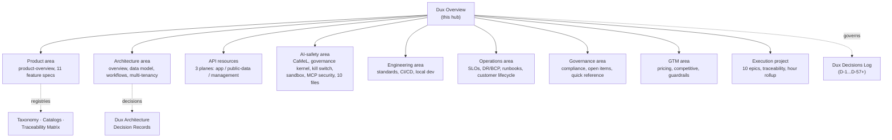

# Dux Overview

## Scope

The map of content for the entire [[Dux, Inc.]] developer documentation corpus (68 source files ingested 2026-07-21 from `C:\Users\User\dux\docs`, mirrored at `.raw/dux/`). **In scope:** product spec, architecture, API contracts, AI safety, engineering standards, operations, governance/compliance, GTM, and execution backlog for the Dux agentic exposure-management platform. **Out of scope:** the archived four-playbook historical record (git history only, not re-ingested).

## Executive Summary

Dux is a multi-tenant SaaS where [[Dux Agent]] takes a CVE plus a customer's live environment evidence and determines what is actually exploitable and the fastest path to protection, across an **Analyze → Mitigate → Remediate** pipeline that runs unattended by default at Gate 1 for 3 of 5 write actions. Defensive only, never PTaaS. The corpus is authored almost entirely by one Founder ([[Sagi]]) working through named, dated decisions — every judgment call lives in [[Dux Decisions Log]], never as inline change-history prose in a spec (D-12). As of 2026-07-21 the architecture has just settled after three infrastructure pivots in five days (self-hosted Kubernetes on EKS, LiteLLM removed for a direct Bedrock SDK, Agentic RAG re-enabled, agent frameworks removed in favor of Temporal calling Bedrock Converse directly) — see [[Dux Architecture Decision Records]].

## Standards

**Authority order:** [[Dux Decisions Log]] → GCIS v2.2 → OpenAPI 3.1 (`/v1/*` wire contract only) → BR→FR→US ([[Dux Traceability Matrix]]) → agent registry manifests. Marketing claims bind GTM copy/naming/UI strings only — never safety posture, gate criteria, or SLOs (D-10).

**Document contract** every source file carries: `owner` (Engineering | Founder | GTM | Security), `status` (`canonical` | `draft` | `backlog-shell` | `process-record`), `gate` (1 | 2 | 3 | n/a), `last_reviewed`, optional `decisions: [D-#]`.

**Terminology discipline** (full glossary: [[Dux Taxonomy and Controlled Vocabulary]] §5): **Dux Agent** is the only customer-facing agent name; **Mitigation nav** (the Analyze-stage research queue) is not the same thing as the **Mitigate stage** (automation) — the single most common naming error in the corpus; kill switch (noun) / kill-switch (adjective); **World Model** is a versioned proper noun.

**Current-truth-only rule (D-12):** specs are present tense, no "re-gated…", no "superseded — was…". [[Dux Decisions Log]] and [[Dux Architecture Decision Records]] are the two deliberate exceptions.

## Reading paths by role

| You are | Start | Then |
|---|---|---|
| Engineer building a feature | Product area | [[Dux Traceability Matrix]] → your feature spec → API resources |
| Architect | Architecture area | [[Dux Architecture Decision Records]] → workflows → data model |
| Security reviewer | AI-safety area | MCP security → OWASP assessments |
| On-call | Operations area | Incident runbooks → seed runbooks |
| Founder / PM / GTM | GTM area | Pricing → competitive |
| Auditor / compliance | Governance area | [[Dux Traceability Matrix]] |
| Anyone, before starting work | Open items (governance area) | what's still undecided and what it blocks |

## Domain map

| Domain | PARA bucket | Vault location |
|---|---|---|
| Product | Area | `wiki/areas/dux-product/` |
| Architecture | Area | `wiki/areas/dux-architecture/` |
| API contracts | Resource | `wiki/resources/dux-api/` |
| AI safety | Area | `wiki/areas/dux-ai-safety/` |
| Engineering | Area | `wiki/areas/dux-engineering/` |
| Operations | Area | `wiki/areas/dux-operations/` |
| Governance & meta | Area | `wiki/areas/dux-governance/` |
| GTM | Area | `wiki/areas/dux-gtm/` |
| Execution backlog | Project | `wiki/projects/dux/` |
| Registries (taxonomy, catalogs, decisions, ADRs) | Resource | `wiki/resources/dux-product/`, `wiki/resources/dux-meta/`, `wiki/resources/dux-architecture/` |
| Entities (people, agent, company) | Resource | `wiki/resources/people/` |
| Concepts (CaMeL, World Model, Governance Kernel, Kill Switch) | Resource | `wiki/resources/concepts/` |

**All ten domains are ingested as of 2026-07-21 (68/68 source files, verified by reconciliation — see [[migration-audit|Migration Audit]]).**

## Diagram

## Active projects in this area

- [[Dux Portfolio]] — the 10-epic execution backlog (`wiki/projects/dux/`)

## Cross-cutting hubs

For a role-based entry point instead of a domain-based one: [[Product Hub]] · [[Engineering Hub]] · [[Growth Hub]] · [[Customer Success Hub]] · [[Legal-Finance Hub]]. See also [[Welcome]] for the full vault PARA guide.

## Reference material

- [[Dux Decisions Log]]
- [[Dux Architecture Decision Records]]
- [[Dux Taxonomy and Controlled Vocabulary]]
- [[Dux Catalogs — Registries of Record]]
- [[Dux Traceability Matrix]]

## Review cadence

Weekly, or after any Founder decisions-log update — mirrors the corpus's own `last_reviewed` discipline.

## Sources

- `.raw/dux/README.md`
