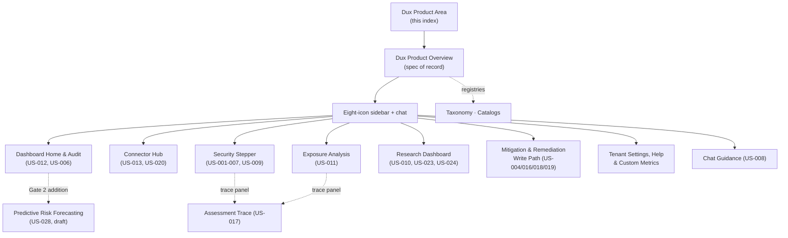

# Dux Product Area

## Scope

Everything under `10-product/` in the Dux corpus: the product spec (thesis, delivery pillars, capabilities, personas, nav map, gate model, capacity, scope boundary) and all eleven feature surfaces reachable from the eight-icon sidebar plus chat. **In scope:** product-overview.md and the `features/` directory (assessment trace, chat guidance, connector hub, continuous re-assessment, dashboard & audit, exposure analysis, mitigation & remediation write path, predictive risk forecasting, research dashboard, security stepper, tenant settings). **Out of scope, but reused by reference:** the taxonomy and catalogs registries ([[Dux Taxonomy and Controlled Vocabulary]], [[Dux Catalogs — Registries of Record]]), which live as resources in `wiki/resources/dux-product/` rather than as area notes here.

## Standards

**Authority order** (per [[Dux Overview]]): [[Dux Decisions Log]] → GCIS v2.2 → OpenAPI 3.1 (`/v1/*` wire contract) → BR→FR→US ([[Dux Traceability Matrix]]) → agent registry manifests.

**Document contract** every source file in this area carries: `owner` (Engineering | Founder | GTM | Security), `status` (`canonical` | `draft` | `backlog-shell` | `process-record`), `gate` (1 | 2 | 3 | n/a), `last_reviewed`, optional `decisions: [D-#]`. Ten of the twelve source files in this batch are `canonical`/Gate 1; [[Predictive Risk Forecasting]] is the deliberate exception (`draft`, Gate 2, owner Founder).

**The single most important naming discipline in this area:** **Mitigation nav** (the Analyze-stage research queue, [[Research Dashboard & Vulnerability Reduction]]) is not the same as the **Mitigate stage** (write-action automation, [[Mitigation & Remediation Write Path]]) — see [[Dux Taxonomy and Controlled Vocabulary]] §5. A second recurring discipline: two pairs of stories that look adjacent must never be merged — US-006 (governance/audit trend) vs. US-003 (live vendor control proof), and US-002 (standalone asset-context panel) vs. US-011 (per-asset fields already on the exposure-analysis asset table). See [[Security Stepper]] "Build rules."

**Write-action autonomy (D-17)** governs every write surface in this area: `network.blocklist_add`, `policy.deploy_device_config` (once Intune ships), and `ticket.create_remediation` execute unattended by default at Gate 1; `endpoint.isolate` and `patch.deploy_special_devices` require mandatory HITL on every call. Chat-initiated writes (`chat_write_tools`) are held to a stricter, always-mandatory-HITL posture regardless of action class, per [[Chat Guidance]].

## Active projects in this area

- **[[Dux Portfolio]]** — pending. No execution-backlog project note exists yet in `wiki/projects/dux/` as of this batch; [[Dux Overview]] references it as the eventual home for the 10-epic execution backlog. A later batch covering `90-execution/` should create it.

## Reference material

- [[Dux Product Overview]] — thesis, pillars, capabilities, personas, nav map, gate model, capacity, scope
- [[Assessment Trace]] — US-017
- [[Chat Guidance]] — US-008
- [[Connector Hub]] — US-013, US-020
- [[Continuous Re-Assessment]] — US-021
- [[Dashboard Home & Audit]] — US-012, US-006
- [[Exposure Analysis]] — US-011
- [[Mitigation & Remediation Write Path]] — US-004, US-016, US-018, US-019
- [[Predictive Risk Forecasting]] — US-028 (Gate 2, draft)
- [[Research Dashboard & Vulnerability Reduction]] — US-010, US-023, US-024
- [[Security Stepper]] — US-001–007, US-009
- [[Tenant Settings, Help & Custom Metrics]] — US-014, US-015, US-022
- [[Dux Taxonomy and Controlled Vocabulary]] — the controlled vocabulary this whole area's terminology follows
- [[Dux Catalogs — Registries of Record]] — the registries (integrations, agents, vendor actions, flags) that back these specs

## Diagram

## Review cadence

Weekly, or immediately after any Founder decisions-log update touching a `10-product/` source file — mirrors the corpus's own `last_reviewed` discipline.
