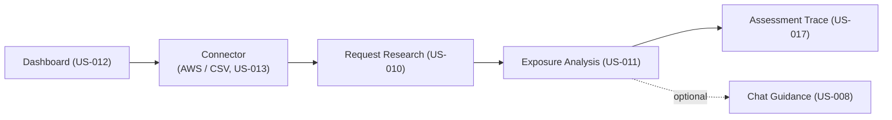
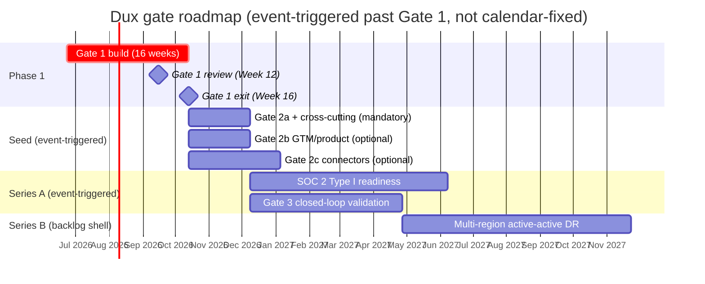

# Dux Product Guide

Navigation: [[Dux]] | [[Dux Feature Reference]] | [[Dux Taxonomy & Catalogs]]

## What Dux actually does

Every security team drowning in scanner output asks the same question: of the thousands of findings on the board, which ones can an attacker actually use right now? Dux exists to answer that question directly. It is a multi-tenant SaaS platform where an AI agent takes a CVE plus a customer's live environment evidence and works out what's genuinely exploitable and the fastest way to shut the door on it: an **Analyze → Mitigate → Remediate** pipeline that, as of Gate 1, runs unattended by default for three of its five possible write actions.

Two things Dux is explicitly *not*: it isn't a scanner replacement, and it isn't penetration-testing-as-a-service. It's defensive only, full stop: a permanent non-goal, not a Phase 2 maybe. Everything below assumes that boundary.

The product thesis and every gate criterion trace back to one Founder, Sagi (see [[Dux]] for the company background), working through named, dated decisions. Nothing changes silently: every judgment call lives in [[Dux Decisions & Traceability Reference]], never as change-history prose bolted onto a spec. If you're reading a spec and it says "current truth" with no caveats, that's deliberate (D-12): specs describe what's true now, and the decisions log is where the "why we changed course" story lives.

## The five delivery pillars

Dux's roadmap organizes around five pillars, each with its own canonical spec:

| Pillar | Delivers | Canonical spec |
|---|---|---|
| **A: Moat** | [[Dux Taxonomy & Catalogs|World Model]], evaluation, personalization | data model, taxonomy, US-017, US-009 |
| **B: Safety scales with autonomy** | governance kernel, kill switch, CaMeL, anomaly-escalation HITL | see [[Dux AI Safety Guide]] |
| **C: Claim ↔ capability firewall** | claims traceability, gate-safe marketing copy | see [[Dux GTM Guide]] |
| **D: Isolation + compliance invariants** | RLS FORCE, composite keys, SOC 2 / ISO | see [[Dux Architecture Guide]], [[Dux Governance & Compliance Guide]] |
| **E: Extensibility spine** | the eight-part registry contract, catalogs-as-manifest | see [[Dux Taxonomy & Catalogs]] |

Pillar B is worth dwelling on, because it's the thesis behind Dux's whole approach to autonomy: safety doesn't get bolted on after the agent gets more capable, it scales *with* capability, gate by gate. That principle shows up everywhere below.

## Eight core capabilities: all live at Gate 1

The product's operating principle (GCIS v2.2) is to close every gap between what the marketing claims and what the system can actually do by *raising the build to meet the claim*, never by quietly narrowing the claim. All eight core capabilities are live as of Gate 1; only preference learning and physical residency remain fenced beyond it.

| # | Capability | Gate-1 delivery | Fenced beyond Gate 1 |
|---|---|---|---|
| 1 | AI-driven exploitability analysis | Full: prerequisite analysis, environmental evidence, executed investigation code in traces | - |
| 2 | Vulnerability → asset → control mapping | Attack paths + AWS security groups + vendor control panels (CrowdStrike live; Intune at Gate 3/W2) | - |
| 3 | Lightweight mitigation | Unattended-by-default action cards | - |
| 4 | Config-change recommendations vs. patching | Read and display surface live; the recommendation logic itself is deferred to Gate 2 | Closed-loop validation → Gate 3 |
| 5 | Remediation acceleration | Ticket create + route, unattended | Closed-loop automation → Gate 3 |
| 6 | Automated asset tagging/ownership | Ownership inference live (ServiceNow, Entra) | Preference-driven refinement → Gate 2c |
| 7 | Multi-source data aggregation | AWS + NVD/KEV/EPSS + CSV + 3+ vendor connectors | Full 42-source taxonomy → waves W2/W3 |
| 8 | Exploitability-based prioritization | Mitigation queue + exposure states | Preference learning → Gate 2c |

Row 4 carries a genuine, disclosed discrepancy between two source documents rather than a settled fact: the capability spec calls control refinements "live" at Gate 1, but the execution backlog explicitly defers the US-005 implementation itself to the Gate-2 backlog as a capacity fallback, with zero Gate-1 tasks scheduled against it. The read/query surface and the stepper panel exist; whether the underlying recommendation logic is actually live at Gate 1 is the part that's unresolved between the two documents.

The agent's operating loop, underneath all eight capabilities, is four steps: continuously analyze vulnerabilities across connected environments, check whether existing tooling or configuration already blocks the attack path, surface a lightweight mitigation faster than a full patch, and route focused remediation to the right stakeholders. Steps three and four execute unattended by default for the three actions that have earned that trust (see below); a human only gets pulled in when something looks anomalous.

## Write-action autonomy: the earned-trust model

This is the part of the product that most differentiates Dux from a chatbot wrapped around a scanner. Dux doesn't treat "the AI can take actions" as a single on/off switch: it treats autonomy as something each action type earns individually, and it's explicit about which actions have earned it and which haven't (decision D-17):

| Action | Blast radius | Gate-1 posture |
|---|---|---|
| `network.blocklist_add` | medium | Unattended by default |
| `ticket.create_remediation` | low | Unattended by default |
| `policy.deploy_device_config` | medium | Unattended, but only once the Gate-3/W2 Intune connector ships |
| `endpoint.isolate` | high | **Mandatory human approval, every single call** |
| `patch.deploy_special_devices` | high | **Mandatory human approval, every single call** |

The two actions held to mandatory review aren't held back arbitrarily: `endpoint.isolate` can take a device off the network, and `patch.deploy_special_devices` targets firmware-only hardware with no API-level rollback path at all. Until either earns unattended execution through a field-proven safety record (the Gate-3 bar), a human stays in the loop on every call. The full mechanics of how a write action moves through governance (the gate chain, the rollback catalog, HITL tiers) live in [[Dux AI Safety Guide]]; this page just establishes the product-level rule.

## Who Dux is built for

The agent persona is **Dux Agent**: see below for what backs that name. On the human side:

| Persona | Goal | What they'd read first | Degraded path without connectors |
|---|---|---|---|
| Security engineer (primary user) | Cut the queue from thousands of findings to tens | Research Dashboard, Security Stepper | AWS and NVD live; vendor panels show connector-degraded empty states |
| CISO / security leader (buyer) | Board-ready, validated risk reduction | Dashboard Home & Audit | Donut and delta metrics only |
| AI Safety Lead | Halt authority: agent kill switch in under 5 seconds | Kill Switch, Governance Kernel | - |
| DevOps / SRE | Fix things without breaking deploys | Connector Hub, Mitigation & Remediation Write Path | Webhooks delayed |
| Tenant admin | Users, connectors, agent policy, data export | Tenant Settings | AWS wizard plus CSV fallback; an SSO deferral note |
| API consumer | Assessments and webhooks over JWT; public data API at Seed | API Overview | Poll `GET /v1/vulnerability-instances` once the Seed API is live |

## The Dux Agent

**Dux Agent** is the *only* name that ever appears in front of a customer. "Dux AI," "AI-workers," "assessment agent": all internal, all things that must never leak into marketing or compliance-facing copy. Behind that single customer-facing name sits a small fleet of specialized runtime services, each with its own blast-radius classification:

- `dux-assessment`: medium blast radius, the core reasoning workflow
- `dux-chat-guidance`: supervised, powers the conversational surface
- `prerequisite-extractor`, `asset-context-worker`, `control-mapping-worker`: low-blast-radius subagents feeding the investigation steps
- `mitigation-agent`, `remediation-agent`: high blast radius, autonomous with human review reserved for anomaly escalation
- `dux-resident-agent`: high blast radius, Gate 5 only (physical residency)
- `third-party-isv`: Series B, not yet in scope

The reasoning loop itself is refreshingly unframeworked: a Temporal TypeScript workflow (`ExploitabilityAssessmentWorkflow`) calls the AWS Bedrock Converse API directly. Mastra and LangGraph.js were both evaluated and explicitly removed (ADR-021 / D-35) in favor of this simpler path. Every AI worker shows a plain-language, non-color-coded status on screen (`REASONING`, `TOOL_CALLING`, `EVALUATING`, `COMPLETE`) streamed straight from the workflow over NATS SSE, with no framework intermediary translating it. Adding a new runtime agent isn't casual: it requires a blast-radius classification, a kill-switch scope, an MCP tool allowlist, an OWASP agentic-risk mapping, and a parity test, all before it ships.

## Navigating the product

The eight-icon sidebar plus chat maps directly onto the user-story set:

| Nav icon | Page | Primary stories |
|---|---|---|
| Dashboard | Home / Exposure Overview | US-012 (+ US-006) |
| Apps | Connector Hub | US-013 |
| Security | Investigation stepper | US-001, US-002–007, US-009 |
| Exposure | Exposure Analysis / CVE Detail | US-011 (+ US-017) |
| Mitigation | Research Dashboard / Vulnerability Reduction | US-010 |
| Fast Actions | One-Click Mitigations | US-016 |
| Settings | Tenant Administration | US-014 |
| Help | Help & Support | US-015 |

One naming trap worth calling out explicitly, because it's the single most common mix-up in the whole corpus: the **Mitigation nav** (the sidebar item, really the Analyze-stage research queue) is not the same thing as the **Mitigate stage** (the automation that actually executes a write action). They sound alike and they aren't. Full glossary in [[Dux Taxonomy & Catalogs]].

For a first walkthrough, the canonical end-to-end path is: Dashboard (US-012) → connect AWS or upload a CSV (US-013) → Request Research (US-010) → Exposure Analysis (US-011) → open the trace to see why (US-017) → optionally ask Chat to explain it further (US-008). That's the "thousands of scanner findings become a small set of evidence-backed action groups" story in miniature. See [[Dux Feature Reference]] for the full spec of every screen in that path.

## The gate model

Dux ships in gates, not sprints-with-a-deadline. Each gate is a bar to clear, not a date on a calendar. That's a discipline worth stating plainly: **gates activate on events, not on the calendar.**

| Gate | Meaning | Exit criteria |
|---|---|---|
| Vertical slice (Week 6) | One CVE → one agent → one conclusion → one UI view | SIGKILL durability; governance gates live; 2+ design partners; 10 test CVEs with traces |
| **Gate 1 review (Week 12)** | Full Phase-1 pipeline, hardened | >80% golden-set accuracy on held-out pairs; zero cross-tenant fuzz reads; zero critical findings in the adversarial suite; **under $0.75 per workflow**; 2+ committed design partners; anomaly-escalation approve/deny surface live with impact preview |
| Phase-1 exit (Week 16) | Production beta | Customer data flowing 2+ weeks; sustained >80% held-out accuracy; false negatives under 5%; OWASP LLM/Agentic assessments Partial or better |
| Gate 2a/2b/2c | Seed activation / GTM / vendor-screen expansion | see [[Dux Operations Guide]] |
| Gate 3 | Closed-loop mitigation validation | Field-proven action-safety record |
| Gate 5 | Optional physical residency | Signed on-prem contract |

The 16-week Phase-1 calendar starts at Week 2 with the infrastructure skeleton and its isolation harness, then Week 4 adds a PgBouncer pooling fuzz test (`test:fuzz-tenant-id` becomes merge-blocking from that point on). It interlocks tightly with two external legal deadlines that don't move for anyone: an EU AI Act counsel opinion due around Week 6, ahead of the Article 50 transparency deadline, and a Langfuse DPA that has to land before production traces can flow, around Week 8. That same Week 8 also brings the first internal dogfood (2 tenants, an isolation pass), an internal `/api/docs` Redoc instance shared with NDA partners, and the HITL approval API. There's also a standing abort rule: if the golden set regresses by more than 2%, the inner reasoning framework gets switched, no negotiation.

Capacity, as of the latest re-baseline, sits at roughly 98.1% of the envelope: 2,118 hours of backlog against a 2,160-hour budget, a 42-hour buffer, with the same five-engineer team and no sixth hire. Neither the Week-12 review nor the Week-16 exit date has moved because of it. See [[Dux Portfolio]] for the full hour rollup.

## Explicitly out of scope for Phase 1

Being clear about what Dux *doesn't* do yet is as load-bearing as the capability list above, and it's what keeps sales copy honest:

- Closed-loop mitigation validation / re-verification → lands at Gate 3 (the write *execution* itself is already in scope at Gate 1)
- Preference **learning** refinement → Gate 2c
- Azure / GCP discovery → Phase 2
- Enterprise SSO / SCIM → triggered at Seed
- OT / IoT discovery → Phase 2+
- On-prem / air-gapped physical residency → Gate 5
- Predictive risk forecasting → funded for Gate 2 (see [[Dux Feature Reference]])
- Financial-impact quantification → Phase 3
- Native mobile app → Series A
- **Scanner replacement and PTaaS** → permanent non-goals, not phased in ever

## Roadmap: gates, not RICE scores

One honest gap worth flagging rather than papering over: there is no RICE-scored (Reach/Impact/Confidence/Effort) backlog anywhere in the source corpus. Rather than inventing scores that were never actually computed, this guide uses the same P0/P1/P2 severity scheme the corpus itself relies on:

| Tier | Meaning |
|---|---|
| P0 | Blocks a Gate-1 ship, or a live legal/compliance exposure |
| P1 | Blocks a plan, a date, or an external commitment already made |
| P2 | Real spec debt, but nothing currently unsafe or over-promised |

Past Gate 2, the roadmap is triggered by events, not quarters:

| Trigger | Unlocks |
|---|---|
| First enterprise prospect requiring SOC 2 | SOC 2 Type I readiness (months 9–12) |
| First EU prospect | EU AI Act Art. 9, Azure OpenAI EU routing |
| Non-human-identity inventory above 500 | NHI policy formalization |
| Throughput ≥500 assessments/day, or Temporal spend >$500/mo for 30 days | Workflow-port graduate-spike evaluation |

Series B is further out and explicitly a backlog shell, not a commitment: multi-region active-active DR with a sub-1-hour recovery target, outcome-based Enterprise pricing by default, and ERM/TPRM maturation. See [[Dux Governance & Compliance Guide]] for the maturity table those items sit in.

Every gate-timeline and capacity number in this roadmap traces to a dated decision: most notably the three capacity re-baselines (2,000h → 2,080h → 2,160h, landing at today's 2,118h-against-2,160h) and the three-pivot infrastructure sequence that reshaped the Gate-1 build without ever moving the Week-12 or Week-16 dates. Full history in [[Dux Decisions & Traceability Reference]].

## Where to go next

- [[Dux Feature Reference]]: the full spec for every screen and API surface named above
- [[Dux Taxonomy & Catalogs]]: the controlled vocabulary and the nine registries every extension point is declared in
- [[Dux Architecture Guide]]: how the pipeline is actually built
- [[Dux AI Safety Guide]]: the governance kernel, kill switch, and CaMeL boundary behind every write action
- [[Dux Portfolio]]: the execution backlog behind this roadmap

## Sources

- `.raw/dux/10-product/product-overview.md`
- `.raw/dux/README.md`
- `.raw/dux/00-meta/vision-reference.md`
- `.raw/dux/00-meta/decisions-log.md`
- `.raw/dux/10-product/catalogs.md`
- `.raw/dux/10-product/taxonomy.md`
- `.raw/dux/60-operations/operations-overview.md`
- `.raw/dux/70-governance/compliance-program.md`
- `.raw/dux/70-governance/series-b-scale.md`
- `.raw/dux/90-execution/README.md`
