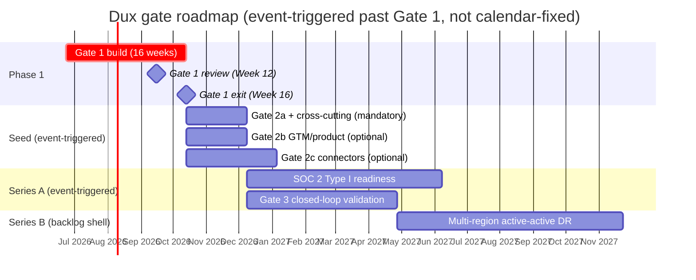
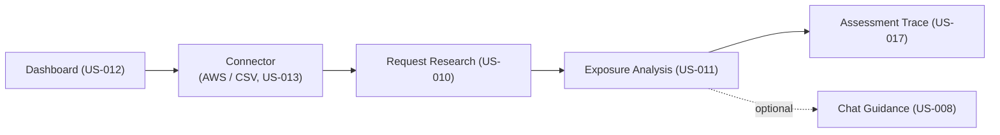

# Dux Product Guide

## Thousands to Tens: How Dux Decides What Actually Matters

*A per-environment, attacker-minded reasoning system that tells a security team which findings are exploitable right now — and what to do about it.*

**Purpose:** what Dux is, what ships at Gate 1, and what is deliberately fenced beyond it. **Parents:** all BRs · **Canon:** ideal-state v2.2 · **Marketing language:** Dux Vision Reference.

Navigation: [[Dux]] | [[Dux Feature Reference]] | [[Dux Taxonomy & Catalogs]]

**Key decisions:** [[Dux Decisions & Traceability Reference]] · **Architecture:** [[Dux Architecture Guide]] · **Safety:** [[Dux AI Safety Guide]]

---

**"Thousands to tens"** — the product's core promise.

## The Question Every Security Team Is Actually Asking

Every security team drowning in scanner output asks the same question: of the thousands of findings on the board, which ones can an attacker actually use right now? Dux exists to answer that question directly.

Dux is a **per-environment, attacker-minded reasoning system**. It decides what is *actually exploitable here*, and the *fastest path to protection*.

It is a multi-tenant SaaS platform where an AI agent takes a CVE plus a customer's live environment evidence and works out what's genuinely exploitable and the fastest way to shut the door on it: an **Analyze → Mitigate → Remediate** pipeline that, as of Gate 1, runs unattended by default for three of its five possible write actions.

It runs at machine speed for analysis and re-assessment. It is personalized per customer through coding agents rather than static rules. It rides third-party frontier models. **It is defensive only.** And it takes governed write actions on the customer's security stack. Three of five actions are unattended by default, with human review as the anomaly-escalation path; the other two (`endpoint.isolate`, `patch.deploy_special_devices`) are gated to mandatory human approval until each earns unattended execution via a field-proven safety record (D-17). Of the three, `network.blocklist_add` and `ticket.create_remediation` are live at Gate 1; `policy.deploy_device_config`'s unattended posture activates only once its Gate-3/W2 Intune connector ships.

Two things Dux is explicitly *not*: it isn't a scanner replacement, and it isn't penetration-testing-as-a-service. Those are permanent non-goals, not Phase 2 maybes. Everything below assumes that boundary.

The product thesis and every gate criterion trace back to one Founder, Sagi (see [[Dux]] for the company background), working through named, dated decisions. Nothing changes silently: every judgment call lives in [[Dux Decisions & Traceability Reference]], never as change-history prose bolted onto a spec. If you're reading a spec and it says "current truth" with no caveats, that's deliberate (D-12): specs describe what's true now, and the decisions log is where the "why we changed course" story lives.

---

## Four Properties That Make Dux More Than a Chatbot Wrapped Around a Scanner

Dux rests on four core properties that distinguish it from a chatbot wrapped around a scanner:

- **Machine speed:** analysis and re-assessment happen as fast as the infrastructure allows, not on a human schedule. The agent continuously evaluates vulnerabilities across connected environments without waiting for a human to trigger a scan.
- **Personalized per environment:** each customer gets reasoning tailored to their live environment evidence, not static rules applied universally. The agent understands what controls are actually deployed, what assets exist, and what the real attack surface looks like.
- **Frontier models:** the product rides third-party frontier models via AWS Bedrock, not a home-grown or narrow ML model. This gives Dux access to the best reasoning capabilities available without requiring a dedicated model-training pipeline.
- **Defensive only:** Dux takes governed write actions on the customer's security stack; it never offensive. This is a permanent non-goal, not a phased feature.

These four properties are not a feature list — they are architectural constraints that shape every design decision in the product. Machine speed requires a Temporal workflow that can execute at infrastructure speed. Personalization requires per-environment data isolation and per-customer reasoning. Frontier models require the Bedrock integration and the governance kernel to contain them. Defensive-only requires the write-action taxonomy and the earned-trust model.

---

## The Operating Principle: GCIS v2.2

> Close every claim↔capability gap by **raising the design to deliver the claim, not by narrowing the claim**. A promoted capability ships in Phase 1 with best-practice architecture plus governance-kernel, kill-switch, and audit controls. Staging is retained only where earlier delivery is physically impossible — insufficient data volume, an unsigned contract, or a safety record that does not yet exist.

All eight core capabilities are live at Gate 1. Write actions execute unattended by default for 3 of 5 canonical actions; `endpoint.isolate` and `patch.deploy_special_devices` require mandatory HITL until they earn unattended execution (D-17). Only **preference learning** and **physical residency** remain fenced.

This operating principle is the product-level expression of a deeper architectural commitment: when a capability is claimed but not yet delivered, the correct response is to raise the build, not to quietly walk back the claim. Every gate review checks whether this discipline has held.

The practical implication: every capability in the table below has a clear delivery scope at Gate 1, and anything that cannot ship at Gate 1 is explicitly fenced with a delivery gate. There are no gray zones, no "it depends" answers, no marketing copy that outruns the build. The claim ↔ capability firewall (Pillar C) enforces this at the GTM layer.

---

## Five Delivery Pillars, One Interlocking System

| Pillar | Delivers | Canonical spec |
|--------|----------|----------------|
| **A** — Moat: World Model, eval, personalization | [[Dux Taxonomy & Catalogs\|World Model]], investigation-code artifacts, preference engine, golden-set eval | [[Dux Architecture Guide\|data-model]], [[Dux Taxonomy & Catalogs\|taxonomy]], US-017 / US-009 |
| **B** — Safety scales with autonomy | governance kernel, kill switch, CaMeL, anomaly-escalation HITL | [[Dux AI Safety Guide]] |
| **C** — Claim ↔ capability firewall | claims traceability, gate-safe copy | [[Dux GTM Guide]] |
| **D** — Isolation + compliance invariants | RLS FORCE, composite keys, SOC 2 / ISO | [[Dux Architecture Guide\|multi-tenancy]], [[Dux Governance & Compliance Guide]] |
| **E** — Extensibility spine | the 8-part contract, catalogs-as-manifest | [[Dux Taxonomy & Catalogs]] |

Pillar B is worth dwelling on, because it's the thesis behind Dux's whole approach to autonomy: safety doesn't get bolted on after the agent gets more capable, it scales *with* capability, gate by gate. That principle shows up everywhere below.

The five pillars are not independent workstreams — they are interlocking constraints. A delivery in Pillar A (personalization) can only ship when Pillar B (safety) has the governance gates to contain it. Pillar C (claim ↔ capability firewall) ensures that marketing copy never outpaces what Pillar A actually delivers. Pillar D (isolation) is the non-negotiable foundation that lets any of the others operate in a multi-tenant environment. And Pillar E (extensibility) is what makes the system grow without forking the codebase.

The pillars are ordered intentionally: A is the moat, B is the safety envelope, C is the honesty layer, D is the foundation, and E is the growth mechanism. Every gate review checks all five pillars. A delivery that satisfies Pillar A but fails Pillar B does not ship.

---

## Core Capabilities: All Live at Gate 1

| # | Capability | BR | Claims | Gate-1 delivery | Fenced beyond Gate 1 |
|---|-----------|----|--------|-----------------|----------------------|
| 1 | AI-driven exploitability analysis — exploitable vs merely reachable | BR-002 | A1, A2, A4, A9, D1 | Full: prerequisite analysis, environmental evidence, executed investigation code in traces | — |
| 2 | Vulnerability → asset → control relationship mapping | BR-002 | B6, C5 | Attack paths + AWS security groups + vendor control panels (CrowdStrike live; Intune at Gate 3/W2) | — |
| 3 | Lightweight mitigation using the existing stack | BR-002 | C4 | Unattended-by-default action cards (US-004, US-016) | — |
| 4 | Configuration-change recommendations vs patching | BR-002 | C3, C4 | Control refinements live (US-005) | Closed-loop validation → Gate 3 |
| 5 | Remediation acceleration via AI agents | BR-002 | C3, B2 step 4 | Ticket create + route, unattended (US-018) | Closed-loop automation → Gate 3 (US-019) |
| 6 | Automated asset tagging and ownership | BR-004 | B2 | Ownership inference live — ServiceNow, Entra (US-007) | Preference-driven refinement → Gate 2c |
| 7 | Multi-source data aggregation | BR-004 | B2 step 1, B6, B3 | AWS + NVD/KEV/EPSS + CSV + ≥3 vendor connectors | Full 42-source taxonomy → waves W2/W3 |
| 8 | Exploitability-based prioritization | BR-002 | D1, C7 | Mitigation queue + exposure states | Preference learning → Gate 2c |

Row 4 is worth being precise about, since two facts sit side by side rather than one simple answer: the stepper panel and the read/query surface (`GET /controls/refinements`) are live at Gate 1, which is what the capability spec's own table cell is stating. But the recommendation logic that actually populates them is a separate matter: US-005 (Control Refinements) was explicitly deferred to the Gate-2 backlog by D-19 as a capacity fallback, with zero Gate-1 tasks scheduled against it, and D-23 later reconfirms that deferral still stands rather than reversing it. Read "live" in row 4 as scoped to the surface, not the recommendation logic behind it.

### Claim-ID Verdicts Against Delivery Status

Claim-ID verdicts against delivery status are recorded in [[Dux Decisions & Traceability Reference]] (claims-implementation audit findings absorbed 2026-07-16; source file removed, see open-items OI-27). The audit maps every claim ID (A1, A2, A4, A9, B2, B3, B6, C3, C4, C5, C7, D1) to its delivery status at Gate 1, providing the evidence trail that backs the capability table above.

---

## The Agent's Operational Loop

Four steps, all Gate 1:

1. Continuously analyze vulnerabilities across connected environments.
2. Determine whether existing tools and configuration already block the attack path.
3. Surface lightweight mitigations that are faster than a full patch.
4. Route focused remediation to the right stakeholders.

Steps 3 and 4 execute unattended by default for `network.blocklist_add`/`policy.deploy_device_config`/`ticket.create_remediation`, human review firing only on anomaly escalation; `endpoint.isolate`/`patch.deploy_special_devices` require mandatory HITL on every call (D-17).

The loop is the same regardless of which connector is providing the data or which mitigation action is being taken. The agent's reasoning is per-environment: it understands the customer's specific assets, controls, and configuration, not a generic topology.

The loop executes at machine speed: the agent doesn't wait for a human to trigger a scan, doesn't wait for a batch job to run, and doesn't wait for a report to be generated. It continuously analyzes, continuously checks, and surfaces mitigations as soon as they're available. This is the "machine speed" property in action.

---

## Write-Action Autonomy: The Earned-Trust Model

This is the part of the product that most differentiates Dux from a chatbot wrapped around a scanner. Dux doesn't treat "the AI can take actions" as a single on/off switch: it treats autonomy as something each action type earns individually, and it's explicit about which actions have earned it and which haven't (D-17):

| Action | Blast radius | Gate-1 posture |
|--------|-------------|----------------|
| `network.blocklist_add` | medium | Unattended by default |
| `ticket.create_remediation` | low | Unattended by default |
| `policy.deploy_device_config` | medium | Unattended, but only once the Gate-3/W2 Intune connector ships |
| `endpoint.isolate` | high | **Mandatory human approval, every single call** |
| `patch.deploy_special_devices` | high | **Mandatory human approval, every single call** |

The two actions held to mandatory review aren't held back arbitrarily: `endpoint.isolate` can take a device off the network, and `patch.deploy_special_devices` targets firmware-only hardware with no API-level rollback path at all. Until either earns unattended execution through a field-proven safety record (the Gate-3 bar), a human stays in the loop on every call. The full mechanics of how a write action moves through governance (the gate chain, the rollback catalog, HITL tiers) live in [[Dux AI Safety Guide]]; this page just establishes the product-level rule.

This earned-trust model is the product's most defensible moat. Any competitor that bolts AI actions onto a scanner output faces the same five-action taxonomy — but Dux has the governance kernel, the kill switch, and the audit trail that make each action's autonomy level explicit, auditable, and reversible. The blast-radius classification isn't a marketing claim; it's an engineering constraint enforced at the infrastructure layer.

---

## The Dux Agent: One Face, a Small Fleet of Specialists

**The agent persona — Dux Agent.** An "Aggressive Exposure Management Specialist": calm, logical, humble, transparency-focused, and **citation-first** — every exploitability claim references a permitted source (NVD, asset inventory, control evidence).

**Dux Agent** is the *only* name that ever appears in front of a customer. "Dux AI," "AI-workers," "assessment agent": all internal, all things that must never leak into marketing or compliance-facing copy. Behind that single customer-facing name sits a small fleet of specialized runtime services, each with its own blast-radius classification:

- `dux-assessment`: medium blast radius, the core reasoning workflow
- `dux-chat-guidance`: supervised, powers the conversational surface
- `prerequisite-extractor`, `asset-context-worker`, `control-mapping-worker`: low-blast-radius subagents feeding the investigation steps
- `mitigation-agent`, `remediation-agent`: high blast radius, autonomous with human review reserved for anomaly escalation
- `dux-resident-agent`: high blast radius, Gate 5 only (physical residency)
- `third-party-isv`: Series B, not yet in scope

The reasoning loop itself is refreshingly unframeworked: a Temporal TypeScript workflow (`ExploitabilityAssessmentWorkflow`) calls the AWS Bedrock Converse API directly. Mastra and LangGraph.js were both evaluated and explicitly removed (ADR-021 / D-35) in favor of this simpler path. Every AI worker shows a plain-language, non-color-coded status on screen (`REASONING`, `TOOL_CALLING`, `EVALUATING`, `COMPLETE`) streamed straight from the workflow over NATS SSE, with no framework intermediary translating it. Adding a new runtime agent isn't casual: it requires a blast-radius classification, a kill-switch scope, an MCP tool allowlist, an OWASP agentic-risk mapping, and a parity test, all before it ships.

The agent's reasoning is citation-first: every exploitability claim references a permitted source (NVD, asset inventory, control evidence). This is not a nice-to-have — it's a compliance requirement. The LLM09 citation gate at Gate 1 ensures that every claim can be traced back to its source. Without citations, the agent's conclusions are unverifiable, and unverifiable conclusions have no place in a security product.

---

## Who's Actually Using This

| Persona | Goal | Primary stories | Degraded path without connectors |
|---------|------|-----------------|----------------------------------|
| Security engineer (primary user) | Cut the actionable queue from thousands to tens | US-001, US-010, US-011, US-008 | AWS + NVD live; vendor panels show connector-degraded empty states |
| CISO / security leader (buyer) | Board-ready, validated risk reduction | US-006, US-012 | Donut and delta metrics only |
| AI Safety Lead | Agent halt authority (<5 s kill switch) | US-014 | — |
| DevOps / SRE | Fix without breaking deploys | US-007, US-018 | Webhooks delayed |
| Tenant admin | Users, connectors, agent policy, export | US-013, US-014 | AWS wizard + CSV fallback; SSO deferral note |
| API consumer | Phase 1: assessments and webhooks (JWT). Seed: public data API | US-014, US-024 | Poll `GET /v1/vulnerability-instances` once the Seed API is live |

The security engineer is the primary user persona. The "thousands to tens" goal is the product's core value proposition: scanner findings become a small set of evidence-backed action groups. The CISO is the buyer persona, focused on board-ready risk reduction metrics. The AI Safety Lead has halt authority over the agent with a kill switch that responds in under 5 seconds. DevOps/SRE needs fixes that don't break deploys. The tenant admin manages users, connectors, and agent policy. The API consumer integrates with the assessment and webhook surfaces using JWT authentication.

The degraded paths are a design choice, not a compromise: every persona can get value from Dux even when not all connectors are live. AWS + NVD provide the minimum viable data for the security engineer. The CISO gets donut and delta metrics from whatever data is available. The tenant admin gets the AWS wizard plus CSV fallback. This ensures Dux is useful from day one of onboarding, not just after every integration is complete.

---

## Navigation → User-Story Map

The eight-icon sidebar plus chat maps directly onto the user-story set:

| Nav | Page title | User stories |
|-----|-----------|--------------|
| Dashboard | Home / Exposure Overview | US-012 (+ US-006 widgets) |
| Apps | Connector Hub | US-013 |
| Security | Investigation workflow (stepper) | US-001; US-002–007, US-009 |
| Exposure | Exposure Analysis / CVE Detail | US-011 (+ US-017 panel) |
| Mitigation | Research Dashboard / Vulnerability Reduction | US-010 |
| Fast Actions | One-Click Mitigations | US-016 |
| Settings | Tenant Administration | US-014 |
| Help | Help & Support | US-015 |

Feature specs live in `features/`. The nav-label vs page-title split, and the Mitigation-nav vs Mitigate-stage distinction, are canonical in [[Dux Taxonomy & Catalogs]] — they are easy to conflate, and must not be.

### The Mix-Up to Avoid: Nav-Label vs Page-Title

The **Mitigation nav** (the sidebar item, really the Analyze-stage research queue) is not the same thing as the **Mitigate stage** (the automation that actually executes a write action). They sound alike and they aren't. The nav-label vs page-title split, and the Mitigation-nav vs Mitigate-stage distinction, are canonical in [[Dux Taxonomy & Catalogs]] — they are easy to conflate, and must not be. This is the single most common mix-up in the whole corpus. The nav-label vs page-title split exists because the sidebar uses action-oriented language ("Mitigation") while the page title uses outcome-oriented language ("Research Dashboard"). Both are correct, but they describe different things. When in doubt, refer to [[Dux Taxonomy & Catalogs]] for the authoritative mapping.

---

## Phase-1 Gate Model: Bars to Clear, Not Dates on a Calendar

Dux ships in gates, not sprints-with-a-deadline. Each gate is a bar to clear, not a date on a calendar. **Gates activate on events, not on the calendar.**

| Gate | Meaning | Exit criteria |
|------|---------|---------------|
| Vertical slice (Week 6) | One CVE → one agent → one conclusion → one UI view | SIGKILL durability (zero duplicate external effects; the LLM step is not re-sampled); governance gates live (Intent, Budget, ActionBudget, CostForecast); 2+ design partners onboarded; 10 test CVEs with traces |
| **Gate 1 review (Week 12)** | Full Phase-1 pipeline, hardened | >80% golden-set accuracy on a held-out set of **(CVE × environment) pairs** (H1); zero cross-tenant fuzz reads; zero Critical findings in the adversarial suite; **<$0.75 per workflow** (D-3); 2+ committed design partners; anomaly-escalation approve/deny surface live with impact preview (H4); LLM09 citation gate green |
| Phase-1 exit (Week 16) | Production beta | Customer data flowing for 2+ weeks; sustained >80% held-out accuracy; false negatives <5%; OWASP LLM and Agentic assessments at Partial or better; actionable-queue ratio and MTTP measured on real partner data |
| Gate 2a / 2b / 2c | Seed activation / GTM / vendor-screen expansion | See [[Dux Operations Guide]] |
| Gate 3 | **Closed-loop mitigation validation (US-019)** | A field-proven action-safety record. Unattended write *execution* is already Gate 1 |
| Gate 5 | Optional physical residency | A signed on-prem contract |

### Vertical Slice SIGKILL Durability

The vertical slice at Week 6 requires SIGKILL durability: zero duplicate external effects, and the LLM step is not re-sampled. Governance gates (Intent, Budget, ActionBudget, CostForecast) must be live. Two or more design partners must be onboarded with 10 test CVEs producing traces. This is the first integration point where the full pipeline — from CVE ingestion through agent reasoning to UI rendering — operates end-to-end on a single vulnerability. The 10 test CVEs must produce traces that demonstrate the full reasoning chain: prerequisite analysis, environmental evidence gathering, control mapping, and the final exploitability conclusion.

### Gate-1 Criteria

The Gate 1 review at Week 12 clears when: >80% golden-set accuracy on held-out (CVE × environment) pairs (H1); zero cross-tenant fuzz reads; zero Critical findings in the adversarial suite; per-workflow cost under $0.75 (D-3); 2+ committed design partners; anomaly-escalation approve/deny surface live with impact preview (H4); and the LLM09 citation gate is green. The golden-set accuracy threshold is the single hardest bar: it requires the agent to reach correct exploitability conclusions on CVEs it has never seen during development. The held-out set is a stratified sample of (CVE × environment) pairs that the agent has never encountered during training or evaluation, ensuring the accuracy metric reflects real-world generalization, not memorization.

### Phase-1 Exit Criteria

Phase-1 exit at Week 16 requires: customer data flowing for 2+ weeks; sustained >80% held-out accuracy; false negatives under 5%; OWASP LLM and Agentic assessments at Partial or better; and actionable-queue ratio and MTTP measured on real partner data. This is the production-beta gate: the product must demonstrate it works on real customer environments, not just test data.

The actionable-queue ratio measures how many of the agent's mitigation recommendations are actually acted on by the security team. MTTP (Mean Time to Patch) measures how quickly the team moves from exposure identification to remediation. Both metrics must be measured on real partner data, not synthetic test data, to validate the product's real-world impact.

---

## Release Milestones

**Release milestones (16-week calendar, D-7 R1):**

| Week | Milestone |
|------|-----------|
| 2 | Infrastructure skeleton + isolation harness |
| 4 | PgBouncer pooling fuzz; `test:fuzz-tenant-id` becomes merge-blocking |
| 6 | Vertical slice + **the EU AI Act counsel opinion, before any EU prospect outreach.** This blocks EU tenant provisioning until the opinion and classification memo are on file. At `phase_1_epoch` 2026-06-23, Week 6 falls near 2026-07-28 — ahead of the 2 Aug 2026 Article 50 transparency deadline ([[Dux Governance & Compliance Guide]], D-26) |
| 8 | Internal dogfood (2 tenants, isolation pass); internal `/api/docs` (Redoc, shared with NDA partners); HITL approval API; **the Langfuse DPA — this blocks production traces** |
| 12 | Gate 1 review + minimal HITL approve/deny UI |
| 14 | `chat_write_tools` + full chat HITL UI |

The 16-week Phase-1 calendar starts at Week 2 with the infrastructure skeleton and its isolation harness, then Week 4 adds a PgBouncer pooling fuzz test (`test:fuzz-tenant-id` becomes merge-blocking from that point on). It interlocks tightly with two external legal deadlines that don't move for anyone: an EU AI Act counsel opinion due around Week 6, ahead of the Article 50 transparency deadline, and a Langfuse DPA that has to land before production traces can flow, around Week 8. That same Week 8 also brings the first internal dogfood (2 tenants, an isolation pass), an internal `/api/docs` Redoc instance shared with NDA partners, and the HITL approval API.

The Week 6 EU AI Act counsel opinion is a hard blocker: it blocks EU tenant provisioning until the opinion and classification memo are on file. The Week 8 Langfuse DPA is equally hard: production traces cannot flow without it. These are not optional legal checkboxes — they are architectural constraints that shape the delivery sequence.

### Abort Rule

If the golden set regresses by more than 2%, the inner reasoning framework gets switched. No negotiation. This is a hard guardrail: the golden set is the product's accuracy contract, and any regression beyond 2% signals that a framework change has introduced a systemic failure mode that cannot be tolerated in production. The abort rule is non-negotiable.

The abort rule applies to the inner reasoning framework — the LLM call chain, the prompt engineering, the tool-use orchestration — not to the surrounding infrastructure. Infrastructure regressions are caught by the fuzz tests and the adversarial suite.

The 2% threshold is not arbitrary: it represents the maximum acceptable degradation in a held-out evaluation set that the team has committed to maintaining above 80% accuracy. A regression beyond 2% means the framework is no longer generalizing — it's memorizing, or it's hallucinating, or both.
---

## Capacity

**Capacity resolved (D-19, D-23).** The backlog consumes 2,040 h against the re-baselined 2,080 h envelope (~98%, a 40 h buffer) — 26 focused h/week instead of 25, same 5-engineer team, no sixth hire. Gate-1 Week 12 and exit Week 16 timing are unchanged. See the capacity check in [[Dux Portfolio]].

Neither the Week-12 review nor the Week-16 exit date has moved because of capacity pressure. The 40-hour buffer is the margin for the unexpected — a legal review that takes longer than planned, a dependency that slips, a design partner that needs more onboarding time. The team runs at 26 focused hours per week against a 2,080-hour annual envelope, and every hour is accounted for in the execution backlog.

The capacity number is honest: 2,040 hours of backlog against a 2,080-hour envelope leaves 40 hours of buffer. That's roughly two weeks of slack for one engineer — enough to absorb a slipped dependency or a design partner that needs extra onboarding time, but not enough to absorb a fundamental scope change. The 26 h/week cadence (up from 25) was the resolution to D-19 and D-23, and it holds.

---

## Explicitly Out of Scope for Phase 1

Being clear about what Dux *doesn't* do yet is as load-bearing as the capability list above, and it's what keeps sales copy honest:

| Item | Where it lands |
|------|----------------|
| Closed-loop mitigation validation / post-fix re-verification (US-019) | Gate 3 — note that unattended write *execution* is in scope at Gate 1 |
| Preference **learning** refinement | Gate 2c |
| Azure / GCP discovery | Phase 2 |
| Enterprise SSO / SCIM | seed trigger |
| OT / IoT discovery | Phase 2+ |
| On-prem / air-gapped physical residency | Gate 5 |
| Predictive risk forecasting (US-028, BR-013) | Gate 2 (funded, D-36) |
| Financial-impact quantification | Phase 3 |
| Native mobile app | Series A |
| **Scanner replacement, and PTaaS** | **permanent non-goals** |

The last row is the most important: scanner replacement and PTaaS are permanent non-goals, not phased in ever. Dux complements scanners; it does not replace them.

The "Where it lands" column is the key discipline here: every out-of-scope item has a named gate or phase where it will be addressed.

---

## Canonical End-to-End Path (Demo / POC)

The canonical demo path is: **US-012 Dashboard → US-013 AWS connector (or CSV) → US-010 Request Research → US-011 Exposure Analysis → US-017 Assessment Trace (showing the reasoning and the executed code) → optionally US-008 Chat Guidance**.

The story it tells is **"thousands to tens"**: scanner findings become a small set of evidence-backed action groups. That's the entire product thesis distilled into a single walkthrough. A security engineer starts at the Dashboard with thousands of raw findings, connects their environment, requests research on a specific CVE, reviews the exposure analysis, opens the trace to understand *why* the agent reached its conclusion, and optionally asks Chat to explain it further. See [[Dux Feature Reference]] for the full spec of every screen in that path.

This path is also the canonical POC flow: it demonstrates the full Analyze → Mitigate → Remediate pipeline in a single session, from data ingestion through evidence-backed action. The trace (US-017) is the key differentiator — it shows the agent's reasoning, the executed investigation code, and the environmental evidence that led to the exploitability conclusion. No other product in this space exposes its reasoning at this level of granularity.

---

## Roadmap: Gates, Not RICE Scores

One honest gap worth flagging rather than papering over: there is no RICE-scored (Reach/Impact/Confidence/Effort) backlog anywhere in the source corpus. Rather than inventing scores that were never actually computed, this guide uses the same P0/P1/P2 severity scheme the corpus itself relies on:

| Tier | Meaning |
|------|---------|
| P0 | Blocks a Gate-1 ship, or a live legal/compliance exposure |
| P1 | Blocks a plan, a date, or an external commitment already made |
| P2 | Real spec debt, but nothing currently unsafe or over-promised |

Past Gate 2, the roadmap is triggered by events, not quarters:

| Trigger | Unlocks |
|---------|---------|
| First enterprise prospect requiring SOC 2 | SOC 2 Type I readiness (months 9–12) |
| First EU prospect | EU AI Act Art. 9, Azure OpenAI EU routing |
| Non-human-identity inventory above 500 | NHI policy formalization |
| Throughput ≥500 assessments/day, or Temporal spend >$500/mo for 30 days | Workflow-port graduate-spike evaluation |

Series B is further out and explicitly a backlog shell, not a commitment: multi-region active-active DR with a sub-1-hour recovery target, outcome-based Enterprise pricing by default, and ERM/TPRM maturation. See [[Dux Governance & Compliance Guide]] for the maturity table those items sit in.

Every gate-timeline and capacity number in this roadmap traces to a dated decision: most notably the three capacity re-baselines (2,000h → 2,080h → 2,160h, landing at today's 2,040h-against-2,080h) and the three-pivot infrastructure sequence that reshaped the Gate-1 build without ever moving the Week-12 or Week-16 dates. Full history in [[Dux Decisions & Traceability Reference]].

---

## Where to Go Next

- [[Dux Feature Reference]]: the full spec for every screen and API surface named above
- [[Dux Taxonomy & Catalogs]]: the controlled vocabulary and the nine registries every extension point is declared in
- [[Dux Architecture Guide]]: how the pipeline is actually built
- [[Dux AI Safety Guide]]: the governance kernel, kill switch, and CaMeL boundary behind every write action
- [[Dux Portfolio]]: the execution backlog behind this roadmap
- [[Dux GTM Guide]]: the claim ↔ capability firewall and gate-safe marketing copy
- [[Dux Governance & Compliance Guide]]: SOC 2, ISO, and the EU AI Act compliance path
- [[Dux Operations Guide]]: Seed activation, GTM, and vendor-screen expansion gates

---

## Sources

- `.raw/dux/10-product/product-overview.md` — the canonical product overview, Gate 1 scope, and thesis
- `.raw/dux/README.md` — company background and founding context
- `.raw/dux/00-meta/vision-reference.md` — marketing language and vision alignment
- `.raw/dux/00-meta/decisions-log.md` — every dated decision referenced in this guide
- `.raw/dux/10-product/catalogs.md` — the nine registries and extensibility spine
- `.raw/dux/10-product/taxonomy.md` — controlled vocabulary and nav-label mappings
- `.raw/dux/60-operations/operations-overview.md` — Seed activation and GTM gates
- `.raw/dux/70-governance/compliance-program.md` — SOC 2, ISO, and EU AI Act compliance
- `.raw/dux/70-governance/series-b-scale.md` — Series B maturity table
- `.raw/dux/90-execution/README.md` — execution backlog and capacity check
