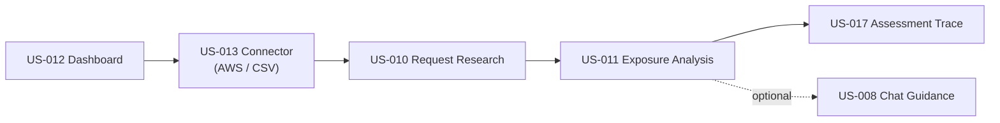

# Dux Product Overview

## Summary

The canonical statement of what Dux is, what ships at Gate 1, and what is deliberately fenced beyond it — the parent spec for all BRs. Owner: Founder. Status: canonical, Gate 1. Decisions: D-3, D-4, D-7, D-17, D-36, H1, H4, H5.

## Executive Summary

Dux is a per-environment, attacker-minded reasoning system that decides what is *actually exploitable* in a customer's live environment and the fastest path to protection — defensive only, never PTaaS or scanner replacement. Three of five canonical write actions (`network.blocklist_add`, `ticket.create_remediation` live at Gate 1; `policy.deploy_device_config` once its Gate-3/W2 Intune connector ships) execute unattended by default, with human review reserved for anomaly escalation; the other two (`endpoint.isolate`, `patch.deploy_special_devices`) are mandatory-HITL until each earns unattended execution via a field-proven safety record (D-17). The product's operating principle (GCIS v2.2) is to close every claim↔capability gap by raising the design to the claim rather than narrowing the claim — all eight core capabilities are live at Gate 1, with only preference learning and physical residency still fenced. Gate 1 review (Week 12) is the load-bearing milestone: it gates on golden-set accuracy, cross-tenant isolation, cost ceiling, and HITL surface readiness simultaneously, not on any single metric. Capacity is resolved at ~98% of the re-baselined envelope with no additional hires, and the 16-week calendar interlocks tightly with two external legal deadlines (EU AI Act counsel opinion, Langfuse DPA).

## Specification

### Five delivery pillars

| Pillar | Delivers | Canonical spec |
|---|---|---|
| A — Moat | World Model, eval, personalization | data-model, taxonomy, US-017 / US-009 |
| B — Safety scales with autonomy | governance kernel, kill switch, CaMeL, anomaly-escalation HITL | 40-ai-safety |
| C — Claim ↔ capability firewall | claims traceability, gate-safe copy | gtm-guardrails |
| D — Isolation + compliance invariants | RLS FORCE, composite keys, SOC 2 / ISO | multi-tenancy, compliance-program |
| E — Extensibility spine | the 8-part contract, catalogs-as-manifest | catalogs |

### Write-action autonomy (D-17)

| Action | Gate-1 posture |
|---|---|
| `network.blocklist_add` | unattended by default, live at Gate 1 |
| `ticket.create_remediation` | unattended by default, live at Gate 1 |
| `policy.deploy_device_config` | unattended posture activates only once the Gate-3/W2 Intune connector ships |
| `endpoint.isolate` | mandatory HITL every call |
| `patch.deploy_special_devices` | mandatory HITL every call |

### Eight core capabilities (all live at Gate 1)

| # | Capability | BR | Gate-1 delivery | Fenced beyond Gate 1 |
|---|---|---|---|---|
| 1 | AI-driven exploitability analysis | BR-002 | Full: prerequisite analysis, environmental evidence, executed investigation code in traces | — |
| 2 | Vulnerability → asset → control mapping | BR-002 | Attack paths + AWS security groups + vendor control panels (CrowdStrike live; Intune Gate 3/W2) | — |
| 3 | Lightweight mitigation | BR-002 | Unattended-by-default action cards (US-004, US-016) | — |
| 4 | Config-change recommendations vs. patching | BR-002 | Control refinements live (US-005) | Closed-loop validation → Gate 3 |
| 5 | Remediation acceleration | BR-002 | Ticket create + route, unattended (US-018) | Closed-loop automation → Gate 3 (US-019) |
| 6 | Automated asset tagging/ownership | BR-004 | Ownership inference live — ServiceNow, Entra (US-007) | Preference-driven refinement → Gate 2c |
| 7 | Multi-source data aggregation | BR-004 | AWS + NVD/KEV/EPSS + CSV + ≥3 vendor connectors | Full 42-source taxonomy → waves W2/W3 |
| 8 | Exploitability-based prioritization | BR-002 | Mitigation queue + exposure states | Preference learning → Gate 2c |

### Agent operational loop (four steps, all Gate 1)

1. Continuously analyze vulnerabilities across connected environments.
2. Determine whether existing tools/config already block the attack path.
3. Surface lightweight mitigations faster than a full patch.
4. Route focused remediation to the right stakeholders.

Steps 3–4 execute unattended by default for the three earned-autonomy actions; human review fires only on anomaly escalation.

### Personas

**Agent persona — [[Dux Agent]]:** "Aggressive Exposure Management Specialist" — calm, logical, humble, transparency-focused, citation-first.

| Human persona | Goal | Primary stories |
|---|---|---|
| Security engineer (primary) | Cut queue from thousands to tens | US-001, US-010, US-011, US-008 |
| CISO / security leader (buyer) | Board-ready validated risk reduction | US-006, US-012 |
| AI Safety Lead | Agent halt authority (<5 s kill switch) | US-014 |
| DevOps / SRE | Fix without breaking deploys | US-007, US-018 |
| Tenant admin | Users, connectors, agent policy, export | US-013, US-014 |
| API consumer | Assessments + webhooks (JWT); Seed public data API | US-014, US-024 |

### Navigation → user-story map (eight-icon sidebar)

| Nav | Page title | User stories |
|---|---|---|
| Dashboard | Home / Exposure Overview | US-012 (+ US-006) |
| Apps | Connector Hub | US-013 |
| Security | Investigation stepper | US-001; US-002–007, US-009 |
| Exposure | Exposure Analysis / CVE Detail | US-011 (+ US-017) |
| Mitigation | Research Dashboard / Vulnerability Reduction | US-010 |
| Fast Actions | One-Click Mitigations | US-016 |
| Settings | Tenant Administration | US-014 |
| Help | Help & Support | US-015 |

**The nav-label vs. page-title split, and Mitigation-nav vs. Mitigate-stage distinction, are canonical in [[Dux Taxonomy and Controlled Vocabulary]]** — easy to conflate, must not be.

### Phase-1 gate model

| Gate | Meaning | Exit criteria |
|---|---|---|
| Vertical slice (Week 6) | One CVE → one agent → one conclusion → one UI view | SIGKILL durability; governance gates live (Intent, Budget, ActionBudget, CostForecast); 2+ design partners; 10 test CVEs with traces |
| **Gate 1 review (Week 12)** | Full Phase-1 pipeline, hardened | >80% golden-set accuracy on held-out (CVE × environment) pairs (H1); zero cross-tenant fuzz reads; zero Critical findings in adversarial suite; **<$0.75 per workflow** (D-3); 2+ committed design partners; anomaly-escalation approve/deny surface live with impact preview (H4); LLM09 citation gate green |
| Phase-1 exit (Week 16) | Production beta | Customer data flowing 2+ weeks; sustained >80% held-out accuracy; false negatives <5%; OWASP LLM/Agentic assessments Partial or better |
| Gate 2a/2b/2c | Seed activation / GTM / vendor-screen expansion | operations-overview |
| Gate 3 | Closed-loop mitigation validation (US-019) | Field-proven action-safety record |
| Gate 5 | Optional physical residency | Signed on-prem contract |

**Release milestones (16-week calendar, D-7 R1):**

| Week | Milestone |
|---|---|
| 2 | Infrastructure skeleton + isolation harness |
| 4 | PgBouncer pooling fuzz; `test:fuzz-tenant-id` merge-blocking |
| 6 | Vertical slice + EU AI Act counsel opinion (blocks EU tenant provisioning; falls near 2026-07-28, ahead of the 2 Aug 2026 Article 50 transparency deadline, D-26) |
| 8 | Internal dogfood (2 tenants); internal `/api/docs` (Redoc); HITL approval API; Langfuse DPA (blocks production traces) |
| 12 | Gate 1 review + minimal HITL approve/deny UI |
| 14 | `chat_write_tools` + full chat HITL UI |

**Abort rule:** switch the inner framework if the golden set regresses by more than 2%.

### Capacity (D-19, D-23)

Backlog consumes **2,040 h** against the re-baselined **2,080 h** envelope (~98%, a 40 h buffer) — 26 focused h/week, same 5-engineer team, no sixth hire. Gate-1 Week 12 and exit Week 16 timing unchanged.

### Explicitly out of scope for Phase 1

| Item | Where it lands |
|---|---|
| Closed-loop mitigation validation / re-verification (US-019) | Gate 3 (unattended write *execution* is in scope at Gate 1) |
| Preference **learning** refinement | Gate 2c |
| Azure / GCP discovery | Phase 2 |
| Enterprise SSO / SCIM | Seed trigger |
| OT / IoT discovery | Phase 2+ |
| On-prem / air-gapped physical residency | Gate 5 |
| Predictive risk forecasting (US-028, BR-013) | Gate 2 (funded, D-36) |
| Financial-impact quantification | Phase 3 |
| Native mobile app | Series A |
| **Scanner replacement, and PTaaS** | permanent non-goals |

### Canonical end-to-end path (demo / POC)

US-012 Dashboard → US-013 AWS connector (or CSV) → US-010 Request Research → US-011 Exposure Analysis → US-017 trace → optionally US-008 Chat Guidance. The story: "thousands → tens" — scanner findings become a small set of evidence-backed action groups.

## Diagram

## Entities & Concepts

- [[Dux Agent]] — the product persona this spec defines
- [[Governance Kernel]] — backstops the unattended write path (D-17)
- [[Kill Switch]] — the AI Safety Lead's halt authority (US-014)
- [[World Model]] — underlies Pillar A (the moat)
- [[Dux Taxonomy and Controlled Vocabulary]] — nav-label / stage-naming discipline
- [[Dux Catalogs — Registries of Record]] — the 8-part extensibility contract (Pillar E)

## Related

- [[Dux Product Area]]
- [[Dux Overview]]
- [[Security Stepper]], [[Exposure Analysis]], [[Assessment Trace]], [[Chat Guidance]] — the canonical end-to-end path
- [[Mitigation & Remediation Write Path]] — the write-action autonomy model this spec defines
- [[Dux Traceability Matrix]]

## Sources

- `.raw/dux/10-product/product-overview.md`
