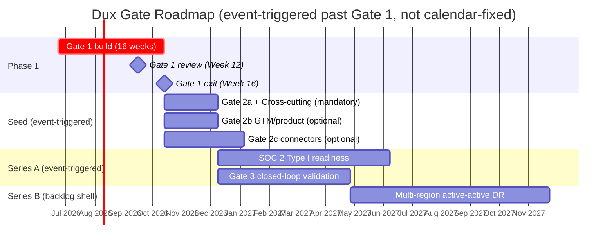

# Dux Roadmap

## Summary

The gate-based product and company roadmap, synthesized from the product gate model, operational activation criteria, and governance triggers. Owner: Founder + CTO. Status: canonical (gate structure), forward-looking (Series A/B dates).

## Executive Summary

Dux's roadmap is **gate-based, not date-based, past Gate 1** — each gate (2 through 5) activates on a named event or criteria set (a signed contract, a trigger threshold, a company-signal like headcount), never on a calendar quarter. This is a deliberate discipline documented throughout the corpus: "activate on events, not on the calendar." **RICE scoring (Reach/Impact/Confidence/Effort) does not exist anywhere in the ingested corpus — source data needed.** The corpus instead prioritizes via a P0/P1/P2 severity scheme tied to BR (Business Requirement) IDs and gate-blocking status, which this roadmap uses in RICE's place rather than inventing scores that were never computed.

## Specification

### Gate model (Phase 1 = Gates 1-2)

| Gate | What it means | Trigger |
|---|---|---|
| Gate 1 | Core pipeline live: Analyze -> Mitigate -> Remediate, unattended by default | Week 12 review, Week 16 exit (16-week Phase 1, envelope 2,160h) |
| Gate 2a | Production infrastructure (mandatory) | K8s deploy, observability, on-call named, DR posture |
| Gate 2 Cross-cutting (mandatory) | Kill switch tested, self-hosted Firecracker live, SLO alerts, isolation green | co-gates with 2a |
| Gate 2b | GTM/product readiness (optional, doesn't block seed) | Stripe SKUs, counsel-approved MSA/SLA |
| Gate 2c | Connector rollout (optional) | vendor-dependent screens |
| Gate 3 | Closed-loop mitigation validation | US-019; amends SOC 2 scope |
| Gate 5 | Optional physical residency (in-VPC agent) | signed on-prem contract |

### Priority scheme (in place of RICE — not invented)

| Tier | Meaning |
|---|---|
| P0 | blocks a Gate-1 ship, or a live legal/compliance exposure |
| P1 | blocks a plan, a date, or an external commitment already made |
| P2 | spec debt — real, but nothing currently unsafe or over-promised |

Cross-referenced against the epic-level BR IDs in [[Dux Portfolio]] and the open-item severities in [[Open Items Register]].

### Post-Gate-2 triggers (Series A)

| Trigger | Unlocks |
|---|---|
| First enterprise prospect requiring SOC 2 | SOC 2 Type I readiness (months 9-12) |
| First EU prospect | EU AI Act Art. 9, Azure OpenAI EU routing |
| NHI inventory above 500 | NHI policy formalization |
| Throughput >=500 assessments/day or Temporal spend >$500/mo for 30 days | `WorkflowPort` graduate spike evaluation |

### Series B forward (backlog shell — not committed)

Multi-region active-active DR (<1h RTO target), outcome-based Enterprise pricing default, ERM/TPRM maturation. See [[Series B Scale Programs]] for the full maturity table — most sections there are explicitly planning placeholders, not committed roadmap.

### Decision log

Every gate-timeline and capacity change in this roadmap traces to a dated decision in [[Dux Decisions Log]] — most notably the three capacity-envelope re-baselines (D-7 R1: 2,000h; D-23: 2,080h; D-40: 2,160h) and the three-pivot infrastructure sequence (D-33/D-34/D-35) that reshaped the Gate-1 build without moving the Week-12/16 dates.

## Diagram

## Entities & Concepts

- [[Dux Product Overview]] — the full gate model and capability list
- [[Dux Portfolio]] — epic-level hour and priority detail behind Gate 1
- [[Compliance Program]] — the event triggers behind Series A governance work

## Related

- [[Product Hub]]
- [[Dux Decisions Log]]

## Sources

- `.raw/dux/10-product/product-overview.md`
- `.raw/dux/60-operations/operations-overview.md`
- `.raw/dux/70-governance/compliance-program.md`
- `.raw/dux/70-governance/series-b-scale.md`
- `.raw/dux/90-execution/README.md`
