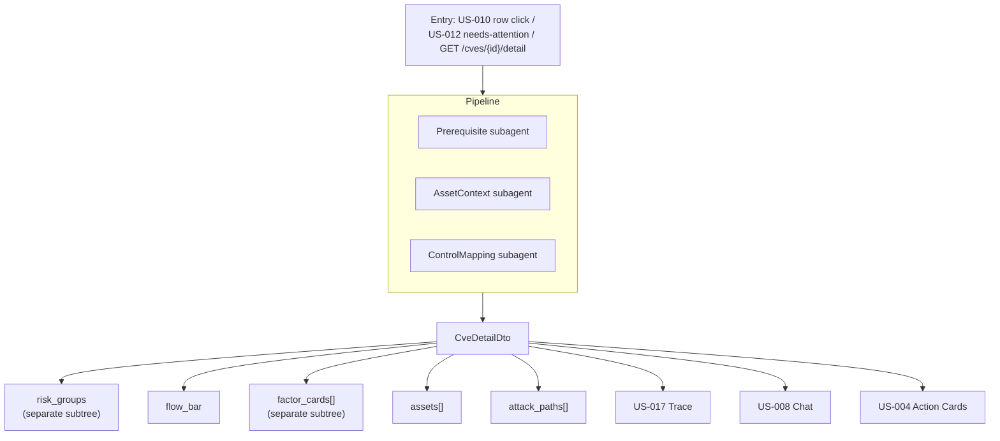

# Exposure Analysis

## Summary

US-011 — the per-CVE drill-down producing a defensible exploitability verdict, backed by AWS security-group or assessment-logic evidence. Owner: Engineering. Status: canonical, Gate 1. Epic: EP-05. BRs: BR-002, BR-004. The primary Analyze drill-down surface.

## Executive Summary

Exposure Analysis is where the assessment pipeline's output becomes a single defensible verdict a security engineer can act on: severity badges, risk groups, flow bar, mitigation factor cards, asset table, and attack paths, running the Prerequisite/AssetContext/ControlMapping subagents. The spec is emphatic that three taxonomies living in this DTO must never be merged — a risk group, an exposure state, and a factor card are three separate things in separate DTO subtrees, echoing the taxonomy note's layered exploitability model. The reference-UI demo numbers embedded in the Figma spec (8,341 researched; a 74.3/15.6/10.1% split; 78% certainty) are explicitly illustrative, not measured product metrics, and must not be cited as real figures. NFR-013 sets a hard performance bar — p95 <500 ms at 1 K assets — that anchors this as a low-latency read path even though it aggregates across four subagents' worth of evidence.

## Specification

**Job.** A security engineer drills into a single CVE: severity badges, risk groups, flow bar, mitigation factor cards, asset table, and attack paths — ending in a defensible verdict.

**Journey.** Entry: US-010 row click, US-012 needs-attention table, or `GET /cves/{id}/detail`. Exit: US-017 trace panel, US-008 chat, or US-004 action cards.

**Orchestration.** Full assessment pipeline — Prerequisite, AssetContext, and ControlMapping subagents (per the agent orchestration loop). Factor cards come from the `factor_type` catalog. Sources: MCP NVD, AWS APIs, assessment logic.

**API.** `GET /cves/{id}/detail` → `CveDetailDto` (`CVEDetailQuery` / `ExposureProjection`):

| Field | Contents |
|---|---|
| header | CVSS, EPSS, KEV |
| `risk_groups` | group breakdown |
| `flow_bar` | pipeline state |
| `factor_cards[]` | mitigation factors |
| `assets[]` | affected assets |
| `attack_paths[]` | reachability paths |

**The three taxonomies live in separate DTO subtrees and must not be merged: a risk group is not an exposure state, and neither is a factor card.**

Also: `GET /attack-paths`, `GET /assessments/{id}`. Export and Audit Log actions exposed on the view. **NFR-013: p95 <500 ms at 1 K assets.**

**Factor cards at Gate 1:**

| Card | Status |
|---|---|
| `aws_sg_blocks_port` | live |
| `product_not_affected` | live |
| `network_reachability` | partial |
| `firewall_blocks_exploitation` | live at Gate 1 (CrowdStrike) |
| `process_not_listening` | Gate 5 |

See [[Dux Taxonomy and Controlled Vocabulary]] §4.

**Safety.** Cross-tenant `GET /cves/{id}` returns **404**. With AWS absent, factor cards show assessment logic only. **KS-L1** halts the in-flight assessment for the session.

**Metrics.** Assessment confidence distribution; factor-card coverage; attack-path query latency; drill-down → trace open rate; golden-set exploitability accuracy.

**Marketing map.** "Determines what's viable for an attacker" (BusinessWire); "maps how every vulnerability, asset, and control connects" — capability #2. Vendor cards backed by live connectors at Gate 1 (ADR-011 R2).

### Risk-group icons

Distinct from the four exposure-state instance icons:

| Icon | Meaning |
|---|---|
| Crossed eye | high-risk group |
| Umbrella | medium |
| Tree | low or mitigated |

Appear on group-breakdown rows.

### UI mode

Full-width structured drill-down, confirmed in June-2026 Figma. Flow bar and asset table both required.

**The reference UI demo numbers are illustrative, not measured** — 8,341 researched; a 74.3 / 15.6 / 10.1% split; 78% certainty. Not product metrics; must not be cited as such.

## Diagram

## Entities & Concepts

- [[Dux Agent]] — runs the three subagents behind this drill-down
- [[Kill Switch]] — KS-L1 halts an in-flight assessment
- [[Dux Taxonomy and Controlled Vocabulary]] — owns the factor-card and exposure-state definitions this DTO projects

## Related

- [[Assessment Trace]] — the exit path for "why" this verdict was reached
- [[Security Stepper]] — US-001–007 feed the evidence this view aggregates
- [[Connector Hub]] — AWS/CrowdStrike evidence sources
- [[Dux Product Area]]
- [[Dux Overview]]

## Sources

- `.raw/dux/10-product/features/exposure-analysis.md`
