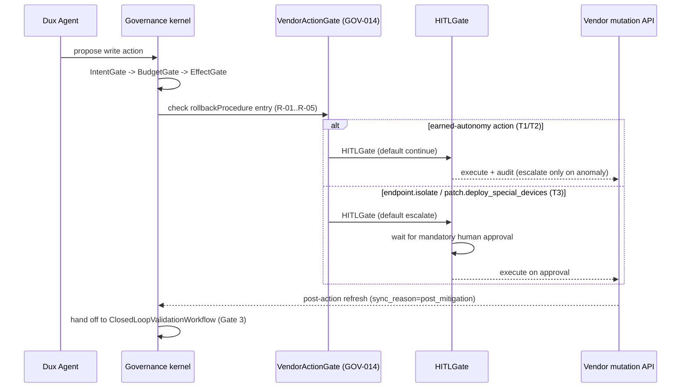

# Mitigation & Remediation Write Path

## Summary

US-004 (Action Cards), US-016 (Fast Actions), US-018 (Remediation Ticket Panel), and US-019 (Mitigation Validation Panel) — the surfaces that take action in the customer's environment. Owner: Engineering. Status: canonical. US-004/016/018 live at Gate 1; US-019 is Gate 3, draft. Epic: EP-06. BRs: BR-002, BR-003. Decisions: D-4, D-10, D-15, D-17, H4, H5.

## Executive Summary

This is the canonical spec for Dux's entire write surface, and its central fact is the D-17 earned-autonomy split: `network.blocklist_add`, `policy.deploy_device_config` (once Intune ships), and `ticket.create_remediation` execute unattended by default at Gate 1, with human review reserved for anomaly escalation (a confidence abstention, a sandbox failure, or a T4 outlier); `endpoint.isolate` and `patch.deploy_special_devices` require mandatory HITL on every call until each earns unattended execution via a field-proven Gate-3 safety record. Every write, regardless of autonomy tier, flows through the same governance-kernel chain (`IntentGate → BudgetGate → EffectGate → VendorActionGate → HITLGate`) and requires a `rollbackProcedure` URL in its audit/HITL payload — the rollback catalog (R-01…R-05) is what makes unattended execution defensible, since `VendorActionGate` (GOV-014) refuses to authorize unattended execution of any action whose rollback entry is missing. `patch.deploy_special_devices` is the interesting edge case: firmware-only devices have no API-level rollback at all, which is precisely why GOV-TOOL-04 holds that case to mandatory HITL rather than letting it run unattended without an undo path. The marketing-claim discipline in this file is exact: "lightweight mitigations" and "rapid remediation" are claim-safe at Gate 1 without caveat because the write path executes at Gate 1, but any "self-healing" or "fully automated remediation" claim still needs a Gate-3 qualifier, because confirming the action worked (closed-loop validation, US-019) is a separate, later gate from acting.

## Specification

### Write-action posture (D-17)

| Action | Tier | Posture |
|---|---|---|
| `endpoint.isolate` | T3 | mandatory HITL every call |
| `network.blocklist_add` | T2 | unattended by default |
| `policy.deploy_device_config` | T2 | unattended by default (once Intune connector ships) |
| `patch.deploy_special_devices` | T3 | mandatory HITL (no API rollback + D-17) |
| `ticket.create_remediation` | T1 | unattended by default (lowest blast radius) |

### US-016 Fast Actions (Gate 1)

**Job.** One-click lightweight mitigations on approved findings.

**Delivery.** `POST /fast-actions` → `QuickMitigationWorkflow`. The three earned-autonomy actions execute immediately, audit-logged and kill-switch-covered. `endpoint.isolate`/`patch.deploy_special_devices` raise a live HITL request and wait. Action cards (SIEM query copy, ticket text, numbered steps) remain a manual fallback.

**Read contract.** Filtered view of the existing US-004 mechanism: `?projection=action_cards&eligible_for=fast_action` — not a dedicated endpoint. Row fields: `canonical_action_id`, target `cve_id`/`finding_id`, `blast_radius`, `hitl_tier`, `status` (`pending` \| `executed` \| `blocked`).

**Safety.** Governance kernel + kill switch gate execution (**KS-L2** blocks enqueue). HITL fires only on anomaly for the three earned-autonomy actions.

### US-004 Action Cards (Gate 1)

Canonical spec; journey summary in [[Security Stepper]] Step 4.

**Job.** Surface and execute lightweight mitigations — blocklist at Gate 1, Intune policy steps once W2 connector lands — faster than a full patch, with a residual-risk count.

**Orchestration.** Mitigation-recommendation activity, or `QuickMitigationWorkflow`. MCP write tools execute through the governance kernel. HITL tiers T2/T3 classify each action for audit and escalation on the three earned-autonomy actions; T3 is a mandatory pre-approval gate on `endpoint.isolate`. Agent: AI #4.

**API.** `?projection=action_cards`. `POST /mitigations` executes through `VendorActionGate`. Webhooks: `mitigation.executed`, `mitigation.blocked`.

**Safety.** Write tools require governance-kernel gates + kill switch. HITL escalates only on anomaly for the three earned-autonomy actions; mandatory gate (not escalation) for `endpoint.isolate`/`patch.deploy_special_devices`. **KS-L2** blocks new proposals.

### US-018 Remediation Ticket Panel (Gate 1 for create and route, unattended by default)

**Job.** A security engineer sees a ServiceNow/ITSM ticket created from Exposure or Chat, with an assignee and an SLA.

**Orchestration.** `RemediationWorkflow` creates and routes tickets automatically — T1, lowest blast radius. Status updates arrive by webhook. Canonical action: `ticket.create_remediation`. Unattended closed-loop auto-close remains **Gate 3** (US-019).

**API.** Gate-1 create/route endpoints. Webhooks: `remediation.ticket_created`, `ticket.created`/`updated`/`resolved`/`reopened`. Data: `REMEDIATION_TICKET`.

**Safety.** A ticket write failure enters a retry saga and is audited. External writes use step-effect idempotency (`mutation_key` + resume-time reconciliation). **KS-L2** prevents new ticket creation.

### US-019 Mitigation Validation Panel (Gate 3, draft)

**Job.** Confirm post-mitigation exposure actually dropped, by re-assessing — the closed loop.

**Orchestration.** `ClosedLoopValidationWorkflow` (FR-012) triggers re-assessment. Pass/fail badge lands on the US-004 card; residual count updates US-011. Flag: `closed_loop_validation`.

**Safety.** A failed validation escalates to HITL. **A finding is never auto-closed on a timeout alone.**

### Write-path mechanics (every write action)

1. **Governance kernel chain:** `IntentGate → BudgetGate → EffectGate → VendorActionGate → HITLGate`. `HITLGate` defaults to `continue` (execute and audit, `escalate` only on anomaly) for the three earned-autonomy actions; defaults to `escalate` on every call for `endpoint.isolate`/`patch.deploy_special_devices` (D-17).
2. **`VendorActionGate`** maps `canonical_action_id → native_action_name`, persists both in `VendorActionExecution` audit records. Connectors must not call vendor mutation APIs.
3. **HITL tiers (T1–T3)** classify every action for audit/escalation. SSE `hitl_request`/POST `hitl_response` fires only on escalation for earned-autonomy actions, and on every call for `endpoint.isolate`/`patch.deploy_special_devices` — the **`rollbackProcedure` URL is required in the payload regardless of HITL posture**.
4. **Post-action refresh:** persist execution → targeted connector delta sync (`sync_reason=post_mitigation`) → hand off to `ClosedLoopValidationWorkflow` (Gate 3).

### Marketing reconciliation

"Lightweight mitigations" and "rapid remediation" are claim-safe at Gate 1 without a caveat — the write path executes at Gate 1. Gate 3 refers specifically to closed-loop validation (US-019): a "self-healing"/"fully automated remediation" claim still needs that qualifier — at Gate 1 Dux acts; confirming the action worked is Gate 3.

### Rollback catalog

Every `rollbackProcedure` URL resolves to one of five entries. `VendorActionGate` (GOV-014) will not authorize unattended execution of an action whose entry is missing.

| ID | Action | Compensating procedure | Trigger |
|---|---|---|---|
| R-01 | `endpoint.isolate` | `endpoint.restore_network` via the same EDR adapter — restores pre-isolation network policy, keyed by the isolation's `mutation_key` for idempotent reversal | HITL rejection, T3 escalation resolved "false positive", or customer-initiated rollback from Tenant Settings |
| R-02 | `network.blocklist_add` | `network.blocklist_remove` — reverts the specific rule by vendor-native rule ID persisted in the audit record; never a broader "flush blocklist" | same |
| R-03 | `policy.deploy_device_config` | `policy.restore_previous_config` — redeploys the device's prior config snapshot, captured immediately before deployment | same |
| R-04 | `patch.deploy_special_devices` | `patch.rollback_to_prior_version` where supported. **Firmware-only devices have no API-level rollback** — manual runbook; GOV-TOOL-04 holds this case to mandatory HITL rather than unattended execution without an undo path | same, or a post-patch device-health check failure |
| R-05 | `ticket.create_remediation` | `ticket.cancel` — closes with reason `superseded_by_rollback`; no environment state to revert | HITL rejection or duplicate-ticket detection |

### Gate-3 remediation orchestration

Evaluation framework (candidate, criteria C1–C5, fallback order) defined in ADR-012 §Gate-3 remediation orchestration — resolves OI-29. The spike against C1–C5 is Gate-3-scoped backlog work under EP-06, not yet run.

## Diagram

## Entities & Concepts

- [[Dux Agent]] — the actor proposing every write
- [[Governance Kernel]] — the gate chain and `VendorActionGate`; owns the rollback-catalog cross-reference (already documented in that note)
- [[Kill Switch]] — KS-L2 blocks enqueue/new proposals across every write surface
- [[Dux Catalogs — Registries of Record]] — the vendor-action catalog (§6) this spec's action table extends

## Related

- [[Chat Guidance]] — the stricter, always-mandatory-HITL write surface this file's actions contrast with
- [[Security Stepper]] — US-004 journey summary at Step 4
- [[Dux Product Area]]
- [[Dux Overview]]

## Sources

- `.raw/dux/10-product/features/mitigation-write-path.md`
