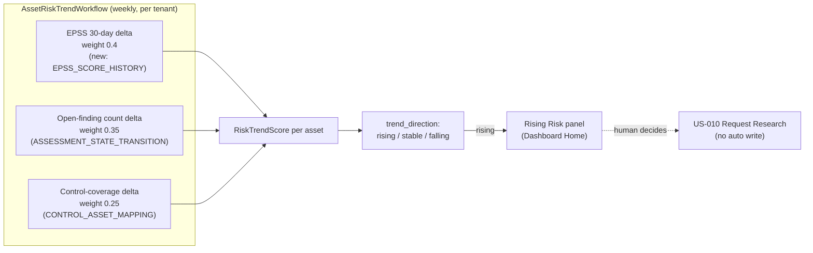

# Predictive Risk Forecasting

## Summary

US-028 (Asset Risk Trend Forecast, E4) — answers "which assets are likely to become risky in the future." Owner: Founder. Status: **draft**, **Gate 2** (not Gate 1 — the rest of the product-area corpus is canonical/Gate 1; this feature is not). Epic: EP-03 (F04). BR: BR-013. FR-030. Flag: `risk_trend_forecasting` (Gate 2, default off). Decisions: D-24, D-36.

## Executive Summary

This feature is a committed-but-not-yet-built roadmap capability, funded at Gate-2 as of 2026-07-20 (D-36) — the 8 h `EP-03-F04-T01` task funded *authoring this spec*, not implementation; sizing implementation hours is Engineering's Gate-2 planning-pass task, described explicitly as a scheduling step rather than an open funding question. Its most important design constraint is stated as a deliberate discipline, not an apology: it is a velocity computation over evidence Dux already ingests, not a new ML model and not a composite risk score — the same anti-composite-score discipline the taxonomy note already applies to exploitability confidence. Output is a direction (`rising`/`stable`/`falling`) plus an inspectable contributing-factor breakdown, never a bare percentage framed as a probability, and safety is enforced by construction: no write action is ever triggered by a trend alone, so it can never reach `VendorActionGate`. It ships mostly on existing infrastructure (ADR-016's Continuous Assessment Engine, the World Model, existing EPSS ingest) plus exactly one new artifact, `EPSS_SCORE_HISTORY` — the corpus is explicit that this is not a new subsystem.

## Specification

**Nav:** Dashboard — a new "Rising Risk" panel on Dashboard Home (US-012), a cross-asset aggregate view distinct from US-011's per-CVE Exposure Analysis.

**Job.** A security engineer or CISO sees which assets are trending toward higher risk — before a new CVE is confirmed exploitable against them — so hardening work is prioritized ahead of an incident, not just in reaction to one.

### Design principle: trend, not a new model

Not a new ML model, not a composite CVSS×EPSS×criticality×exposure score — the same discipline `taxonomy.md`'s confidence-scoring section already applies to exploitability verdicts (a fabricated single number misrepresents what the system actually knows). It surfaces which signals are moving, in what direction.

### Orchestration

`AssetRiskTrendWorkflow` (Temporal), scheduled **weekly** per tenant (reuses ADR-016's scheduled-sweep mechanism; lower cadence than the 24 h continuous-assessment default). Computes a `RiskTrendScore` per asset from three signals:

| Signal | Weight | Source |
|---|---|---|
| EPSS 30-day delta, summed across the asset's open findings | 0.4 | **new:** `EPSS_SCORE_HISTORY` |
| Open-finding count, 30-day delta | 0.35 | existing `FINDING.state` transitions, via `ASSESSMENT_STATE_TRANSITION` |
| Control-coverage delta (`Protected` → `Partially Mitigated`/`Exposed`, US-003) | 0.25 | existing `CONTROL_ASSET_MAPPING` |

**Direction, not a probability.** Output: `rising` / `stable` / `falling` plus contributing-factor breakdown — never a percentage framed as a likelihood.

### Data — new entity

`EPSS_SCORE_HISTORY` *(global, like `EPSS_SCORE`)*: `cve_id`, `epss_score`, `percentile`, `snapshot_date`. Appended daily alongside the existing `EPSS_SCORE` upsert (ADR-016's ingest path); retained **90 days rolling**, matching the trend window. The one net-new piece of infrastructure this feature requires.

### API

`GET /assets/risk-trend` → `AssetRiskTrendDto[]`:

| Field | Shape |
|---|---|
| `asset_id`, `hostname` | denormalized `ASSET` fields |
| `trend_direction` | `rising` \| `stable` \| `falling` |
| `trend_score` | 0.0–1.0, magnitude only — not exposed as a probability |
| `contributing_factors[]` | `{signal, delta, weight}` — the three rows above, inspectable ranking |
| `as_of` | ISO 8601 |

Sorted `rising` first, by `trend_score` descending.

### Safety

No write action is ever triggered by a trend alone — `rising` surfaces a prioritization signal on the dashboard; it does not enqueue an assessment, open a ticket, or feed `VendorActionGate`. A rising trend is a prompt for a human to *request* research (US-010), same as any other queue entry.

### Marketing reconciliation

"Which assets are likely to become risky" (E4) is claim-safe once this ships — answered literally, using Dux's own reasoning/evidence discipline rather than a claimed predictive model. GTM copy must not describe this as "AI predicts your next breach" — it is a trend surfaced from real evidence, described the same way the rest of the corpus describes every other output: inspectable, not magic.

### Funding status

**Funded at Gate-2 (2026-07-20, D-36).** The 8 h `EP-03-F04-T01` task funded *authoring this spec*; the feature itself is committed for the Gate-2 backlog. Sizing implementation hours for `backlog-ep03.md` is Engineering's Gate-2 planning-pass task — a scheduling step, not an open funding question.

## Diagram

## Entities & Concepts

- [[Dux Agent]] — not itself the actor here; this is a scheduled Temporal workflow, not an agent reasoning loop
- [[World Model]] — the evidence substrate this trend computation reads from
- [[Dux Taxonomy and Controlled Vocabulary]] — source of the anti-composite-score discipline this feature inherits

## Related

- [[Continuous Re-Assessment]] — reuses ADR-016's scheduled-sweep mechanism at a lower cadence
- [[Dashboard Home & Audit]] — hosts the new "Rising Risk" panel
- [[Dux Product Area]]
- [[Dux Overview]]

## Sources

- `.raw/dux/10-product/features/predictive-risk-forecasting.md`
