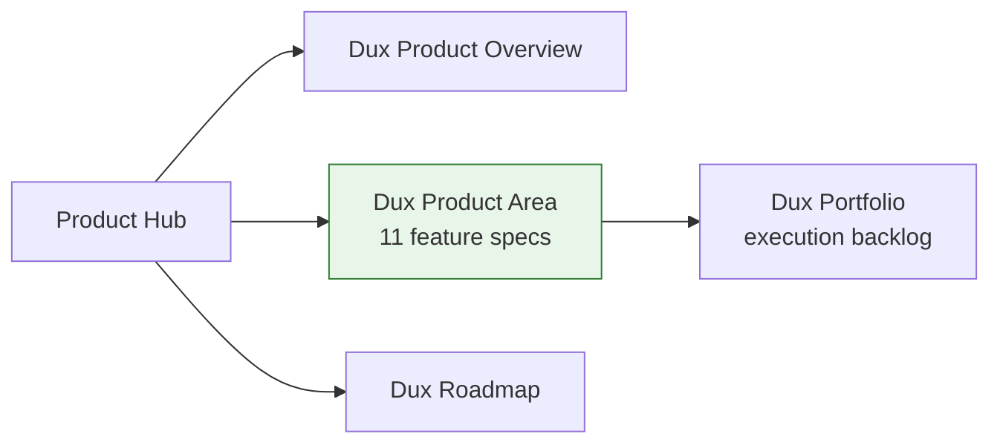

# Product Hub

Cross-cutting entry point for anyone approaching this vault by function ("I want product context") rather than by domain folder. For the full domain scope and standards, see **[[Dux Product Area]]** — this note is a role-based index into it and its closest neighbors.

## Core product

- [[Dux Product Overview]] — thesis, pillars, capabilities, personas, gate model
- [[Dux Product Area]] — the full 11-feature product domain index
- [[Dux Roadmap]] — quarterly/gate-based roadmap, decision log

## Registries this area depends on

- [[Dux Taxonomy and Controlled Vocabulary]]
- [[Dux Catalogs — Registries of Record]]
- [[Dux Traceability Matrix]]

## Execution

- [[Dux Portfolio]] — the 10-epic execution backlog behind this product

## Diagram

## Related

- [[Engineering Hub]]
- [[Growth Hub]]
