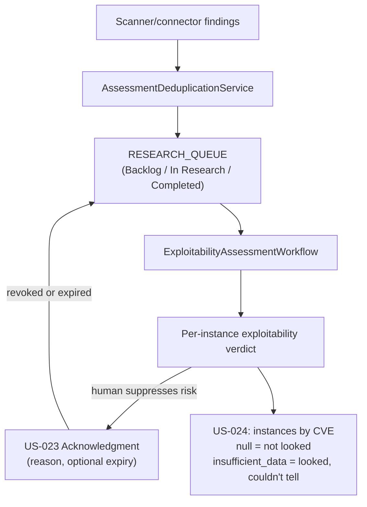

# Research Dashboard & Vulnerability Reduction

## Summary

US-010 (Research Dashboard), US-023 (Acknowledge Vulnerability Instance), and US-024 (Vulnerability Instances by CVE) — the queue surface tracking what the Dux Agent has researched, is researching, and has yet to reach, plus per-instance acknowledgment. Owner: Engineering. Status: canonical. US-010: Gate 1. US-023: Gate 1 for write, public read at Seed. US-024: UI at Gate 1, public API at Seed. Epics: EP-05, EP-09. BRs: BR-002, BR-010, BR-012.

## Executive Summary

**This is the Mitigation nav — the Analyze-stage research queue, not the Mitigate pipeline stage** — the single most common naming error in the corpus per the taxonomy note, and load-bearing for this file specifically since its whole job is queue visibility, not automation. US-010's success moment is the product's core value proposition made literal: thousands of alerts collapse to tens of actionable rows, each with evidence links, and queue rows are structured output, not chat. The reference funnel (8,341 → 2,143) illustrating that collapse is explicitly illustrative, not a measured result. US-023 draws a precise distinction from US-009 (natural-language preference rules) — acknowledgment is per-instance, with a reason and optional expiry, and its computed-field semantics matter: `is_acknowledged` is true only when an active acknowledgment exists (not revoked, and `expires_at` null or future), and a revoked or expired acknowledgment does **not** suppress alerts — the instance returns to queue elevation. US-024 draws an equally precise distinction between two null-like states that mean opposite things: `exploitability_status = null` means "we have not looked," while `insufficient_data` means "we looked and could not tell."

## Specification

### US-010 Research Dashboard (Gate 1)

**Job.** A security engineer or CISO tracks the Dux Agent queue — Completed, In Research, Backlog — reads Vulnerability Reduction metrics, and enqueues new investigations. Success: thousands of alerts collapse to tens of actionable rows, each with evidence links.

**Orchestration.** `POST /research/queue` → `ExploitabilityAssessmentWorkflow`, deduplicated by `AssessmentDeduplicationService`. Same agent stack as US-001 and US-011. Queue rows are structured output, not chat.

**Data.** `RESEARCH_QUEUE`, assessment statuses, `VulnerabilityReductionDto` aggregates, AWS + NVD/KEV outcomes. Continuous re-assessment feeds the queue through US-021 (Gate 1, ADR-016).

**API.**

| Surface | Contract |
|---|---|
| `GET /research/dashboard` | → `ResearchDashboardDto`: `vulnerability_reduction`, a 7-day calendar with per-user tooltip lines, `cve_rows`, `view_mode` (`by_cve` \| `by_asset` \| `by_instance`) |
| `GET /research/dashboard/stream` | SSE → `queue_row_update` patch, target **<1 s** |
| `POST /research/queue` | idempotent. Body `{cve_id}` or `{natural_language}` → `{assessment_id, status: queued \| deduplicated, queue_position}` |

**Safety.** **KS-L2** freezes the queue for the tenant. Stale intel marks pending rows `INSUFFICIENT_DATA`. Queue depth carries burn-rate SLO alerting.

**Metrics.** Queue depth by state; Vulnerability Reduction bar accuracy; Request Research latency; actionable-queue ratio (FR-006).

**Marketing map.** "Waste less time chasing noise", capability #8. **The 8,341 → 2,143 funnel is illustrative**, mapping to the US-010 buckets — it is not a measured result.

### US-023 Acknowledge Vulnerability Instance (Gate 1 write; public read at Seed)

**Job.** A security engineer accepts or suppresses risk on a specific vulnerability instance, with a reason, an optional expiry, and an audit trail. **This is not US-009** (natural-language preference rules) — this is per-instance acknowledgment.

**Orchestration.** No agent loop. The governance kernel writes `VULNERABILITY_INSTANCE_ACKNOWLEDGMENT` plus audit events.

**API.**

| Surface | Contract |
|---|---|
| `POST /vulnerability-instances/{id}/acknowledge` | body `{reason, expires_at?}` → `{acknowledgment_id, is_acknowledged: true, expires_at?}` |
| `DELETE …/acknowledge/{ack_id}` | revoke |
| `GET /v1/vulnerability-instances/{cve_id}` | public read exposes `is_acknowledged` |
| Webhooks | `vulnerability_instance.acknowledged`, `vulnerability_instance.acknowledgment_expired` |

An auto-expire job clears active acknowledgments past `expires_at`.

**`is_acknowledged` is computed:** true when an active acknowledgment exists — not revoked, and `expires_at` either null or in the future.

**Safety.** A revoked or expired acknowledgment **does not suppress alerts** — the instance returns to US-010 queue elevation. Cross-tenant acknowledgment returns **404**.

### US-024 Vulnerability Instances by CVE (UI at Gate 1; public API at Seed)

**Job.** List every instance of a CVE across assets, with its exploitability, reachability, and acknowledgment state.

**Orchestration.** A projection over the World Model plus the latest assessment per instance.

**API.** `GET /v1/vulnerability-instances/{cve_id}` — cursor pagination, `limit` **1–5000** (default **3000**), `expand=asset`. Batch enqueue: `POST /v1/cve-research` (**1–50**). UI uses `view_mode=by_instance` at Gate 1; public v1 surface lands at Seed.

**Edge case.** An unresearched CVE returns `exploitability_status = null` — **not** `insufficient_data`. Null means "we have not looked"; `insufficient_data` means "we looked and could not tell."

## Diagram

## Entities & Concepts

- [[Dux Agent]] — runs `ExploitabilityAssessmentWorkflow` behind the queue
- [[Kill Switch]] — KS-L2 freezes the queue per tenant
- [[Dux Taxonomy and Controlled Vocabulary]] — owns the Mitigation-nav vs. Mitigate-stage naming distinction this file's identity depends on

## Related

- [[Continuous Re-Assessment]] — feeds this queue via US-021
- [[Exposure Analysis]] — the drill-down target from a queue row
- [[Dashboard Home & Audit]] — the 7-day queue calendar this file owns, distinct from the audit-log date picker
- [[Dux Product Area]]
- [[Dux Overview]]

## Sources

- `.raw/dux/10-product/features/research-dashboard.md`
