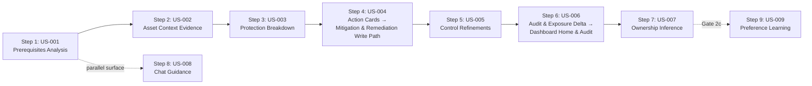

# Security Stepper

## Summary

US-001 through US-007 and US-009 — the investigation journey, from decomposing a CVE to routing the fix. (Step 8, US-008 conversational investigation, is a separate spec: [[Chat Guidance]].) Owner: Engineering. Status: canonical. US-001–007 live at Gate 1 (read-only or unattended-by-default write per D-17); US-009 is Gate 2c, not promoted. Epics: EP-02, EP-03, EP-06, EP-10. BRs: BR-002, BR-004. Decisions: D-17, H5.

## Executive Summary

The stepper is Dux's seven-plus-one-step investigation journey, and this file is deliberately a mix of canonical specs (US-001, US-002, US-003, US-007, US-009) and journey-summary pointers to specs owned elsewhere (US-004 → [[Mitigation & Remediation Write Path]], US-006 → [[Dashboard Home & Audit]]) — the "Build rules" section exists specifically because two pairs of stories are easy for engineering to wrongly merge: US-006 (governance/audit trend) is not US-003 (live vendor control proof), and US-002 (the standalone CrowdStrike/Intune asset-context panel) is not US-011 (where per-asset AWS fields already live in the exposure-analysis asset table). A second discipline runs through every step: screens without a live connector render the full Figma layout with connector-degraded empty states, deep-linking to Connector Hub — they are never CTA-only shells. US-009 (Preference Learning) is the one story held back from Gate 1 for a data-availability reason rather than a build reason: `PreferenceEngine`'s influence on scoring weights needs tenant assessment history that simply doesn't exist yet at Gate 1, so the interim is session routing preferences (24 h TTL, in Chat Guidance) plus per-instance acknowledgment (US-023).

## Specification

### US-001 Prerequisites Analysis (Gate 1)

**Job.** Decompose a CVE into its real-world exploitation requisites, with cited sources.

**Orchestration.** `ExploitabilityAssessmentWorkflow` (Temporal), triggered on queue enqueue or CVE selection. The `prerequisite-extractor` subagent gathers NVD, GitHub, Metasploit, and Medium evidence through MCP read tools. The [[CaMeL]] S-LLM/P-LLM boundary sanitizes untrusted CVE text. Status streams live. Agent: AI #1 (REASONING).

**Data.** World Model `FINDING`, `CVE`, `EXPLOITABILITY_ASSESSMENT`, `ASSESSMENT_REASONING_STEP`. Degraded paths: a missing NVD record yields `INSUFFICIENT_DATA`; with AWS absent, prerequisites render from intel feeds alone.

**API.** `GET /assessments/{id}` → `AssessmentDto`. Trace: `GET /assessments/{id}/trace` (US-017).

**Safety.** **KS-L1** halts the session. Intel staler than **24 h** yields `INSUFFICIENT_DATA`. No HITL — read-only research.

**Metrics.** Completion rate; ≥4 prerequisite source slots (NVD mandatory); time-to-first-card p95; golden-set accuracy.

**Competitive.** Tenable Hexa AI orchestrates but ships no prerequisite decomposition with per-source citations. Strobes triages in seconds. Dux differentiates on the reasoning chain plus executed code (US-017).

### US-002 Asset Context Evidence (Gate 1, read-only)

**Job.** Prove or disprove environmental exploitability, using runtime, network, SIEM, and role evidence on a specific asset.

**Orchestration.** `AssetContextWorker`. MCP tools query:

| Source | Status | Evidence |
|---|---|---|
| CrowdStrike | live at Gate 1 (one of ADR-011 R2's ≥3 launch connectors) | endpoint state |
| AWS | live at Gate 1 | EC2 metadata, security-group reachability |
| Splunk | live at Gate 1 | SIEM process/runtime telemetry — e.g. listening-process evidence |
| Identity / role | live at Gate 1 | last-login, role — from US-007 ownership-evidence sources |
| Intune | **Gate 3 / wave W2** | connector-degraded empty state until then |

**API.** `GET /assets/{id}/context` → `AssetContextDto` (FR-020).

**Safety.** A stale connector yields `INSUFFICIENT_DATA`. Vendor fields are never fabricated. **KS-L2** stops new gathers; in-flight gathers complete, flagged as partial evidence.

### US-003 Protection Breakdown (Gate 1, read-only)

**Job.** Answer "where am I already protected?" with vendor control proof — CrowdStrike policies at Gate 1; Intune at Gate 3/W2. **Distinct from US-006** (see Build rules).

**Orchestration.** `control-mapping-worker` correlates findings to active controls. MCP pulls CrowdStrike policy state at Gate 1. Output: segment cards (Protected, Partially Mitigated, Exposed) + a settings/effect table.

**API.** `ProtectionBreakdownDto` via `?projection=protection` on `GET /cves/{id}/detail`. Also `GET /attack-paths` (AWS security groups + vendor).

**Data.** `CONTROL`, `CONTROL_MAPPING`.

### Step 4 — Action Cards (US-004) — journey summary only

**Gate 1.** Unattended by default for `network.blocklist_add`/`policy.deploy_device_config`; mandatory HITL for `endpoint.isolate`/`patch.deploy_special_devices` (D-17). **Canonical spec:** [[Mitigation & Remediation Write Path]]. Every write flows through `VendorActionGate`; T2/T3 tiers classify it for audit/escalation. **KS-L2** blocks new proposals. HITL fires only on anomaly escalation.

### US-005 Control Refinements (Gate 1)

**Job.** Surface the highest-impact estate-wide configuration changes — disable NTLM, enable IMDSv2 — ranked by exposure reduction.

**Orchestration.** `ControlRefinementQuery`, Specification pattern (`ByImpact`, `ByScanner`, `ByCVE`), aggregating across CVEs. Wiz ingest live at Gate 1 (FR-019); Qualys is Gate 3/W2.

**Ranking output carries an `effort` field** — S/M/L, sized by rollout scope not build cost: **S** a single-toggle config change on one control; **M** a staged change across a device/asset group; **L** an estate-wide policy rollout needing change-management sign-off. Exposure reduction ranks the queue; `effort` is a secondary column, not a tiebreaker the ranking uses.

**API.** `GET /controls/refinements`, or the refinement DTO via `?projection`. ERD entity: `ControlRefinementAggregate`, field `effort`.

### Step 6 — Audit & Exposure Delta (US-006) — journey summary only

**Gate 1**, governance and audit. **Canonical spec:** [[Dashboard Home & Audit]]. A CISO-facing, board-ready exposure trend: delta cards and a tamper-evident audit trail. **Not live vendor protection** — that's US-003 (see Build rules). No agent loop; a projection over assessment outcomes; the governance kernel writes hash-chained `AUDIT_EVENT` rows.

### US-007 Ownership Inference (Gate 1, read-only)

**Job.** Route remediation to the right team, with a certainty percentage and ITSM/identity evidence.

**Orchestration.** The ownership-inference activity. MCP reads ServiceNow and Entra ID, both live at Gate 1. Webhook: `ownership.inferred`. Agent: AI #7.

**API.** `OwnershipInferenceDto` (FR-016). Data: `OWNERSHIP_EVIDENCE`, `ASSET.owner_team`.

**Safety.** Certainty below threshold yields `INSUFFICIENT_DATA` + a manual-assign CTA. Auto-ticketing at Gate 1 creates and routes unattended (US-018).

### US-009 Preference Learning (Gate 2c — not promoted)

**Job.** A CISO teaches risk appetite in natural language, so future assessments respect scope.

**Why it stays at Gate 2c.** Needs behavioral-data volume: `PreferenceEngine`'s influence on scoring weights requires tenant assessment history that does not exist at Gate 1. Interim: session routing preferences (24 h TTL) plus per-instance acknowledgment (US-023).

**API.** `POST /preferences`, `GET /preferences` (FR-018). Data: `TENANT_PREFERENCE`, `PREFERENCE_RULE`.

**Safety.** Preference writes require tenant-admin or CISO role. Ambiguous natural language raises a clarification prompt — never a silent accept. **KS-L2** freezes updates.

### Build rules

**US-006 is not US-003. Engineering must not merge them.**

| Question | Story | Surface |
|---|---|---|
| "How is exposure trending?" — governance and audit | **US-006**, Gate 1 | score gauge, delta cards, 30-day hash-chained log, CSV export |
| "Am I still protected?" — live vendor control proof | **US-003**, Gate 1 | vendor policy state |

The CISO Gate-1 demo uses US-006 metrics plus US-011 AWS and vendor factor cards.

**US-002 is not US-011.** Per-asset AWS fields live in the US-011 asset table. The US-002 standalone panel hydrates from CrowdStrike (Gate 1) and Intune (Gate 3/W2, connector-degraded until then).

### Figma and interim design

US-001–009 confirmed in the June-2026 Figma set, screens 1–9. Vendor panels in US-002–005, US-007, and US-009 use connector-degraded empty states before hydration.

**Figma's "playbook cards" *are* the mitigation factor cards. Do not introduce a separate entity for them.**

## Diagram

## Entities & Concepts

- [[Dux Agent]] — AI #1 (REASONING), AI #7, and the subagents behind each step
- [[CaMeL]] — S-LLM/P-LLM boundary sanitizing untrusted CVE text in US-001
- [[Kill Switch]] — KS-L1/KS-L2 scoped per step

## Related

- [[Mitigation & Remediation Write Path]] — canonical spec for Step 4
- [[Dashboard Home & Audit]] — canonical spec for Step 6
- [[Chat Guidance]] — Step 8, documented separately
- [[Connector Hub]] — the degraded-empty-state deep-link target for every step
- [[Dux Product Area]]
- [[Dux Overview]]

## Sources

- `.raw/dux/10-product/features/security-stepper.md`
