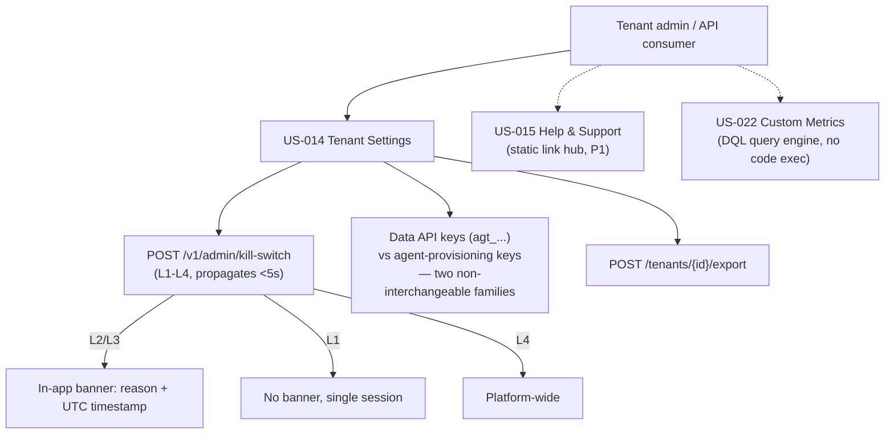

# Tenant Settings, Help & Custom Metrics

## Summary

US-014 (Tenant Settings), US-015 (Help & Support), and US-022 (Custom Metrics Configuration) — tenant administration, the help hub, and custom metrics. Owner: Engineering. Status: canonical. US-014: Gate 1. US-015: Phase-1 exit (P1), not a Gate-1 blocker. US-022: Seed. Epics: EP-01, EP-07, EP-08. BRs: BR-001, BR-003, BR-005, BR-006, BR-011.

## Executive Summary

Tenant Settings is where the platform's two safety-critical control surfaces become admin-visible: kill-switch activation (`POST /v1/admin/kill-switch`, propagating in **under 5 s** per NFR-005) and agent-policy LLM spend caps. The file draws a hard line the corpus is careful never to blur: data API keys (`agt_…` Bearer tokens, scoped `custom_metrics:read` / `vulnerability_instances:read` / `cve_research:write`) and agent-provisioning keys (`POST /v1/agents`) are two non-interchangeable families — data keys are rejected on dashboard JWT routes, and agent-provisioning keys cannot call public data endpoints without those scopes. Kill-switch UI severity is legible at a glance: L1 is single-session and silent (no banner); L2/L3 raise an in-app banner naming the reason, actor, and UTC timestamp; L4 is platform-wide. US-022 is notable for what it explicitly rules out — there is no arbitrary code execution, only a DQL query engine with 422 rejection on invalid grammar. US-015's one operationally live risk is a documented launch blocker: `trust.dux.io` was unreachable at the June-2026 scrape, covered by a broken-link synthetic check, with no agent or safety impact.

## Specification

### US-014 Tenant Settings (Gate 1)

**Job.** A tenant admin or API consumer manages users, API keys, webhooks, agent policy, kill-switch visibility, and data export.

**Orchestration.** No agent runs on this page. `POST /v1/admin/kill-switch` propagates in **under 5 s** (NFR-005). Agent policy caps LLM spend. The Assessment-quality widget reports the **10%** drift cohort.

**API.**

| Endpoint | Contract |
|---|---|
| `POST /v1/admin/kill-switch` | `{level: L1–L4, tenant_id?, session_id?, reason}` |
| `DELETE /v1/admin/kill-switch/{id}` | deactivate |
| `POST /webhooks/configure` | webhook registration |
| `POST /tenants/{id}/export` | data export |
| `DELETE /tenants/{id}` | tenant deletion |

**Data API keys (Seed).** `agt_…` Bearer tokens, scopes `custom_metrics:read`, `vulnerability_instances:read`, `cve_research:write`.

**Data keys vs. agent-provisioning keys — not interchangeable:**

- An admin can create and revoke scoped data keys.
- Data keys authenticate the public REST data API only — rejected on dashboard JWT routes.
- Agent-provisioning keys (`POST /v1/agents`) cannot call public data endpoints without the scopes above.
- Rate-limit tier is surfaced per key.
- Webhooks carry an HMAC signature and an `Idempotency-Key`.

**Kill-switch UI.** L2 and L3 raise an in-app banner:

> *Agent activity paused for your organization — {reason}. Activated {timestamp} UTC. Contact your administrator.*

L1 is a single session and shows no banner. L4 is platform-wide.

**Gate split.** Users and agent policy are P0. API keys and webhooks are P1. SSO and SCIM are a seed trigger — Phase 1 shows a deferral note.

**Data.** `TENANT`, `API_KEY`, `WEBHOOK_CONFIG`. Kill-switch state lives in **NATS** (with a CloudNativePG fallback mirror).

**Metrics.** Kill-switch activation count; webhook delivery success; export volume; API-key usage by tier/scope; LLM spend against cap.

### US-015 Help & Support (Phase-1 exit, P1 — not a Gate-1 blocker)

A static link hub: `docs.dux.io`, `status.dux.io`, `trust.dux.io`, tier-appropriate support. Contextual `?` links resolve to `docs.dux.io/phase1#us-*`.

**`trust.dux.io` was not publicly reachable at the June-2026 scrape — that is a launch blocker.** A broken-link synthetic check covers it. No agent or safety impact.

### US-022 Custom Metrics Configuration (Seed)

**Job.** A tenant admin or API consumer defines tenant custom metrics — display name, DQL filter, `group_by`, dashboard binding. The metric appears in the public `GET /v1/custom-metrics` once the Seed API trigger fires.

**Orchestration.** None — a query engine over the World Model. Data: `CUSTOM_METRIC` ERD entity, with `EntityType` as a filter dimension.

**API.** Admin UI writes the config; reads go through the public data API. Webhook: `custom_metric.updated` (Seed).

**Safety.** Invalid DQL is rejected at save with a **422**. **There is no arbitrary code execution.**

## Diagram

## Entities & Concepts

- [[Dux Agent]] — subject to the LLM spend cap set on this page
- [[Kill Switch]] — L1–L4 activation surface, NATS-backed state

## Related

- [[Dux Catalogs — Registries of Record]] — the feature-flag catalog this settings surface partially controls
- [[Dux Product Area]]
- [[Dux Overview]]

## Sources

- `.raw/dux/10-product/features/tenant-settings.md`
