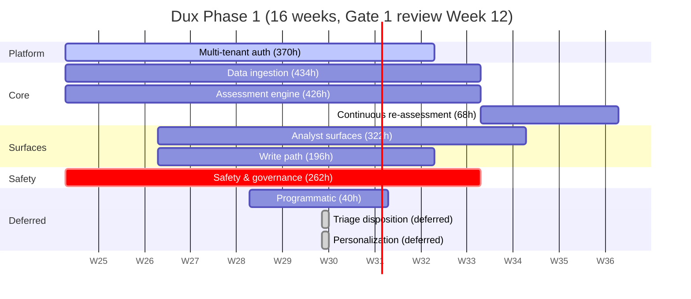

# Dux Portfolio

Navigation: [[Dux]] | [[Dux Product Guide]] | [[Dux Decisions & Traceability Reference]]

The Epic → Feature → Story → Task decomposition of the Phase-1 build, 16 weeks starting 2026-06-23, and the rules governing how that decomposition is allowed to change. This is the planning source imported into the team's actual project tracker: not a live status mirror, so treat any hour or status figure here as the plan as of its last review, not a real-time dashboard.

## Where the backlog stands

The backlog has been re-baselined three times against a moving capacity envelope, and each time the team chose to re-baseline rather than quietly cut scope: 2,000 hours, then 2,080 (bumping focused weekly hours from 25 to 26), then 2,160 (bumping again to 27). The corrected backlog lands at **2,118 hours: about 98.1% of the final envelope, a 42-hour buffer.** That correction matters on its own: a manual audit caught a 20-hour arithmetic slip that had silently accumulated in the rollup table (two epics were each overcounted), fixed via the same reconciliation script that validates the rest of this corpus. The team was explicit that a fourth consecutive envelope raise should not become a habit: Agentic RAG, the graph database layer, and the Gate-2 triage-model path are all deliberately left unestimated as net-new scope, tracked openly rather than silently folded into the buffer.

Seven documented, deliberate deviations from a strict Epic/Feature/Story framework are on the record, and they're worth knowing about because they explain why this backlog doesn't look like a template-perfect one: stories are never invented just to hit a quota (the 28-story set is closed and canonical) and a handful of role placeholders stand in for team members not yet named.

### ID scheme

| Level | Format | Source |
|---|---|---|
| Epic | `EP-01`…`EP-10` | Canonical, defined in [[Dux Decisions & Traceability Reference]] |
| Feature | `EP-xx-Fyy` | New at this planning layer |
| Story | `US-001`…`US-028` | Canonical, closed set: never invented here |
| Task | `US-xxx-Tzz` or `EP-xx-Fyy-Tzz` | New at this planning layer |

Capacity: 5 engineers, 3 on TypeScript and 2 on Python. A story is only "done" when every merge gate is green, its verification command passes, it's deployed to staging, and it's been demoed: no partial credit.

## The portfolio at a glance

| Epic | Focus | Status | Hours | Share |
|---|---|---|---|---|
| Multi-tenant platform & auth | Zero cross-tenant leakage | Defined | 370h | 17% |
| Environmental data ingestion | Connectors and feeds | Defined | 434h | 20% |
| Exploitability assessment engine | The core reasoning pipeline | Defined | 426h | 20% |
| Continuous re-assessment | Keeping verdicts fresh | Defined | 68h | 3% |
| Analyst surfaces & APIs | Dashboards, drill-down, chat | Defined | 322h | 15% |
| Mitigation & remediation write path | The action surfaces | Defined | 196h | 9% |
| Safety & governance | The safety spine | Defined | 262h | 12% |
| Programmatic platform | Public API, webhooks | Defined | 40h | 2% |
| Triage disposition | Acknowledgment lifecycle | **Deferred** | 0h | - |
| Personalization | Preference learning | **Deferred** | 0h | - |
| **Total** | | | **2,118h** | 100% |

## Epic highlights worth understanding, not just the hour count

**Multi-tenant platform & auth (370h, P0).** The infrastructure pivot to self-hosted Kubernetes added 98 hours to this epic alone: cluster provisioning, the self-hosted database, event bus, cache, object storage, and workflow engine. That wasn't a like-for-like swap: self-hosting and operating five separate services genuinely costs more engineering time than pointing the same services at managed cloud tiers, and the plan accounts for that honestly rather than assuming it nets out even.

**Continuous re-assessment (68h, P0, a claim-safety blocker).** This is the epic that makes the "continuous" marketing claim engineering-true at Gate 1, not just aspirational copy. Most re-assessment triggers have to resolve without an LLM call at all, which is why a 15-minute debounce window and an evidence-hash dirty-check exist: they're cost control, not just deduplication.

**Safety & governance (262h, P0, a pre-launch blocker).** The kill switch, the full governance-kernel gate chain, the audit trail, and the MCP gateway all live here. Worth knowing as a planning lesson: the MCP gateway alone split into four separate sub-tasks after a review found the original single task badly under-scoped: it turned out to bundle a policy engine, schema-integrity checking, an egress proxy, and a circuit breaker into what looked like one line item.

**Programmatic platform (40h, P1).** Outbound webhooks ship at Gate 1; the public data API and an outbound MCP server are both deferred. That MCP server deferral is a real strategic choice, not just a scheduling one: building it would invert Dux's current posture from purely an MCP *client* into also being an MCP *server* for third parties, which is a genuine ecosystem play with no near-term trigger pulling it forward yet.

**Triage disposition and Personalization (0h, both deferred).** Triage disposition was deferred through an early capacity fallback lever, back when the backlog first ran well over its original envelope. Personalization isn't just delayed: it's deliberately not promoted, because it needs a volume of behavioral data that simply doesn't exist before launch.

**Two easy-to-miss features hiding inside otherwise-active epics.** Neither carries its own line in the hour rollup above, both sit behind feature flags: an outcome-learning capability deferred to a post-Gate-3 candidate pending enough remediation-outcome data to be meaningful, and a proactive tool-discovery feature (costed at 44 hours, folded into the ingestion epic's total) that detects cloud resources already configured in a way suggesting an already-installed security tool: surfacing a "you already own this" suggestion instead of prompting a redundant purchase.

### Why the framework bends in seven places

The Epic/Feature/Story template is broken on purpose in seven named ways, and every one of them is justified by the same principle: preserving what's actually true over hitting a template quota. A Feature is allowed to carry just one or two stories instead of the usual range, because inventing stories to pad it out would fabricate scope that doesn't exist. A deferred or draft feature carries no acceptance criteria or SLA, because writing precise commitments for work that isn't scheduled yet would fake a level of commitment the team doesn't actually have.

### The rules every change has to satisfy

No orphans: every Feature has a parent Epic, every Story a parent Feature, every Task a parent Story or Feature. No widows: every Epic has at least one Feature under it. IDs are unique across the entire portfolio. Every reference is checked for bidirectional traversal against the traceability matrix. Status cascades strictly upward: a parent is only marked done once every one of its children is. And one last gate, easy to overlook precisely because it's administrative rather than structural: every task carries an assignee, an hour estimate, a discipline, a type, and a target week, checked at the tech-lead level before it's considered real.

### What's tracked but deliberately excluded from the Gate-1 sum

A small Gate-2/fast-follow register sits next to the Gate-1 backlog rather than inside it: a pre-approved-scope policy (roughly 12 hours), connector-freshness plus live contract tests (roughly 16 hours), and a full SBOM/SLSA pass (roughly 8 hours) are all costed and tracked, deliberately kept out of the Gate-1 total above. Two smaller items in the same register, a runbook update and an instrumentation pass, carry low engineering cost and aren't separately called out.

The backlog's discipline load, for anyone staffing against it, runs roughly Backend 52%, Frontend 17%, QA 13%, DevOps 10%, and Security 8%. Two of those carry real concentration risk worth naming: the backend and Python engineering tracks are critical-path-loaded from Week 3 through Week 8, and Security is a single point of failure across the governance kernel, MCP, and identity work all at once.

## Sources

- `.raw/dux/90-execution/README.md`
- `.raw/dux/90-execution/traceability.md`
- `.raw/dux/90-execution/backlog-ep01.md` through `backlog-ep10.md`
