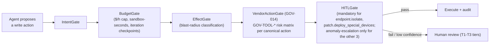

# Governance Kernel

## Definition

The synchronous gate chain (`GOV-001`–`GOV-014`) evaluated before every privileged [[Dux Agent]] action — the mechanism that is supposed to make Dux's unattended-by-default write path safe.

## How It Works

`VendorActionGate` is `GOV-014`, specified with a **`GOV-TOOL-*` risk matrix** — one row per canonical write action, each carrying a consequence scope, reversibility, an unattended-execution confidence floor, and the HITL tier it falls back to below that floor (D-14). **Connectors must not call vendor mutation APIs — every write goes through `VendorActionGate`.**

## Why It Matters

The write path shipped unattended-by-default at Gate 1 (D-17: 3 of 5 canonical actions) on the premise that this gate chain would make it safe — it was specified (D-14) only after that premise was already live, closing a real gap rather than a hypothetical one. The gate chain, kill switch, least-privilege scoped action credentials, hash-chained audit, and blast-radius tiering together carry the safety burden that a mandatory human-approval step used to backstop before D-17/D-13's re-gating.

**A write-action safety invariant added to `GOV-TOOL-*`:** no future action may weaken MFA, logging, encryption, or audit (D-16-era pass).

## Examples

- `endpoint.isolate` and `patch.deploy_special_devices` — mandatory HITL on **every** call, regardless of confidence (D-17), because neither has a guaranteed API-level rollback and both carry the highest blast radius.
- `ticket.create_remediation`, `network.blocklist_add`, `policy.deploy_device_config` (once its Intune connector ships) — unattended by default; HITL only on anomaly escalation (low-confidence verdict, sandbox `TIMEOUT`/`OOM`, or a T4 outlier).
- Rollback catalog R-01…R-05 backs the `rollbackProcedure` audit field for all five canonical actions (D-15); `patch.deploy_special_devices` is the one action with no guaranteed API-level rollback, which is exactly why it is held to mandatory HITL rather than shipping unattended without an undo path.

## Connections

- [[Dux Agent]] — the actor every gate check applies to
- [[Kill Switch]] — the emergency halt layered on top of (not instead of) this gate chain
- [[CaMeL]] — the dual-LLM boundary upstream of any gated action

## Sources

- `.raw/dux/40-ai-safety/governance-kernel.md`
- `.raw/dux/20-architecture/adr-index.md` (ADR-012 R3)
- `.raw/dux/00-meta/decisions-log.md` (D-14, D-15, D-17)
