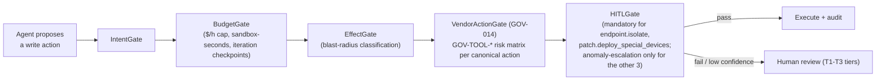

# Governance Kernel

## Definition

The synchronous gate chain (`GOV-001`–`GOV-014`) evaluated before every privileged [[Dux Agent]] action — the mechanism that is supposed to make Dux's unattended-by-default write path safe.

## How It Works

`VendorActionGate` is `GOV-014`, specified with a **`GOV-TOOL-*` risk matrix** — one row per canonical write action, each carrying a consequence scope, reversibility, an unattended-execution confidence floor, and the HITL tier it falls back to below that floor (D-14). **Connectors must not call vendor mutation APIs — every write goes through `VendorActionGate`.**

### The 13 gates (GOV-001–013)

Chain of Responsibility; each handler returns `continue`, `block`, or `escalate`. No bypass path in Phase 1. `KillSwitchRelay` is consulted *before* any gate — an active L3+ switch returns 503 without running the chain.

| ID | Gate | Checks | Failure |
|---|---|---|---|
| GOV-001 | Intent | action matches the `assessment_plan` schema (allowed tool sequence, target CVEs, max steps) | `GOVERNANCE_BLOCKED` |
| GOV-002 | Budget | token and cost limits per tenant/session | `BUDGET_EXCEEDED` (P0-C if >3x baseline) |
| GOV-003 | ActionBudget | per assessment: warn >100, halt >=200 weighted actions (LLM=1, MCP read=2, MCP write=5) | `ACTION_BUDGET_WARN`/`EXCEEDED` |
| GOV-004 | WorkflowTenantBudget | daily cap — Starter 500 / Pro 5,000 / Enterprise floor 50,000; changing it needs tenant **and** platform admin | `WORKFLOW_TENANT_BUDGET_EXCEEDED` |
| GOV-005 | WorkflowCircuitBreaker | tenant exceeds 2x its rolling 7-day baseline actions/hour | L2 `workflow_cost_runaway`, banner within 15 min |
| GOV-006 | CostForecast | forecast before start; re-forecast every 25 actions, or when asset count grows 50% | `COST_FORECAST_EXCEEDED` |
| GOV-007 | CostCap | hard per-tenant spend cap ($25/hour default), checked before every LLM call | L2 `budget_exceeded` |
| GOV-008 | Effect | tool side effects stay within tenant scope; blast tiers: single asset->T2, subnet->T3, tenant-wide->T4 | block + audit |
| GOV-009 | DLP | regex (<5ms) Weeks 1-10; Presidio NER from Week 11 after a 2-week shadow run (enforce only once FP <5%) | redact or block |
| GOV-010 | Loop | max 50 P-LLM iterations/assessment; max 10 MCP calls/iteration; high-blast agents capped at `min(50, 10 x P-LLM iterations)` | `GOVERNANCE_BLOCKED`, optionally L1 |
| GOV-011 | PromptScreen | the trusted user prompt is screened before the P-LLM plan (CaMeL+) | `PROMPT_SCREEN_BLOCKED` |
| GOV-012 | OutputAudit | S-LLM/Q-LLM output scanned for instruction leakage before it reaches the P-LLM | `OUTPUT_AUDIT_BLOCKED` |
| GOV-013 | TieredRisk | a tool's blast-radius tier must match the session `risk_tier` | `TIERED_RISK_BLOCKED`, HITL per tier |

**Cost threshold evaluation order (first match wins, D-3):** $0.675/assessment soft breaker (ADR-008) -> $25/hour CostCap (GOV-007) -> 2x-baseline workflow circuit breaker (GOV-005).

**Latency budget:** Weeks 1-10, sequential p99 <75ms total (DLP <5ms, every other gate <15ms). Week 11+, DLP <60ms p99 (Presidio), parallelized with Intent where safe. `pnpm test:governance-kernel` exercises all 13 failure modes and is merge-blocking before Gate 1.

**Write-action safety invariant.** No future `GOV-TOOL-*` row may allowlist a write action that disables or weakens MFA, logging, encryption, or audit — on the target system, Dux's own control plane, or the action's own audit trail. `GOV-014` enforces this the same way it blocks any action with a missing rollback entry: a proposed action that trips it never reaches `continue`, and no new `GOV-TOOL-*` row can land without a passing test proving it.

## Why It Matters

The write path shipped unattended-by-default at Gate 1 (D-17: 3 of 5 canonical actions) on the premise that this gate chain would make it safe — it was specified (D-14) only after that premise was already live, closing a real gap rather than a hypothetical one. The gate chain, kill switch, least-privilege scoped action credentials, hash-chained audit, and blast-radius tiering together carry the safety burden that a mandatory human-approval step used to backstop before D-17/D-13's re-gating.

**A write-action safety invariant added to `GOV-TOOL-*`:** no future action may weaken MFA, logging, encryption, or audit (D-16-era pass).

## Examples

- `endpoint.isolate` and `patch.deploy_special_devices` — mandatory HITL on **every** call, regardless of confidence (D-17), because neither has a guaranteed API-level rollback and both carry the highest blast radius.
- `ticket.create_remediation`, `network.blocklist_add`, `policy.deploy_device_config` (once its Intune connector ships) — unattended by default; HITL only on anomaly escalation (low-confidence verdict, sandbox `TIMEOUT`/`OOM`, or a T4 outlier).
- Rollback catalog R-01…R-05 backs the `rollbackProcedure` audit field for all five canonical actions (D-15); `patch.deploy_special_devices` is the one action with no guaranteed API-level rollback, which is exactly why it is held to mandatory HITL rather than shipping unattended without an undo path.

## Connections

- [[Dux Agent]] — the actor every gate check applies to
- [[Kill Switch]] — the emergency halt layered on top of (not instead of) this gate chain
- [[CaMeL]] — the dual-LLM boundary upstream of any gated action

## Sources

- `.raw/dux/40-ai-safety/governance-kernel.md`
- `.raw/dux/20-architecture/adr-index.md` (ADR-012 R3)
- `.raw/dux/00-meta/decisions-log.md` (D-14, D-15, D-17)
