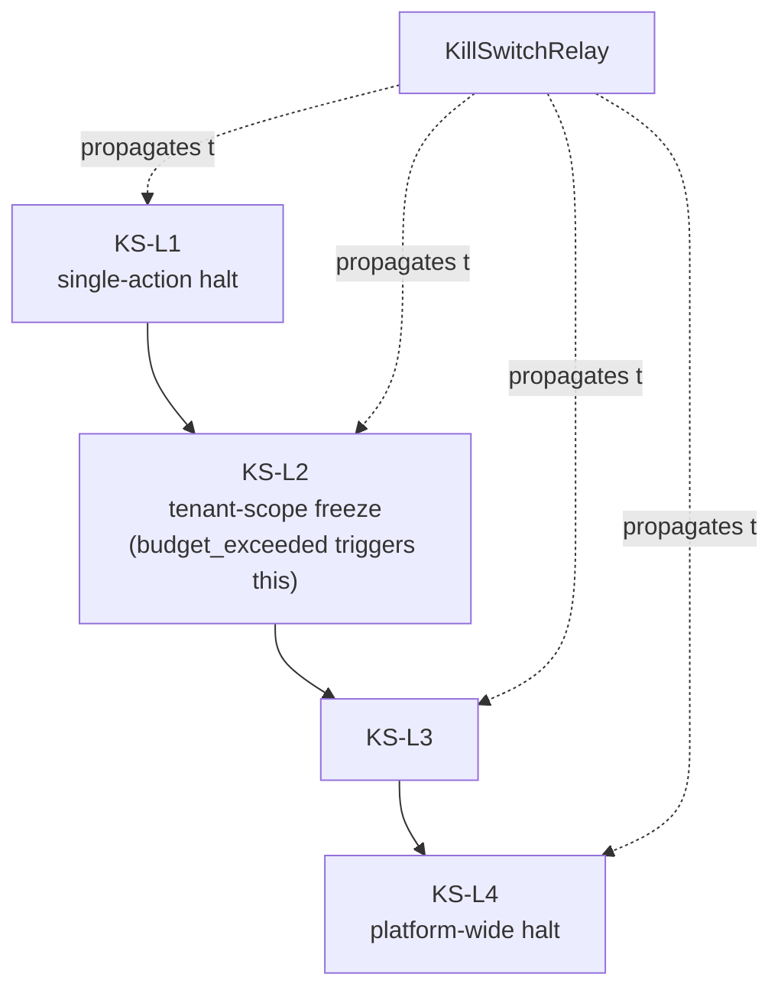

# Kill Switch

## Definition

Emergency agent-halt mechanism (noun: **kill switch**; adjective: **kill-switch**, per the naming glossary). Four escalating levels, KS-L1 through KS-L4, propagated in under 5 seconds p99 (NFR-005 / TR-NFR-003).

## How It Works

Propagation runs over NATS core pub/sub (D-33 migrated this off Upstash — the same bus now also carries continuous-reassessment events). `KillSwitchRelay` is the implementing service; `test:kill-switch` and `test:kill-switch-idempotency` are the verification suites.

## Why It Matters

The kill switch is the primary compensating control for the unattended-by-default write path (D-13/D-17) — it, the [[Governance Kernel]] gate chain, least-privilege scoped action credentials, and hash-chained audit together replace the mandatory human-approval step that used to gate every write before the 2026-07-13 re-gating.

## Examples

- A per-tenant sandbox budget breach (`budget_exceeded`, per-tenant 300 sandbox-seconds/hr + 5 concurrent microVMs) triggers an **L2** freeze.
- KS-L2/L3/L4 activation for a tenant or session populates the short-TTL Upstash JWT denylist (`revoked_jti:{jti}`), forcing re-authentication.

## Connections

- [[Dux Agent]] — every agent path is a kill-switch scope
- [[Governance Kernel]] — the synchronous per-action gate chain the kill switch backstops as an emergency override

## Sources

- `.raw/dux/40-ai-safety/kill-switch-hitl.md`
- `.raw/dux/00-meta/decisions-log.md` (D-9, D-17)
