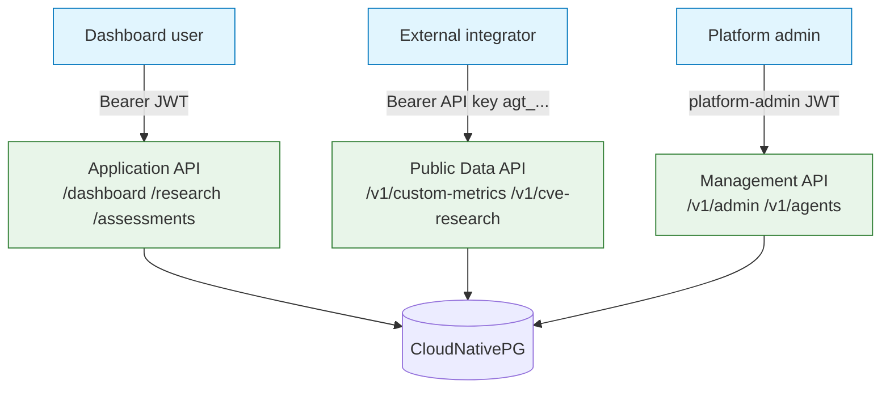

# API Overview

## Summary

The three REST planes, their auth, versioning, and rate limits. Owner: Engineering. Status: canonical. Gate: 1. Decisions: D-6.

## Executive Summary

Dux exposes three REST planes that must never be conflated: the **Application API** (dashboard/agent traffic, Bearer JWT), the **Public Data API** (`/v1/*`, Bearer API key, ships at the Seed trigger not Phase 1), and the **Management API** (`/v1/admin/*`, `/v1/agents/*`, platform-admin JWT, Gate-1 internal). `openapi.yaml` is a **draft skeleton, not the wire authority** — it inventories paths, auth, and limits, and moves to the API service repo at build start for Spectral-lint and contract testing; until then the prose contracts in `30-api/*.md` are canonical. Public Data API keys and the two JWT types are non-interchangeable credentials: a Public Data API key is rejected on Application-plane routes, and `POST /v1/agents` accepts only a platform-admin JWT regardless of any key's scopes. Authorization runs in two layers — authentication, then a `USER.role` (`admin`/`member`/`viewer`) matrix (D-45) that gates each Application-plane endpoint by blast radius.

## Specification

### Three REST planes

| Plane | Path prefix | Auth | Ship gate | Public OpenAPI |
|---|---|---|---|---|
| Application API | `/dashboard/*`, `/research/*`, `/assessments/*`, `/cves/*`, `/connectors/*`, `/chat/*` | Bearer JWT, `aud=api.dux.io` | Gate 1 | No — internal Redoc from Week 8 |
| Public Data API | `/v1/custom-metrics*`, `/v1/vulnerability-instances/{cve_id}`, `/v1/cve-research` | Bearer API key (`agt_...`) | Seed trigger | Yes — `api.dux.io/docs` |
| Management API | `/v1/admin/*`, `/v1/agents/*` | platform-admin JWT | Gate 1, internal | No |

### Versioning

| Surface | Version | Breaking-change policy |
|---|---|---|
| Public Data API | `v1.0.0`, pinned 2026-06-26 | additive only within v1; a breaking change means `/v2` with a 90-day overlap |
| Application API | unversioned | breaking changes ship behind feature flags |
| SSE event schemas | `2026.06` | new event types additive; field removal requires a version bump |
| Webhook payloads | `v1`, HMAC-signed | `Idempotency-Key` required; deprecated fields honored 90 days |

### Auth

Application/Management planes: Bearer JWT from Better Auth, `aud` enforced, 60-minute access token, 7-day refresh with rotation. Public Data API: Bearer API key shaped `agt_<8-char-prefix>_<32-char-secret>` — only the SHA-256 hash is stored, plaintext shown once. Scopes: `custom_metrics:read`, `vulnerability_instances:read`, `cve_research:write`.

### Authorization matrix (selected, D-45)

| Endpoint class | admin | member | viewer |
|---|:---:|:---:|:---:|
| Reads (dashboard, research, assessments, CVE detail) | Y | Y | Y |
| Research queue/schedule, acknowledgments, HITL response | Y | Y | - |
| `POST /mitigations`, `POST /fast-actions` (live security-posture writes) | Y | - | - |
| Connector setup, webhook config, tenant export/delete | Y | - | - |

`member` covers read plus day-to-day analyst operation; tenant configuration and highest-blast-radius unattended writes stay `admin`-only; `viewer` is read-only everywhere.

### Rate limits — two planes (D-6)

| Tier | Application API (req/min) | Public Data API (req/min) |
|---|---|---|
| Starter | 1,000 | 60 |
| Professional | 5,000 | 300 |
| Enterprise | 10,000 | negotiated |

Every response carries `RateLimit-Limit`/`RateLimit-Remaining`/`RateLimit-Reset` (IETF draft); a `429` additionally carries `Retry-After`. Flood control sits at the Cloudflare edge; identity-aware limits are enforced post-auth by `@nestjs/throttler` + Valkey. Concurrent SSE streams are capped at 5 per `user_id`.

### Domains

`dux.io` (marketing), `app.dux.io`, `api.dux.io` (+`/docs`), `staging.dux.io`, `status.dux.io`, `trust.dux.io`, `docs.dux.io`. `trust.dux.io` and `status.dux.io` are launch blockers and must not be linked from marketing until they return HTTP 200.

### Application <-> public bridge (research queue)

| Concern | Application (JWT) | Public Data (API key) |
|---|---|---|
| Enqueue | `POST /research/queue` — single `cve_id` or `natural_language` | `POST /v1/cve-research` — batch of 1-50 `cve_ids` only |
| Response | `{assessment_id, status: queued\|deduplicated, queue_position}` | array of `CveResearchV1Item` |
| In-progress state | `QueueSummaryDto.in_research` | none — poll `backlog` until `completed` |

Natural-language enqueue has no public-v1 equivalent.

## Diagram

## Entities & Concepts

- [[Application API]] — full DTO contracts for this plane
- [[Public Data API]] — full endpoint contracts for this plane
- [[Events & Webhooks]] — outbound delivery shared across planes

## Related

- [[Dux Overview]]
- [[Dux Architecture Decision Records]]

## Sources

- `.raw/dux/30-api/api-overview.md`
- `.raw/dux/30-api/openapi.yaml`
