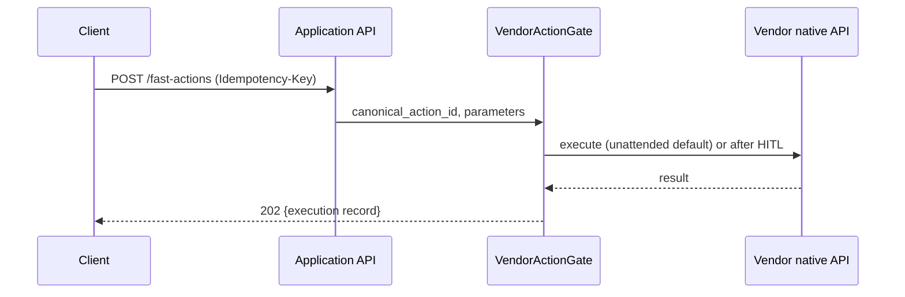

# Application API

## Summary

Phase-1 DTO contracts for the Application plane (Bearer JWT). Owner: Engineering. Status: canonical. Gate: 1.

## Executive Summary

This API is deliberately CVE-lookup-and-assessment-centric — `GET /cves/{id}/detail`, `GET /assessments/{id}` — not a generic "submit a scan, poll for a report" shape. Dux's unit of work is a CVE against a live World Model, continuously re-assessed, not a point-in-time scan job. Every vendor-write endpoint (`POST /mitigations`, `POST /fast-actions`, `POST /remediation-tickets`) requires a client-supplied `Idempotency-Key`, deduplicated the same way as the research-queue enqueue, because each triggers a real vendor-side action with no other client-facing retry-safety mechanism. Cross-tenant reads on `GET /assessments/{id}` and its `/trace`/`/replay` children return 404, never 403 — the corpus's standard IDOR-safe response.

## Specification

### Key endpoints

| Endpoint | Story |
|---|---|
| `GET /dashboard/home`(`/stream`) | US-012 — `DashboardHomeDto`: exposure summary, vulnerability reduction, queue summary, needs-attention list, connector health |
| `GET /research/dashboard`(`/stream`) | US-010 — `ResearchDashboardDto`: 7-day calendar, CVE rows sorted with Mitigation Required elevated, `view_mode` (`by_cve`/`by_asset`/`by_instance`) |
| `POST /research/queue` | US-008, US-010 — `{cve_id}` or `{natural_language}` → `{assessment_id, status: queued\|deduplicated, queue_position}`. Idempotent via `AssessmentDeduplicationService`. Also the investigation-trigger for the Agentic RAG loop — no separate trigger endpoint exists (D-56) |
| `GET /assessments/{id}`(`/trace`, `/replay`) | US-001, US-017 — trace returns reasoning steps + code artifact + `execution_results` (populated at Gate 1 via microVM, null only when sandbox is kill-switched off); replay reconstructs the full span tree from `trace_id` at read time |
| `GET /cves/{id}/detail` | US-011 — `CveDetailDto` via `CVEDetailQuery`; `?projection=exposure\|protection\|action_cards` |
| `GET /assets/{id}/context` | US-002 (FR-020) — `AssetContextDto`: endpoint/cloud/runtime/identity/policy context blocks, each nullable and never fabricated when the source connector is stale or absent |
| `POST /mitigations`, `POST /fast-actions`, `POST /remediation-tickets` | US-004/016/018 — all unattended by default, `Idempotency-Key` required |
| Chat SSE + `POST .../hitl-response` | US-008 — events: `query`, `response`, `citation`, `processing_step`, `prioritization_cards`, `request_research_ack`, `hitl_request` |

### CVE read projections

| Projection | Story | Output | Budget |
|---|---|---|---|
| `ExposureProjection` | US-011 | severity, groups, attack paths, AWS evidence | p95 <500ms |
| `ProtectionProjection` | US-003 | four-state summary + vendor control panels | Gate 1 |
| `ActionCardProjection` | US-004 | mitigation steps, vendor deep-links, `canonical_action_id` | Gate 1 |

A shared `CVEDetailQuery` base fetches the CVE and tenant scope once; each projection adds its own joins.

### Error handling

`DuxErrorCode`, shared across REST/SSE/webhooks:

| Code | HTTP |
|---|---|
| `AGENT_TIMEOUT` | 504 |
| `CONTEXT_EXHAUSTED` | 422 |
| `BUDGET_EXCEEDED` | 429 |
| `GOVERNANCE_BLOCKED` | 403 |
| `INSUFFICIENT_DATA` | 422 — `asset_gap`/`intel_gap`/`context_limit` |
| `VALIDATION_FAILED` | 422 — `details: [{field, message}]`, the single request-validation shape corpus-wide |

Application error classes: `TenantIsolationError` (403), `ConnectorSyncError` (502), `AgentBudgetExceeded` (429), `AssessmentDedupConflict` (409).

## Diagram

## Entities & Concepts

- [[Dux Agent]] — the reasoning entity behind `/assessments/*` and `/research/*`
- [[Kill Switch]] — governs `/v1/admin/kill-switch` (management plane) and the HITL-response path

## Related

- [[API Overview]]
- [[Public Data API]]

## Sources

- `.raw/dux/30-api/application-api.md`
