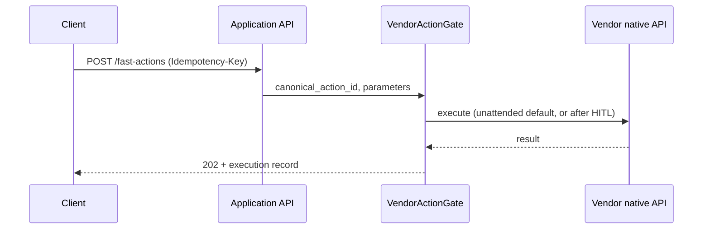
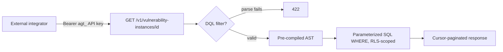
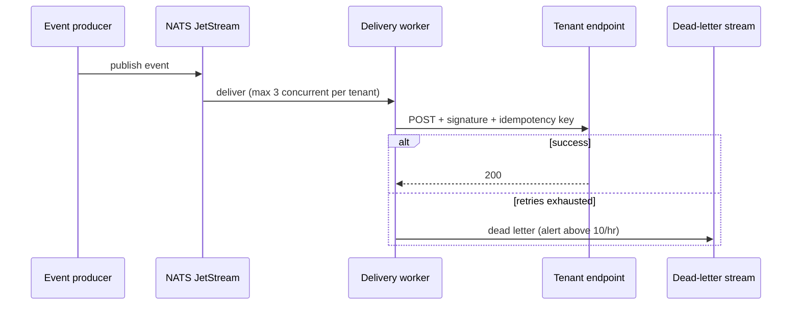

# Dux API Reference

Navigation: [[Dux]] | [[Dux Feature Reference]] | [[Dux Taxonomy & Catalogs]]

This is a reference document, not a narrative one: it's organized for lookup, not for reading top to bottom. `openapi.yaml` in the source repository is a draft skeleton, not the wire authority yet; it inventories paths, auth, and limits, and only becomes contract-tested once it moves into the API service repo. Until then, the prose contracts below are canonical.

## The three REST planes

Dux exposes three separate planes that are never conflated, each with its own auth model and its own credentials: a credential valid on one plane is explicitly rejected on the others, regardless of scope:

| Plane | Path prefix | Auth | Ships at | Public docs |
|---|---|---|---|---|
| **Application API** | `/dashboard/*`, `/research/*`, `/assessments/*`, `/cves/*`, `/connectors/*`, `/chat/*` | Bearer JWT, audience-checked | Gate 1 | No: internal Redoc from Week 8 |
| **Public Data API** | `/v1/custom-metrics*`, `/v1/vulnerability-instances/{cve_id}`, `/v1/cve-research` | Bearer API key (`agt_...`) | Seed trigger, not Phase 1 | Yes: `api.dux.io/docs` |
| **Management API** | `/v1/admin/*`, `/v1/agents/*` | Platform-admin JWT | Gate 1, internal only | No |

A Public Data API key is hard-rejected on any Application-plane route, and `POST /v1/agents` accepts nothing but a platform-admin JWT: no key, regardless of its scopes, can substitute.

### Versioning

| Surface | Version | Breaking-change policy |
|---|---|---|
| Public Data API | `v1.0.0` | Additive only within v1; a breaking change means a new `/v2` with a 90-day overlap window |
| Application API | Unversioned | Breaking changes ship behind a feature flag instead |
| SSE event schemas | `2026.06` | New event types are additive; removing a field requires a version bump |
| Webhook payloads | `v1`, HMAC-signed | Requires an `Idempotency-Key`; deprecated fields stay honored for 90 days |
| Management API | `/v1/admin/*`, `/v1/agents/*` | A fixed path token, not a semantic version: it evolves independently of the Public Data API's `v1.0.0`/`/v2` policy, despite the shared `/v1` segment. The two are never to be conflated |

### Authentication and authorization

Application and Management planes use a Bearer JWT issued by Better Auth, audience-checked, with a 60-minute access token and a 7-day rotating refresh token. The Public Data API uses a Bearer API key shaped `agt_<8-char-prefix>_<32-char-secret>`: only its SHA-256 hash is ever stored server-side, and the plaintext is shown exactly once at creation. Key scopes: `custom_metrics:read`, `vulnerability_instances:read`, `cve_research:write`.

Authorization runs in two layers: authentication first, then a role matrix (`admin`/`member`/`viewer`) that gates each Application-plane endpoint by blast radius.

| Endpoint class | admin | member | viewer |
|---|:---:|:---:|:---:|
| Reads (dashboard, research, assessments, CVE detail) | Yes | Yes | Yes |
| Research queue/schedule, acknowledgments, HITL response | Yes | Yes | No |
| Live security-posture writes (`POST /mitigations`, `POST /fast-actions`) | Yes | No | No |
| Connector setup, webhook config, tenant export/delete | Yes | No | No |

In short: `member` covers everything a day-to-day analyst needs including read/write on the research queue, but tenant configuration and the highest-blast-radius unattended writes stay `admin`-only, and `viewer` is read-only everywhere, no exceptions.

### Rate limits

| Tier | Application API | Public Data API |
|---|---|---|
| Starter | 1,000 req/min | 60 req/min |
| Professional | 5,000 req/min | 300 req/min |
| Enterprise | 10,000 req/min | Negotiated |

Every response carries the standard IETF `RateLimit-*` headers (`RateLimit-Limit`, `RateLimit-Remaining`, `RateLimit-Reset`); a 429 additionally carries `Retry-After`. Coarse flood control sits at the Cloudflare edge; identity-aware limiting is enforced post-auth. Concurrent SSE streams are capped at 5 per user.

### Domains

`dux.io` (marketing), `app.dux.io` (product), `api.dux.io` plus `/docs` (API and public documentation), `staging.dux.io`, `status.dux.io`, `trust.dux.io`, `docs.dux.io`. The status and trust subdomains are launch blockers: they must return a healthy response before either is linked from marketing.

## Application API: the JWT-authenticated plane

This plane is deliberately CVE-lookup-and-assessment-centric (`GET /cves/{id}/detail`, `GET /assessments/{id}`) rather than a generic "submit a scan, poll for a report" shape. Dux's actual unit of work is a CVE reasoned over against a live, continuously updated World Model, not a point-in-time scan job, and the API shape reflects that directly.

### Key endpoints

| Endpoint | Story | Notes |
|---|---|---|
| `GET /dashboard/home` (+ `/stream`) | Dashboard Home | Exposure summary, vulnerability-reduction trend, queue summary, needs-attention list, connector health |
| `GET /research/dashboard` (+ `/stream`) | Research Dashboard | 7-day calendar, CVE rows, `view_mode` of `by_cve`/`by_asset`/`by_instance` |
| `POST /research/queue` | Request Research | `{cve_id}` or `{natural_language}` → `{assessment_id, status, queue_position}`. Idempotent, and it's also the sole trigger for the Agentic RAG investigation loop: no separate trigger endpoint exists |
| `GET /assessments/{id}` (+ `/trace`, `/replay`) | Assessment + trace | Trace returns reasoning steps, a code artifact, and execution results (populated at Gate 1, null only when the sandbox is kill-switched off); replay reconstructs the full span tree from a trace ID at read time |
| `GET /cves/{id}/detail` | Exposure Analysis | `?projection=exposure\|protection\|action_cards` |
| `GET /assets/{id}/context` | Asset Context | Endpoint/cloud/runtime/identity/policy blocks, each nullable and never fabricated when a source connector is stale or absent |
| `GET /controls/refinements` | Control refinements | Backs the control-refinement recommendations surface |
| `POST /research/schedule`, `GET /research/schedule` | Continuous re-assessment | Sets or reads a scheduled research sweep; defaults to a 24-hour cadence |
| `POST /mitigations`, `POST /fast-actions`, `POST /remediation-tickets` | Write actions | All unattended by default; all require a client-supplied `Idempotency-Key` |
| `POST /vulnerability-instances/{id}/acknowledgments` (+ `DELETE .../{ack_id}`) | Acknowledge Vulnerability Instance | Create: `{reason, expires_at?}` returns `{acknowledgment_id, is_acknowledged: true, expires_at?}`. `DELETE` revokes |
| `POST /webhooks/configure` | Webhook configuration | Registers a tenant's webhook endpoint |
| `GET /webhooks/deliveries` (+ `POST .../{id}/replay`) | Webhook delivery visibility | Filterable by status or event type; replay is scoped to the tenant's own dead-letter records |
| `POST /v1/admin/kill-switch` (+ `DELETE .../{id}`) | Kill switch | Management plane only. Activation body: `{level: L1\|L2\|L3\|L4, tenant_id?, session_id?, reason}`; `DELETE` deactivates |
| Chat SSE + `POST .../hitl-response` | Chat Guidance | Events: `query`, `response`, `citation`, `processing_step`, `prioritization_cards`, `request_research_ack`, `hitl_request` |

### CVE read projections

A shared base query fetches the CVE and tenant scope exactly once; each projection below adds its own joins on top:

| Projection | Returns | Latency budget |
|---|---|---|
| Exposure | Severity, risk groups, attack paths, AWS evidence | p95 under 500ms |
| Protection | Four-state summary plus vendor control panels | - |
| Action cards | Mitigation steps, vendor deep-links, canonical action ID | - |

### Idempotency on writes

Every vendor-write endpoint requires a client-supplied idempotency key, deduplicated the same way as research-queue enqueue requests: because each one triggers a real, vendor-side action, and an idempotency key is the only client-facing retry-safety mechanism available. Cross-tenant reads on an assessment (and its trace/replay children) return 404, never 403: the standard IDOR-safe response used throughout the API.



### Error codes, shared across REST, SSE, and webhooks

| Code | HTTP status |
|---|---|
| `AGENT_TIMEOUT` | 504 |
| `CONTEXT_EXHAUSTED` | 422 |
| `BUDGET_EXCEEDED` | 429 |
| `GOVERNANCE_BLOCKED` | 403 |
| `INSUFFICIENT_DATA` | 422 (subtypes: `asset_gap`, `intel_gap`, `context_limit`) |
| `VALIDATION_FAILED` | 422, with a `details: [{field, message}]` array: the one request-validation shape used everywhere |

Application-specific error classes: a tenant-isolation violation (403), a connector sync failure (502), an agent budget breach (429), and an assessment-deduplication conflict (409).

## Public Data API: the programmatic read surface

Ships at the Seed trigger, not in Phase 1. Every endpoint is a `GET` except one (`POST /v1/cve-research`) and there is deliberately no create, update, or delete for metrics or vulnerability instances anywhere in v1. `confidence_score` is never exposed on this plane; external consumers get `exploitability_status` only, keeping the raw model-confidence internals private.

| Endpoint | Notes |
|---|---|
| `GET /v1/custom-metrics` | Paginated (`page`, `size` 1–200, default 10); filterable by entity type, active status, dashboard, or search; sortable via a `sort` parameter (column list, `-` prefix for descending, validated against `CustomMetricItem`'s own field list, with an unresolvable column returning the same 422 shape as an unresolvable DQL field) |
| `GET /v1/custom-metrics/{id}` | Single metric detail |
| `GET /v1/custom-metrics/{id}/data` | Time-range-bounded, cursor-paginated data points |
| `GET /v1/vulnerability-instances/{cve_id}` | Cursor pagination, `limit` 1–5000 (default 3000), `expand=asset` |
| `POST /v1/cve-research` | Batch of 1–50 CVE IDs; returns 202 with a per-item `backlog`/`completed` status array; deduplicated per CVE ID, not per batch |

`CustomMetricItem`'s required fields: `id`, `display_name`, `description`, `entity_type`, `dql_filter`, `group_by`, `is_active`, `dashboard_id`, `ordinal`, `created_by`, `created_at`, `updated_at`, plus the optional `dashboard_ids[]`.

`VulnerabilityInstanceV1Response` carries two more fields worth knowing: `external_uids` (required) and `remediations` (optional, a nullable `string[]`). Its `network_exposure` field is an optional, nullable verdict with four possible values: `internet`, `external`, `internal`, `unreachable`.

### DQL: the query language behind custom metrics

DQL (Dux Query Language) is a flat, single-entity boolean filter grammar (no joins, no subqueries) that compiles to a parameterized SQL `WHERE` clause, scoped by row-level security. It never interpolates a raw string into SQL, which is exactly what closes off any arbitrary-code-execution path through this surface:

```
expression   := clause (( "AND" | "OR" ) clause)*
clause       := "(" expression ")" | comparison
comparison   := field operator value
field        := identifier ("." identifier)*
operator     := "=" | "!=" | ">" | ">=" | "<" | "<=" | "IN" | "NOT IN" | "CONTAINS" | "IS NULL" | "IS NOT NULL"
value        := string | number | boolean | "(" value ("," value)* ")"
```

`AND` binds tighter than `OR`. `CONTAINS` is the only substring/array-membership operator, valid only on string or text-array fields. An unknown field name fails at save time with a 422, never as a silent empty result: a query that looks like it works but quietly returns nothing is worse than one that fails loudly. Example: `severity >= 7 AND (state = "exploitable" OR state = "under_research") AND asset.has_public_ip = true`. Once a query validates, it's cached as a pre-compiled AST, so reads never re-parse the grammar. The closed set of queryable entity types: device, user, label, finding, cloud compute, vulnerability instance, CVE, mitigation.

Grammar limits (2,000 characters, a max nesting depth of 5, a max of 20 clauses) are enforced at save time as a 422, never silently truncated.

| Parameter | Min | Max | Default |
|---|---|---|---|
| `cve_ids` (batch research) | 1 | 50 | - |
| `size` (custom metrics) | 1 | 200 | 10 |
| `limit` (vulnerability instances) | 1 | 5000 | 3000 |

Before the Public Data API can actually go live, a fixed publishing checklist has to close: OpenAPI security schemes for the Bearer API key, documented 429 rate-limit response schemas, the scope enum, and a full security review.



### The bridge between Application and Public planes

The research queue is reachable from both planes, with slightly different shapes:

| Concern | Application (JWT) | Public Data (API key) |
|---|---|---|
| Enqueue | `POST /research/queue`: single CVE ID or natural-language string | `POST /v1/cve-research`: batch of 1–50 CVE IDs only |
| Response | Assessment ID, status, queue position | An array of per-item result objects |
| In-progress visibility | A live queue-summary field | None: poll until the item reports completed |

Natural-language enqueue has no equivalent on the public plane at all: that's an Application-plane-only capability.

## Events and webhooks

The event-driven surface behind both REST planes: what fires, how it's delivered, and how a consumer replays what it missed.

### Event semantics

| Event family | Fires when |
|---|---|
| `finding.*` | A scanner row is created, updated, or deleted during World Model ingest |
| `vulnerability_instance.*` | The per-asset CVE projection changes: exploitability status, network exposure, acknowledgment state, or last-seen time |
| `assessment.completed` | An application-layer assessment finishes |
| `assessment.requeued` | Continuous re-assessment re-triggers an assessment |
| `attack_path.validated` | An attack path is validated |
| `ownership.inferred` | Asset ownership is inferred |
| `control_asset_mapping.updated` | A control-to-asset mapping changes |
| `custom_metric.updated` | A custom metric's definition or data changes (Seed onward) |

Public API consumers should subscribe to `cve_research.completed` and `vulnerability_instance.*` rather than polling for changes.

### Outbound delivery

Delivery runs on a durable NATS JetStream queue: explicitly not a Redis-backed job queue, which was an earlier, since-corrected specification that had drifted out of sync with the actual architecture decision.

| Component | Specification |
|---|---|
| Concurrency | Max 3 concurrent deliveries per tenant |
| Retry | Exponential backoff with jitter, base 1 second, up to 5 attempts |
| Dead letter | A dedicated dead-letter stream; alerts above 10 failures per tenant per hour; retained 7 days |
| Replay | A tenant-facing replay endpoint, plus an internal operator command |
| Signing | Every payload carries an `X-Dux-Signature: sha256=HMAC_SHA256(payload, webhook_secret)` header, keyed from a secret in Vault |
| Circuit breaker | Delivery pauses automatically above 10 failures per tenant per hour |

### SSE streams

| Stream | Events | Target latency |
|---|---|---|
| Chat | `query`, `response`, `citation`, `processing_step`, `prioritization_cards`, `request_research_ack`, `hitl_request` | - |
| Dashboard | `queue_update` | Under 5 seconds |
| Research | `queue_row_update` | Under 1 second |

Reconnection replays from the last received event ID over a 1-hour window, falling back to a full state snapshot beyond that.

### Payload envelope

Every webhook body shares one shape: an event ID, event type, occurrence timestamp, tenant ID, API version, and a `data` object. Phase-1 assessment webhooks authenticate the same way as the Application-plane request that triggered them (Bearer JWT); public-API webhooks (CVE research completion, custom-metric updates) authenticate with the same API keys available from Seed onward.



## Sources

- `.raw/dux/30-api/api-overview.md`
- `.raw/dux/30-api/openapi.yaml`
- `.raw/dux/30-api/application-api.md`
- `.raw/dux/30-api/public-data-api.md`
- `.raw/dux/30-api/events-webhooks.md`
- `.raw/dux/20-architecture/architecture-diagrams.md`
