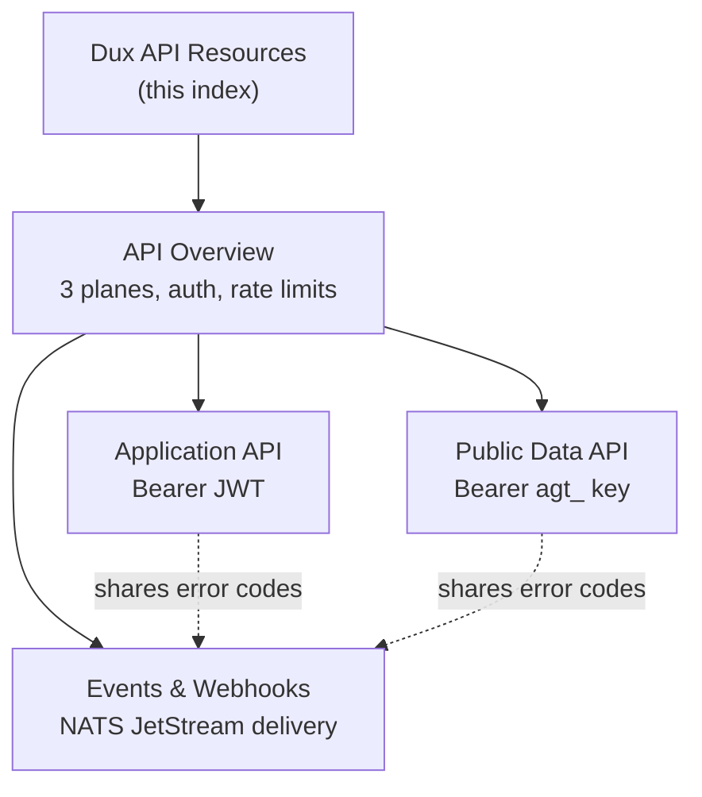

# Dux API Resources

## Scope

Everything under `30-api/` in the Dux corpus: the three-plane REST contract, DTO shapes, DQL, and outbound event delivery. In scope: api-overview.md, application-api.md, public-data-api.md, events-webhooks.md, openapi.yaml (draft skeleton).

## Reference material

- [[API Overview]] — the three planes, auth, versioning, rate limits
- [[Application API]] — Phase-1 DTO contracts (Bearer JWT plane)
- [[Public Data API]] — programmatic read surface + DQL (Bearer API key plane, Gate 2/Seed)
- [[Events & Webhooks]] — outbound delivery, SSE, event semantics

## Diagram

## Related

- [[Dux Overview]]
- [[Dux Architecture Area]]
