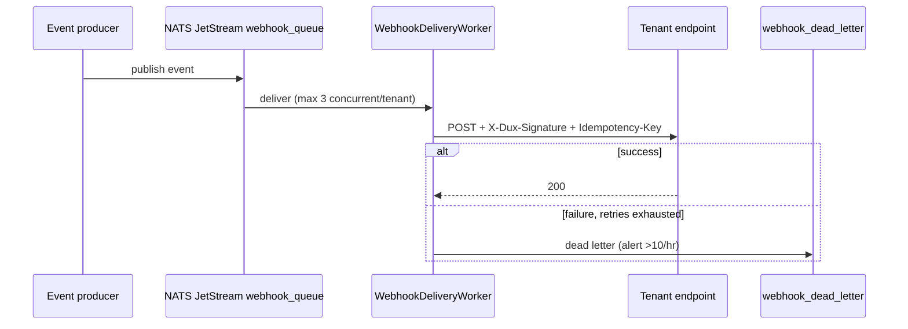

# Events & Webhooks

## Summary

Event semantics and outbound delivery mechanics. Owner: Engineering. Status: canonical. Gate: 1.

## Executive Summary

Outbound delivery runs on a **NATS JetStream durable queue, explicitly not BullMQ** — a legacy TRD table specifying BullMQ on Redis DB1 is a documented correction (BS-10) that contradicted ADR-005 and FR-010. Delivery retries with exponential backoff plus jitter (base 1s, up to 16s, max 5 attempts) before landing in a dead-letter stream, alerting above 10 failures per tenant per hour, retained 7 days. Every payload is HMAC-signed (`X-Dux-Signature`) and idempotency-keyed; consumers must accept the `Idempotency-Key` header. The webhook payload version (`v1`) and the SSE schema version (`2026.06`) are intentionally decoupled — each transport evolves on its own cadence for the same underlying event catalog data.

## Specification

### Event semantics

| Event family | Fires when |
|---|---|
| `finding.*` | a scanner row is created, updated, or deleted on World Model ingest |
| `vulnerability_instance.*` | the per-asset CVE projection changes (`exploitability_status`, `network_exposure`, `is_acknowledged`, `last_seen_at`) |
| `assessment.completed` | an application-layer assessment finishes |

Public API consumers should subscribe to `cve_research.completed` and `vulnerability_instance.*` rather than polling.

### Outbound delivery

| Component | Specification |
|---|---|
| Queue | durable `webhook_queue` stream on NATS JetStream (not BullMQ) |
| Worker | `WebhookDeliveryWorker` (`packages/notifications/`) |
| Concurrency | max 3 concurrent deliveries per tenant |
| Retry | `delay = base x 2^n + random(0, 1000ms)`, n=0..4, base 1s; max 5 attempts |
| Dead letter | `webhook_dead_letter` JetStream stream; alert above 10 failures/tenant/hour; retained 7 days |
| Replay | `GET /webhooks/deliveries` + `POST /webhooks/deliveries/{id}/replay` (tenant-facing); `pnpm ops:replay-webhooks` (internal) |
| Signing | `X-Dux-Signature: sha256=HMAC_SHA256(payload, webhook_secret)`, secret in Vault |
| Circuit breaker | delivery pauses above 10 failures/tenant/hour |

### SSE events

| Stream | Events | Target latency |
|---|---|---|
| Chat | `query`, `response`, `citation`, `processing_step`, `prioritization_cards`, `request_research_ack`, `hitl_request` | - |
| Dashboard | `queue_update` | <5s |
| Research | `queue_row_update` | <1s |

SSE schema version `2026.06`; new event types are additive, a field removal bumps the version. Reconnection replays from `Last-Event-ID` over a 1-hour window, falling back to a state snapshot beyond that.

### Payload envelope

Every webhook body shares `{event_id, event_type, occurred_at, tenant_id, api_version, data: {...}}`. Phase-1 assessment webhooks authenticate the same way as their triggering Application-plane request (Bearer JWT); public data-API webhooks (`cve_research.*`, `custom_metric.updated`) use `agt_...` API keys from Seed.

## Diagram

## Entities & Concepts

- [[Dux Catalogs — Registries of Record]] — the event catalog, source of truth for event types
- [[Multi-Tenancy]] — `X-Impersonate-Tenant` header-naming convention this signature header follows

## Related

- [[API Overview]]
- [[Public Data API]]

## Sources

- `.raw/dux/30-api/events-webhooks.md`
