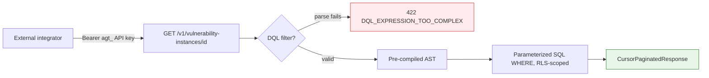

# Public Data API

## Summary

The programmatic read surface: custom metrics, vulnerability instances, batch CVE research. Owner: Engineering. Status: canonical. Gate: 2 (ships at the Seed public-API trigger, not Phase 1).

## Executive Summary

Every Public Data endpoint is a GET except `POST /v1/cve-research` — there is no create, update, or delete for metrics or instances in v1. `confidence_score` is deliberately never exposed on v1; consumers get `exploitability_status` only. The centerpiece is **DQL (Dux Query Language)**, a flat single-entity boolean filter grammar (no joins, no subqueries) that compiles to a parameterized SQL `WHERE` clause scoped by RLS — it never interpolates the raw string, so there is no arbitrary code execution path. Grammar limits (2,000 chars, depth 5, 20 clauses) are enforced at save time as a 422, not silently truncated.

## Specification

### Endpoints

| Endpoint | Notes |
|---|---|
| `GET /v1/custom-metrics` | paginated (`page`, `size` 1-200 default 10), filterable by `entity_type`/`is_active`/`dashboard_id`/`search` |
| `GET /v1/custom-metrics/{id}` | -> `CustomMetricItem` |
| `GET /v1/custom-metrics/{id}/data` | time-range bounded (`from`/`to`), cursor-paginated data points |
| `GET /v1/vulnerability-instances/{cve_id}` | cursor pagination (`limit` 1-5000 default 3000, `expand=asset` only) |
| `POST /v1/cve-research` | batch of 1-50 `cve_ids`, matching `^CVE-\d{4}-\d{4,}$`; 202 -> array of `{status: backlog\|completed}`; per-`cve_id` dedup, not per-batch |

### DQL grammar

```
expression   := clause (( "AND" | "OR" ) clause)*
clause       := "(" expression ")" | comparison
comparison   := field operator value
field        := identifier ("." identifier)*
operator     := "=" | "!=" | ">" | ">=" | "<" | "<=" | "IN" | "NOT IN" | "CONTAINS" | "IS NULL" | "IS NOT NULL"
value        := string | number | boolean | "(" value ("," value)* ")"
```

`AND` binds tighter than `OR`. `CONTAINS` is the only substring/array-membership operator (valid only on `string[]`/`text`). An unknown field is a 422 at save time, not a silent empty result. Example: `severity >= 7 AND (state = "exploitable" OR state = "under_research") AND asset.has_public_ip = true`. Valid grammar is cached as a pre-compiled AST so reads never re-parse.

`EntityType` closed set: `device`, `user`, `label`, `finding`, `cloud_compute`, `vulnerability_instance`, `cve`, `mitigation`.

### Pagination limits

| Parameter | Min | Max | Default |
|---|---|---|---|
| `cve_ids` (batch) | 1 | 50 | - |
| `size` (custom-metrics) | 1 | 200 | 10 |
| `limit` (vulnerability-instances) | 1 | 5000 | 3000 |

### Publishing checklist (Seed, AI-142)

OpenAPI `securitySchemes` (Bearer API key), rate-limit `429` schemas, the scope enum, and a Security review — required before the trigger fires.

## Diagram



## Entities & Concepts

- [[API Overview]] — the three-plane context this API sits inside
- [[Dux Taxonomy and Controlled Vocabulary]] — `EntityType` enum source

## Related

- [[Application API]]
- [[Events & Webhooks]]

## Sources

- `.raw/dux/30-api/public-data-api.md`
