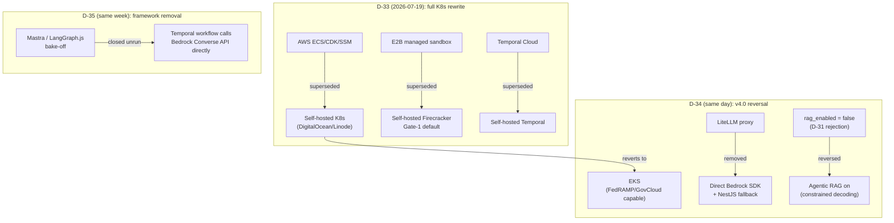

# Dux Architecture Decision Records

## Summary

ADR-001 through ADR-021, the canonical architecture decisions with their revisions. Unlike a spec, an ADR is *meant* to carry its own history — `Superseded` lines are the format working as intended, the one deliberate present-tense exception besides decisions-log.md. Owner: Engineering. Status: canonical, Gate 1. CI lint fails any ADR more than 180 days stale.

## Executive Summary

Twenty-one ADRs, five of them (ADR-006, 007, 010, 015, 017) revised three or more times across the July 2026 infrastructure churn documented in [[Dux Decisions Log]]. The end state: **self-hosted Kubernetes on EKS**, Temporal self-hosted for durable execution, Bedrock Converse API called directly with no agent framework and no LLM proxy in front of it, Postgres (CloudNativePG) carrying relational, vector (pgvector), and graph (Apache AGE) workloads in one RLS-enforced instance rather than three separate stores. The throughline across nearly every ADR revision is the same trade-off, stated explicitly each time: portability and auditability for regulated (finance/healthcare) buyers over the cheaper, faster managed-service default.

## Specification

### Summary table

| ADR | Decision | Status |
|---|---|---|
| ADR-001 | Better Auth via `AuthPort`; JWT + refresh rotation; SPIFFE agent claims | Accepted |
| ADR-002 R2 | Shared-schema RLS FORCE on CloudNativePG | Accepted (R2) |
| ADR-006 R4 | **Kubernetes (EKS) from Gate 1**, Pulumi IaC, Vault, Cloudflare WAF, MinIO audit anchor | Accepted (R4) |
| ADR-007 R3 | Self-hosted Temporal on K8s is the canonical `WorkflowPort` from Gate 1 | Accepted (R3) |
| ADR-008 R2 | CaMeL-tiered LLM routing, ≤$0.75 SLO at 45% cache | Accepted (R2) |
| ADR-010 R5 | **LiteLLM removed** — direct Bedrock SDK behind `LLMProviderPort` | Accepted (R5) |
| ADR-011 R2 | Vendor connector framework, ≥3 live at Gate 1 | Accepted (R2) |
| ADR-012 R3 | Vendor-action write path, **unattended by default at Gate 1** | Accepted (R3) |
| ADR-015 R4 | **Self-hosted Firecracker on K8s is the Gate-1 default**; E2B retired | Accepted (R4) |
| ADR-017 R3 | Multi-provider Claude inference: Bedrock → direct Anthropic → local vLLM | Accepted (R3) |
| ADR-018 | Frontend design system: headless components (React Aria + Radix/shadcn) on a design-token source of truth | Accepted |
| ADR-019 | Data visualization: headless charts (Visx) plus SVG, same token/accessibility discipline | Accepted |
| ADR-020 R2 | Agentic RAG enabled: pgvector + Apache AGE, constrained decoding | Accepted (R2) |
| ADR-021 | Remove Mastra and LangGraph.js; Temporal calls Bedrock Converse API directly | Accepted |

Full 21-ADR table: `.raw/dux/20-architecture/adr-index.md`.

### Selected decisions in depth

**ADR-006 R4 — Deployment topology.** Kubernetes (EKS, managed control plane) from Gate 1. `dux-api`, `dux-connector-sync`, `dux-sandbox` are separate Deployments. Auto-scaling: CPU >70%/2min or memory >80%/2min scales nodes; Temporal worker queue depth >50 scales workers. Secrets: HashiCorp Vault (self-hosted). WAF: Cloudflare edge, backstopped by Falco for in-cluster runtime detection. Audit archive: MinIO Object Locking (Compliance mode).

**ADR-007 R3 — Durable execution.** Self-hosted Temporal gives event-sourced audit trails — every approval/rejection/escalation is an immutable workflow-history event, in-boundary, now a sales-relevant property for finance/healthcare ICPs. Orchestration: supervisor + isolated subagents, one child workflow per tenant (`assessment-{tenant_id}`), continue-as-new at ≥8K/hard 10K/cap 35K events, heartbeat timeouts NVD 30s/AWS 120s/MCP 60s. **The golden set validates (CVE × synthetic-environment) pairs with per-environment ground truth — exploitability is a property of the pair, not the CVE alone** (H1).

**ADR-012 R3 — Vendor action framework.** `endpoint.isolate`, `network.blocklist_add`, `patch.deploy_special_devices`, `ticket.create_remediation` execute at Gate 1 without waiting for human approval, except the two highest-blast-radius actions which are mandatory-HITL per D-17 (see [[Governance Kernel]]). Gate-3 remediation orchestration: Strands A2A v0.2 is the default candidate, gated on 5 criteria (C1–C5); a custom JWT-scoped handler is the fallback if it fails any.

**ADR-015 R4 — Sandbox.** Shared-kernel containers rejected outright for LLM-generated code (CVE-2024-21626 "Leaky Vessels", CVE-2024-0132, SandboxEscapeBench 2026) — the 2026 consensus is that Docker/runc isolation is not a security boundary for AI-generated code. A fresh ephemeral microVM per invocation, never reused (VM reuse is a data-leak vector). `firecracker-containerd`/Kata Containers are an allowed interim bridge — Firecracker is the target architecture, Kata is not a fallback decision.

**ADR-020 R2 — Agentic RAG and graph retrieval.** Reverses ADR-020 R1/D-31's own rejection ("RAG hallucinates; security cannot") by removing the objection via **constrained decoding**: every retrieve/reason/decide step forced through schema-validated tool-use (Bedrock Converse API `toolConfig` pinned to a specific tool) — no free-text output anywhere in the loop. Vector store: Postgres pgvector+pgvectorscale until ~100M vectors. Graph store: Apache AGE, same CloudNativePG instance — a poisoned edge gates an unattended write (GraphRAG poisoning: >93% success at <0.05% corpus edit is the threat model being defended against).

**ADR-021 — Remove Mastra and LangGraph.js.** Both are abstraction layers over capabilities the stack already owns outright (Temporal for durable execution, Bedrock Converse for tool use/structured output/streaming). `ExploitabilityAssessmentWorkflow` is a Temporal TypeScript workflow calling Bedrock Converse directly, S-LLM via `outputConfig.textFormat`, P-LLM via `toolConfig`. Message history lives in Postgres, never Temporal workflow state.

**ADR-018 — Frontend design system (D-29).** Adopt a headless component layer on the existing design-token source of truth (stage-pill colors, risk-group/exposure-state icons, accessibility rules), and own the styling rather than adopting a full component library. **React Aria Components** for the data-dense surfaces (asset tables, up to 5,000-row instance lists, the queue) where WCAG 2.2 AA at 0 axe-core violations (TR-NFR-010) is a hard gate; **Radix/shadcn** elsewhere. The amber token is fixed at the token layer, since the taxonomy audit fails it at a 2.4:1 contrast ratio. Color-and-shape and SVG-not-emoji are enforced as CI lints; `aria-live` is required on the SSE streaming surfaces (H10). Rationale: headless owns the visual identity and gives the deepest available accessibility for the grid-heavy surfaces, where the 0-axe-core gate is at most risk — a full component library would trade the bespoke system for speed.

**ADR-019 — Data visualization (D-30).** Headless charts plus SVG: **Visx** for the donut/trend/distribution charts; custom SVG for the single-hop attack path today; **Cytoscape.js or Sigma+graphology** once multi-hop attack-path traversal ships. A contrast-validated categorical palette encodes by color **and** a second channel — matching the eye/umbrella/tree risk-icon pattern already in use — plus a table/ARIA fallback per chart. Rationale: keeps charts on the same token system and accessibility discipline as the rest of the UI; a high-level charting library would impose a house style that fights the bespoke design system and the icon/shape accessibility rules from ADR-018.

## Diagram

## Entities & Concepts

- [[CaMeL]] — ADR-008 R2, ADR-017 R3, ADR-020 R2
- [[Governance Kernel]] — ADR-012 R3
- [[Dux Decisions Log]] — the decision entries (D-33/34/35) behind these ADR revisions

## Related

- Areas using this: [[Dux Overview]], `wiki/areas/dux-architecture/`

## Sources

- `.raw/dux/20-architecture/adr-index.md`
