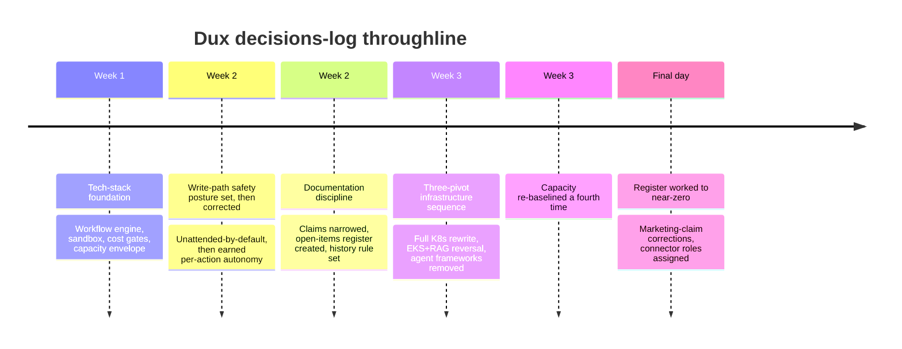
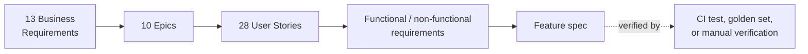

# Dux Decisions & Traceability Reference

Navigation: [[Dux]] | [[Dux Architecture Guide]] | [[Dux Governance & Compliance Guide]]

This page is the audit trail: every decision that shaped the product, and the join table connecting business requirements down to individual verification commands. It's reference material by design: dense and lookup-oriented rather than narrative, because that's what an audit trail is actually for. Specs elsewhere in this knowledge base state current truth in the present tense with no change history; this is the deliberate, sole exception, and it's the most cross-referenced page in the entire corpus.

## The decisions log

Two and a half months of decisions compress into a few real throughlines worth understanding before diving into the detail below:

- **Capacity kept getting re-baselined rather than scope getting cut.** The Gate-1 capacity envelope moved from 1,750 hours to 2,000 to 2,080 to 2,160 hours across five separate decisions, and the team was explicit the last time it happened that a fourth consecutive raise should never be treated as precedent or as headroom for still-unestimated work.
- **The write-action autonomy posture swung twice before landing.** It started as mandatory human approval on every write action, flipped to unattended-by-default on all five actions, then corrected two days later to the mixed posture still live today: three actions unattended by default, two held to mandatory approval on every call.
- **The infrastructure stack pivoted three times in five days.** AWS ECS moved to self-hosted Kubernetes, which moved to EKS with several reversals bundled in the same decision, which was followed a week later by removing the agent frameworks entirely in favor of calling the model API directly from Temporal.
- **The founder spent one day closing the open-items register to near-zero,** working seventeen items in a single pass, including two live marketing-claim retractions.

### Foundational tech-stack decisions

Early decisions set defaults that mostly got reversed later, which is itself a useful pattern to notice: an E2B-managed sandbox (later reversed to self-hosted Firecracker), Temporal Cloud with one namespace per environment (later self-hosted), AWS SSM for secrets (later Vault). Three decisions from this era stuck and are still load-bearing: the cost gates ($0.675 soft breaker, $0.55 CI gate, $0.75 Gate-1 hard criterion), the two-plane rate-limit split, and the sandbox budget of 300 seconds per hour with 5 concurrent microVMs per tenant, including its partial-failure semantics: a blocked script never retries, a timeout gets one retry before escalating to mandatory review, and an out-of-memory failure never retries and escalates immediately.

### The governance layer, specified and then corrected

AWS Bedrock became the Claude inference path (later made multi-provider). `VendorActionGate` was specified as the fourteenth governance gate, carrying the risk matrix described in [[Dux AI Safety Guide]]. A five-entry rollback catalog was authored, and the one action with no viable API-level rollback (patching firmware-only devices) was held to mandatory human review specifically because it lacked one. The single most consequential decision in this entire log is the one that established **earned, per-action-class write autonomy**: two actions (`endpoint.isolate`, `patch.deploy_special_devices`) became mandatory-HITL on every call, while the other three stayed unattended by default with review reserved for anomaly escalation. That reversed part of a two-day-old prior decision that had made all five actions unattended by default: a real, on-the-record safety correction, not a minor adjustment.

### Documentation discipline

Three decisions from the same week still shape how every page in this knowledge base is written: marketing claims were scoped to bind only GTM copy, product naming, and UI strings: never safety posture, gate criteria, or SLOs; unresolved questions were pulled out of prose entirely and into the open-items register; and change history was banned from specs entirely, living only in this log.

### Holding the line against an outside redesign

Two external technical-design documents proposed a materially different stack: a different orchestration layer, a different message queue, a different ingestion framework, a different vector database, a graph-first rather than Postgres-first data model, and a single composite risk score instead of the calibrated confidence ensemble. **None of it was adopted, and no architecture decision or safety-spine change resulted.** The reasoning holds up: both documents were written by outsiders without access to this corpus, and every proposed divergence was either premature scaling (introducing infrastructure ahead of the traffic that would justify it) or actively undermined the product's own positioning: a single composite score is exactly the kind of "yet another risk score" the product's public thesis argues against. The safety spine specifically (the governance gate chain, the kill switch, HITL tiers, per-tenant workflow isolation) is built directly on the chosen workflow engine's contract, so swapping orchestration layers alone would have forced rebuilding the entire AI-safety layer from scratch. Two narrower pieces of the outside proposal were kept genuinely open for a real evaluation on their own merits rather than dismissed outright: an ingestion accelerator for long-tail connectors, and per-tenant database isolation as a future enterprise tier.

### The three-pivot infrastructure sequence

All three of these landed within five days of each other:

1. **A full stack replacement:** AWS's managed services gave way to self-hosted Kubernetes plus Vault plus Cloudflare WAF plus MinIO; the managed database and workflow engine both moved to self-hosted equivalents; the sandbox moved to self-hosted Firecracker as the Gate-1 default. The driving fact behind all of it: Dux sells into finance and healthcare, so infrastructure portability and avoiding single-vendor dependency outrank the cheaper, faster managed-service path. This alone added real capacity cost, pushing utilization to roughly 103.5% of the then-current envelope.
2. **A same-day partial reversal:** hosting moved again, this time to Amazon EKS specifically, because FedRAMP/GovCloud capability outweighed the single-vendor concern that had motivated leaving AWS in the first place. The LLM proxy layer was removed entirely in favor of a direct SDK integration. Agentic RAG, previously rejected on safety grounds, was re-enabled via constrained decoding. A graph database layer was added alongside the existing vector store.
3. **Framework removal, the same week:** the two agent-orchestration frameworks under evaluation were both removed entirely: the reasoning loop became a plain workflow calling the model API directly, no framework in between.

### Capacity re-baseline ladder

| Decision | Date | Envelope | Backlog | Utilization |
|---|---|---|---|---|
| First re-baseline | 2026-07-09 | 2,000h (16-week) | - | - |
| Second pass | 2026-07-15 | 2,000h | 2,002h | ~100.1% |
| Third re-baseline | 2026-07-16 | 2,080h | 2,040h | ~98% |
| Infrastructure-pivot impact | 2026-07-19 | 2,080h | 2,154h | ~103.5% |
| Fourth re-baseline | 2026-07-20 | **2,160h** | 2,118h | ~98.1% |

That fourth re-baseline explicitly rejected treating itself as a precedent: the buffer it created was recorded as not-to-be-used as headroom for still-unestimated future scope.

### Closing the open-items register

In a single day, the founder worked the open-items register from a substantial backlog down to near zero, P0 through P2. A few closures are worth knowing individually: a previously-cited analyst quote, once logged as "confirmed primary research," was downgraded to unconfirmed and pulled from active sales use: an explicit, on-the-record self-correction rather than a silent edit. A specific customer-facing metrics claim was independently confirmed as real after two *other* plausible-sounding claims investigated in the same pass turned out to be fabricated and were never allowed into the corpus at all. The correct legal entity name was confirmed and reconciled against an internal document that had the wrong name on it. All 33 outstanding roadmap-wave vendor connectors were assigned real catalog roles in one pass. And an embedding integrity-hash specification closed most of a long-standing open item around defending the retrieval layer against data poisoning.



## The traceability matrix

Where the decisions log is chronological, this is structural: the join table connecting thirteen business requirements down through ten epics, twenty-eight user stories, and their technical requirements, to the verification command that actually proves each one. The chain runs one direction by design: vision anchor, to business requirement, to epic, to user story, to functional/non-functional requirement, to feature spec, to a CI test or golden-set check that verifies it.

```
Vision anchor → Business requirement
              → Epic (groups the corpus's functional requirements)
                → User story
                  → Functional / non-functional requirement → technical spec
```

Worth knowing as a maintenance hazard rather than just trivia: the chain is bidirectional in principle but the validator only checks the forward direction: a user story quietly dropped from a business requirement's story list, or a requirement dropped from an epic's parent list, breaks the chain silently. This exact defect has been caught by hand more than once during review passes, which is precisely why it's worth flagging here rather than assuming automated tooling catches it.

### The ten epics

| Epic | Theme | Parent requirements |
|---|---|---|
| Multi-tenant platform & auth | Foundation | Zero cross-tenant leakage |
| Environmental data ingestion | Connectors & feeds | Multi-source ingestion |
| Exploitability assessment engine | Core reasoning | Agentic analysis, predictive forecasting |
| Continuous re-assessment | Freshness | Agentic analysis |
| Analyst surfaces & APIs | UX + programmatic access | Analysis, audit, dashboards |
| Mitigation & remediation write path | The write surfaces | Analysis, kill switch/governance |
| Safety & governance | The safety spine | Kill switch, audit, multiple safety BRs |
| Programmatic platform | Public API | Audit, programmatic access |
| Triage disposition | Acknowledgment | Vulnerability-instance handling |
| Personalization | Preference learning | Agentic analysis |

### The business requirements that matter most

| Requirement | What it demands | Gate | How it's verified |
|---|---|---|---|
| Zero cross-tenant data leakage | No agent or query can ever cross a tenant boundary | Gate 1 | Tenant-ID fuzz testing, the full isolation suite |
| Agentic exploitability analysis | Evidence-backed verdicts, not scanner noise | Gate 1 core, extended through Gate 3 | Golden set, trace export, nightly eval |
| Kill switch + governance enforcement | Sub-5-second propagation at levels 2 through 4 | **Pre-launch**: the corpus's only requirement gated ahead of a numbered Gate | Kill-switch and governance-kernel test suites |
| Multi-source ingestion | AWS, NVD/KEV/EPSS, CSV, and 3+ vendor connectors | Gate 1 | Connector sync tests |
| Tamper-evident audit trail | Hash-chained, exportable | Gate 1 | Audit verification endpoint, trace export |
| Predictive risk forecasting | Trend deltas, explicitly not a new ML model | Gate 2 | Trend-computation tests |

That kill-switch requirement being gated "pre-launch" rather than at a numbered gate is worth noticing on its own: it's the one requirement in the entire matrix treated as more urgent than the Gate-1 bar itself.

### A sample of the user-story index

| Story | What it covers | Epic | Status |
|---|---|---|---|
| Prerequisites Analysis | Step 1 of the investigation journey | Assessment engine | Live at Gate 1 |
| Action Cards | Mitigation execution | Write path | Gate 1, unattended by default |
| Chat Guidance | The conversational surface | Analyst surfaces | Gate 1, write tools on their own HITL schedule |
| Fast Actions | One-click mitigation | Write path | Gate 1, unattended by default |
| Assessment Trace | The "why" panel, including executed code | Assessment engine | Gate 1, including execution results |
| Continuous Re-assessment Scheduler | Automatic re-evaluation on world-state change | Continuous re-assessment | Gate 1 |
| Asset Risk Trend Forecast | Predictive risk forecasting | Assessment engine | Gate 2, draft |

The full story set spans 28 stories in total: see [[Dux Feature Reference]] for the ones that ship complete product specs, and the raw traceability matrix source for the complete numbered index.

### Selected technical requirements

| Requirement | Target |
|---|---|
| Zero cross-tenant reads | 100% enforced in CI |
| Assessment start latency | p95 under 2 seconds |
| Kill switch propagation | Under 5 seconds p99 (levels 2–4) |
| Assessment quality | Golden-set regression under 2%, a hard merge block |
| Per-tenant LLM cost cap | $25/hour default |
| API availability | 99.5% monthly, excluding LLM provider outages |



## Sources

- `.raw/dux/00-meta/decisions-log.md`
- `.raw/dux/00-meta/traceability-matrix.md`
