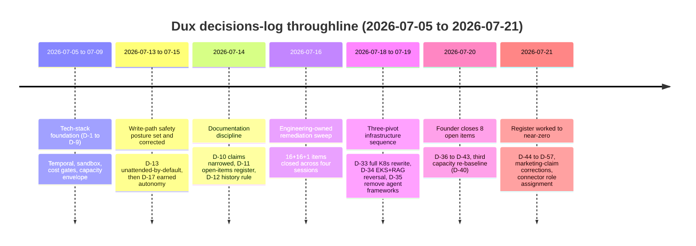

# Dux Decisions Log

## Summary

The single history home for the entire `docs/` corpus — **every decision that shaped it is recorded here, dated, with rationale, and only here** (135KB source, 57+ numbered decisions, the most-linked file in the corpus at 53 inbound references). Specs state current truth in the present tense and carry no change history (D-12); this note is the exception, by design. Owner: Founder. Started 2026-07-05.

## Executive Summary

Two months of decisions compress into one throughline: a five-engineer team repeatedly re-baselined its Gate-1 capacity envelope (1,750h → 2,000h → 2,080h → 2,160h across D-7/D-8/D-19/D-23/D-40) rather than cut scope, while the write-action autonomy posture swung twice — mandatory HITL on every write → unattended-by-default on all five (D-13, 2026-07-13) → mixed posture with 2 of 5 actions pulled back to mandatory HITL (D-17, 2026-07-15) — landing on the posture still live today. The infrastructure stack itself pivoted three times in five days (2026-07-18 to 2026-07-19): AWS ECS → self-hosted Kubernetes on DigitalOcean/Linode (D-33) → EKS + Agentic RAG re-enabled + LiteLLM removed (D-34) → Mastra/LangGraph.js also removed in favor of Temporal+Bedrock direct (D-35). The most recent phase (2026-07-21, D-44 through D-57) is Sagi working the open-items register to zero, one item at a time, closing 17 items in a single day including two live-marketing-claim retractions (D-48 Gartner quote pulled from active use, D-51 legal entity name corrected).

## Specification

### Process & structure (P-1…P-5)

All four legacy playbooks rewritten into `docs/`; canon is Gap Closure & Ideal-State v2.2; numbered domain folders 00-meta…90-execution mirror the product's feature structure; contradictions resolved via the corpus's own authority hierarchy.

### Foundational tech-stack decisions (D-1…D-9, 2026-07-05–09)

E2B sandbox default (later reversed, see D-33/D-15 R4) · Temporal Cloud single-namespace-per-environment (later self-hosted, D-33) · cost gates ($0.675 soft breaker, $0.55 CI gate, $0.75 Gate-1 criterion) · **D-4 HITL timing**, later substantially reworked · AWS SSM secrets (later Vault, D-33) · two-plane rate limits · **D-7: capacity re-baseline to 2,000h/16-week envelope** · **D-8: adversarial-audit disposition, four 🔴 findings folded into Gate-1 scope** · **D-9: sandbox budget 300 sandbox-s/hr + 5 concurrent microVMs**, partial-failure semantics (BLOCKED→no retry, TIMEOUT→1 retry then HITL T3, OOM→no retry+HITL T3).

### Governance layer specified (D-13…D-17, 2026-07-13–15)

**D-13:** AWS Bedrock becomes the Claude inference path (later made multi-provider, D-33/D-34). **D-14: `VendorActionGate` = GOV-014**, with the `GOV-TOOL-*` risk matrix — see [[Governance Kernel]]. **D-15:** rollback catalog R-01…R-05 authored; `patch.deploy_special_devices` held to mandatory HITL for lacking one. **D-17: earned per-action-class write autonomy** — the pivotal safety-posture correction, reversing part of the two-day-old D-13 unattended-by-default call: `endpoint.isolate` and `patch.deploy_special_devices` become mandatory-HITL-every-call; the other three stay unattended by default, HITL on anomaly escalation only. This is the posture still live.

### Documentation discipline (D-10…D-12, 2026-07-14)

**D-10:** claims-alignment directive narrowed — marketing claims bind GTM copy/naming/UI strings only, never safety posture, gate criteria, or SLOs (supersedes an earlier version of itself that had gone further). **D-11:** open questions leave prose and become the `OI-##` register. **D-12:** change history leaves prose and lives only in this file.

### Three-pivot infrastructure sequence (D-33…D-35, 2026-07-19)

**D-33 (full stack replacement):** AWS ECS/CDK/SSM/WAF/S3 → self-hosted Kubernetes (DigitalOcean/Linode) + Pulumi + Vault + Cloudflare WAF + MinIO; Neon → CloudNativePG; Temporal Cloud → self-hosted Temporal; E2B → self-hosted Firecracker as the **Gate-1 default**; ADR-017 reversed to multi-provider Claude inference. Driven by one override fact: Dux sells to finance/healthcare, so portability and no single-vendor dependency now outrank cheap-and-fast. Capacity impact: +114h, landing at 2,154h/2,080h (~103.5% — [[Dux Overview|OI-39]] opened).

**D-34 (v4.0 unified architecture, same-day reversal of two D-33 axes):** hosting reverts DigitalOcean/Linode → **EKS** (FedRAMP/GovCloud capability outweighs single-vendor concern); **LiteLLM removed entirely**, replaced by direct Bedrock SDK + NestJS-level fallback; **Agentic RAG re-enabled** (`rag_enabled = true`, reversing D-31's rejection) via constrained decoding — see [[CaMeL]]; **Apache AGE** added as the graph layer alongside pgvector.

**D-35 (same week):** Mastra and LangGraph.js removed entirely — the agent reasoning loop is a Temporal workflow calling Bedrock Converse API directly, no agent framework. See ADR-021 in [[Dux Architecture Decision Records]].

### Capacity re-baseline ladder

| Decision | Date | Envelope | Backlog | Utilization |
|---|---|---|---|---|
| D-7 R1 | 2026-07-09 | 2,000h (16wk) | — | — |
| D-19 | 2026-07-15 | 2,000h | 2,002h | ~100.1% |
| D-23 | 2026-07-16 | 2,080h | 2,040h | ~98% |
| D-33 impact | 2026-07-19 | 2,080h | 2,154h | ~103.5% |
| D-40 | 2026-07-20 | **2,160h** | 2,118h | ~98.1% |

D-40 explicitly rejects a fourth consecutive raise as precedent: "this buffer must not be treated as headroom for still-unestimated scope."

### Register closure, item by item (D-44…D-57, 2026-07-21)

Sagi worked the `OI-##` register P0→P1→P2 in a single day. Notable closures: **D-48** — the Gartner (Nunez) quote in `competitive.md`, previously called "confirmed primary research" (2026-07-09 entry), is downgraded to unconfirmed and pulled from active sales use — an explicit, on-the-record self-correction, not a silent edit. **D-49** — the "65-day MTTR" RSA-2026 LinkedIn post is confirmed real (Sagi located it directly) after two other plausible-sounding claims researched in the same pass turned out to be fabricated (a false Dux-hosted RSA reception; a false Redpoint InfraRed 100 placement) and were never entered into the corpus. **D-51** — "Dux, Inc." confirmed as the correct legal entity name; the company's own live Privacy Policy PDF ("Dux Technologies Inc.") is the error. **D-54** — all 33 roadmap-wave vendor connectors assigned real catalog roles. **D-55** — embedding integrity-hash spec closes most of OI-41 (adversarial-neighbor RAG-poisoning defense).

## Diagram

## Entities & Concepts

- [[Sagi]] — sole named decision-maker
- [[Dux Architecture Decision Records]] — the ADR-format sibling record for architecture specifically
- [[Governance Kernel]] — specified in D-14, corrected in D-17
- [[CaMeL]] — Agentic RAG reversal (D-34) extends this boundary's constrained-decoding pattern

## Related

- Areas using this: [[Dux Overview]]

## Sources

- `.raw/dux/00-meta/decisions-log.md`
