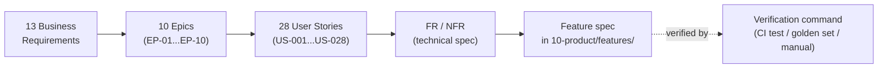

# Dux Traceability Matrix

## Summary

The join table for the entire Dux corpus: Business Requirement → Epic → User Story → FR/NFR → Gate → feature spec → verification command. Owner: Founder. Status: canonical, Gate 1. **This file owns the closed set of 28 user stories** — stories are defined here and never invented downstream in `90-execution/`.

## Executive Summary

13 business requirements roll up into 10 epics (EP-01…EP-10) and 28 user stories (US-001…028); the chain is bidirectional by design and the validator does not check the reverse direction — a US dropped from a BR's story list, or a BR dropped from an epic's parent list, silently breaks the chain, and this exact defect has been caught by hand more than once in decisions-log review passes. The most consequential single row is BR-003 (kill switch + governance-kernel enforcement, <5s L2–L4) — it is the corpus's only "pre-launch" gate rather than a numbered Gate.

## Specification

### Chain

```
Vision anchor → BR (business requirement)
              → Epic (delivery theme, groups the corpus's FR-001…FR-030)
                → US (user story)
                  → FR / NFR → TR-NFR (technical spec)
```

### Epics

| Epic | Name | Parent BRs |
|---|---|---|
| EP-01 | Multi-tenant platform & auth | BR-001 |
| EP-02 | Environmental data ingestion (connectors & feeds) | BR-004 |
| EP-03 | Exploitability assessment engine | BR-002, BR-007, BR-013 |
| EP-04 | Continuous re-assessment | BR-002 |
| EP-05 | Analyst surfaces & APIs | BR-002, BR-006, BR-008, BR-010 |
| EP-06 | Mitigation & remediation write path (HITL) | BR-002, BR-003 |
| EP-07 | Safety & governance | BR-003, BR-005, BR-009 |
| EP-08 | Programmatic platform | BR-006, BR-011 |
| EP-09 | Triage disposition (acknowledgment) | BR-012 |
| EP-10 | Personalization | BR-002 |

### Key business requirements

| BR | Requirement | Gate | Verification |
|---|---|---|---|
| BR-001 | Zero cross-tenant data leakage | Gate 1 | `pnpm test:fuzz-tenant-id`; ISO-001–010 |
| BR-002 | Agentic exploitability analysis (evidence-backed, not noise) | Gate 1 core; Gate 2c/3 extensions | Golden set; trace export; DeepEval CI |
| BR-003 | Kill switch + governance-kernel enforcement, <5s L2–L4 | **Pre-launch** | KS-001; `test:kill-switch`; `test:governance-kernel` |
| BR-004 | Multi-source ingestion (AWS, NVD/KEV/EPSS, CSV, vendor connectors) | Gate 1 (≥3 vendor connectors) | Connector sync tests; CONN-001 |
| BR-005 | Tamper-evident hash-chained audit trail + export | Gate 1 | `/audit/verify`; trace export |
| BR-013 | Predictive risk forecasting (trend deltas, not a new ML model) | Gate 2 | Trend-computation tests |

### Selected user story index

| US | Title | Epic | Gate |
|---|---|---|---|
| US-001 | Prerequisites Analysis | EP-03 | Gate 1 live |
| US-004 | Action Cards | EP-06 | Gate 1, unattended by default |
| US-008 | Chat Guidance | EP-05 | Gate 1 (write tools per HITL schedule) |
| US-016 | Fast Actions | EP-06 | Gate 1, `POST /fast-actions` unattended by default |
| US-017 | Assessment Trace (+ execution results) | EP-03 | Gate 1 incl. `execution_results` |
| US-021 | Continuous Re-assessment Scheduler | EP-04 | Gate 1 |
| US-028 | Asset Risk Trend Forecast | EP-03 | Gate 2 |

Full 28-row index: `.raw/dux/00-meta/traceability-matrix.md` §3.

### NFR crosswalk (selected)

| NFR | Requirement | Target |
|---|---|---|
| NFR-001 | Zero cross-tenant reads | ISO-001–010, 100% CI |
| NFR-003 | Assessment start | p95 < 2s |
| NFR-005 | Kill switch | <5s p99 (L2–L4) |
| NFR-008 | Assessment quality | golden-set regression <2% (P0 block) |
| NFR-011 | Per-tenant LLM cost cap | $25/h default |
| NFR-012 | API availability | 99.5% monthly, excl. LLM providers |

## Diagram



## Entities & Concepts

- [[Dux Overview]] — reading-path hub this matrix serves
- [[Dux Decisions Log]] — the arithmetic/reference bugs found in this file (D-42 hour-rollup exception, multiple traceability-audit passes) are recorded there, not here (present-tense rule)

## Related

- Areas using this: [[Dux Overview]]

## Sources

- `.raw/dux/00-meta/traceability-matrix.md`
