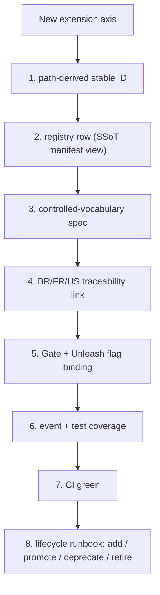

# Dux Catalogs — Registries of Record

## Summary

The registries every extension axis in the Dux corpus is declared in: integrations, agents, model providers, events, feature flags, vendor actions, reasoning evals, compliance frameworks. **The filesystem plus the AI-BOM is the source of truth** — these tables are human-readable views CI validates (`validate-playbooks.py`, `pnpm test:agent-registry-parity`, `aibom-validate`). Owner: Engineering. Status: canonical, Gate 1.

## Executive Summary

Nine registries, one 8-part extensibility contract governing all of them (stable ID → registry row → spec → BR/FR/US link → gate+flag → event+test → CI green → deprecate-on-retire). The integration catalog is the largest and most-revised: 42 wire-level `Sources` enum values, of which ~9 have full catalog rows today and 33 were assigned real connector roles in a single 2026-07-21 pass (D-54). The vendor-action catalog is the safety-critical one — it's the table [[Governance Kernel]]'s `GOV-TOOL-*` matrix and [[Kill Switch]] scoping both key off.

## Specification

### Integration catalog (§1)

**≥3 live connectors ship at Gate 1**: CrowdStrike, Wiz, ServiceNow **or** Entra (ADR-011 R2). W1/Gate 1 set: `aws`, `nvd`, `cisa-kev`, `epss`, `csv-fallback`, `crowdstrike` (ingest+action), `wiz`, `servicenow` (ingest+action), `entra-id`, `splunk`. W2/Gate 3: `intune`, `qualys`. Roadmap (33 vendors, all assigned a real `role` in D-54, 2026-07-21):

| Role | Vendors |
|---|---|
| `asset_discovery` (11) | `jamf`, `kandji`, `workspaceone`, `apple_business_manager`, `microsoft_defender`, `trellix`, `tanium`, `azure_app`, `azure_cloud`, `gcp`, `kace` — MDM/UEM, EDR/XDR, and cloud-platform asset inventory |
| `identity` (5) | `jumpcloud`, `okta`, `onelogin`, `google_workspace`, `google_cloud_identity` |
| `scanner` (6) | `rapid7_insightvm`, `tenable_vm`, `tenable_sc`, `nessus`, `orca`, `upwind` — vulnerability/CNAPP posture scanners |
| `ticketing` (3) | `jira`, `freshservice`, `servicedesk_plus` |
| `threat_intel` (3) | `exploitdb`, `vulncheck`, `first` (FIRST.org exploit-maturity/CVSS data) |
| `network_context` (4, first real use of this ADR-011 R2 role) | `netskope`, `perimeter81`, `prisma_browser`, `island` |
| `validation` (1, first real use of this role) | `horizon3_nodezero` — autonomous pentest/BAS |

**The `Sources` OpenAPI enum (42 values) is not the connector list** — it's a scanner/ingest **provenance attribution tag** set. CI asserts no enum value lacks a taxonomy row. **NVD enrichment fallback:** NVD enrichment collapsed 2026-04-15 (~29,000 pre-March-2026 CVEs stuck `Not Scheduled`); the pipeline falls back to `cisa-kev` + `epss`, which caps confidence at `likely` — never `exploitable` — until NVD resolves for that CVE.

### Agent catalog (§2)

| `agent_id` | layer | customer-visible | blast radius | gate |
|---|---|---|---|---|
| `dux-agent` | product_persona | Y | — | Gate 1 |
| `dux-assessment` | runtime_service | N | medium | Gate 1 |
| `dux-chat-guidance` | runtime_service | Y | medium | Gate 1 |
| `mitigation-agent` | runtime_service | N | high — autonomous, HITL on anomaly only | Gate 1 |
| `remediation-agent` | runtime_service | N | high — autonomous, HITL on anomaly only | Gate 1 |
| `dux-resident-agent` | runtime_service | N | high | Gate 5 |
| `third-party-isv` | third_party_isv | Y | high | Series B |

### Model provider catalog (§3)

Pins dated 2026-06, quarterly review cadence. `openai` primary (`gpt-5.4`, `gpt-5.4-mini`), `anthropic` fallback (`claude-sonnet-4-6`, `claude-haiku-4-5` — evaluate `claude-sonnet-5` at next refresh), `azure-openai-eu` for EU residency. **Zero Data Retention (H2, Gate-1 legal task):** neither provider trains on API data by default, but abuse-monitoring logs are retained (OpenAI ~30 days; Anthropic 7 days by default since 2025-09-14) — ZDR negotiated with both is a precondition of subprocessor listing, and until then **the CaMeL S-LLM must not receive customer-identifying context**.

### Event catalog (§4)

SSoT for webhooks/SSE/audit — full spec in `events-webhooks.md`. Gate-1 webhook events include `assessment.completed`/`state_changed`, `finding.created/updated/deleted`, `mitigation.executed/blocked` (unattended), `remediation.ticket_created` (unattended create+route), `kill_switch.activated`. `hitl_request` is SSE, anomaly-escalation only.

### Feature-flag catalog (§5)

Distinct from the kill switch — a flag is a *release* control, kill switch is a *safety* control. `mitigation_stage`/`remediation_stage`: **Gate 1, on by default** — unattended for 3 of 5 write actions. `rag_enabled`: **on** (2026-07-19, D-34, Agentic RAG + constrained decoding). `hitl_ui` (Week 12) and `chat_write_tools` (Week 14): off until their approval surfaces ship.

### Vendor action catalog (§6) — the write path

| `canonical_action_id` | blast radius | HITL tier | integration | gate |
|---|---|---|---|---|
| `endpoint.isolate` | high | T3, **mandatory every call** | `crowdstrike` | Gate 1 |
| `network.blocklist_add` | medium | T2, unattended by default | `crowdstrike` (IOC/indicator blocklist, D-50) | Gate 1 |
| `policy.deploy_device_config` | medium | T2, unattended once live | `intune` | Gate 3 (connector not yet live) |
| `patch.deploy_special_devices` | high | T3, **mandatory every call** | — (no API rollback) | Gate 1 |
| `ticket.create_remediation` | low | T1, unattended by default | `servicenow` | Gate 1 |

**Writes flow only through `VendorActionGate`** — connectors must never call vendor mutation APIs directly.

### Reasoning eval catalog (§7)

`EXP-CIT-001` (citation present), `EXP-FN-001` (false-negative guard), `EXP-AWS-SG-001`, `EXP-VENDOR-001`. **A golden-set regression above 2% is a P0 merge block** (NFR-008). Personalization is tenant-scoped — never cross-tenant training.

### Compliance framework catalog (§8)

`soc2-type-i` (seed) → `soc2-type-ii` (Series A) → `iso-27001`/`iso-42001` (Series A) → `eu-ai-act` (first EU prospect; Art. 50 transparency 2 Aug 2026, Art. 9/Annex III 2 Dec 2027). Isolation invariants: RLS FORCE on every `tenant_id` table; composite FKs; Apache AGE graph isolation (Neo4j reserved as future escape valve only).

## Diagram

## Entities & Concepts

- [[Dux Agent]] — the `dux-agent` row in the agent catalog
- [[Governance Kernel]] — consumes the vendor-action catalog's `GOV-TOOL-*` mapping
- [[Kill Switch]] — scoped per agent-catalog row

## Related

- Areas using this: [[Dux Overview]]
- Resources: [[Dux Taxonomy and Controlled Vocabulary]]

## Sources

- `.raw/dux/10-product/catalogs.md`
