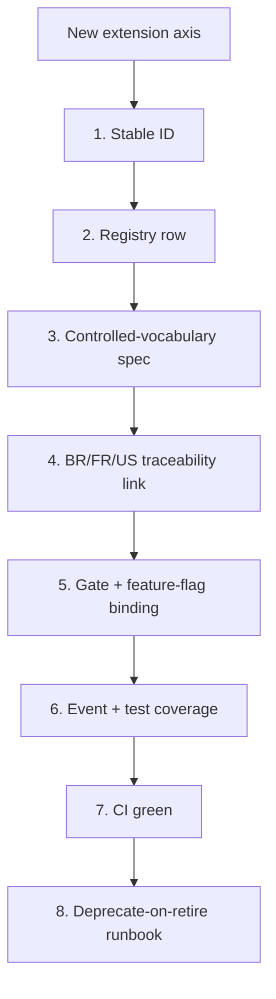

# Dux Taxonomy & Catalogs

Navigation: [[Dux]] | [[Dux Product Guide]] | [[Dux Feature Reference]]

Two registries in one page because they answer the same underlying question from opposite directions: the **taxonomy** fixes what every label and enum *means*, and the **catalogs** fix what every extension point *is*. Between them, they're the controlled vocabulary the entire product speaks. OpenAPI 3.1 owns the public wire enums; this page owns the UI and application-layer projections onto them.

## The layered exploitability model

Every exploitability verdict Dux produces flows through **one direction only**: application assessment → UI exposure state → public API status, never the reverse. Each layer has its own fixed vocabulary, cross-mapped:

| Layer | Values | Where it's used |
|---|---|---|
| Application assessment | `exploitable` / `likely` / `unlikely` / `not_exploitable` / `insufficient_data`, plus a `confidence_score` | `AssessmentDto`, Exposure Analysis, abstention handling |
| UI exposure states | `Protected` / `PartiallyMitigated` / `MitigationRequired` / `Exposed` | Research Dashboard, Dashboard Audit, the design system |
| Public API (`exploitability_status`) | `potentially_exploitable` / `not_exploitable` / `partially_mitigated` / `null` | `GET /v1/vulnerability-instances/{cve_id}` |

Confidence bands map application labels to public projections:

| Confidence range | Application label | Public projection |
|---|---|---|
| 0.85–1.00 | `exploitable` | `potentially_exploitable` |
| 0.70–0.85 | `likely` | `potentially_exploitable` |
| 0.40–0.70 | `unlikely` | `partially_mitigated` |
| 0.00–0.40 | `not_exploitable` | `not_exploitable` |
| abstain | `insufficient_data` | `null` |

The raw `confidence_score` itself is never exposed on the public v1 API. `insufficient_data_reason` (`asset_gap` / `intel_gap` / `context_limit`) stays application/UI-only. The `network_exposure` verdict behind "reachable" (below) is itself a closed, nullable enum: `internet` / `external` / `internal` / `unreachable`.

A handful of UI labels alias onto this model rather than adding new states: Figma's "Exploitable" label means the Mitigation Required subset (`potentially_exploitable`); "Not Exploitable" and "Unexploitable" both mean Protected (`not_exploitable`); "Unresearched" means `null`.

### EntityType: the closed set behind DQL and custom metrics

Eight entity types, gated in two waves:

| Gate | Types |
|---|---|
| Gate 1 | `device`, `cloud_compute`, `finding`, `vulnerability_instance`, `cve` |
| Gate 2c+ | `mitigation`, `label`, `user` |

## Confidence, calculated honestly

Dux deliberately does not compute a single composite "DuxScore." Confidence is instead a calibrated three-signal ensemble:

| Signal | Weight | Available when |
|---|---|---|
| Mean top-1 logprob on claim-bearing tokens | 0.40 | Only when the model API exposes logprobs |
| Semantic entropy across meaning-clustered completions | 0.35 | Always |
| Verbalized confidence (structured output) | 0.25 | Always |

Without logprobs, the remaining two signals renormalize to 0.54/0.46. The blended score feeds Platt scaling to produce the final calibrated `confidence_score`. The rule that matters most in practice: **evidence freshness caps confidence.** Evidence older than a connector's freshness SLO sets a degraded-evidence flag, and degraded evidence simply cannot support a high-confidence band: an `exploitable`/`likely` verdict gets downgraded, or falls all the way to `insufficient_data`, rather than being reported at face value. Full methodology in [[Dux AI Safety Guide]].

## Reachable vs. breachable

A framing distinction worth internalizing, because it's how the product explains its own verdicts to customers: **reachable** means a network path exists (`network_exposure` says so); **breachable** means reachable *and* the exploitation prerequisites are met *and* no blocking control is in the way. No schema change is implied by the distinction: it's the same underlying data, described precisely. The "Relationship Graph Engine" customers see is the marketing name for this existing vulnerability↔asset↔control mapping: single-hop only today; multi-hop lateral-movement traversal is roadmap.

## Mitigation factor cards

| Display title | Internal type | Evidence source | Status |
|---|---|---|---|
| AWS Security Group Blocks Port | `aws_sg_blocks_port` | AWS | Gate 1 |
| Product Not Affected | `product_not_affected` | assessment logic | Gate 1 |
| Network Reachability | `network_reachability` | AWS + multi-connector | Gate 1, partial |
| Firewall Blocks Exploitation | `firewall_blocks_exploitation` | CrowdStrike | Gate 1 |
| Process Not Listening On Ports | `process_not_listening` | resident agent | Gate 5 |

**Figma's "playbook cards" are these same factor cards under a design-file name, never a separate entity** — the identical naming trap as "Mitigation nav" versus "Mitigate stage" below, and worth stating with the same explicitness.

Underneath the factor cards sits a second, more granular controlled vocabulary: the specific `CONTROL.settings` values the UI surfaces as the rule detail when a card is expanded. These don't replace the factor-card model, they back it:

| Setting | Meaning | Example attribution |
|---|---|---|
| `InboundPortBlock` | Blocks external traffic to the affected service port | "Source: CrowdStrike Firewall" |
| `RestrictedIPAllowlist` | Allows access only from approved IP ranges | - |
| `DefaultDenyExternalAccess` | Denies all unsolicited external connections by default | - |

## The naming glossary

Roughly half of every cross-file terminology bug found during the corpus's own review passes traces back to violating one of these rules: this is the highest-leverage table on this page:

| Canonical term | Deprecated / internal-only alias | The rule |
|---|---|---|
| **Dux Agent** | Dux AI, AI-workers | The only customer-facing agent name |
| **Mitigation nav** | - | The Analyze-stage research queue (visibility only) |
| **Mitigate stage** | - | Write-action automation: **not the same as Mitigation nav** |
| **kill switch** (noun) | kill-switch (adjective only) | Levels KS-L1 through KS-L4 |
| **CaMeL** | camel-plane | The dual-LLM safety boundary |
| **World Model** | world model | A versioned proper noun, not a generic phrase |
| **tenant** | organization (UI only) | API and code always say `tenant_id` |
| exploitability assessment | assessment (UI shorthand) | Formal docs and US-011 use the full term |
| Exposure Analysis | Exposure drill-down | Nav label vs. page name |

## Design system

Exposure-state colors are fixed and always paired with a shape or icon, never color alone (WCAG 2.2 SC 1.4.1): Protected `#22C55E`, Partially Mitigated `#F59E0B` (fails contrast at 2.4:1 on its own, pair with icon/shape, or darken to `#B45309`), Mitigation Required `#DC2626`, Exposed `#EF4444`, Listening `#F472B6`, primary accent `#8B5CF6`, actions CTA `#EC4899`. Icons are always SVG with ARIA labels: never emoji.

**Stage pills** carry their own color family, distinct from the exposure-state colors above: Exploitability Analysis is pink (the `#EC4899` family), Lightweight Mitigations is tan/brown, and Remediation Acceleration is blue.

**Iconography pairs a shape with every color, never color alone** (the same WCAG 2.2 SC 1.4.1 rule the exposure-state colors follow): a solid umbrella means Protected, an umbrella with rain means Partially Mitigated, a crossed circle means Mitigation Required, a pulsing crossed circle with an exclamation mark means Exposed, signal waves mean Listening, a brain or lightbulb marks AI reasoning, a lightning bolt marks a quick action, and a D-shield (pink when active, grey when inactive) marks the Dux Agent itself.

**Typography** runs on Inter (or the system font as fallback): a headline is 24px at weight 700, a card title is 16px at weight 600, a metric is 32px at weight 700 rendered in its state color, and body text is 14px at weight 400. Spacing runs on a 4px base unit: 24px card padding, 16px gaps, 32px section spacing.

## Error taxonomy

`AGENT_TIMEOUT` (504) · `CONTEXT_EXHAUSTED` (422) · `BUDGET_EXCEEDED` (429) · `GOVERNANCE_BLOCKED` (403) · `INSUFFICIENT_DATA` (422, with subtypes `asset_gap` / `intel_gap` / `context_limit`). A workflow abandons after 15 minutes; context checkpoints at 80%+ depth and is resumable via `POST /assessments/{id}/resume`.

A parallel set of application-level error classes covers the same failures at the exception level rather than the wire level: `TenantIsolationError` (403), `ConnectorSyncError` (502), `AgentBudgetExceeded` (429), and `AssessmentDedupConflict` (409).

### Platform edge cases

| Scenario | Expected behavior |
|---|---|
| NVD unavailable more than 2 hours | Serve from the S3 cache; warn via `NVD_SYNC_WARN` past 2 hours, escalate to critical via `NVD_SYNC_STALE` past 4 hours |
| AWS throttling | Exponential backoff plus jitter, max 5 retries, `AWS_SYNC_FAILURE` at P2 |
| Workflow action storm | Continue-as-new at 35,000 events, max 2 retries |
| Cross-tenant URL manipulation | 404, to mask existence. More than 20 masked 404s per IP per 5 minutes triggers a SIEM alert |
| Webhook delivery failure | 5 attempts, then dead-letter; alert above 10 failures per tenant per hour |
| Rate limit exceeded | 429 (RFC 6585) plus `Retry-After` (RFC 9110); admin notified if the queue stalls more than 5 minutes |
| Context window exhaustion | Checkpoint into `assessment_checkpoints` (JSONB); resumable via the resume endpoint; abandons with `CONTEXT_EXHAUSTED` at 80%+ depth |

---

## World Model

**World Model** is a proper noun: a versioned artifact (`world_model_versions`), never written lowercase. It's the evidence substrate every Dux Agent assessment reasons over, built from eight evidence types: `ASSET`, `FINDING`, `CONTROL`, `OWNERSHIP_EVIDENCE`, `EXPLOITABILITY_ASSESSMENT`, `ASSESSMENT_REASONING_STEP`, `ATTACK_PATH`, `CONTROL_MAPPING`. Every connector sync that materially changes ingested evidence bumps the version; a 24-hour in-flight compatibility window plus a purge job keep the versioning cost bounded.

A governance rule worth stating plainly: a new World Model evidence type must extend the catalog registry below *before* it extends any connector-specific annex: evidence typing is corpus-governed, not something a connector integration can define locally. And because evidence freshness caps confidence (above), a stale connector doesn't fail loudly: it quietly feeds stale evidence into the World Model, which produces a wrong verdict. The corpus treats that as a safety defect, not a data-quality nitpick.

Agentic RAG retrieval runs against the World Model's graph projection (Apache AGE) and vector store (pgvector) in parallel with episodic memory and live threat-intel APIs: see [[Dux Architecture Guide]] for the full retrieval architecture.

---

## The nine registries

Every extension axis in the Dux corpus (a new integration, a new agent, a new write action) is declared in one of nine registries, all governed by the same eight-part contract: stable ID → registry row → controlled-vocabulary spec → BR/FR/US traceability link → gate and feature-flag binding → event and test coverage → CI green → a deprecate-on-retire runbook. **The filesystem plus the AI Bill of Materials is the actual source of truth; these tables are human-readable views that CI validates** against `validate-playbooks.py`, an agent-registry parity test, and an AI-BOM validator.

### 1. Integration catalog

The largest, most-revised registry. At least three live connectors ship at Gate 1 (CrowdStrike, Wiz, and ServiceNow or Entra). The full Wave-1/Gate-1 set: `aws`, `nvd`, `cisa-kev`, `epss`, `csv-fallback`, `crowdstrike` (ingest + action), `wiz`, `servicenow` (ingest + action), `entra-id`, `splunk`. Wave 2 / Gate 3 adds `intune` and `qualys`.

Beyond that near-term set, the public `Sources` OpenAPI enum carries 42 wire-level provenance values: a scanner/ingest attribution tag set, **not** a connector roadmap. As of a single 2026-07-21 pass, all 33 of the not-yet-built values were assigned a real connector role:

| Role | Count | Vendors |
|---|---|---|
| `asset_discovery` | 11 | jamf, kandji, workspaceone, apple_business_manager, microsoft_defender, trellix, tanium, azure_app, azure_cloud, gcp, kace |
| `identity` | 5 | jumpcloud, okta, onelogin, google_workspace, google_cloud_identity |
| `scanner` | 6 | rapid7_insightvm, tenable_vm, tenable_sc, nessus, orca, upwind |
| `ticketing` | 3 | jira, freshservice, servicedesk_plus |
| `threat_intel` | 3 | exploitdb, vulncheck, first (FIRST.org) |
| `network_context` | 4 | netskope, perimeter81, prisma_browser, island |
| `validation` | 1 | horizon3_nodezero (autonomous pentest/BAS) |

One operational fallback worth knowing: NVD enrichment collapsed on 2026-04-15, leaving roughly 29,000 pre-March-2026 CVEs stuck at "Not Scheduled." The pipeline falls back to CISA KEV plus EPSS for those, which caps confidence at `likely` (never `exploitable`) until NVD resolves for that specific CVE.

### 2. Agent catalog

| Agent ID | Layer | Customer-visible | Blast radius | Gate |
|---|---|---|---|---|
| `dux-agent` | product persona | Yes | - | Gate 1 |
| `dux-assessment` | runtime service | No | medium | Gate 1 |
| `dux-chat-guidance` | runtime service | Yes | medium | Gate 1 |
| `mitigation-agent` | runtime service | No | high: autonomous, HITL on anomaly only | Gate 1 |
| `remediation-agent` | runtime service | No | high: autonomous, HITL on anomaly only | Gate 1 |
| `dux-resident-agent` | runtime service | No | high | Gate 5 |
| `third-party-isv` | third-party ISV | Yes | high | Series B |

### 3. Model provider catalog

Pins dated 2026-06, reviewed quarterly. OpenAI is primary (`gpt-5.4`, `gpt-5.4-mini`); Anthropic is fallback (`claude-sonnet-4-6`, `claude-haiku-4-5`, `claude-sonnet-5` is queued for evaluation at the next refresh); `azure-openai-eu` handles EU residency requirements. Enterprise tenants on critical CVEs can escalate further still, to `openai/gpt-5.5`, behind the `reasoning_model_tier` Unleash flag. Zero Data Retention is a Gate-1 legal task: neither provider trains on API data by default, but abuse-monitoring logs are still retained (roughly 30 days at OpenAI, 7 days at Anthropic by default since September 2025): negotiated ZDR with both is a precondition of subprocessor listing, and **until that's in place, the CaMeL S-LLM must not receive customer-identifying context.**

### 4. Event catalog

The source of truth for webhooks, SSE, and audit events (full spec: [[Dux API Reference]]):

| Event(s) | Class | Gate | Producer |
|---|---|---|---|
| `assessment.completed`, `assessment.state_changed` | Webhook | Gate 1 | Assessment workflow |
| `assessment.requeued` | Webhook | Gate 1 | The continuous-reassessment scheduler |
| `finding.created` / `updated` / `deleted` | Webhook | Gate 1 | World Model ingest |
| `vulnerability_instance.updated` | Webhook | Seed | Instance projection |
| `vulnerability_instance.acknowledged`, `.acknowledgment_expired` | Webhook | Gate 1 | Acknowledgment service |
| `attack_path.validated` | Webhook | Gate 1 | Graph projection |
| `ownership.inferred` | Webhook | Gate 1 | Ownership inference |
| `preference.applied` / `.rejected` | Webhook | Gate 2c | Preference learning |
| `control_asset_mapping.updated` | Webhook | Gate 1 | Control-to-asset sync |
| `mitigation.executed` / `.blocked` | Webhook | Gate 1, unattended | The governance kernel |
| `remediation.ticket_created`, `ticket.created` / `.updated` / `.resolved` / `.reopened` | Webhook | Gate 1, create plus route, unattended | ServiceNow adapter |
| `cve_research.backlog` / `.completed`, `custom_metric.updated` | Webhook | Seed | Research queue / metric admin |
| `connector.sync_failed`, `kill_switch.activated` | Webhook | Gate 1 | Connector / kill switch |
| `hitl_request` | SSE | Gate 1, anomaly escalation only | Chat guidance SSE |
| `governance.kill_switch_short_circuit`, `agent.created`, `admin.impersonate` | Audit | Gate 1 | Governance kernel / provisioning |
| `tenant.provisioned` | Audit | Seed | Provisioning |

### 5. Feature-flag catalog

Distinct from the kill switch on purpose: a flag is a *release* control, the kill switch is a *safety* control: never conflate the two.

| Flag(s) | Gate | Default | Kill-switch relation |
|---|---|---|---|
| `chat_interface`, `trace_viewer` | Gate 1 | On | - |
| `camel_plane` | Gate 1 | On | - |
| `api_webhooks` | Gate 1 | Off until configured | - |
| `ownership_inference` | Gate 1 | On | - |
| `hitl_ui` | Week 12 (minimal approve/deny UI) | Off | HITL required |
| `chat_write_tools` | Week 14 (full chat HITL UI) | Off | HITL required |
| `mitigation_stage`, `remediation_stage` | Gate 1, unattended by default for 3 of 5 write actions | On | L2 tenant scope |
| `closed_loop_validation` | Gate 3 | Off | - |
| `optional_physical_residency` | Gate 5 | Off | - |
| `reasoning_model_tier` | Enterprise | Off | Cost cap |
| `platt_scaling` | Gate 2+ | Off | Requires a calibration record |
| `risk_trend_forecasting` | Gate 2 | Off | - |
| `rag_enabled` | Seed, reassessed | On since 2026-07-19 (Agentic RAG with constrained decoding) | - |

### 6. Vendor action catalog

The safety-critical registry: [[Dux AI Safety Guide]]'s governance-kernel tool matrix and the kill switch's scoping both key off this table directly:

| Canonical action | Blast radius | HITL tier | Integration | Gate |
|---|---|---|---|---|
| `endpoint.isolate` | high | T3, mandatory every call | CrowdStrike | Gate 1 |
| `network.blocklist_add` | medium | T2, unattended by default | CrowdStrike (IOC blocklist) | Gate 1 |
| `policy.deploy_device_config` | medium | T2, unattended once live | Intune | Gate 3 |
| `patch.deploy_special_devices` | high | T3, mandatory every call | none: no API rollback | Gate 1 |
| `ticket.create_remediation` | low | T1, unattended by default | ServiceNow | Gate 1 |

Writes flow only through `VendorActionGate`: connectors are never permitted to call a vendor's mutation API directly.

### 7. Reasoning eval catalog

`EXP-CIT-001` (citation must be present), `EXP-FN-001` (false-negative guard), `EXP-NOISE-001` (non-exploitable findings are deprioritized), `EXP-AWS-SG-001`, `EXP-VENDOR-001`. A golden-set regression above 2% is a hard merge block. Personalization stays strictly tenant-scoped: cross-tenant training is never permitted.

### 8. Compliance framework catalog

SOC 2 Type I (Seed) → SOC 2 Type II (Series A) → ISO 27001 / ISO 42001 (Series A) → EU AI Act (triggered by the first EU prospect; Article 50 transparency deadline 2 Aug 2026, Article 9/Annex III deadline 2 Dec 2027). Full detail in [[Dux Governance & Compliance Guide]]. The underlying isolation invariants (row-level security forced on every tenant-scoped table, composite foreign keys, graph isolation via Apache AGE) are covered in [[Dux Architecture Guide]].

## Sources

- `.raw/dux/10-product/taxonomy.md`
- `.raw/dux/10-product/catalogs.md`
