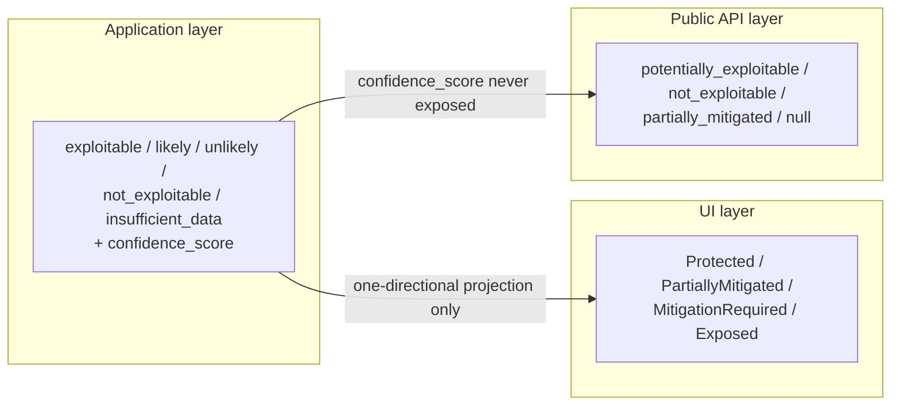

# Dux Taxonomy and Controlled Vocabulary

## Summary

The controlled vocabulary governing exploitability labels, entity types, mitigation factor cards, naming rules, design tokens, and error codes across [[Dux Agent]]. OpenAPI 3.1 owns the public wire enums; this document owns the UI and application-layer projections onto them. Owner: Engineering. Status: canonical, Gate 1.

## Executive Summary

Every exploitability verdict Dux produces flows through **one direction only** — application assessment → UI exposure state → public API status — never the reverse, and every layer's enum values are fixed and cross-mapped. Confidence is a **calibrated 3-signal ensemble** (logprob mean, semantic entropy, verbalized confidence), never a composite CVSS×EPSS×criticality formula — there is deliberately no "DuxScore." A stale connector caps confidence rather than failing silently (H8). The naming glossary and the WCAG-audited design-token set are the other two load-bearing sections: half the corpus's cross-file terminology bugs found in decisions-log review passes trace back to violations of this file's naming rules (Mitigation nav vs. Mitigate stage being the single most common one).

## Specification

### Layered exploitability model

| Layer | Values | Where used |
|---|---|---|
| Application assessment | `exploitable` \| `likely` \| `unlikely` \| `not_exploitable` \| `insufficient_data`, plus `confidence_score` | `AssessmentDto`, US-011, abstention |
| UI exposure states | `Protected` \| `PartiallyMitigated` \| `MitigationRequired` \| `Exposed` | US-010, US-006, design system |
| Public API (`exploitability_status`) | `potentially_exploitable` \| `not_exploitable` \| `partially_mitigated` \| `null` | `GET /v1/vulnerability-instances/{cve_id}` |

**Confidence bands** (lower bound inclusive, upper exclusive):

| Band | Label | Public projection |
|---|---|---|
| [0.85, 1.00] | `exploitable` | `potentially_exploitable` |
| [0.70, 0.85) | `likely` | `potentially_exploitable` |
| [0.40, 0.70) | `unlikely` | `partially_mitigated` |
| [0.00, 0.40) | `not_exploitable` | `not_exploitable` |
| abstain | `insufficient_data` | `null` |

`confidence_score` is **not exposed on public v1**. `insufficient_data_reason` (`asset_gap` \| `intel_gap` \| `context_limit`) is application/UI only. `network_exposure`: `internet` \| `external` \| `internal` \| `unreachable` (nullable).

### Confidence scoring methodology

Not a composite risk score — a 3-signal ensemble (full spec: `confidence-calibration.md`):

| Signal | Weight | When available |
|---|---|---|
| Mean top-1 logprob (claim-bearing tokens) | 0.40 | when API exposes logprobs |
| Semantic entropy (meaning-clustered completions) | 0.35 | always |
| Verbalized confidence (structured output) | 0.25 | always |

Without logprobs, renormalizes to entropy 0.54 / verbalized 0.46. Feeds Platt scaling → calibrated `confidence_score`. **Evidence freshness caps confidence (H8):** evidence past a connector's freshness SLO sets a degraded-evidence flag; degraded evidence cannot support a high-confidence band — `exploitable`/`likely` is downgraded or becomes `insufficient_data`.

### Entity types and evidence types

`EntityType` (DQL/custom metrics): `device` · `cloud_compute` · `finding` · `vulnerability_instance` · `cve` (Gate 1) · `mitigation` · `label` · `user` (Gate 2c+).

[[World Model]] evidence types: `ASSET` · `FINDING` · `CONTROL` · `OWNERSHIP_EVIDENCE` · `EXPLOITABILITY_ASSESSMENT` · `ASSESSMENT_REASONING_STEP` · `ATTACK_PATH` · `CONTROL_MAPPING`.

### Mitigation factor cards (US-011)

| Display title | `factor_type` | Source | Gate |
|---|---|---|---|
| AWS Security Group Blocks Port | `aws_sg_blocks_port` | `aws` | Gate 1 |
| Product Not Affected | `product_not_affected` | assessment logic | Gate 1 |
| Network Reachability | `network_reachability` | `aws` + multi-connector | Gate 1, partial |
| Firewall Blocks Exploitation | `firewall_blocks_exploitation` | `crowdstrike` | Gate 1 |
| Process Not Listening On Ports | `process_not_listening` | `dux-resident-agent` | Gate 5 |

**Reachable vs. breachable:** the customer-facing framing of `network_exposure` + the exposure states + factor cards — "reachable" (network path exists) vs. "breachable" (reachable, prerequisites met, no blocking control). No schema change implied. **Relationship Graph Engine** = the existing vuln↔asset↔control mapping, single-hop only today.

### Naming glossary (selected)

| Canonical | Deprecated/internal alias | Rule |
|---|---|---|
| **Dux Agent** | Dux AI, AI-workers | Only customer-facing agent name |
| **Mitigation nav** | — | The research queue — the **Analyze** stage (US-010) |
| **Mitigate stage** | — | Mitigation *automation* (`mitigation_stage`) — **not the same as Mitigation nav** |
| **kill switch** (noun) | kill-switch (adjective only) | Levels KS-L1–L4 |
| **CaMeL** | camel-plane | The dual-LLM boundary |
| **World Model** | world model | A versioned proper noun |

### Design system

Exposure-state colors: Protected `#22C55E` · Partially Mitigated `#F59E0B` (fails WCAG 2.2 SC 1.4.3 at 2.4:1 — icon/shape only, or darken to `#B45309`) · Mitigation Required `#DC2626` · Exposed `#EF4444` · Listening `#F472B6` · Primary accent `#8B5CF6` · Actions CTA `#EC4899`. **Color and shape always together** (WCAG 2.2 SC 1.4.1) — never color alone. SVG with ARIA labels, never emoji.

### Error taxonomy

`DuxErrorCode`: `AGENT_TIMEOUT` (504) · `CONTEXT_EXHAUSTED` (422) · `BUDGET_EXCEEDED` (429) · `GOVERNANCE_BLOCKED` (403) · `INSUFFICIENT_DATA` (422, subtypes `asset_gap`/`intel_gap`/`context_limit`). Workflow abandons at 15 minutes; context checkpoints at ≥80% depth, resumable via `POST /assessments/{id}/resume`.

## Diagram

## Entities & Concepts

- [[Dux Agent]] — the actor producing these verdicts
- [[World Model]] — evidence types this taxonomy governs
- [[CaMeL]] — confidence-calibration methodology feeds P-LLM reasoning

## Related

- Areas using this: [[Dux Overview]]
- Resources: [[Dux Catalogs — Registries of Record]]

## Sources

- `.raw/dux/10-product/taxonomy.md`
